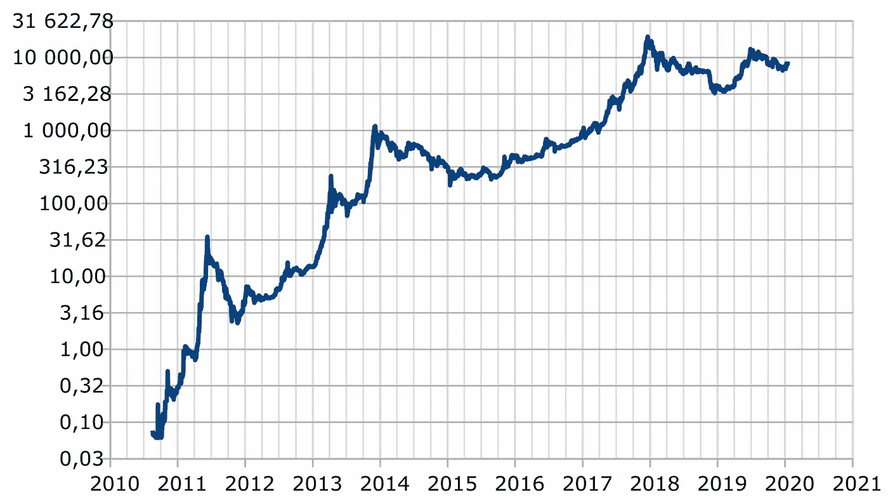
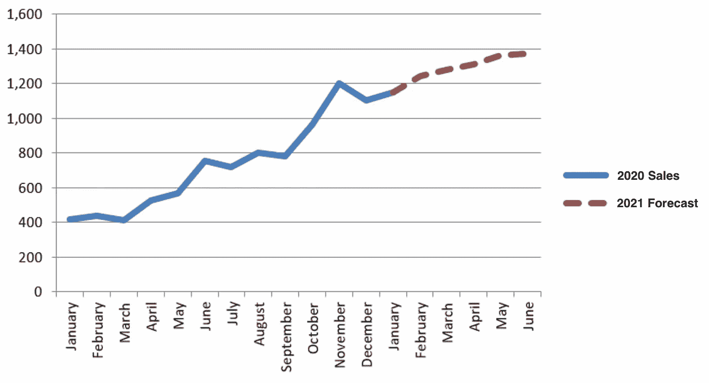

# 什么是商业分析？

> 原文：<https://medium.datadriveninvestor.com/what-is-business-analytics-ca535577865e?source=collection_archive---------21----------------------->

## 对什么是分析以及有哪些类型的可理解的解释

Photo by [Franki Chamaki](https://unsplash.com/@franki?utm_source=medium&utm_medium=referral) on [Unsplash](https://unsplash.com?utm_source=medium&utm_medium=referral)

随着大数据的到来，与数据相关的一切都呈指数级增长，这主要归功于它的三个 5 V:速度、种类和量。每天生成的数据量呈指数级增长，这就是为什么用于分析数据的工具和技术必须发展并适应这些新变化，同时开发数据的新方法也在不断涌现。

大数据是一个使能器，它允许您以不同的、更完整的方式使用数据，并且它与人工智能一起，允许您从数据中提取更大的价值。公司已经意识到，如果他们想要获得超越竞争对手的竞争优势，他们需要从数据中提取价值，以了解如何改进他们的流程，更好地了解他们的客户，并最终增加收益和降低成本。

出现的许多新术语之一是**商业分析**，也被称为**分析**。但这是什么呢？分析不仅仅是发现处理数据的不同方式，它还意味着分析数据，创建有意义的模型，以便我们能够回答以前无法回答的问题。

# 5 种类型的分析

有**不同的方式来探索我们业务的数据**，这将允许我们回答日益复杂的问题，但对我们的决策过程有更大的价值。

## 📊描述性分析

描述性分析让我们能够了解我们的业务中发生了什么。换句话说，它是对过去的回顾，让我们了解我们业务的结果或我们客户的行为。它们将允许我们检测趋势变化、异常或极端值、季节性行为或指标之间的关系。衡量特定描述性分析的几个 KPI 的定义可能是了解我们目标的成功程度的好方法。

描述性分析的一些问题示例包括:

*   最赚钱的产品有哪些？
*   去年什么营销活动取得了最好的效果？

Example of descriptive analytics: Bitcoin price evolution between 2010 and 2020

## 🛠诊断分析

诊断分析将允许我们理解**为什么会发生某种情况**。一旦我们知道发生了什么，我们必须了解到底是什么导致了这种情况，以便根据变化是变得更好还是更坏来试图重现成功的方法或防止犯同样的错误。诊断分析也将帮助你对比你认为已经发生的是不是真的发生了。作为一个例子，通过描述性分析，我们发现产品的推出引发了销售。在诊断分析中，我们应该了解是什么导致了销售额的暴涨。

通常，检测数据异常的过程将遵循以下步骤:

1.  识别异常情况
2.  收集与异常相关的数据
3.  使用分析工具研究数据，了解异常现象发生的原因

诊断分析的一些问题示例包括:

*   为什么上个月活跃用户增加了？
*   为什么去年九月销售额下降了？

## 🔮预测分析

到目前为止，数据的数量或种类并不是一个关键参数。我们可以探索几乎任何数量的数据，并进行更好或更差的描述性或诊断性分析，但它变得特别相关的地方是从现在开始:现在大数据开始发挥作用。预测分析旨在回答**可能会发生什么**的问题。然而，如果没有足够数量和种类的数据，我们将无法回答这个问题:我们需要大数据。这种类型的分析可以从简单的回归模型到更复杂的模型，在这些模型中，我们希望预测现有的 KPI 或模拟其他情况。

预测分析的一些问题示例包括:

*   下个季度比特币价格会如何波动？
*   下个月我的云基础架构的预计成本是多少？

Example of predictive analytics: Sales forecast for 2021

## 💡规定性分析

最后一步是规定性分析，其目标是**根据数据**确定下一步要采取的行动。这是数据驱动型组织的终极目标。在任何分析中，技术部分和业务部分必须共存，这样得出的结论才是一致的和可理解的。然而，在规范分析中，不仅需要了解公司的业务领域，还需要了解公司的内部运作，以便有效地进行数据决策。

预测分析的一些问题示例包括:

*   该产品的最佳营销策略是什么？
*   递送这个包裹最便宜的路线是什么？

## 🧠认知分析

这里的关键概念是:推论。

> 推理是一种演绎的行为，是根据先前发生的事实或参数得出某种结论或可能性的行为。

通过这种方式，认知分析旨在**从数据**中获得推理，以及从过去获得的推理中获得推理，从而允许自身生成自主学习循环。认知分析的巨大潜力在于，它利用了迄今为止尚未开发的大部分数据:非结构化和动态数据。由于自然语言处理(NLP)的能力，认知分析允许以迄今为止不可能的方式理解数据。

认知分析的一些问题示例可能是:

*   公司的商业文件中提到了哪些人？
*   当我的客户致电技术支持时，他们抱怨什么？

## 摘要

我们刚刚了解了 5 种分析类型，这将使您能够将数据的使用提升到最高水平。由于大规模数据增长以及与人工智能的协同作用，开发数据的新方法已经出现，使我们能够获得前所未有的洞察力。

正如我在[关于数据质量的文章](https://medium.com/datadriveninvestor/how-much-is-your-firm-losing-because-of-poor-data-quality-6bb8996d0616)中提到的，有效的数据治理尤其重要，同时还有支持数据处理和维护的技术基础设施，这可以保持高水平的数据质量和可访问性。。由于这一点，我们将能够从我们的数据中获得丰富的知识，并利用这些知识在市场中竞争，以及识别新的商业机会。

感谢阅读！🤗