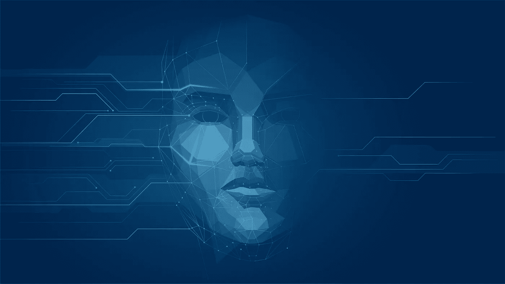
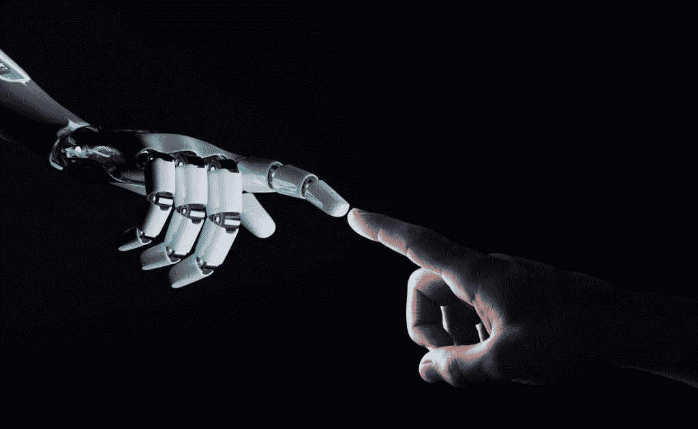

# 什么是认知计算——用例，与人工智能的区别

> 原文：<https://medium.datadriveninvestor.com/what-is-cognitive-computing-use-cases-differences-from-ai-a95f0abf6765?source=collection_archive---------4----------------------->

自从计算机第一次被发明以来，计算机科学家试图给它编程来模仿人类的行为。计算机的起源可以追溯到 20 世纪 60 年代，当时实现这一梦想的技术根本不存在。然而，在二十一世纪，由于认知计算，这一愿景终于实现了。在这篇文章中，我们将仔细研究认知计算及其实际应用。

# 认知计算定义

认知计算使机器能够像人类一样思考和学习。这包括使用自学算法，这些算法依赖于各种汇集在一起的过程，并允许计算机模拟人的大脑工作方式。虽然在相当长的一段时间里，计算机在计算和其他复杂过程方面比人类更好，但它们一直难以完成简单的任务，如识别物体或常规语音。

 [## 人工智能与创造力:梦想成真|数据驱动的投资者

### 人工智能总是让我着迷。不仅作为一套有用的工具，不断发展，而且作为一个…

www.datadriveninvestor.com](https://www.datadriveninvestor.com/2019/01/28/ai-creativity-deep-dream-comes-true/) 

认知计算的一个很好的例子是 IBM 的沃森。它因赢得《危险边缘》并击败所有之前的获胜者而出名。像沃森这样的系统是通过让它接触大量数据来训练的，认知软件将随着技术的成熟而改进。

# 认知计算与人工智能

如果你想知道这与人工智能有什么不同，你必须看看每种技术的目标。认知计算不想完全取代人类，而是帮助他们执行某些任务。它试图创造一个像人类一样思考的机器。这和 AI 不同，AI 只是试图用最好的算法来解决某个特定的问题。

认知计算带给你的包括:

*   增强的分析和计划-认知系统可以收集所有必要的信息，进行分析，并为您提供如何解决某些问题的答案或建议。
*   机器肩负着分析的重担——你不再需要自己分析数据来寻找模式和识别潜在的机会。认知系统可以通过在短时间内分析大量数据来为你做到这一点。
*   更好的客户服务——将与客户交流的聊天机器人可以快速找到他们正在寻找的信息，并且只提供上下文信息。

缺点包括:

*   安全性—虽然系统可以访问大量数据，但这可能会带来一定的安全挑战。需要有更好的机制来识别可疑活动。
*   采纳——每当一项新技术出现时，都会有一些内在的采纳问题。因此，所有利益相关者之间需要更多的协作来简化流程。
*   开发周期长——目前，认知智能的开发主要集中在基于场景的应用上。这不仅增加了开发周期，而且阻碍了该技术的跨行业实现。

现在我们知道了认知计算的一些优缺点，让我们来看看它的能力。

# 这项技术能做什么？

不同行业有很多不同的认知计算用例。例如，如果我们继续上面提到的沃森的话题，这项技术可以用于医疗领域，帮助分析海量信息并提出建议。它还可以通过扫描 X 射线和识别是否存在某些疾病或其他问题来帮助医生诊断患者。这不仅会提高准确性和病人护理，而且还有助于减轻医生的工作量，使他们能够更多地关注病人。

今天，一些认知计算被用在汽车上，帮助我们在路上导航。例如，[物体识别技术](https://skywell.software/computer-vision-services/)可以在我们危险地靠近另一辆车时发出警报，甚至在我们分心时为我们刹车。随着自动驾驶汽车越来越普及，你可以预计这种技术会变得更加流行。

# 在不久的将来我们可以期待看到什么？

认知计算席卷了科技行业，原因显而易见。这项技术的优势是巨大的，特别是因为它可以自动化我们现在拥有的许多手动过程。B2B 和 B2C 细分市场有很多可能性，因为它允许公司以更高的效率管理他们的业务活动，并发现没有人费心去寻找的机会。

我们可以预计，随着技术的成熟和变得更加先进，上述障碍将得到解决，我们可以预计将开始看到在跨行业的企业中采用认知计算的大规模过渡。因此，开始投资未来的技术解决方案来解决您今天面临的一些问题是一个好主意，这样您将比刚刚开始采用认知计算的竞争对手更具优势。

*原载于*[*https://sky well . software*](https://skywell.software/blog/what-is-cognitive-computing-use-cases-differences-from-ai/)*。*