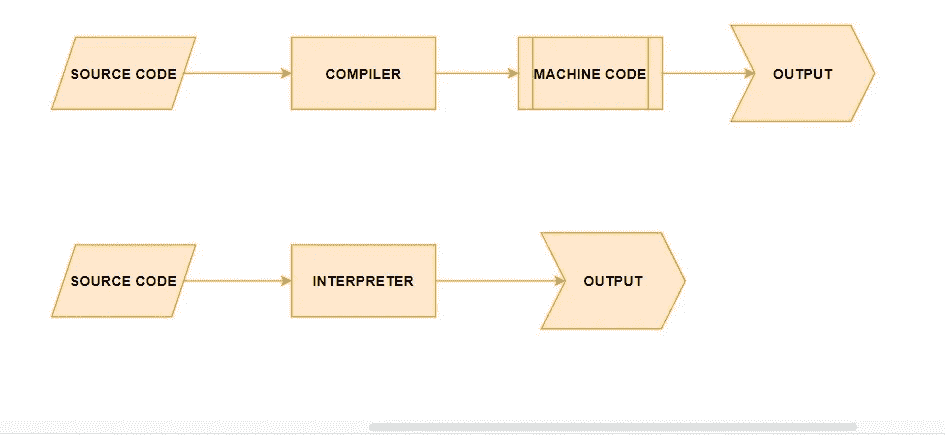
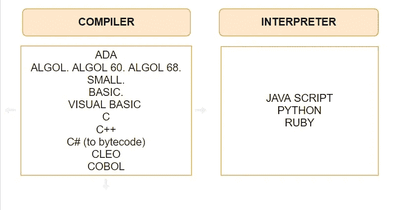

# 编译器和解释器编程语言的含义是什么？

> 原文：<https://medium.datadriveninvestor.com/what-is-compiler-and-interpreter-ad71cca542a6?source=collection_archive---------3----------------------->

*在当今的行业中，工作经验并不代表一切。一旦你达到了基本要求，你和你的工作之间就只剩下一件事了，那就是“工作面试”。今天我来解释一个开发者在面试中经常被问到的问题。*

***编译器*** *是以高级编程语言编写的源代码为输入，根据机器的架构，产生机器语言输出的程序。作为输出产生的机器代码可以在任何时候用不同的输入反复运行。*

*我们可以用 Java 编译器作为例子，称为 Javac。Javac 用。java 扩展到一个用* ***Java 字节码*** *编写的. class 文件，供代码在 Java 虚拟机中使用。*

*编译器在编译源代码之前检查代码。如果编译器发现任何错误情况，就会报告这一点。这允许我们在得到一个完全正常工作的程序之前修复任何编码错误。然而，一个程序被成功编译的事实并不一定意味着它是没有错误的，并且会做所要求的事情。我们需要用各种数据测试我们的程序，并确保它在逻辑上也能正常工作。*

如果我们有一个在 Linux 操作系统上编译的 C 程序，我们不能复制这个编译的程序并等待它在 Windows 操作系统上运行。如果我们想在 Windows 上运行相同的 C 程序，我们需要在 Windows 计算机上使用 C 编译器重新编译程序。

**解释器**是一种程序，它将带有程序数据的源代码作为输入，并逐行执行源程序。

Java 解释器 **java** 就是一个例子。将**转换成**Java*。class* 扩展文件转换成可以在运行它的机器上运行的自然机器码。

在 Java 中，编译器和解释器一起工作。也就是说，它首先被编译以从生成的源代码中产生一个字节码。编译后的字节码在 Java 虚拟机(JVM)上被解释和执行。这带来了一些好处。最重要的是平台独立性。我们的字节码将在每台运行 JVM 的机器上顺利工作。第二个优点是，由于我们的 Java 字节码运行在虚拟机上，我们受到了一个安全层的保护，它可以抵御恶意程序。

java 字节码和 Java 解释器不仅仅在 Java 语言中使用。举个例子，我们可以用 Jython 从 Python 语言编译成 Java 字节码，然后用 **java** 进行解释。同样，编译器 ML、Lisp 和 Fortran 将其编译成 java 字节码。

flowchart of compiler and interpreter

*我们可以将编程语言分类如下……*

compiler and interpreter programming languages

# 包装

*我澄清了一些你会在编程语言中看到的术语。*

希望这个概述能帮助你更好地理解用于编程语言分类的术语。

*如果你觉得这很有帮助，请在你最喜欢的社交媒体上分享，这样其他人也可以找到它。*

如果你对此感兴趣，请在 Medium 上阅读并关注我。

**参考文献:**

http://www.bilisimakale.com/2018/11/13。