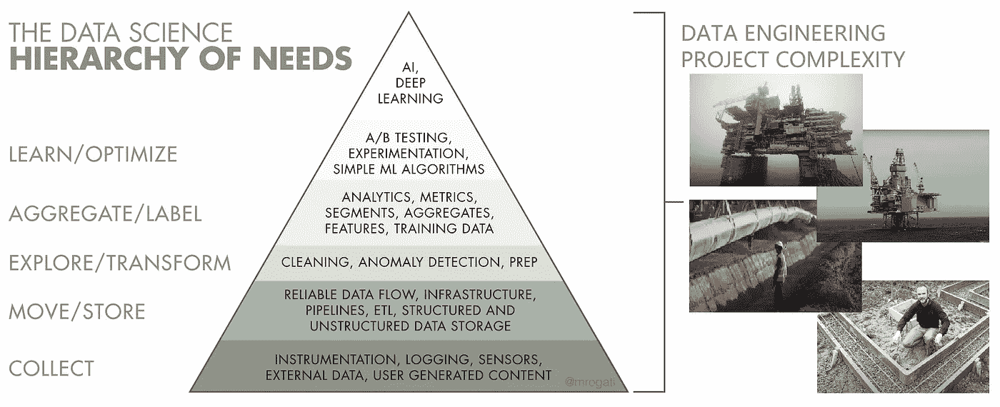
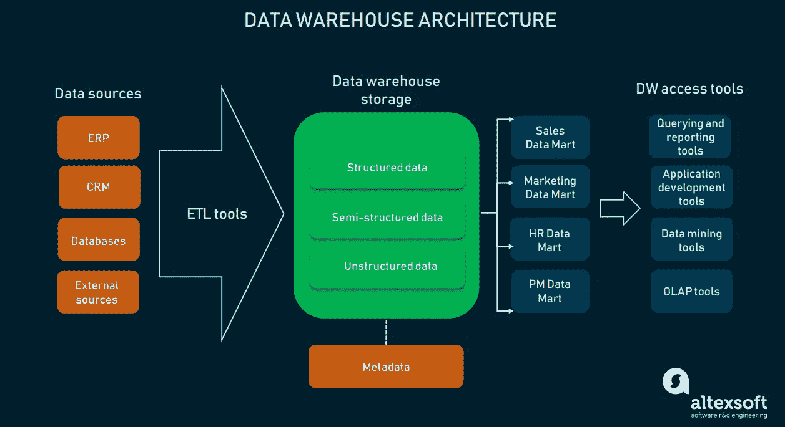
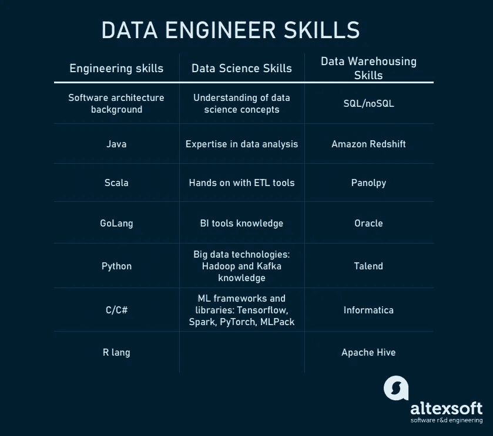

# 什么是数据工程师:角色描述、职责、技能和背景

> 原文：<https://medium.datadriveninvestor.com/what-is-data-engineer-role-description-responsibilities-skills-and-background-703753277af7?source=collection_archive---------6----------------------->

随着每天产生令人难以置信的 2.5 万亿字节的数据，[的数据科学家们比以往更加忙碌。我们掌握的信息越多，我们就越能利用它。数据科学为我们提供了利用这些数据的方法。所以，当你搜索“万亿分之一”的定义时，谷歌可能正在了解你有这个知识缺口。](https://www.altexsoft.com/blog/datascience/how-to-structure-data-science-team-key-models-and-roles/?utm_source=MediumCom&utm_medium=referral&utm_campaign=shared)

但是，理解和解释数据只是漫长旅程的最后一个阶段，因为信息从原始格式到花哨的分析板。系统地处理数据需要一个被称为[数据管道](https://www.altexsoft.com/blog/data-pipeline-components-and-types/?utm_source=MediumCom&utm_medium=referral&utm_campaign=shared)的专用生态系统:一套形成特定环境的技术，在该环境中数据被获取、存储、处理和查询。因此，除了创造算法的数据科学家，还有数据工程师，数据平台的建筑师。

在本文中，我们将解释什么是*数据工程师*，他们的职责范围、技能组合和一般角色描述。我们还将描述数据工程师与其他相关角色的不同之处。

# 什么是数据工程师？

我们将从大处着眼到细节。 [*数据工程*](https://www.altexsoft.com/blog/datascience/what-is-data-engineering-explaining-data-pipeline-data-warehouse-and-data-engineer-role/?utm_source=MediumCom&utm_medium=referral&utm_campaign=shared) 是*数据科学*的一部分，这是一个宽泛的术语，包含了与数据工作相关的许多知识领域。数据科学的核心是获取数据进行分析，以产生有意义和有用的见解。数据可进一步用于为[机器学习](https://www.altexsoft.com/whitepapers/machine-learning-bridging-between-business-and-data-science/?utm_source=MediumCom&utm_medium=referral&utm_campaign=shared)、[数据流分析](https://www.altexsoft.com/blog/real-time-analytics/?utm_source=MediumCom&utm_medium=referral&utm_campaign=shared)、[商业智能](https://www.altexsoft.com/blog/business/complete-guide-to-business-intelligence-and-analytics-strategy-steps-processes-and-tools/?utm_source=MediumCom&utm_medium=referral&utm_campaign=shared)或任何其他类型的分析提供价值。

 [## 一瞬间学会数据科学！？数据驱动的投资者

### 在我之前的职业生涯中，我是一名训练有素的古典钢琴家。还记得那些声称你可以…

www.datadriveninvestor.com](https://www.datadriveninvestor.com/2020/07/23/learn-data-science-in-a-flash/) 

虽然数据科学和数据科学家特别关注探索数据，在数据中寻找见解，并构建机器学习算法，但数据工程关心的是使这些算法在生产基础设施上工作，并创建一般的数据管道。因此，**数据工程师**是数据科学团队或任何需要创建和管理数据平台技术基础设施的数据相关项目中的工程角色。

# 数据工程师的角色

数据工程师的角色就像项目要求的那样多才多艺。它将与数据平台的整体复杂性相关联。如果你看一下*数据科学需求层次*，你可以抓住一个简单的想法:涉及的机器学习或人工智能等先进技术越多，数据平台就变得越复杂，资源越多。

*The growing complexity of data engineering compared to the oil industry infrastructure. Original picture:* [*hackernoon.com*](https://hackernoon.com/the-ai-hierarchy-of-needs-18f111fcc007)

为了让您了解什么是数据平台，以及使用哪些工具来处理数据，让我们快速概述一些通用的架构原则。数据基础设施有三个主要功能。

1.  提取数据:信息位于某个地方，所以首先我们必须提取它。就公司数据而言，来源可以是一些数据库、网站的用户交互、内部 ERP/CRM 系统等。或者该源可以是飞机机身上的传感器。或者数据可能来自在线的公共资源。
2.  数据存储/转换:任何数据管道的主要架构点都是存储。我们需要将提取的数据存储在某个地方。在数据工程中，[数据仓库](https://www.altexsoft.com/blog/enterprise-data-warehouse-concepts/?utm_source=MediumCom&utm_medium=referral&utm_campaign=shared)的概念体现了为分析目的收集的所有数据的最终存储。
3.  转换:原始数据可能对最终用户没有多大意义，因为很难以这种形式进行分析。转换旨在清理、结构化和格式化数据集，以使数据可用于处理或分析。在这种形式下，最终可以进行进一步的处理或从[报告层](https://www.altexsoft.com/blog/data-analytics-tools/?utm_source=MediumCom&utm_medium=referral&utm_campaign=shared)进行查询。

*One of the various architectural approaches to data pipelines*

数据管道的经典架构围绕着它的中心点，即仓库。但是，统一存储的存在不是强制性的，因为分析师可能会出于转换/存储目的使用其他实例。或者他们可以不使用任何存储。因此，数据源和数据访问工具之间的实例数量决定了数据管道架构。

数据工程师的职责可以同时对应于整个系统，也可以分别对应于系统的各个部分。

**普通角色**。一个由数据专业人员组成的小团队中的数据工程师将负责数据流的每一步。因此，从配置数据源到集成分析工具，所有这些系统都将由一个普通角色的数据工程师来设计、构建和管理。

**以仓库为中心**。从历史上看，数据工程师负责使用 SQL 数据库来构建数据存储。今天仍然如此，但是仓库本身变得更加多样化。因此，可能有多个数据工程师，其中一些可能只专注于设计一个仓库。以仓库为中心的数据工程师还可能涉及不同类型的存储(noSQL、SQL)、处理大数据的工具(Hadoop、Kafka)以及连接数据源或其他数据库的集成工具。

以管道为中心的数据工程师将负责连接数据源和数据仓库的数据集成工具。这些工具要么只是将信息从一个地方加载到另一个地方，要么执行更具体的任务。例如，它们可能包括数据暂存区，数据在转换之前到达此处。管理生态系统的这一层将是以管道为中心的数据工程师的重点。

# 数据工程师的职责

不管关注系统的特定部分，数据工程师都有相似的职责。这主要是一个技术职位，结合了计算机科学、工程和数据库的知识和技能。

**建筑设计**。数据工程的核心是设计数据平台的架构。

**数据相关工具/实例的开发**。由于数据工程师首先是一个开发人员角色，这些专家使用编程技能来开发、定制和管理集成工具、数据库、仓库和分析系统。

**数据管道维护/测试**。在开发阶段，数据工程师将测试系统每个部分的可靠性和性能。或者他们可以与测试团队合作。

**机器学习算法部署**。机器学习模型是由数据科学家设计的。数据工程师负责将它们部署到生产环境中。这需要为模型提供存储在数据仓库中或直接来自数据源的数据、配置数据属性、管理计算资源、设置监控工具等。

**管理数据和元数据**。数据可以以结构化或非结构化的方式存储在仓库中。附加存储可能包含元数据(关于数据的探索性数据)。数据工程师负责管理存储的数据，并通过[数据库管理系统](https://www.altexsoft.com/blog/business/comparing-database-management-systems-mysql-postgresql-mssql-server-mongodb-elasticsearch-and-others/?utm_source=MediumCom&utm_medium=referral&utm_campaign=shared)对其进行适当的组织。

**提供数据访问工具**在某些情况下，不需要这样的工具，因为数据科学家可以使用像数据湖这样的仓库类型从存储中直接提取数据。然而，如果一个组织需要分析师和其他非技术用户的商业智能，数据工程师负责设置工具来查看数据、生成报告和创建视觉效果。

**跟踪管道稳定性**。只要仓库需要经常清理，监控系统的整体性能和稳定性就真的很重要。由于数据/模型/需求可能会改变，因此还应该监控和修改管道的自动化部分。

# 数据工程师技能

任何专家的技能都与他们所负责的职责相关。技能组合会有所不同，因为数据工程师可以做的事情范围很广。但是一般来说，他们的活动可以分为三个主要领域:工程、数据科学和数据库/仓库。

*Skill set of a data engineer broken by domain areas*

**工程技能**。大部分数据分析/大数据的工具和系统都是用 Java (Hadoop，Apache Hive)和 Scala (Kafka，Apache Spark)编写的。Python 和 Rlang 由于其流行性和语法清晰性而被广泛用于数据项目。像 C/C#和 Golang 这样的高性能语言在数据工程师中也很受欢迎，尤其是在训练和实现 ML 模型方面。

**数据相关专业**。数据工程师将与数据科学家密切合作。对数据建模、算法和数据转换技术的深刻理解是使用数据平台的基础。数据工程师将负责构建 ETL(数据提取、转换和加载)、存储和分析工具。因此，必须具备现有 ETL 和 BI 解决方案的经验。

参与利用 Kafka 或 Hadoop 等专用工具的大数据项目需要更具体的专业知识。如果项目与机器学习和人工智能相关，数据工程师必须有 ML 库和框架(TensorFlow，Spark，PyTorch，mlpack)的经验。

*   对数据科学概念有深刻的理解
*   数据分析专业知识
*   ETL 工具的实践经验
*   商务智能工具知识
*   大数据技术: [Hadoop](https://hadoop.apache.org/) 和 [Kafka](https://kafka.apache.org/)
*   ML 框架和库: [TensorFlow](https://www.tensorflow.org/) ， [Spark](https://spark.apache.org/) ， [PyTorch](https://pytorch.org/) ， [mlpack](https://www.mlpack.org/)

**数据库/仓库。**在大多数情况下，数据工程师使用特定的工具来设计和构建数据存储。这些存储可用于存储结构化/非结构化数据以供分析，或插入专用的分析界面。在大多数情况下，这些都是关系数据库，所以 SQL 是每个数据工程师应该了解的 DB/查询的主要内容。其他工具，如 Talend、Informatica 或 Redshift，是创建大型分布式数据存储(noSQL)、云仓库或将数据实现到托管数据平台的流行解决方案。所以，关键工具是:

正如我们已经提到的，责任的级别会根据团队规模、项目复杂性、平台规模和工程师的资历而变化。在一些组织中，与数据科学和工程相关的角色可能更加细化和详细。让我们来看看关键的几个，并尝试定义它们之间的区别。

# 数据专家对比:数据科学家 vs 数据工程师 vs ETL 开发者 vs BI 开发者

数据科学家通常受雇于各种组织，处理各种类型的数据平台。数据工程师、ETL 开发人员和 BI 开发人员是当数据平台变得复杂时出现的更具体的工作。数据平台越复杂，角色的分布就越精细。例如，处于数据计划早期阶段的组织可能只有一名数据科学家负责数据探索、建模和基础设施。随着复杂性的增加，您可能需要专门的专家来处理数据流的每个部分。

**数据科学家**是大多数数据相关项目的基础。这些专家知道您的数据问题的内容、原因和方式。他们将为整个团队提供对使用什么数据类型、必须发生什么数据转换以及将来如何应用的理解。数据科学家提供的输入为未来的数据平台奠定了基础。显然，数据科学家将承担以下任务。

*   定义所需的数据类型
*   查找数据源/挖掘数据
*   定义数据收集技术
*   清理/准备[数据集](https://www.altexsoft.com/blog/datascience/best-public-machine-learning-datasets/?utm_source=MediumCom&utm_medium=referral&utm_campaign=shared)
*   管理元数据
*   为数据转换/处理设定标准
*   开发机器学习模型
*   定义监控和分析流程

数据工程师是负责设计、构建、测试和维护整个数据平台的技术人员。根据项目的不同，他们可以专注于系统的特定部分，或者成为制定战略决策的架构师。在小团队的情况下，工程师和科学家往往是同一批人。但作为一个独立的角色，数据工程师实施数据处理、分析、监控应用模型和微调算法计算的基础设施。

一个 [**ETL 开发人员**](https://www.altexsoft.com/blog/datascience/who-is-etl-developer-role-description-process-breakdown-responsibilities-and-skills/?utm_source=MediumCom&utm_medium=referral&utm_campaign=shared) 是数据平台中的一个特定的工程角色，主要负责构建和管理提取、转换和加载阶段的工具。因此，数据工程师和 ETL 开发人员之间的界限有点模糊。然而，ETL 开发人员是一个狭窄的专家，很少担任架构师/技术领导的角色。这些任务通常会交给 ETL 开发人员。

*   ETL 过程管理
*   数据仓库架构
*   数据管道(ETL 工具)开发
*   ETL 测试
*   数据流监控

[**商业智能开发人员**](https://www.altexsoft.com/blog/bi-developer-role-responsibilities-skills/?utm_source=MediumCom&utm_medium=referral&utm_campaign=shared) 是商业智能项目中的一个特定工程角色。 [*商业智能*](https://www.altexsoft.com/blog/business/complete-guide-to-business-intelligence-and-analytics-strategy-steps-processes-and-tools/?utm_source=MediumCom&utm_medium=referral&utm_campaign=shared) (BI)是数据科学的一个子类，专注于将数据分析应用于历史数据以供业务使用。数据工程师和 ETL 开发人员处理内部基础设施，而 BI 开发人员负责

*   定义报告标准，
*   开发报告工具和数据访问工具，
*   构建交互式仪表盘，
*   开发数据可视化工具，
*   实现 OLAP 立方体，
*   测试仓库架构，
*   验证数据，
*   测试用户界面，以及
*   测试数据查询过程。

因此，从理论上讲，这些角色是可以明确区分的。在实践中，职责可能是混合的:每个组织自己定义专家的角色。一切都取决于项目需求、目标和[数据科学/平台团队结构](https://www.altexsoft.com/blog/datascience/how-to-structure-data-science-team-key-models-and-roles/?utm_source=MediumCom&utm_medium=referral&utm_campaign=shared)。项目越大，团队成员越多——责任划分就越清晰。反之亦然，较小的数据平台需要专家执行更一般的任务。

# 什么时候雇佣数据工程师？

有几种情况下你可能需要一个数据工程师。

**扩展您的数据科学团队。**这里有一个一般性的建议:当你的数据专家团队到了无人负责技术基础设施的地步时，就一般专家而言，数据工程师可能是一个不错的选择。

**大数据项目。**目前，数据工程转向旨在处理大数据、管理数据湖以及为 noSQL 存储构建扩展数据集成管道的项目。在这种情况下，由数据工程师组成的专门团队按照基础架构组件分配角色是最佳选择。

**需要自定义数据流。**即使是中型企业平台，也可能需要定制数据工程。提取、转换、加载只是主要应用于自动化 BI 平台的主要原则之一。实际上，一家公司可能会针对多种数据类型利用不同类型的存储和流程。这涉及到一个大型的技术基础设施，只能由多样化的数据专家来设计和管理。在这种情况下，数据工程师比数据领域的任何其他角色都更合适。

*最初发表于 AltexSoft tech 博客“* [*什么是数据工程师:角色描述、职责、技能和背景*](https://www.altexsoft.com/blog/what-is-data-engineer-role-skills/?utm_source=MediumCom&utm_medium=referral&utm_campaign=shared)

***访问专家视图—** [**订阅 DDI 英特尔**](https://datadriveninvestor.com/ddi-intel)*