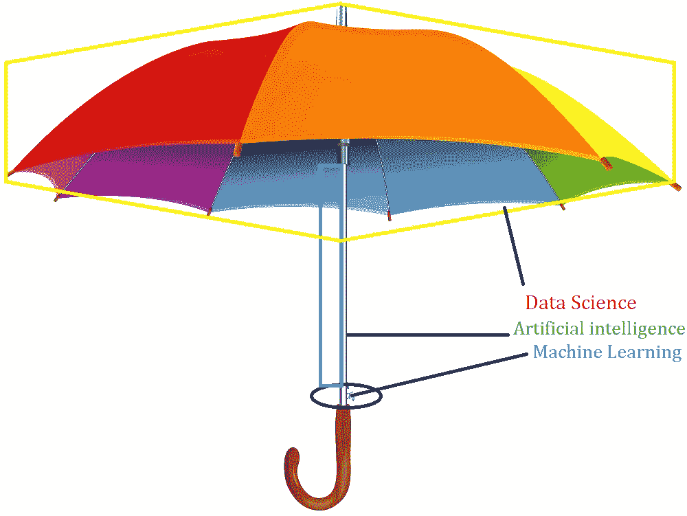
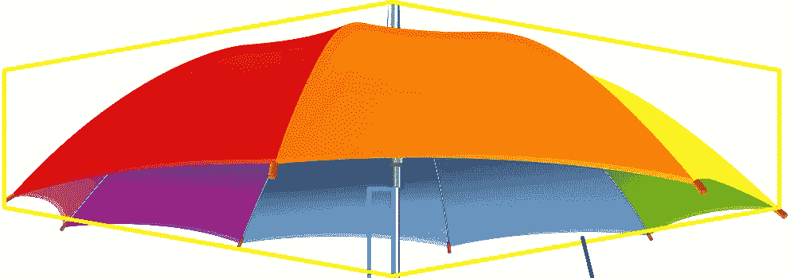

# 什么是数据科学 vs 人工智能 vs 机器学习

> 原文：<https://medium.datadriveninvestor.com/what-is-data-science-vs-artificial-intelligence-vs-machine-learning-8d67080f8914?source=collection_archive---------5----------------------->

理解什么是数据科学以及它如何与人工智能相连，以及机器学习如何……当我们阅读更多而不是理解时，总是一个很大的困惑。让我用一个简单的例子来解释一下。

 [## 商业价值和人工智能的 5 个原则|数据驱动的投资者

### 提取商业价值很难。我是说真的很难...说到高级分析，这一过程甚至…

www.datadriveninvestor.com](https://www.datadriveninvestor.com/2020/07/07/5-principles-for-business-value-and-artificial-intelligence/) 

# 什么是数据科学？

观察覆盖全身/地方的伞的形状。
Data science as the shape 收集了大量结构化/非结构化数据，以确保这些数据是实现预期结果的途径。

**谁是现实中的科学家** —科学家是头脑中有一个预期结果的人，这个预期结果是 Z，也是他可以获得输入 A 以确保 Z 按时完成的来源。中间过程很重要

因此，数据科学从来都不是一项技术，而是一个概念。

**什么是人工智能** —为一个人工系统创造智能。撑伞的棍子是一个人工系统，其主要目的是在数据的帮助下实现自动化/预测。

现在我们能让一个系统变得智能吗？我们可以使用一些指令使系统智能化。指导是学习的一部分。
**那么什么是机器学习:**确保一个系统是智能的——训练机器的一系列学习程序。这就像训练你的孩子一样简单*(看看我的一个例子——*[*孩子解释机器学习的方式*](https://medium.com/datadriveninvestor/what-is-machine-learning-my-kidzy-way-of-explaining-d574a6493b6a?source=friends_link&sk=c3875525bb508463159f0770d4acb127) *)*

考虑将在底部的伞拧入一个螺丝，这很重要，并且是运行人工智能系统的关键，在这个系统中，我们实际上可以证明数据科学的目的

简单来说:机器学习是人工智能的子集，人工智能是数据科学的子集。

这些应用程序主要在有复杂数据时工作。只有当我们拥有大量数据时，才需要工具。只有当我们遇到足够多的复杂情况时，才需要自动化。

有一个点是机器学习无法超越的。为了解决这个问题，我们有深度学习和其他概念——将在下一篇文章中尝试解释这一点。
感谢您的阅读

adhu
Vadlamani

**访问专家视图—** [**订阅 DDI 英特尔**](https://datadriveninvestor.com/ddi-intel)