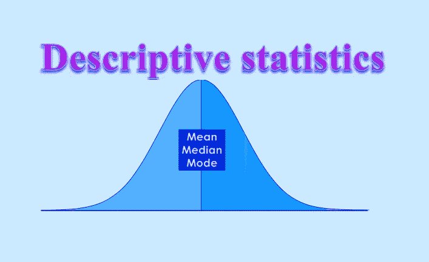

# 什么是描述性统计？

> 原文：<https://medium.datadriveninvestor.com/what-is-descriptive-statistics-85890bc451ae?source=collection_archive---------1----------------------->

描述性统计是概括给定数据集的简要描述性系数，该数据集可以是总体的代表，也可以是总体的样本。描述性统计被分解为集中趋势的度量和可变性(分布)的度量。集中趋势的度量包括均值、中值和众数，而可变性的度量包括标准差、方差、最小和最大变量以及峰度和偏斜度。

> 获取更多 AI 实时资讯 [**AI 在线培训**](https://onlineitguru.com/artificial-intelligence-course.html)

## 理解描述性统计

简而言之，描述性统计通过给出关于样本和数据度量的简短摘要来帮助描述和理解特定数据集的特征。最被认可的描述性统计类型是中心度量:平均值、中间值和众数，它们几乎被用于数学和统计的所有层面。平均值的计算方法是将数据集中的所有数字相加，然后除以数据集中的数字数。例如，以下数据集的和是 20: (2，3，4，5，6)。平均值为 4 (20/5)。数据集的众数是最常出现的值，中位数是位于数据集中间的数字。它是在一个数据集内将较高的数字与较低的数字分开的数字。然而，有一些不太常见的描述性统计数据仍然非常重要。

人们使用描述性统计将大型数据集中难以理解的定量见解转化为简单的描述。例如，学生的平均绩点(GPA)提供了对描述性统计的很好理解。GPA 的理念是，它从广泛的考试、班级和成绩中获取数据点，并将它们平均在一起，以提供对学生整体学术能力的总体了解。一个学生的个人 GPA 反映了他低劣的学习成绩。

## 描述性统计的量度

所有的描述性统计要么是集中趋势的量度，要么是变异性的量度，也称为离差的量度。集中趋势的测量集中于数据集的平均值或中间值；然而，可变性的测量集中在数据的分散上。这两种方法使用图表、表格和一般性讨论来帮助人们理解所分析数据的意义。

集中趋势的度量描述了数据集分布的中心位置。一个人分析分布中每个数据点的频率，并使用平均值、中值或众数来描述它，这衡量了所分析数据集的最常见模式。

可变性的度量或分布的度量有助于分析一组数据的分布有多分散。例如，虽然集中趋势的度量可以给一个人一个数据集的平均值，但它不能描述数据在该集中是如何分布的。因此，虽然数据的平均值可能是 100 分之 65，但仍然可能有 1 和 100 的数据点。可变性的测量通过描述数据集的形状和分布来帮助传达这一点。范围、四分位数、绝对偏差和方差都是可变性测量的例子。考虑下面的数据集:5，19，24，62，91，100。该数据集的范围是 95，计算方法是从最大值(100)中减去数据集中最小的值(5)。

> 获取更多实时资讯在 [**AI 在线培训海得拉巴**](https://onlineitguru.com/artificial-intelligence-course.html)