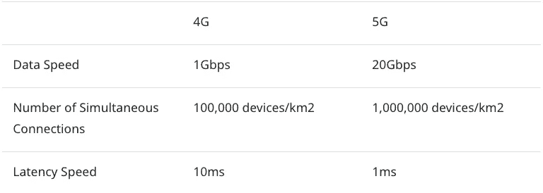

# 什么是边缘 AI 计算？

> 原文：<https://medium.datadriveninvestor.com/what-is-edge-ai-computing-61ece58c76d0?source=collection_archive---------11----------------------->

## 简单来说什么是边缘计算？本文着眼于边缘人工智能和边缘计算如何改进现代技术。

边缘 AI 从边缘计算开始。边缘计算也称为边缘处理，是一种将服务器放置在设备附近的网络技术。这有助于减少系统处理负载和解决数据传输延迟。这些过程在传感器或设备生成数据的位置执行，也称为边缘。

边缘计算的发展意味着边缘人工智能变得越来越重要。各行各业都是如此，尤其是在处理延迟和数据隐私方面。在这篇文章中，我们将看看边缘人工智能的影响，为什么它很重要，以及它的常见用例。

# 什么是 Edge AI？

Edge AI 是指在硬件设备上本地处理的 AI 算法，可以在没有连接的情况下处理数据。这意味着数据创建等操作无需在云中传输或存储数据即可进行。这很重要，因为越来越多的情况下，设备数据无法通过云处理。例如，工厂机器人和汽车需要最小延迟的高速处理。

为了实现这些目标，边缘计算可以通过在云上进行深度学习来生成数据，以在数据原点，即设备本身(边缘)开发演绎和预测模型。

我们可以在工厂机器人的工作中看到这样的例子。人工智能技术可以用来以人类无法处理的速度可视化和评估来自监控摄像头和传感器的大量多模态数据。我们还可以用它来检测生产线上人类可能会忽略的错误数据。这种物联网结构可以存储生产线产生的大量数据，并通过机器学习进行分析。它们也是提高工厂智能化的演绎和预测模型的核心。

 [## 利用计算抗击 SARS-CoV2 |数据驱动型投资者

### 全世界所有的学者、研究人员、科学家和组织都在尽一切努力对抗…

www.datadriveninvestor.com](https://www.datadriveninvestor.com/2020/04/29/utilizing-computing-in-the-fight-against-sars-cov2/) 

# 边缘人工智能、物联网和 5G:

边缘人工智能经常与物联网(IoT)和 5G 网络联系在一起。

物联网一词指的是通过互联网相互连接的设备，包括智能手机、机器人和电子设备。作为一个用 AI 执行分析的平台，edge AI 可以收集和存储物联网产生的海量数据，使使用具有可扩展特性的云成为可能。这允许改进数据处理和基础设施的灵活性。

5G 网络可以增强上述过程，因为其三大特征——超高速、大规模同时连接和超低延迟——明显超过 4G。

物联网和边缘 AI 的发展离不开 5G，因为物联网设备传输数据时，数据量膨胀，影响传输速度。传输速度的下降会造成延迟，这是实时处理的最大问题。

# 为什么边缘计算和边缘 AI 很重要？

设备数据无法通过云处理的情况越来越多。工厂机器人和汽车经常是这种情况，它们需要高速处理，因为当增加的数据流产生延迟时会出现问题。

例如，想象一辆自动驾驶汽车在检测道路上的物体，或者操作刹车或方向盘时遭受云延迟。数据处理的任何减速都会导致车辆的响应变慢。如果减速导致车辆不能及时响应，这可能会导致事故。生命确实处于危险之中。

对于这些物联网设备，实时响应是必要的。这意味着设备能够在现场分析和评估图像/数据，而不依赖于云人工智能。

通过将通常委托给云的信息处理委托给边缘设备，我们可以实现无传输延迟的实时处理。此外，通过将云数据传输限制为仅传输重要信息，可以减少数据量并最大限度地减少通信中断。

# 边缘人工智能用例

边缘人工智能市场主要由两个领域组成:工业机械和消费设备。我们看到演示测试在控制和优化设备以及自动化熟练劳动力技术等领域取得了进展。

消费者设备也在取得进展，这些设备的相机带有自动识别摄影主题的人工智能。由于设备数量大于工业机器，消费设备市场预计将从 2021 年起大幅增长。

我们将 edge AI 的一些常见用例放在下面:

# 无人驾驶汽车

自动驾驶汽车是应用边缘计算最值得期待的领域。在许多情况下，自动驾驶汽车必须对情况进行即时评估，这需要实时数据处理。2019 年 12 月，日本对《道路交通法》和《道路运输车辆法》的修订使得 3 级自动驾驶汽车更容易上路。这些包括自动驾驶汽车必须遵守的安全标准，以及它们可以运行的区域。因此，汽车制造商正在开发符合这些标准的自动驾驶汽车。例如，丰田已经在测试全自动(第 4 级)三 P4。

# 自主无人机

关于无人机在远程飞行实验中失去控制和失踪的新闻越来越多。这甚至导致了事故。根据无人机降落的地点，坠机可能是灾难性的。

对于自主无人机，飞行员并不积极参与无人机的飞行。他们远程监控操作，只有在绝对必要时才驾驶无人机。这方面最著名的例子是亚马逊 Prime Air，这是一家无人机送货服务公司，正在开发自动驾驶无人机来运送包裹。

# 面部识别

面部识别系统是监控摄像机的一种发展，它可以通过人脸识别人。2019 年 11 月，WDS 有限公司开始供应 Eeye，这是一种人工智能相机模块，通过边缘人工智能计算过程实时分析面部特征。Eeye 能够快速准确地识别人脸，适用于针对性别和年龄等特征的营销工具，以及解锁设备的人脸识别。

# 智能手机

这个边缘人工智能设备是我们最熟悉的一个。Siri 和谷歌助手是智能手机上边缘人工智能的很好例子，因为该技术驱动了它们的语音用户界面。使用设备上人工智能，处理发生在设备(边缘)端，这意味着不需要将设备数据传输到云。这有助于保护隐私和减少流量。

# 边缘人工智能的未来

边缘人工智能正在发展，我们已经看到了对该技术的大量投资。像 Konduit AI 这样的公司正在把它作为他们在东南亚的人工智能战略的一个关键部分。另一个例子是在 2020 年 1 月，据报道，苹果投资 2 亿美元收购了总部位于西雅图的人工智能企业 Xnor.ai. Xnor.ai 的人工智能技术通过边缘处理来处理用户智能手机上的数据。随着智能手机本身内置人工智能，我们可能会看到语音处理、面部识别技术和增强的隐私方面的进步。

根据富士经济新闻集团发布的“2019 年 AI 业务汇总调查”，日本的 edge AI 计算市场在 2018 财年的预测市场规模为 110 亿日元。该调查预计，2030 财年该市场将扩大至 664 亿日元。

随着 5G 的普及，我们还可能看到全球对边缘人工智能服务的成本下降和需求增加。

# 作者简介

从自雇的现场工程师到 PHP 程序员，Tatsuo Kurita 现在是 UX 的一名主管，主要作为技术主管支持公司产品。他的专业知识涵盖了广泛的领域，包括应用信息技术认证、信息安全管理、精神健康管理二级、HTML、通用深度学习和人工智能实施。

# 关于 Lionbridge AI

Lionbridge AI 作为值得信赖的培训数据源拥有超过 20 年的经验，可帮助各种规模的企业构建、测试和改进机器学习模型。我们的社区由 100 多万名合格的贡献者组成，遍布全球，全天候提供对所有语言和文件类型的海量数据的访问。[今天联系](https://lionbridge.ai/contact-sales/)。

**访问专家视图—** [**订阅 DDI 英特尔**](https://datadriveninvestor.com/ddi-intel)