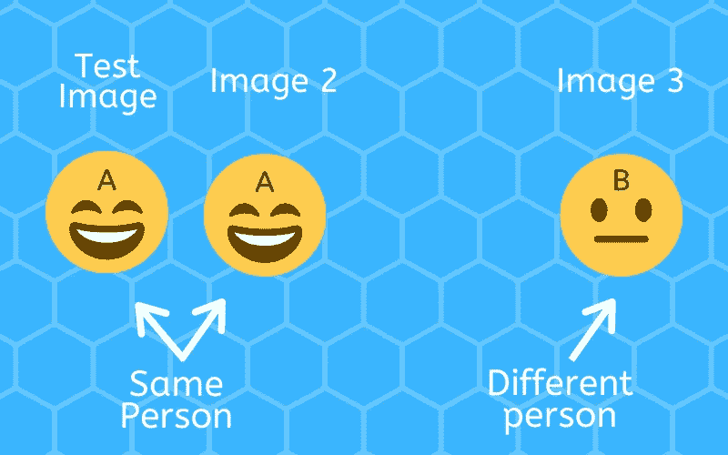
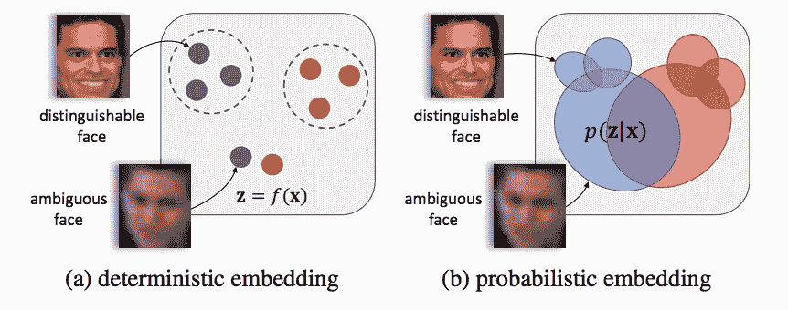
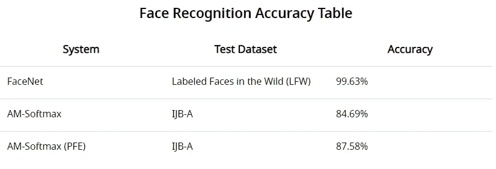

# 什么是面部识别？—应用程序及其工作原理

> 原文：<https://medium.datadriveninvestor.com/what-is-facial-recognition-applications-how-it-works-cdbc2bb116ff?source=collection_archive---------1----------------------->

在[计算机视觉](https://lionbridge.ai/articles/what-is-computer-vision/)领域，面部识别是一个研究和开发的领域，涉及赋予机器识别和验证人脸的能力。研究人员主要致力于创造可以改善商业和改善人类生活的人脸识别技术。为了帮助你加强对这项技术的理解，本指南将解释什么是面部识别，它是如何工作的，它的各种应用，以及它目前的准确性。

# 什么是面部识别？

面部识别软件在消费市场以及安全和监控行业有无数的应用。事实上，面部识别技术已经被用于改善中国的安全协议和支付程序，世界其他地方也有可能效仿。

面部识别模型执行两个主要任务。第一个是验证，这是将新的输入人脸与已知身份进行比较的任务。这方面的一个很好的例子是通过面部识别解锁智能手机。设置系统时，手机会将您的面部信息注册为手机的所有者。因此，解锁时的唯一任务是将新的输入人脸与您在设备上注册的人脸进行比较。

 [## 认知计算——一套被广泛认为是……

### 作为它的用户，我们已经习惯了科技。这些天几乎没有什么是司空见惯的…

www.datadriveninvestor.com](https://www.datadriveninvestor.com/2020/02/19/cognitive-computing-a-skill-set-widely-considered-to-be-the-most-vital-manifestation-of-artificial-intelligence/) 

第二个是识别，这是一项将输入的人脸与多个人脸身份的数据库进行比较的任务。该任务通常用于安全和监控系统。执法中的面部识别就是一个很好的例子。在国际刑警组织的网站上，有一个法医部分，解释了他们如何在机场和边境口岸使用[面部识别来识别相关人员。](https://www.interpol.int/en/How-we-work/Forensics/Facial-Recognition)

# 人脸识别是如何工作的？

由于对该领域的浓厚兴趣，数据科学家每年都在开发新的人脸识别方法。本节将简要讨论人脸识别模型如何工作的基础知识，以及创建人脸嵌入的两种方法之间的主要区别。

在最基本的层面上，人脸识别模型遵循以下步骤:

1.输入图像被馈送到算法。

2.该算法为输入图像创建面部嵌入。

3.该算法将输入图像的面部嵌入与数据库中已知面部的嵌入进行比较。

# 培养

每种方法都有不同的训练方法，研究人员经常对该领域的既定方法进行调整或添加元素。然而，大多数系统采用三重损失来训练算法。关于人脸识别，三重损失通过向算法提供三幅图像来工作(见下文)。

*Figure 1 — Triplet Loss*

其中两个图像是人 A 的，其余的图像是人 b 的。该算法创建每个图像的面部嵌入，然后比较它们。

在比较之后，网络将被稍微调整，使得人 A 的嵌入彼此比他们与人 b 的嵌入更相似。随后，这教导算法使用面部测量，这允许它准确地将同一个人的图像分类为彼此相似。然后这个过程会重复几十万甚至几百万次。最后，网络应该能够为以前从未见过的面孔生成准确的面部嵌入。

# 面部嵌入

在算法可以对比人脸之前，我们必须将人脸图像转换成算法可以理解的数据。为此，该系统根据面部特征和地标计算测量值。图 2 是 68 个[面部标志](https://lionbridge.ai/services/image-annotation/#landmarkannotation)的可视化，也称为面部关键点。

*Figure 2 — image via Adrian* [*Rosebrock at PyImageSearch*](https://www.pyimagesearch.com/author/adrian/)

# 确定性人脸嵌入

通过创建面部嵌入，您可以将面部图像转换为数字数据。该数据然后被表示为潜在语义空间中的向量。潜在空间中的嵌入越接近，它们越有可能是同一个人。

然而，使用确定性人脸嵌入的模型的准确性取决于输入图像的清晰度。此外，这种模型通常在受约束的设置下进行测试。实际上，输入图像(例如来自监控视频)通常是在不受约束或不受控制的环境中拍摄的。图像质量可能较低，或者图像中可能覆盖了部分面部。在这种情况下，使用确定性人脸嵌入的方法会降低性能。

# 概率人脸嵌入(PFE)

在 2019 年 8 月发表的一篇[论文中，Yichun Shi 和 Anil K. Jain 提出了一种替代的人脸识别方法，PFEs。概率人脸嵌入将人脸图像表示为一个分布，而不是一个点估计。](https://arxiv.org/pdf/1904.09658.pdf)

*Figure 3 — image via* [*Shi and Jain*](https://arxiv.org/pdf/1904.09658.pdf)

上图很好地展示了确定性嵌入和概率性嵌入之间的区别。在左边，在潜在空间中的面部嵌入被表示为没有指示嵌入的不确定性的点估计。然而，使用 PFEs，分布的平均值表示图像中面部特征的最佳估计。分布的方差代表不确定性。

当然，对于面部特征缺失或模糊的模糊图像，不确定性会更高。

# 人脸识别的准确率有多高？

我们已经讨论了什么是面部识别以及它是如何工作的。然而，也许更重要的问题是我们能依赖它吗？我们今天的面部识别技术有多精确？

这个问题可能没有单一的具体答案。显然，人脸识别的准确性取决于算法和我们测试它的条件。下表显示了一些当前模型能够实现的功能。这些数据显示了三个著名的系统、测试它们的数据集以及最终的准确率。

Data via [Shi and Jain](https://arxiv.org/pdf/1904.09658.pdf)

由 Google 开发的 FaceNet 在具有高度约束设置的人脸图像数据集 LFW 上取得了很好的结果。另一方面，AM-Softmax 在 IJB-A 数据集上只能达到 84.69%(PFEs 为 87.58%)的准确率，该数据集是在无约束条件下拍摄的人脸图像。IJB A 数据集中的许多影像在姿态、影像条件和角度方面各不相同。

数据显示，许多最先进的方法在受约束的设置下表现相对较好。另一方面，在不受约束的环境中测试时，精确度会有很大的下降。

但说到面部识别，多好才算够好呢？99.63%的准确率听起来可能很高。然而，可接受的精度水平完全取决于规模和背景。例如，当我们从机场安全的角度来看这个数字时，很难确定一个可接受的误差幅度。

哈兹菲尔德-杰克逊亚特兰大国际机场每天接待超过 260，000 名乘客。在这样的规模下，大多数安全官员甚至不会接受 0.37%的错误率。然而，研究人员正在不断探索人脸识别的新方法。随着计算能力的提高，人脸识别的准确性也应该会继续提高。

# 面部识别是用来做什么的？

执法部门和智能手机开发商使用面部识别来提高安全性。然而，这些并不是唯一的用例。事实上，这项技术的应用是广泛而多样的。下面的例子只是当今许多企业使用人脸识别的一些最有趣的方式。

# 增强现实

许多流行的智能手机应用程序都依赖于人脸识别。一些著名的例子是 Instagram、Snapchat 和 LINE 上的面部过滤器。通过定位用户的面部标志，AR 应用程序可以实时准确地在用户脸上叠加图像滤镜。

# 无现金支付

*Image via SnapPay*

虽然在大多数国家还不可用，但在中国有许多商家现在接受面部识别支付。而且，2019 年 10 月 16 日，SnapPay 宣布他们在北美推出人脸识别支付技术。

# 安全门

这项技术的另一个应用是安全门。无论是公寓大楼的入口，还是办公室的前厅，甚至是火车站的检票口，面部识别技术都可以用于允许或拒绝进入。虽然这项技术在大多数国家还不常见，但中国的许多企业似乎很快就接受了这项技术。

上面的视频展示了中国最大的科技公司之一百度的人脸识别安全门的快速演示。

如你所见，面部识别有许多有益的应用。随着模型准确性的提高，越来越多的国家可能会在其基础设施中采用人脸识别技术。

希望上面的信息有助于加强你对面部识别是什么以及它如何工作的基本理解。由于商业和我们日常生活中的大量用例，面部识别仍然是机器学习研究的热门领域。一些世界上最大的科技公司年复一年地在这个领域进行新的研究。更多关于面部识别的指南和新闻，请[在 Medium 上关注我！](https://medium.com/@LimarcA)

[原创文章](https://lionbridge.ai/articles/what-is-facial-recognition/)经许可转贴。