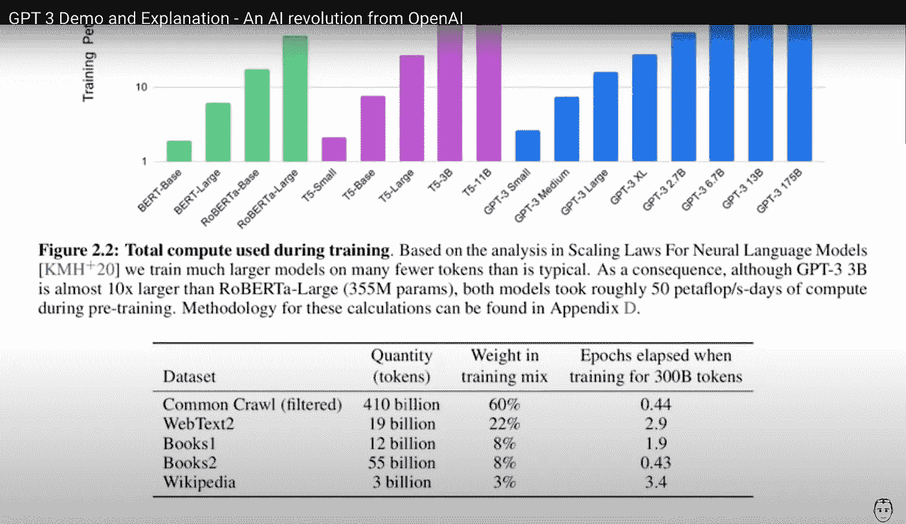

# 什么是 GPT-3，它对作家意味着什么？

> 原文：<https://medium.datadriveninvestor.com/what-is-gpt-3-and-what-does-it-mean-for-writers-16ebaf2d7e81?source=collection_archive---------7----------------------->

## 将来的

## 人工智能是游戏规则的改变者，你需要做好准备

Photo by [Mike](https://www.pexels.com/@mikebirdy?utm_content=attributionCopyText&utm_medium=referral&utm_source=pexels) from [Pexels](https://www.pexels.com/photo/combat-figure-fingers-gear-349455/?utm_content=attributionCopyText&utm_medium=referral&utm_source=pexels)

“你不应该按照人类思维的样子制造一台机器。”
[*弗兰克·赫伯特*](https://en.wikipedia.org/wiki/Frank_Herbert) ，在[沙丘传奇](https://en.wikipedia.org/wiki/Dune_(franchise))

## 什么是 GPT-3？

[GPT-3](https://en.wikipedia.org/wiki/GPT-3) ，或者说是预训练的生成式变形金刚 3，是一种人工智能工具，可以以类似人类的精度产生长格式文本。在埃隆·马斯克的支持下，它于今年早些时候发布用于测试。

## 有多精确？

> 该模型可以在不到 10 秒的时间内创建原创的长格式文本，如短文或文章，给出一句话的提示。模型写的最好的论文欺骗了 88%的人相信它们是人类写的。”— [数据驱动投资者](https://www.datadriveninvestor.com/2020/08/24/whats-the-hype-surrounding-gpt-3/)
> 
> “你所要做的就是写一个提示，它会添加它认为可能会跟随的文本。我用它来写歌、故事、新闻稿、吉他标签、采访、论文、技术手册。又好笑又吓人。我感觉我已经看到了未来。”— [Arram Sabeti](https://arr.am/2020/07/09/gpt-3-an-ai-thats-eerily-good-at-writing-almost-anything/)

GPT-3 使用了数十亿个参数，包括 30 亿篇维基百科文章和超过 670 亿本书籍。这可能比媒体上最狂热的读者所能达到的还要多:

Source: [Half Ideas — Startups and Entrepreneurship](https://www.youtube.com/watch?v=8psgEDhT1MM) on YouTube.

## 好吧…这对我作为作家的工作意味着什么？

我一直在网上阅读意见，每个人似乎都对此过于乐观。好像这个新工具只是作家的另一只援助之手。"节省我们的研究时间，增加编辑工作的价值，等等."

这种气氛让我想起了 2007 年，也就是 2008 年金融危机爆发前的几个月。我在伦敦还是一名金融新闻新手，我的经验更丰富的同事们在看到北岩银行分行外排队提取他们一生的积蓄时宣称:

> "哦，这只是不成立的集体歇斯底里."

我当时相信了他们。他们错了。他们对危机将对他们的投资造成的毁灭性影响视而不见。他们试图麻木这种不可避免的情感冲击。

Source: [Wikipedia](https://en.wikipedia.org/wiki/Turtle_graphics#/media/File:Turtle-animation.gif)

我不知道你们中有多少人能感同身受，但这就是我在 80 年代小学计算机课的样子。我们用一些简单的代码在屏幕上移动一只乌龟来制作几何图形。

这很有趣，但没人真的觉得怎么样。

该系统被称为 [LOGO](https://en.wikipedia.org/wiki/Logo_(programming_language)) ，是一种教育编程语言，旨在引导儿童进入全新的计算机世界。

 [## 机器学习和人工智能如何改变电子商务的面貌？|数据驱动…

### 电子商务开发公司，现在，整合先进的客户体验到一个新的水平…

www.datadriveninvestor.com](https://www.datadriveninvestor.com/2020/11/19/how-machine-learning-and-artificial-intelligence-changing-the-face-of-ecommerce/) 

嗯，我们，孩子们，把它当作一个游戏，就像 GPT 3 的早期用户现在正在做的一样。但这不再仅仅是一个游戏了。

**“我操作一台叫做语言的机器。它吱吱嘎嘎地哼哼着，但它是我自己的。”**

> *景观即将改变。非常快。以此作为友好的提醒。*

*正如每一项技术进步一样，即将到来的变化会带来好的和坏的结果，这取决于你站在故事的哪一边。*

# *对未来几年非常悲观的预测*

## *对于小说作家来说*

> *“乍一看，GPT 3 号似乎具有令人印象深刻的产生类似人类文字的能力。而且我们不怀疑它可以用来制作娱乐性的超现实主义小说；其他商业应用也可能出现。” [*欧内斯特·戴维斯。*](https://www.technologyreview.com/2020/08/22/1007539/gpt3-openai-language-generator-artificial-intelligence-ai-opinion/)*

*欧内斯特·戴维斯是纽约大学计算机科学教授。这段引文来自他在《麻省理工科技评论》上的一篇文章。*

*如果你是在为市场写逃避现实的小说，我会把这当作一个明确的警告，你的日子可能不多了。要么这样，要么你必须用一些独特的现实生活经验来提升游戏，以证明你对人工智能的价值。*

## *面向记者*

> *我们今天所知的人工智能生成的新闻是一种非常粗糙的程序。编写人工智能程序的人不“思考”任何事情；而是将旧文章中的词语复制粘贴到新文章中，并做一些调整以适应当前事件。*

**上面的引文是 2020 年 11 月 25 日(昨天，当我写这篇文章时)金融时报的一篇文章的开头段落。惊喜效果是:**是 GPT-3** 写的。**

**对于我们作为记者的短期未来来说，GPT-3 在这里所说的太接近事实了。**

**对于那些在前线报道真实新闻的人来说，什么都不会改变。但是对于那些在办公室里做网上调查，或者重写别人的文章或新闻稿的人来说，情况就不同了。**

## **对于成功的营销人员**

**你还在写操作指南吗？我认为 GPT 3 号已经储存了足够多的信息，暂时不需要你们的任何投入。**

**甚至你最独特的操作经验可能已经在 GPT 三号的数据库里了。**

## **对于自助作家和生活教练**

**再说一遍，如果你从事写激励性文章的行业，围绕名人名言来给人留下印象，现在就改变你的关注点。GPT 3 号可以在 10 秒内预测你的输出。**

## **对诗人来说**

**GPT 三号押韵比你好。如果你没有把自己独特的经历写进诗里，你最好把你的提示输入系统，让它产生想法。挑一个你喜欢的发表。**

**除非你是出于爱和乐趣而写作。那么，请继续吧**

# **从好的方面来看**

**实话实说吧。今天有太多的文字被用来填充页面，填充网站，提高搜索引擎排名。太多的人自己出书，希望赚一些没有什么新东西可说的钱。**

**这些作家和机器没什么区别，出于商业原因生产公式化的内容。数量重于质量。当人工智能接管这种类型的写作时，这些工人将迁移到下一个无脑的侧挤。**

**我用积极的眼光看待这件事。并不是所有的写作都需要以金钱为动机，我相信人工智能可以帮助我们回到更人性化的写作风格。你是发自内心的写作，而不是为了数据。**

**这是 AI 没有的一点。**一个灵魂。**我真的相信这将是我们在这个新领域的主要**“独特卖点”。****

## ****访问专家视图— [订阅 DDI 英特尔](https://datadriveninvestor.com/ddi-intel)****