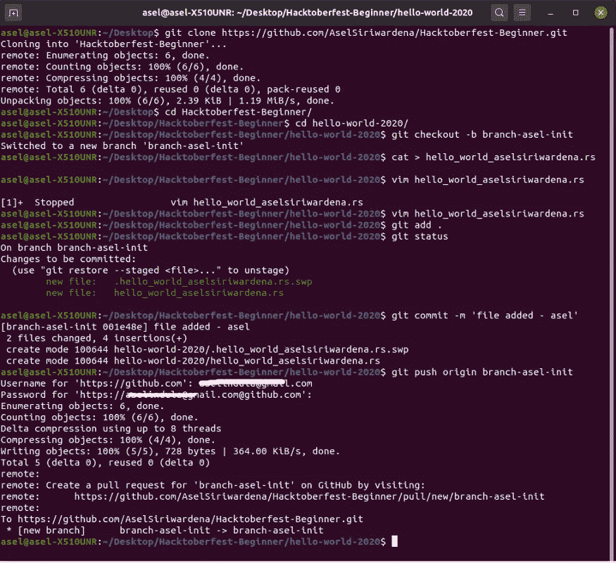

# 什么是 Hacktoberfest？|如何获得免费 t 恤？

> 原文：<https://medium.datadriveninvestor.com/what-is-hacktoberfest-how-to-get-a-free-t-shirt-9ff2344314c4?source=collection_archive---------2----------------------->

## 了解世界上最大的开源贡献活动。


Hacktoberfest 2020

> Hacktoberfest 是由数字海洋运营的开源软件长达一个月的庆典。Hacktoberfest 对我们全球社区的所有人开放！四个质量拉请求必须提交给公共 GitHub 库。你可以在 10 月 1 日到 10 月 31 日之间的任何时间报名。

# **初学者如何参与？**

很简单。你所需要的只是一个 Github 账户。GitHub 是开源世界的中心。在 hacktoberfest.digitalocean.com 注册。然后，您需要向公共回购发出 4 个有效的拉请求。仅此而已！


hacktoberfest-2020 progress

# 完成挑战需要付费吗？

当然可以！你将免费获得一件限量版 Hacktoberfest t 恤和贴纸。他们将把它们运送到世界各地。你不需要担心运费。鼓励优质投稿！

今年，他们提供了种一棵树的选择，而不是收到一件 t 恤。这是你的决定。

[](https://www.datadriveninvestor.com/2019/04/22/strategic-or-tactical-programming-the-road-ahead-for-software-engineers/) [## 战略或战术规划？软件工程师的未来之路|数据驱动的投资者

### outer hout(2018)在他的书《软件设计哲学》中提到了一些原则，以便更深入地挖掘…

www.datadriveninvestor.com](https://www.datadriveninvestor.com/2019/04/22/strategic-or-tactical-programming-the-road-ahead-for-software-engineers/) 

# 那么如何提出拉取请求呢？

如果你来自非编码背景，你可以在 GitHub 的浏览器上为一些项目做贡献。你不需要在电脑上安装任何东西。你甚至不需要知道一门编程语言。一些开发人员专门创建了 GitHub 库来帮助新来者提出他们的第一个 pull 请求。

但是如果你不是，我强烈建议你做一些真正的贡献。如果你的贡献非凡，你有机会从一些公司赢得更多的礼物。链接将很快更新。

# 以下是提出拉取请求的指南。

这一章将集中在初学者仓库。这是我创建的 Hacktoberfest [repo](https://github.com/AselSiriwardena/hacktoberfest-beginner) 的链接。



easy vim commands to commit changes

*   分叉公共存储库(单击此页面右上角的分叉按钮，单击您的个人资料图像)
*   将您的 fork 克隆到本地机器上

```
git clone [https://github.com/your-username/](https://github.com/your-username/hacktoberfest.git)hacktoberfest-beginner[.git](https://github.com/your-username/hacktoberfest.git)
```

*   创建分支

```
git checkout -b branch-name
```

*   进行更改(从以下任一任务中选择)
*   提交和推送

```
git add .
git commit -m 'Commit message'
git push origin branch-name 
```

*   从分叉的存储库中创建一个新的拉请求(单击位于存储库顶部的`New Pull Request`按钮)


making a pull request.

*   等待你的公关审查和合并批准！

# 你也可以为我正在做的一些公共库做贡献。

*   [锈角播种机项目](https://github.com/AselSiriwardena/rust-rocket-angular-seed) —项目指南可在此处找到
*   [Mozilla-lk 服务器监控项目](https://github.com/Mozilla-lk/griffin)

# 谢谢大家！黑客快乐！

## 访问专家视图— [订阅 DDI 英特尔](https://datadriveninvestor.com/ddi-intel)