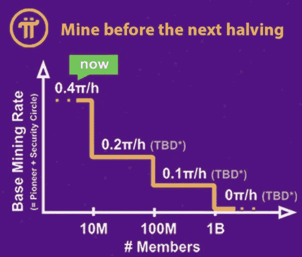

# Pi 网络发生了什么？

> 原文：<https://medium.datadriveninvestor.com/what-is-happening-with-pi-network-52e07d995697?source=collection_archive---------5----------------------->

Pi 网自从我上次写了一篇关于它的文章，已经成长了很多，大概是一个月前的事了。从那时到现在，很多事情都变了，这个项目发展得更快。“挖掘”率仍然是 0.04π/小时，但用户数量急剧增加。现在已经有 700 多万人下载使用了 Pi 网络。增长势头强劲，是过去几个月来最大的应用之一。当全球用户超过 1000 万时，该速率将降至 0.02π/小时。

# Pi 网官方推特

该项目刚刚得到了它的 Twitter 句柄验证，这是一件大事，因为最近，有很多假冒的帐户冒充 Pi 团队，并试图欺骗用户。这个问题也是他们举报的，告诉大家新的加密货币还没有取值，在这一点上没有人可以卖或者买。

# Pi 网络约定

Pi 网络团队宣布最新的会议将在今年第三季度召开。这是一个极好的消息，我们将听到创作者和团队帮助这个项目成为现实。未来的计划是什么，我们应该什么时候进入下一个阶段。他们实际上也在寻找大会的发言人或演示者，你可以在这里应用。

令人兴奋的事情正在这个项目中发生，我们就是为此而来的。在这一点上，我仍然继续每天采矿，这已经变成了一种习惯。我可以向所有人保证，它不会影响手机的电池或互联网消费。我有正常的电话使用，除了收集圆周率之外没有任何变化。到目前为止，我手头有 1500π多一点，我不打算很快停止采矿。如果你们想加入，这是我的邀请码:多瓦克

 [## 现在是改变支撑社会的系统的时候了吗？数据驱动的投资者

### 首先，我要感谢 5CsofBusiness，是它激励我写这篇关于通过…创造一个更美好的世界的文章

www.datadriveninvestor.com](https://www.datadriveninvestor.com/2020/07/14/is-this-the-time-to-change-the-systems-that-underpin-society/) 

**访问专家视图—** [**订阅 DDI 英特尔**](https://datadriveninvestor.com/ddi-intel)