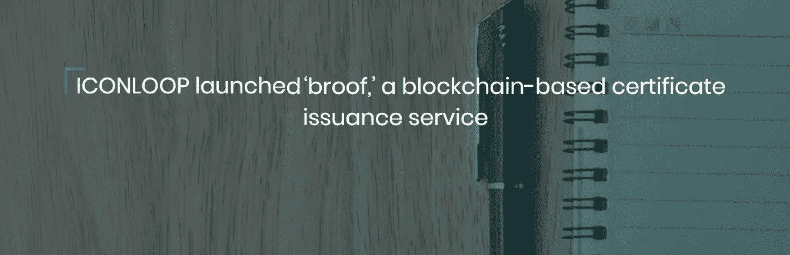
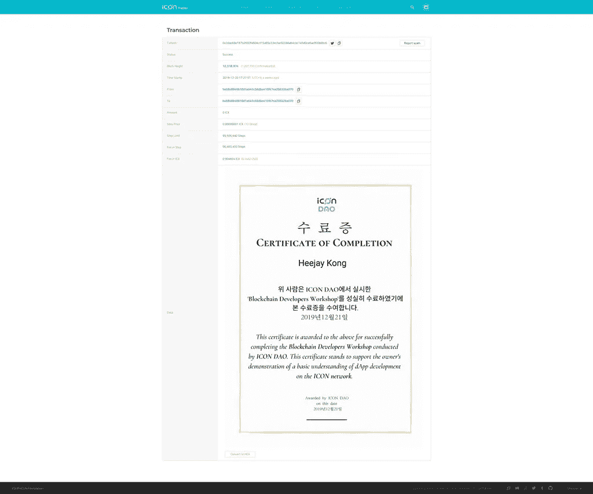
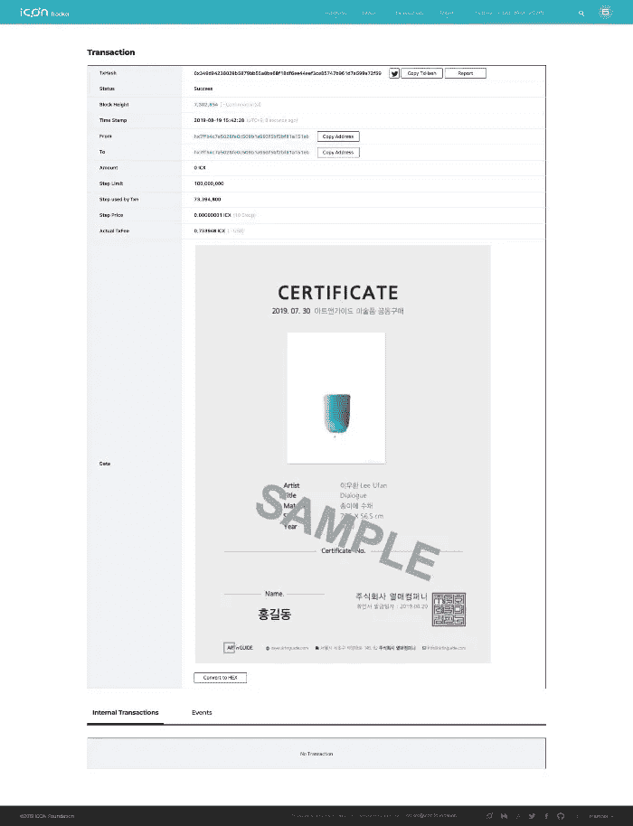

# 什么是 ICONLOOP broof？

> 原文：<https://medium.datadriveninvestor.com/what-is-iconloop-broof-791b187b843c?source=collection_archive---------7----------------------->

大肆宣传的分布式账本技术(DLT)区块链已经开始成为现实世界的技术选择。并且准备改变记录信息的方式，就像开源软件在 25 年前所做的那样。同样，Linux 花了十多年时间才成为全球商业世界的基石，区块链很可能需要几年时间来探索其最大的复杂性。

 [## 2019 年十大区块链课程|数据驱动的投资者

### 渴望在区块链发展吗？你想知道区块链是如何工作的，但不知道在哪里？或者就是太多了…

www.datadriveninvestor.com](https://www.datadriveninvestor.com/2019/03/08/top-10-blockchain-courses/) 

随着区块链采用率的变化势头越来越大，大多数市场分析师、开发人员和加密货币爱好者都认为，区块链技术有过多的用例场景，其中大多数都可能会对整个行业产生积极的影响。此时此刻，人们谈论的都是 ICONLOOP 新推出的“ [broof](http://broof.io) ”，这是一项总部位于区块链的证书发行服务。

**什么是 ICONLOOP & broof？**

为了加速区块链的大规模采用，ICONLOOP 开发了 broof 来促进任何类型证书的证书颁发，如毕业证书、就业证书、存储和防止伪造。

ICONLOOP 是一家区块链专业技术公司，总部位于韩国首尔，专门从事区块链技术的实施和设计。该公司旨在获得现有平台的可扩展性和安全性，并通过 SCORE 智能合约、LFT 算法、分层系统、多通道和模块化架构最大限度地利用区块链技术。ICONLOOP 基于自主开发的区块链引擎和 loopchain，引领着金融交易、数字货币和物联网(IoT)领域的创新。

> ICONLOOP broof 是一个值得信赖的基于区块链的证书发行服务，它直接在 ICON 公共区块链网络上运行。

从长远来看，ICONLOOP broof 上发生的任何交易都将使公共链受益，并需要 ICON (ICX)。broof 在一个不能被篡改的区块链中记录了从证书的颁发到删除的一切，从而增加了公众对证书颁发的信心。

让我们更深入地了解 ICONLOOP broof。

**为什么 ICONLOOP broof 很重要？**

在公共区块链上利用图标数字认证可以显著限制与发布和存储纸质文件相关的费用和劳动力。重要的是，证书接收者可以查看和接收他们的基于区块链的证书，而无需创建单独的数据库框架。一旦证书颁发，收件人就可以随时随地通过数字方式访问证书，只需点击几次鼠标。

[ICONLOOP 的 Medium post](https://medium.com/helloiconworld/iconloop-launches-broof-a-blockchain-based-certificate-issuance-service-e24e956c5ea3) 声明“*一旦发证机构(公司或机构)设置了批准的收件人列表、发证期限和 URL，收件人就可以访问该 URL 并输入他们的名称和密码以获得证书，而无需经过其他冗长的程序*”。

由于区块链网络的不变性和安全性，基于 ICON broof 的文件提供了强大的保证，防止伪造发行和伪造，并具有更容易跟踪真实性的时间戳。通过查找特定的交易，可以在图标追踪器中检查记录的真实性。

所有的信息都由 ICON 可靠地管理，ICON 是一个分散的、没有许可的区块链，很难修改过去的交易，除非你有过多的资金打算这样做。因此，潜在的雇员、政府机构和大学可以容易地验证诸如起点、目的地和交易时间等参数的真实性，同时降低相应认证的材料损坏或丢失的风险。

**icon loop broof 的用例**

对于许多机构、公司和个人来说，区块链是一个有趣的概念，也非常怀疑它的用例。让我们来看看 ICONLOOP broof 的用例。

POSTECH(浦项科技大学)——韩国一流大学之一已经开始相信这项技术，并在一定程度上以采用的名义将自己的声誉置于危险之中。

POSTECH 向学生发放区块链毕业证书的最初势头表明，这是公共区块链的首次成功实施。此外，这种“无摩擦”的实施证明了区块链的有用性和可靠性。

ICONLOOP 与 Yeolmae 公司签署了一项协议，为 ARTnGUIDE 提供基于 ICON broof 的证书发行服务。

ARTnGUIDE 是一个独特的平台，作为个人购买艺术品共同所有权的中介网站，而不是购买整件艺术品。根据协议的细节，ICONLOOP 的 broof 服务将存储艺术品的所有权以及该作品的图像，以防止伪造记录。颁发一个带有时间戳的证书，该证书显示图像以及“印章”签名。

**总结**

ICONLOOP broof 可以被任何人用来为任何事情创建不可变的数字证书。

ICONLOOP 首席执行官 Jonghyup Kim 表示" *ICONLOOP 一直在以各种方式与政府和其他各种机构合作，以便在日常生活中实施简单的区块链服务。我们期望“broof”将在行政管理、教育和金融等领域创建一个更安全、更可靠的认证体系。同时，这也将减少所需的社会成本*。

然而，商业世界将很快意识到这项技术的巨大潜力，它将推动新一轮的分散应用。不难得出结论，随着时间的推移，可能会有越来越多的公司跟进。