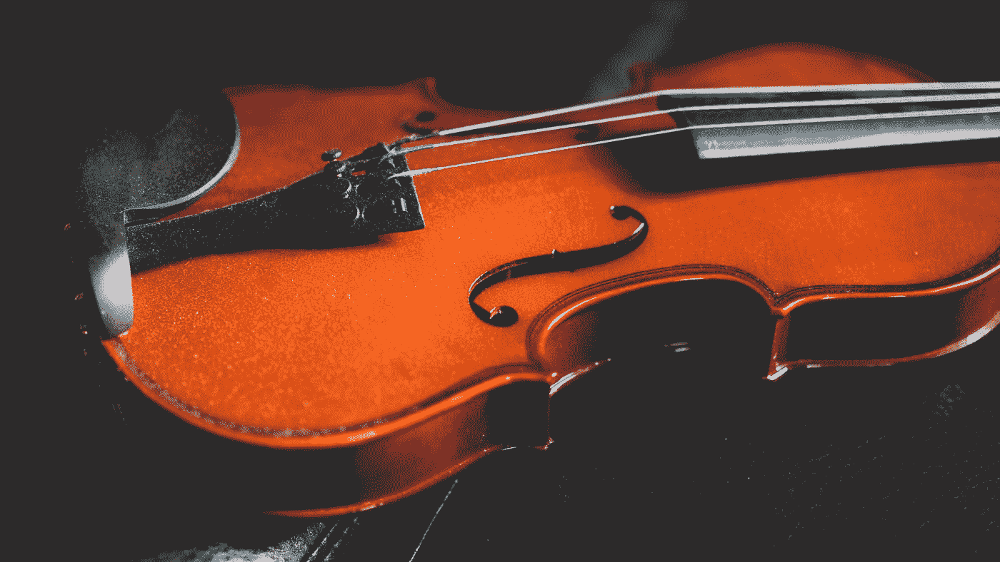
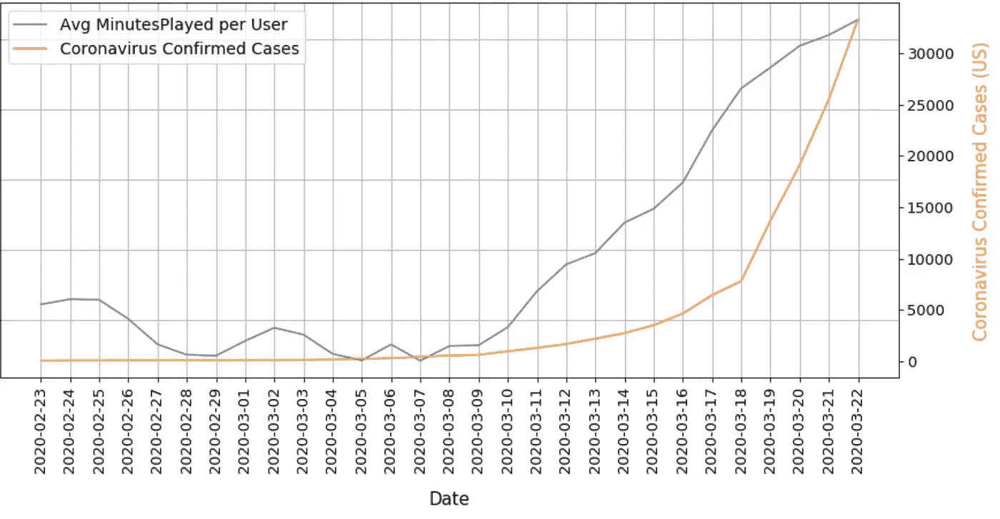
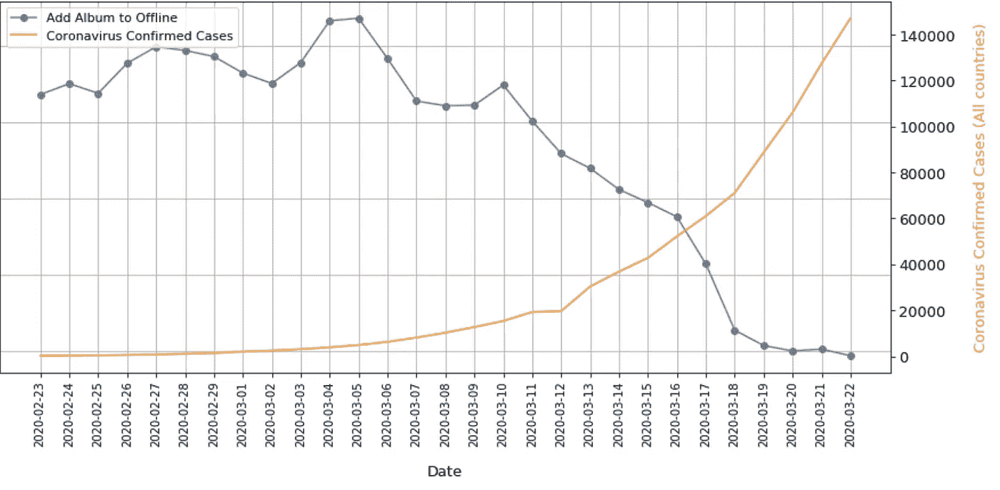
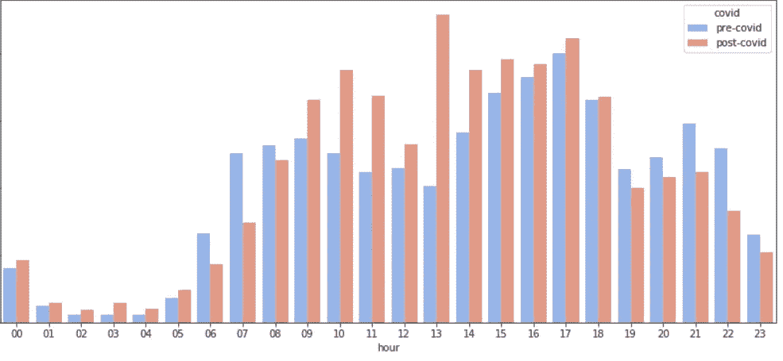
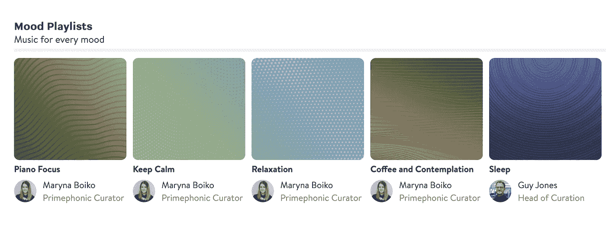
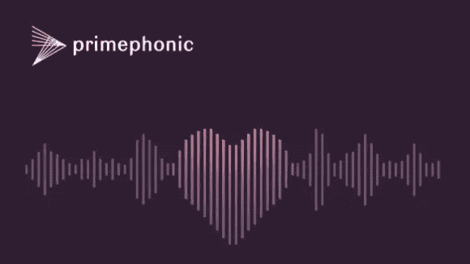

# 冠状病毒对音乐流媒体服务有什么影响？

> 原文：<https://medium.datadriveninvestor.com/what-is-impact-of-the-coronavirus-on-music-streaming-services-e2cf85aebdae?source=collection_archive---------11----------------------->

## 我们展示了古典音乐流媒体服务 Primephonic 的例子。

Photo by [Hunter Harritt](https://unsplash.com/@hharritt?utm_source=medium&utm_medium=referral) on [Unsplash](https://unsplash.com?utm_source=medium&utm_medium=referral)

无法回避的事实是，新冠肺炎正影响着世界大部分地区的许多人。随着社交距离和呆在家里成为我们大多数人的新常态，我们面临着如何在不离开家的情况下打发空闲时间的问题。

除了让我们的职业生活适应至少几周的在家工作，我们还面临着在闲暇时间娱乐自己的挑战。

不太可能有人认为网飞、Spotify 或 Primephonic 等服务最近几天没有增加流量。在这个奇怪的时代，流媒体应用是一个很好的盟友，不仅可以在晚上和周末娱乐，还可以在音乐流媒体应用的情况下，帮助人们在工作日集中注意力。

# Primephonic 的案例

Photo by [Dan Gold](https://unsplash.com/@danielcgold?utm_source=medium&utm_medium=referral) on [Unsplash](https://unsplash.com?utm_source=medium&utm_medium=referral)

Primephonic 是专为古典音乐设计的流媒体服务，包含 350 万首最高音频质量的曲目。许多用户听音乐是为了娱乐，一些是为了学习，另一些是作为他们日常活动的背景。

所以还是去分析吧！

# 隔离、自我隔离和社会距离如何影响流动数字？

## 倾听时间

我们分析了过去六周内每个用户的平均收听时间。美国受到了疫情的严重影响，所以我们对美国的订阅用户进行了抽样调查。

 [## 将定义 2020 年就业前景的五大数据科学和机器学习趋势|数据驱动…

### 数据科学和 ML 是 2019 年最受关注的趋势之一，毫无疑问，它们将继续发展…

www.datadriveninvestor.com](https://www.datadriveninvestor.com/2020/02/19/five-data-science-and-machine-learning-trends-that-will-define-job-prospects-in-2020/) 

我们怀疑，人们在家里花的时间越多，试图放松或集中注意力的时间越多，他们使用 Primephonic 的时间就越多。这一点得到了证实，我们可以在下图中看到:

Average Minutes Played per User & Number of confirmed coronavirus cases (Users in the US) (*)

最近几天，我们看到每个用户的上场时间增加了，因为隔离和封锁越来越严格，人们也越来越意识到这一点。

## 将音乐保存到脱机状态

再来看看其他功能。作为领先的古典音乐流媒体服务，Primephonic 提供下载音乐供离线收听的选项。看看这个特性最近的使用情况:

Number of Playlists Added to Offline — Daily Count (Users in France) (*)

我们可以看到，最近几天这个功能的使用减少了。这是有意义的，因为人们现在花更多的时间在有 wifi 的家里，不需要下载专辑或播放列表在旅途中听。

## 一天中的时间——我们能看到常规的改变吗？

下图显示了二月初(疫情之前)的一周和三月中旬(法国局势发生急剧变化之后)的一周内，每小时发生的会话总数。

有什么重大变化吗？

Sessions per Hour of the Day — Pre and Post quarantine (Users in Italy) (*)

蓝色条显示了新冠肺炎改变日常生活之前的会话总数，橙色条显示了之后的会话总数。

我们可以看到很多东西:

*   人的套路变了。二月初，听众在早上记录了更多的会议，与起床、为一天做准备和吃早餐的时间一致。我们假设许多人也在通勤途中收听，要么在公共交通工具上，要么通过 Primephonic 的最新功能之一的车载流媒体。
*   在隔离期间，似乎总的来说，人们醒得较晚，但全天听得更多。听众在工作日和午餐时间都在享受音乐。
*   很明显，在意大利被封锁之前，上班前和下班后是最受欢迎的收听时段。看起来古典音乐是许多人日常生活的一部分，这是一种有益健康的习惯，一旦我们都回到了日常工作中，他们就会恢复这种习惯。可能有些人回到共享工作区，09:00-17:00 还会继续听古典音乐，耳机销量会增加！
*   最后一个有趣的见解是:更多的人在凌晨听音乐。在 03:00，收听会话的数量是前一时段的两倍多(回顾图表)。也许焦虑和担心在起作用，也许那些失眠的人随着他们日常生活的改变会更强烈地感受到这一点。也许此时他们正转向 Primephonic 的“睡眠”或“保持冷静”播放列表寻求安慰。

Playlists curated by Classic Music specialists in Primephonic

如果你想看的话，这里有心情播放列表的链接。

(*)出于数据保护和隐私方面的原因，图表的左轴隐藏了数字。

# 最后的想法

待在家里的新常态为联系过去的激情或发现新的激情提供了一个很好的机会。在 Primephonic，我们已经看到越来越多的人更频繁地使用我们的服务，这让我们很高兴。我们很高兴能够在这个艰难的时刻提供一些安慰。

我们对音乐厅和歌剧院普遍关闭以及世界各地不断取消现场演出感到震惊。我们希望帮助艺术家和观众继续创造和享受这种美妙的艺术形式。#LetsKeepTheMusicPlaying

Primephonic

# 关于 Primephonic

我们是一家不断成长的初创公司，成立的目的是直接应对古典音乐行业中存在的紧迫挑战和机遇。

我们的目标是通过广泛的古典音乐目录、高质量的音频和行业领先的搜索技术接触到服务不足的古典音乐听众，同时解决对当今艺术家和唱片公司产生负面影响的流媒体音频价值差距。

Primephonic 从共享价值的商业角度出发，与古典音乐艺术家、艺术家经理、唱片公司和艺术主持人合作，寻求重塑数字古典音乐体验，并重新点燃全球对这种音乐类型的热情。

查看[这里](https://play.primephonic.com/)的 [Primephonic 网页播放器](https://play.primephonic.com/)！

感谢阅读！