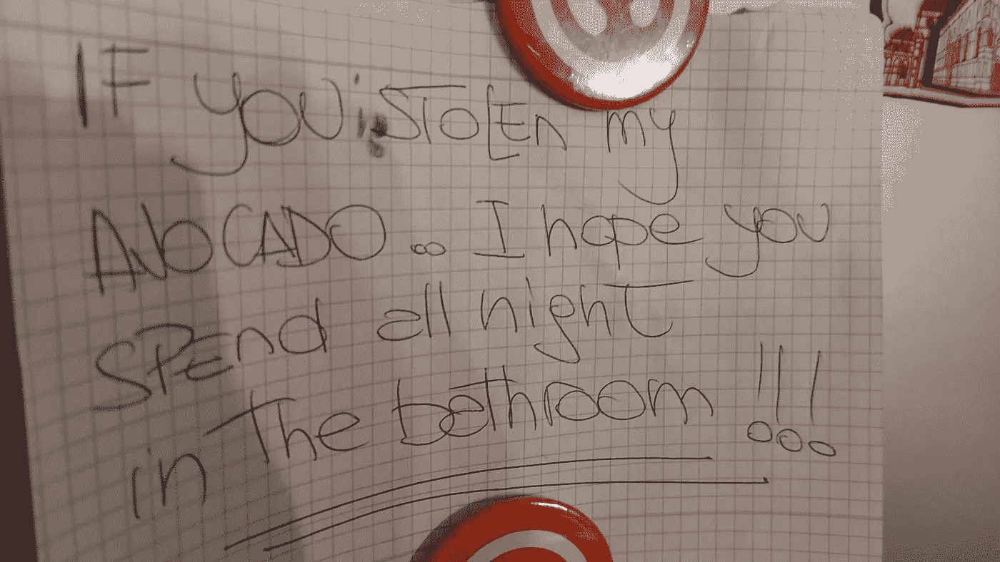

# 住旅社是一种怎样的体验？

> 原文：<https://medium.datadriveninvestor.com/what-is-it-like-to-live-in-a-hostel-ff5670a0e4b2?source=collection_archive---------13----------------------->

## 我已经在宿舍住了 1 个月了。以下是我的印象。

Photo by [Taiga Ishii](https://unsplash.com/@shichisan?utm_source=medium&utm_medium=referral) on [Unsplash](https://unsplash.com?utm_source=medium&utm_medium=referral)

很**酷**，但不适合任何人。你几乎没有隐私。但它还有其他几个优点。

# 费用

支付的金额是你能找到的最小金额之一。比 Airbnb 之类的便宜多了。我显然指的是共用房间里的一张床。在我现在的房间里，有 8 张床。有床位少的房间。还有包间。越不共享，越私密，越贵。

# 位置

结合低廉的成本，让住旅社的人有可能选择城市里的特权地址。对我来说，我在这个城市最好的位置，靠近 2 个购物中心，超市和交通。我可以轻松地步行游览旅游区，享受最好的酒吧和餐馆，以及文化景点。据我所知，周围至少有六个其他的旅馆选择，设施相同，价格合理。

# 语言

我的工作要求精通英语。这家旅馆是与来自各国的人交谈的理想场所。对我来说，训练不同口音的对话很重要。在这里，我们有来自德国、意大利、加拿大、英国、法国、西班牙等等的人。厨房是聚会的地方，谈话总是用英语。其中一位客人是英语老师。他总是帮助我进步。

# 建立工作关系网

也许最好的好处之一是:在一个月的时间里，我遇到了一些人，我可以和他们进行很好的交流。我遇到了一位客人，如果我想在加拿大工作，他会为我开门；另一位英语老师想在对话中帮助我；一位德国人给了我关于政府的重要提示和一些我需要的文件(他仍然知道我父亲出生的城市)。我给一个巴西人提供咨询，他有一个为艺术家申请的好主意，他给我上了一堂咖啡课(有权品尝)。我帮助一个街头音乐家开始了他的职业生涯。我给了一个住在加拿大的女孩一些建议，她想了解巴西。如果她去我的城市，我可以免费为她提供家庭成员的住宿。她让我品尝她家乡西班牙的典型食物。事实上，我们经常为对方做饭。我们免费且自然地与来自所有国家的人们建立友谊和合作的纽带。**我们交朋友。**

# 天有不测风云

不是所有的东西都是花。有时候有些东西会消失，比如一位意大利客人非常生气的鳄梨，你可以看到:

有时候有些客人很难相处。一个年轻人有在水池里洗脚的习惯。另一个喜欢指挥卧室里的事情应该如何运作。还有一种——也许是最糟糕的——打鼾的分贝数我认为对一个人来说是不可能的。目前，我的睡眠一直被这个室友打扰，他肯定要呆一个月。当他离开时，可能会有或多或少有问题的人来代替他。

# 这就是旅社的生活。

我现在的生活，让我成为一个更好的人。对此我很感激。当然不会是一辈子，但我会尽我所能过好这个阶段。