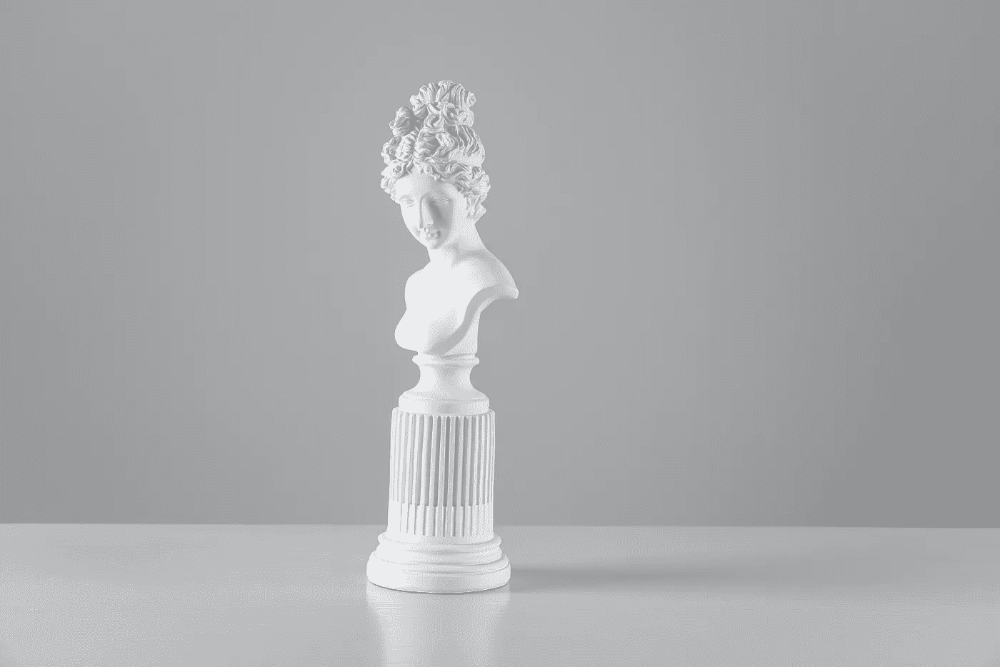

# 什么是因果报应？

> 原文：<https://medium.datadriveninvestor.com/what-is-karma-e2faafbd823d?source=collection_archive---------12----------------------->

—西方对东方传统的反思

恶有恶报。消极行为最终会导致某种形式的宇宙报应的信念。你同意这个原则吗？

如果你全心全意的回答是。后续的问题是，你怎么知道别人对你的社交行为是正面的还是负面的解读？

Photo by [Amanda Dalbjörn](https://unsplash.com/@amandadalbjorn?utm_source=unsplash&utm_medium=referral&utm_content=creditCopyText) on [Unsplash](https://unsplash.com/s/photos/psychology?utm_source=unsplash&utm_medium=referral&utm_content=creditCopyText)

在西方心理学中，弗洛伊德和其他精神分析学家认为，我们生活的相当一部分发生在无意识状态中。换句话说，成年人倾向于掩盖不愉快的经历。我们没有正面面对生活的挑战，而是主动抑制不适。

根据吉杜·克里希那穆提的观点，这种回避行为源于个体无法感知整个思维。

> 痛苦在所难免。痛苦是可选的。—佛陀

# 思考

心理学、神经学、哲学、神秘主义、灵性试图捕捉谁或什么有生命的体验。还原论科学指向大脑或心灵，这产生了个性和能动性的精神幻觉。其他人从事主观和/或物理经验的解释。

为了解释心灵，我们经常使用效用观点。思考实现了什么？坦率地说，它是在物质和被代表的事物之间建立联系。如果你在自然界中发现一块石头，你会把它看成一块石头。当你把同样的石头放在博物馆里，其他人会看到艺术。

A statute is just a fancy curved rock. — Photo by [Ellen Qin](https://unsplash.com/@ellenqin?utm_source=unsplash&utm_medium=referral&utm_content=creditCopyText) on [Unsplash](https://unsplash.com/s/photos/statue?utm_source=unsplash&utm_medium=referral&utm_content=creditCopyText)

头脑中解决问题的部分在西方被称为智力。萨德古鲁解释智力就像一把在物体之间解剖的刀。没有它，你会试着穿墙而不是穿门，无法理解其中的区别。

# 经验

来解释什么是人类生活体验的基础。我不得不谈谈意识的发展。为了在石器时代生存，人类进化出了具有战斗和逃跑反应的爬行动物大脑。

很久以前，我们像类人猿一样寻找食物。值得注意的是，缺乏速度和体力。幸运的是，我们有创造力或跳出框框思考的天赋。

每个生物都想延长自己的寿命。否则，我们会为了独特的死亡体验而跳出飞机。所以为了延长人类的寿命，我们制造了武器、房屋，创造了农业、电力、民主等等。但是最重要的发明是语言——用来解释未呈现的事物。

# 想

一个世界的表象只能在交流中表达。就像语言中的单词一样，表达出来的单词或图像意味着另一个未表达的想法。

当肚子咕咕叫的时候，条件反射的大脑会发出一种即时的神经元模式。你认为我感到饥饿，所以你采取行动。你要么消耗食物，要么抑制优先考虑当前活动的想法。

经验的背景决定了决策的权重。如果你有禁食或延迟满足的经验，你可以推迟饥饿感。同样，如果你有饿死的痛苦经历，你更有可能立即走向冰箱，因为你再也不想经历这样的痛苦了。

当你遵从身体的意愿时，大脑通常会奖励你多巴胺或皮质醇激素。头脑要么想要重复这种快乐，要么想要避免这种经历的痛苦。

不可能再次重现同样的事件，因为外部和内部环境总是在不断变化。你仍然可以欣赏这种独特性，或者为每一刻的消逝而感到悲伤。因此，每一次经历都是既痛苦又愉快的，这取决于视角。

总而言之，大多数想法都是重复的，因为它们要么想要复制，要么想要避开以前的经历。

# 二元论

战争是和平。快乐掩盖了痛苦。有光的地方，也能找到黑暗。这些短语是有争议的。两者都意味着绝对的对立，指向用语言解释现实的内在矛盾。

头脑就像是经验的过滤器。虽然你认为它是未定义的，就像画家未触及的空白画布，但它是定义的。思想有一个特殊的形状，就像一幅画的框架。

Photo by [Kelly Sikkema](https://unsplash.com/@kellysikkema?utm_source=unsplash&utm_medium=referral&utm_content=creditCopyText) on [Unsplash](https://unsplash.com/s/photos/white-canvas?utm_source=unsplash&utm_medium=referral&utm_content=creditCopyText)

画家可以在空白处画任何东西，但他无法改变观察者对画面的方形感知。同样，如果你没有提高对某个领域或技能的认识，你就无法体验某件事。

专家看到模式；你看不到是因为他很多小时的学习和练习。掌握意味着你凭直觉或本能地以最佳方式行动和思考，向你想要的结果靠近。

# 梵语

印度教有两个词，对你理解生命的游戏、因果报应、摩耶有深远的意义。

哪里有快乐，哪里就有痛苦。在你经历痛苦的地方，你也能找到坚持不懈的安慰。业力直接转化为束缚或痛苦，而痛苦是不适的身体体验。痛苦只发生在头脑中。

对因果报应的误解是你可以控制自己行为的后果。我们在这一刻或任何时刻都有业力。它不是一种有意识的伤害或疼痛的体验。

是相信玛雅或者大幻术的束缚。因果报应就像一个轮子或一系列经历。所有的人类文化都倾向于让头脑感知生活中的七宗罪:欲望、暴食、贪婪、懒惰、愤怒、嫉妒和骄傲。同样，我们被教导:成功、感恩、利他主义、和平、慈善、无条件的爱，是积极的生活体验。

在不同的情况下，我们都会时不时地经历这些感受。根据亚历山大·洛登的说法，这些情绪来源于两种主要的情绪恐惧或爱。

> 恐惧导致愤怒，愤怒导致仇恨，仇恨导致痛苦。—绝地大师尤达

爱是通向未知的引力。当你接受周围和内在的混乱时，喜悦、优雅、感激、耐心在优雅的状态中体验。每当我们面对这些感知到的情绪状态时，我们都有机会做出反应或采取主动。

# 二元论

玛雅被解释为分离的幻觉。你和宇宙的分离。心灵和物质。真相和谎言。善与恶。社会在抽象生活方面做得很好。

为了让大多数人理解他们的生活经历，我们发明了像道德和伦理这样的复杂概念。这些系统意在将人们从对随意杀戮、残忍等的恐惧中解放出来。如今，我们已经忘记了它们完全是我们编造的。

残酷的事实是现实就是如此。它既不是公平的，错误的，公正的，快乐的，正确的，也不是虚假的。斯多葛派通过自我控制来应对这种虚无主义的世界观，如果你不能控制你的环境，至少要控制你的感知。

在东方，这种终极的混沌被解释为自然的优雅。道教选择与生命共舞，佛教徒决定放弃因果报应，印度教徒认为每个人都在玩捉迷藏游戏，而不是强制执行意志。

# 厌倦

根据阿兰·沃茨的说法，印度人相信一切都是一个被称为神性的实体。这个生物拥有绝对的力量，为了娱乐自己，它想出了一个诡计。

想象你变成了不朽。你会如何度过第一个 100 年？你可以阅读每本书，从事任何职业；你可以来回变换性别。你尝试死亡、邪恶、天使等等。但最终，你会感到厌倦。

Photo by [Daniel Cheung](https://unsplash.com/@danielkcheung?utm_source=unsplash&utm_medium=referral&utm_content=creditCopyText) on [Unsplash](https://unsplash.com/s/photos/lego?utm_source=unsplash&utm_medium=referral&utm_content=creditCopyText)

所以为了让事情变得有趣，你给游戏添加了一个特定的时间框架，一个生命周期。让决策更有趣。你让某些角色变得更聪明，更健康，等等。，来创造，例如，受压迫者的叙述。

然后你有了一个绝妙的主意，让人们忘记他们是同一个宇宙的一部分，所以他们认为他们的小行动是有意义的。

# 戏剧

人类的生命是不断重复的记录。经历的忧喜在每个时代都在变，但感受却保持不变。我们的祖先带着和你一样的大脑到处走。但是他们使用它的方式不同，因为他们直到发明了书面语言才能够储存信息，或者在我们的计算时代看到大规模的模式。

大多数人类参与了业力和玛雅的大计划。不知道他们有自由放弃命名的经验。开悟不是一个目标，而是一种无判断的状态。当你决定停止寻找并开始体验时，你就会体验到这一点。当你选择爱，这未知的深潜，你意识到在这种状态流中，你同时是观察者和被观察者。头脑不能再用某种方式欺骗你去描绘这个世界。

> “因果报应是你的生存，也是你的束缚。而如果处理得当，也可以是你的解脱。”贾吉·瓦苏德夫