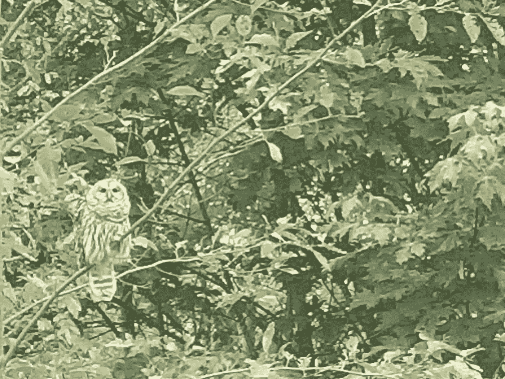

# 人生是什么？你的感知如何改变地球上所有的生命

> 原文：<https://medium.datadriveninvestor.com/what-is-life-how-your-perception-changes-all-life-on-earth-cbb878f1467c?source=collection_archive---------9----------------------->

## 我们可以拥抱所有的生命，去发现每一个生命的价值

The human face of life, photo by Christyl Rivers

## 什么时候是人生？

本周，许多人都在屏息关注最高法院的任命，选举的趋势，以及人类平等的持续斗争。这让我开始思考看似不相关的生活、出生和医疗保健问题是如何塑造我们的观点的。

生命始于受孕吗？大多数教育家、医生和科学家会说不。生命——我们已知的唯一生命——大约 35 亿年前开始于已知宇宙中的唯一一颗行星上。一根单线，DNA，将我们与史前联系在一起。

然而，如此专注于人类生活的人类，倾向于认为生命的开始与他们有着千丝万缕的联系。我们的心与人的生命相关，因为这是我们的主要兴趣所在，但是当我们的头脑、我们的思维技能开始接受只有人的生命才是最重要的这一观点时，危险就出现了。认为“生命”指的是人的生命是很自然的，但它也切断了我们对提供“生命”的生命世界的归属。

在你意识到之前，我们正在为谁有足够高的威望来决定他/她自己的生活而争吵。

“生活”一词倾向于成为名词。例如，说“我的生活一团糟”，表明生活不再是一个过程，一个动词，而是一个年久失修的物体，或者它是一个不幸的“存在”，我们把它当作一件东西来看待。

但是如果以这种方式看待生活掩盖了它感人的进步力量呢？赋权需要运动和活动。当一个生命成为一个东西时，它就不再是动态的了。除此之外，生命被更准确地看作是亿万个相互依存的有机体所共有的一种品质。从这个角度来看，生活不能被视为任何单一的事物。它当然不能被占有或支配，只能由分享它的我们来影响。

根据我们对生活的定义，宗教、政治和教条有分裂我们的危险。一旦分裂，我们很容易被征服加入冲突的部落。然后，我们常常意识不到，我们想要捍卫自己信仰的倾向会危及其他生命，进而危及整个文化、更广阔的世界和支持我们的生物圈。

 [## 新的健康技术如何让我们活过 100 岁？数据驱动的投资者

### 不久前，我们都在看一台黑色电视，不得不带着天线跑遍整个公寓，以确保…

www.datadriveninvestor.com](https://www.datadriveninvestor.com/2020/08/12/how-new-health-technology-makes-us-live-past-100-years/) 

## 外表行为惹人注目

这就是为什么对人类来说，扩大我们的归属范围，包括“地球上的生命”是至关重要的。对于那些没有干净空气、水、食物或住所的人来说，生活质量很低。越来越多，这包括所有的生命，珊瑚生命，雨林生命，沙漠生命，草原生命。珍惜所有这些生命不仅是富有同情心的延伸，也是合理的应用科学。

除非我们看到“生命”本身的价值:生物学，否则我们无法保护我们在地球上的生命。

思想塑造我们的话语，但反过来也是如此。像“生活”这样一个承载了几个世纪人类意识形态重量和教条的词，会改变一个人头脑中的意义。

例如，我们想要最高法院的法官相信生命始于受孕吗？有些是。有些没有。不管怎样，我们需要非常批判性地审视我们如何以及为什么对“生活”这个看似中性的词持有我们的观点，甚至是敌对的观点。

正是这一点让我们团结起来对抗宇宙的巨大空虚——我们活着！不应该被征用来毁灭我们。

我们有生活。我们思考和形成文字和想法的能力是真正值得赞美和欣赏的。让我们感谢自己有能力质疑、思考和审视比自己更伟大的东西。

## 生死问题

当我们站在二十一世纪下半叶的悬崖边时，生活中存在着长期被忽视的挑战，这给我们自己带来了危险。

不平等是其一。它阻碍了地球团队的团结。第六次灭绝，是由分裂和激怒我们的力量——统治和剥削——造成的，如果我们继续分裂，它将对我们构成更大的威胁。气候危机是一个非常现实和复杂的问题，需要所有人都参与进来，这使得我们有成千上万的不同任务要做，从植树造林到控制森林燃烧，从太阳能摩天大楼到对害虫和入侵物种的无毒干预。

早就应该解决的人权问题阻碍了前进的步伐。不要过于二元对立(高等人类对低等人类)，难道我们不能决定所有人类都应该享有基本的人权和代表权吗？

当然，当你试图将包容扩大到未出生的人类，或者说，扩大到那些与我们关系如此密切的灵长类动物时，这就变得很棘手了，因为它们不仅应该受到保护，还应该拥有自身的价值？

这种困惑恰恰说明了为什么我们需要给予那些应该有权在难题上发表意见的人完全的人的地位。

## 感知就是一切

我们如何看待生命关系到生命，也关系到活着的人。

我们的星球正在经受卡尔·萨根博士所说的我们的技术青春期的严峻考验。他的意思是，当我们发明脸书、人工智能和监控技术、战争技术——包括生物武器和核弹——时，我们有巨大的责任知道如何明智地使用它。

如果这种技术进一步分裂我们，就像我们看到的客观新闻观点的终结，或偏见党派的孤立筒仓，我们将付出巨大的代价，我们可以称之为真理的终结。

当你把教条加入其中时，事情会变得前所未有的混乱。古老的教条告诉一个群体，生活是一种权利，其他人被排除在外，你是在自找灾难。

人们迫切需要教育，而不是灌输。当我们以此为基础追求技术进步时，我们更容易找到服务于所有人而不是少数人的功利主义答案。

想想那些不熟悉信仰的气候难民，他们觉得自己对文化和食物的要求和你自己的一样合理。例如，当北美野牛在十九世纪被灭绝时，那些“有权”被屠杀的人并没有考虑到草原和平原生态系统的保护。

“天定命运论”这一观点毁了许多人的生活，当然不仅仅是人类。

感知很重要。如果有人怀着极大的热情和虔诚，认为某些特权，无论是住房、医疗保健、好工作，甚至是救助，都不应该属于“不值得拥有的人”，那么这种怨恨将会继续存在。

## 科学和理性

科学、技术和社会科学需要对所有人开放，不要把它们视为邪恶的统治者，而是改进的工具。

也就是说，我认为我们不能仅仅依靠知识来前进。一场巨大的文化转变，一场任何三岁小孩都能理解的对公平的常识的运动也是必要的。

曾几何时，所谓的科学帮助古代人设想了一个巨大的存在链，这个层次结构解释了为什么牧师和国王在顶端，而女人和狗在底端。

但是这个吃或被吃的食物链被证明是错误的。更确切地说，我们存在于一个存在和归属的巨大交织网中。

是我们开始认识到现实的时候了。

## 访问专家视图— [订阅 DDI 英特尔](https://datadriveninvestor.com/ddi-intel)