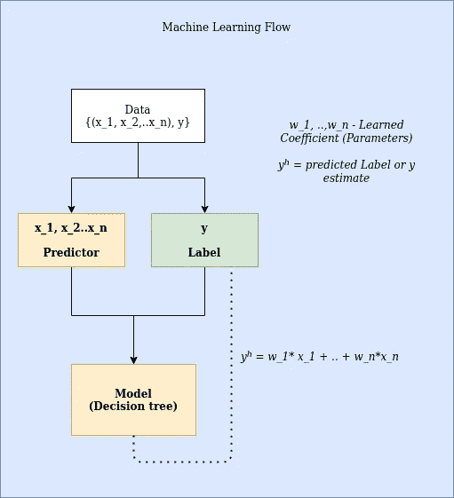

# 机器学习简介

> 原文：<https://medium.datadriveninvestor.com/what-is-machine-learning-8dfea3772edc?source=collection_archive---------16----------------------->

## 教机器学习！

机器学习是人工智能(AI)的一种应用，它为系统提供了自动学习和根据经验改进的能力，而无需显式编程。机器学习专注于开发能够访问数据并使用数据进行自我学习的计算机程序。

## **其他定义**

机器学习本质上是一种应用统计学的形式，越来越强调使用计算机来统计估计复杂的函数，而越来越不强调提供这些函数的置信区间。

> “如果一个计算机程序在 T 中的任务上的性能，如 P 所测量的，随着经验 E 的增加而提高，那么就说它从关于某类任务 T 和性能测量 P 的经验 E 中学习。”作者:[汤姆·米契尔](https://en.wikipedia.org/wiki/Tom_M._Mitchell)

Photo by [Marília Castelli](https://unsplash.com/@liacastelli?utm_source=unsplash&utm_medium=referral&utm_content=creditCopyText) on [Unsplash](https://unsplash.com/s/photos/machine-learning?utm_source=unsplash&utm_medium=referral&utm_content=creditCopyText)

**机器学习的核心**

D ***ata*** 是机器学习的核心，质量&干净的数据犹如人间天堂。但是永远不要期望你的数据像 Kaggle 竞赛中给出的那样干净。据信，数据的语料库越大，学习模型的泛化越好。较少的数据会导致较差的泛化能力，从而导致模型在看不见的数据上表现不佳。

M **odel** ，这是一个基于数据学习的函数，像图像、音频等高维数据这样的复杂数据需要复杂的函数。

> 例如，工作场所的评估是一个复杂的功能，因为各种因素在你的评估中起着关键作用，如你在团队中的努力、可交付的质量、多年的经验、与经理的友好关系等。人们不能简单地用线性函数来表示，比如随着工作经验的增加而增加工资。因此，该模型学习这些因素及其相互关系，并从数据中提取隐藏的模式，这些模式在一个函数上被推广。

L ***收益*** ，一个模型是说从数据中学习。这里的学习指的是识别或认识数据中的模式。如果一个模型对看不见的数据进行准确的预测，它就会表现良好。看不见的数据在技术上称为测试数据。当模型在训练时，它在训练数据上被训练。机器学习博客帖子 II 中解释了术语训练和测试数据。

## **机器学习中的技术术语**

***数据*** ，是关于我们将应用机器学习算法的系统的一组可用观察值。在大多数情况下，我们对我们的数据执行一系列步骤，使其可用于机器学习，如从字符串中清除 URL 或删除离群值，并在表单中构建它，以便它可由 ml 算法使用。

> **例如，考虑医院中的患者记录系统，其中医院跟踪患者的健康习惯、现有健康状况、是否存在 XYZ 疾病等。这些特征都属于一个共同的术语，称为数据。**
> 
> **假设我们有 1000 个目标为*疾病 XYZ* 的患者记录，其值为 0 或 1。0 表示没有疾病，1 表示存在疾病。为了执行机器学习，我们将数据集分成多个集合，如训练集、验证集和测试集。**

***预测因子*** ，是 ***自变量*** 的集合，有助于描述一个系统。根据上述患者记录，如果我们想要预测，如果患者患有 XYZ 病，那么我们的预测变量将包括健康习惯(如吸烟、饮酒等)、现有健康状况如血压、糖尿病等。预测值也称为独立变量。

Figure 2: Machine Learning Flow

***标签*** 是一个 ***因变量*** ，它讲述了系统以及它的含义。从患者记录系统来看，我们的标签可能是 XYZ 疾病，这意味着我们可以预测患者是否患有 XYZ 疾病。标签也称为目标。 ***依赖，因为它依赖于预测因素。***

***模型*** 是一种机器学习算法，它是在数据上进行训练来完成我们的任务。有数以千计的最大似然算法可供应用，但是确定一个最适合该任务的最大似然算法是一个巨大的挑战。

在上面的例子中，我们预测一个病人是否患有疾病，这属于一类称为 ***二元分类问题*** 的问题，其中标签变量取值为是或否。

***参数*** 是机器学习算法中可调的旋钮，像**决策树算法*****惩罚*****逻辑回归**中的 ***树的深度*** 等，每个算法都有不同的参数可用。

> *可调 ***参数称为超参数，由正在进行机器学习的用户手动设置。另一组参数通过机器学习算法学习，如线性回归中 X 的系数、深度学习算法中的权重等。****

> ***对于训练，我们使用训练集。为了识别模型的超参数和参数，我们使用了验证集。为了检验模型的最终性能，我们使用了测试集。***

****训练*** 是学习机器学习算法参数的过程。在这个过程中，我们跟踪训练误差，随着训练的不断进行，训练误差减小。*

> *训练在列车组进行。*

****评估*** 是学习超参数的过程，为了学习算法，必须尝试或试验不同的可能超参数。评估可以与培训同时进行。在评估过程中，我们跟踪验证错误，这将告诉我们正在调整的每个超参数的性能。*

> *对数据集的验证集进行评估。*

****测试*** 是确认模型是否对未知数据进行推广的过程。 ***如果模型表现不佳，我们需要使用不同的模型或不同的参数或超参数或更多的数据等重新进行训练。****

> *测试在数据集的测试集上完成。*

> **注:有时训练误差会减少，但验证误差可能无法减少。这是因为模型中的偏差问题。更多细节在下一篇博客。**

# ***机器学习的类型***

**

*[Figure 3: Machine Learning Algorithms](https://www.google.com/url?sa=i&url=https%3A%2F%2Ftowardsdatascience.com%2Fmachine-learning-algorithms-in-laymans-terms-part-1-d0368d769a7b&psig=AOvVaw2Rh7kwbMUC7StFUo0Q6AUv&ust=1612805103120000&source=images&cd=vfe&ved=0CAIQjRxqFwoTCMjiiK6l2O4CFQAAAAAdAAAAABAD)*

## *监督学习*

*在监督学习中，算法从标记的数据中学习。它从带有标签的数据中识别模式，并将这些模式与未标记的数据相关联。*

> *例如:基于各种因素的房价数据，如面积、房间、草坪和其他细节，我们预测房子的价值。所以我们的标签是房价。*

*数据集有要素(X)和目标(y)。目标可以是一个离散值，也可以是一个连续值，基于此我们可以分别称问题为分类或回归。*

****分类*** 问题分类为二元或多类分类或多标签分类。目标值要么是 0/1，要么是多个值，如狗、人、猫。它回答是或否的问题。它有明确的结果。*

****回归*** 问题就像预测一个值(数值)。例如，预测产品的房价或股票价值。它回答了多少问题。它有数字结果。*

*每个数据集都有特征和目标变量。这些特征有助于生成直接或间接影响目标变量的参数。现在，X 和 y 之间的关系是由 ML 算法建立的。*

## *无监督学习*

*在无监督学习中，算法从未标记的数据中学习。*

> *例如:非结构化文本文档，其中我们使用聚类算法基于句子中的词绑定来聚类文本或段落，以将文档分组到特定主题。*

*通过无监督学习来训练没有标签的数据集，即通过使用诸如 KMeans、分层聚类等聚类技术来广泛学习这种数据集的模式。*

## *强化学习*

*该算法通过执行一些动作并接收这些动作的奖励(+ve/-ve)来学习。在这里，算法与环境相互作用，所以在学习系统和它的经验之间有一个反馈回路。 ***例如:自动驾驶汽车和游戏代理。****

*感谢阅读。如果你喜欢阅读我的文章，请查看[数学+计算=人工智能](https://mayurji.github.io/data-structure-algorithms/)获取更多文章。*

*在 [LinkedIn](https://www.linkedin.com/in/mayur-jain-ds) 和 [Twitter](https://twitter.com/mayur__22) 上与我联系*