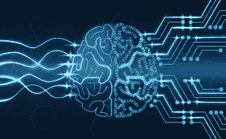

# 机器学习是如何工作的？

> 原文：<https://medium.datadriveninvestor.com/what-is-machine-learning-and-how-does-it-work-ea4b2a6b1d32?source=collection_archive---------11----------------------->

想象一下。

所以今天是公园的休闲日。你的朋友在那里，太阳出来了，生活是美好的😎

一个足球不知从哪里冒出来，砸在你的头上。*哎哟……*

你摔倒了，有点摇晃，感觉很晕。你的朋友冲到你身边，担心你得了脑震荡。你冲向医院，希望一切都好。

你终于到了，但仍然感到头晕目眩。谢天谢地，等待的时间不算太长，你走进去看医生。

除了你看到的**这个**。

好吧，也许瓦力实际上还没有医学学位……*(*谁知道呢，这些家伙很有天赋)。但信不信由你，像 Wall-E 这样的人工智能机器几乎正在医疗领域得到应用。

 [## DDI 编辑推荐:5 本让你从新手变成专家的机器学习书籍|数据驱动…

### 机器学习行业的蓬勃发展重新引起了人们对人工智能的兴趣

www.datadriveninvestor.com](https://www.datadriveninvestor.com/2019/03/03/editors-pick-5-machine-learning-books/) 

人工智能正被世界各地的医院用于进行医学成像、诊断和协助医生。事实上，甚至有机器人已经通过认证的医学测试，并有能力进行手术！🤯

但是这怎么可能呢？人工智能！！

## AI？就像电子游戏里那样？

是啊。人工智能，或称 AI，是计算机科学的一个广泛领域，涉及赋予计算机和机器“类人智能”的过程。它正被用于大量的应用中。这项技术有一些疯狂的潜力，人工智能领域每天都在取得进步，但它是如何工作的？🤔

人工智能的一个主要的也可以说是最有影响力的分支是机器学习。事实上，机器学习可以简单地描述为用数据来回答问题。然而，机器学习实际上有几种方法。

# 是时候为机器学习方法做一个奇怪的类比了…

机器学习主要有三种方法。

*   **监督学习**
*   **无监督学习**
*   **强化学习**

为了简单起见，让我们把这些方法中的每一个都想象成学校的学生。如果我们被认为是试图编写一个 ML 程序来解决某个问题的程序员，我们可以称自己为**老师**，负责教这些学生如何成功解决一些问题。👨‍🏫

这些学生中的每一个都有不同的学习方法，这是我们(老师)在给他们出难题时必须记住的。

## 监督学习

所以这个学生 SL 是一个依赖老师给他们的训练的学生。基本上，SL 希望我们训练他们，这样一旦他们理解了这个概念，他们就可以开始自己解决问题。我们可以从已经为它提供了一些**条件/问题**开始。我们给真正的监督学习程序的数据类型的一个例子是对一些数据进行分类的组的数量。

## 无监督学习

我们的 UL 学生采取了另一种方法。UL 的学生基本上是说“不用了，谢谢，我可以自己学”。尽管他们能够自己找到模式，并将事情分类成组，但他们不会确切地知道**为什么**他们最终会得到他们得到的答案。对于一个真正的无监督学习程序，它将从**未标记的训练数据**中自行学习，并产生未标记的数据簇。

## 强化学习

现在我们的 RL 学生有了不同的学习方法。这个学生使用一个基于分数的系统来判断他们是否做得好。例如，如果他们答对了某个问题，他们将获得一分，如果答错了，他们将失去一分。这种基于激励的学习是真正的强化学习程序用来成功产生预期结果的，并且有一个最小的焦点是关于一个**代理**(在这种情况下是一个学生)如何与**环境**(任务的参数)交互。

# TLDR

也许你很着急，也许我很无聊。以下是你真正需要知道的。

*   人工智能是计算机科学的一个分支，它赋予计算机“类似人类”的智能
*   它在世界范围内被用来解决一系列问题
*   机器学习是人工智能的一个分支，它使用数据来回答问题
*   机器学习的三种方法是监督、非监督和强化

无论你是一名机器学习开发人员，还是只想弄清楚为什么谷歌一直向你展示廉价游泳池的广告，希望这篇文章能向你简要介绍人工智能和机器学习的世界。😁