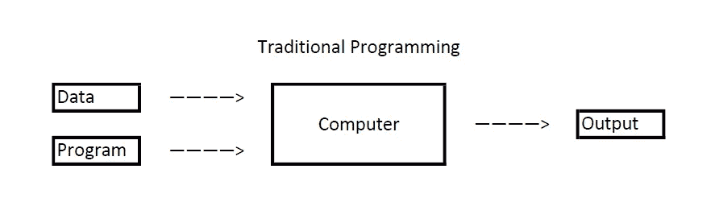
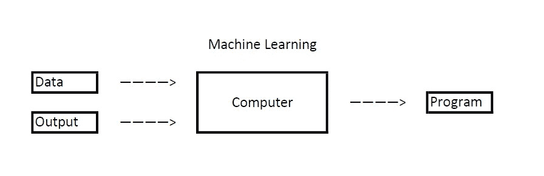
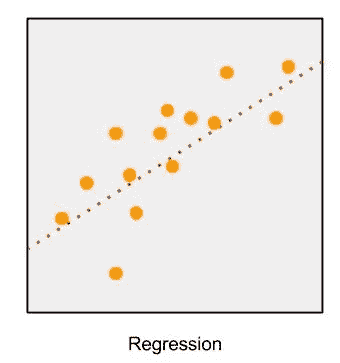
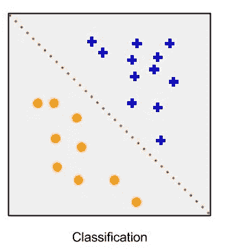
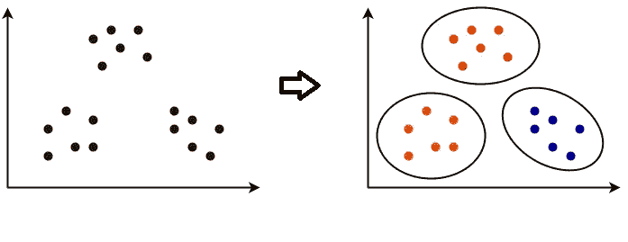

# 什么是机器学习？

> 原文：<https://medium.datadriveninvestor.com/what-is-machine-learning-db43ee2df03?source=collection_archive---------27----------------------->

Photo by [Markus Winkler](https://unsplash.com/@markuswinkler) on [Unsplash](https://unsplash.com/)

让我们用通俗的语言来理解这个广泛的话题，它不需要任何先决知识来理解。

**机器学习**就是从数据(例子)中学习，建立逻辑并预测给定输入的输出。所以，我们可以把它分成两部分:

I)从过去的经验中学习

ii)提高智能程序的性能

 [## 什么是数据目录，它如何使机器学习取得成功？数据驱动的投资者

### 数据目录是机器学习和数据分析的燃料。没有它，你将不得不花费很多…

www.datadriveninvestor.com](https://www.datadriveninvestor.com/2020/08/27/what-is-a-data-catalog-and-how-does-it-enable-machine-learning-success/) 

如果你来自编码背景，那么下面的图片将帮助你理解机器学习背后的思想:

Photo by author

Photo by author

在基本编码中，我们构建程序或逻辑，提供输入，然后它给我们输出，而在机器学习中，我们提供数据、输出，它产生程序(当然不是字面上的)。

**机器学习的类型:**

i) **监督学习** : { *任务驱动}* 我们使用数据训练机器学习模型，并提供与数据相关联的标签，这意味着一些数据(训练数据)已经标记了正确的答案。在训练之后，被训练的模型被提供一组新的数据，其被称为测试数据。从而监督学习算法分析训练数据并从标记数据中产生正确的结果。分类和回归是监督机器学习的例子。

在回归分析中，我们需要预测连续响应值。

Photo by author

在分类中，我们预测分类响应值，其中数据可以被标记为特定的“类”。

Photo by author

> *简而言之，回归拟合数据，而分类分离数据。*

ii) **无监督学习** : { *数据驱动* }使用既未分类也未标记的数据建立模型，并允许算法对该信息进行操作以分析数据。这里，机器学习模型的主要动机是根据相似性、差异和模式对未排序的信息进行分组。异常检测和聚类是无监督学习的一些类型。

在聚类中，我们根据相似性和模式对数据进行分组。这可能被认为是像多类分类，但这里我们不提供标签。

Clustering (Photo by author)

**访问专家视图—** [**订阅 DDI 英特尔**](https://datadriveninvestor.com/ddi-intel)