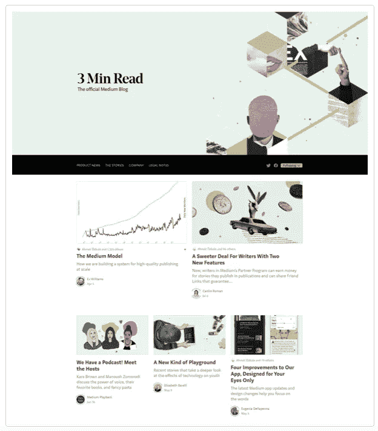

# 什么是媒介，怎样才能在媒介上写作赚钱？

> 原文：<https://medium.datadriveninvestor.com/what-is-medium-and-how-can-we-earn-money-writing-on-medium-2fd38d0c9846?source=collection_archive---------6----------------------->

## 写作

## 中级基础初学者指南

Blåøret (Norway). Photo by the author

## 在媒介上写作赚钱容易还是难？

Medium 是一个平台，可以让你随心所欲，想写多少就写多少，想发表多少就发表多少，发表多少就可以获得报酬。

Medium 已经存在了近 8 年，该平台现在每月有超过 1.45 亿的独立访问者。这意味着访问平台的人非常多，潜在读者也非常多。但这并不意味着在介质上赚钱很容易，至少不是很多钱。

Medium 是一个平台，供想发表自己的文章、散文、故事、短文、诗歌、实验性文本的作者使用——是的，任何对读者可读的东西。

Medium 是一个平台，它尊重内容的视觉和高质量，以及原创和令人惊讶的内容和扩展的视角。Medium 方便了写作和出版，该平台与 Unsplash.com 有着有趣的合作，每个人都可以免费下载精彩的图片作为他们文章的插图。

Medium 希望推广原创内容和高质量的内容和设计。这个质量目标适用于高水平的语言(没有错别字或简单的措辞！)，以及良好的视觉和平面设计质量。Medium 希望作者使用好的插图和好的照片，并且需要具有原创方法的提高认识的内容。

 [## 在创业之旅中，拥抱学习|数据驱动的投资者

### 好像建立一个数百万美元的公司还不够困难，企业家必须额外照顾他们的…

www.datadriveninvestor.com](https://www.datadriveninvestor.com/2018/10/16/on-the-entrepreneurial-trek-embrace-the-learning/) 

每个人都可以通过在媒体上写作赚钱，有些人甚至通过在媒体上写作赚了很多钱。在这篇文章中，我将试着对媒体做一个全面的描述，同时说明为什么我认为媒体是自互联网“完全公开”以来作家们最激动人心和积极的新出版选择之一。

> Medium 是伊万·威廉姆斯开发的在线出版平台，于 2012 年 8 月推出。(……)该平台是社会新闻的一个例子，拥有业余和专业人士和出版物的混合集合，或媒体上的独家博客或出版商，并通常被视为博客主机。(维基百科)

Medium 的创始人 Ev Williams 也创办了 Blogger 和 Twitter。

## 每月独立访客

2020 年 2 月，Medium 报告称，每月有来自 252 个国家的 1.46 亿独立访客。前 5 名中等独立月访问量国家是:

**美国:** **28.00%
印度:6.81%
巴西:4.19%
英国:4.18%
加拿大:3.56%**

## 写作、出版和在媒体上赚钱

通过媒体合作伙伴计划，在媒体上写作、出版和赚钱变得很容易。

媒体合作伙伴计划允许作者根据媒体成员的参与度，从他们在媒体上发布的内容中赚钱。

任何人都可以在媒体上写作和发表文章。您需要创建一个帐户，可以是免费的或付费的帐户。如果你决定成为付费会员，你每月支付$5.00，然后你就有权从你在 Medium 上发布的内容中获利。

付费会员可以阅读不限数量的故事，通过阅读其他作者的文本，读者帮助他们赚钱。收入是根据媒体成员的阅读时间来计算的。一旦非会员成为会员，他们的阅读时间也包括在内。

## 合作伙伴计划的作者每月根据 Medium 成员阅读他们的故事所花费的时间获得报酬。

Medium 根据两个部分计算收益:

*   会员花多长时间阅读你的故事
*   会员每月花多少阅读时间在你的故事上

随着中型会员花更多时间阅读你的故事(“会员阅读时间”)，你会赚得更多。

当 Medium 计算你的故事的收入时，如果非会员在阅读你的故事后 30 天内成为会员，他们也包括阅读时间。

## 写作独特主题的中等支持作者

通过计算会员阅读时间的份额，Medium 支持那些撰写独特主题并与忠实读者建立联系的作者。例如，如果上个月一个会员花了他们每月阅读时间的 10%在你的故事上，你将收到他们份额的 10%(他们订阅费的一部分)。

Medium 从技术上来说是根据浏览者在页面上主动阅读的时间来计算阅读时间的。Medium 考虑了查看者的滚动和活动，然后确定查看者花了多长时间阅读故事。Medium 注意区分滚动活动的间隙和观看者离开去喝咖啡休息的长时间。

## 合作伙伴计划的支出与活跃媒体成员的数量相关联。

*   随着会员数量的持续增长，他们将支付更多费用。
*   第二，你的收入是基于多种因素计算的，而不是基于字数或时间的直接计算。
*   第三，你每天的阅读量和阅读时间并不是你每天收入的唯一来源。你的收入的其他组成部分是滞后的，这意味着你可能需要一段时间才能从每个视图中获得收入——这不像将每日阅读转化为收入那么简单。

Medium 发送每个月的付款(该日历月中各天的收入)。

## 每日更新

介质上的收益每天更新。他们使用 UTC 天数，这意味着他们包括从 UTC 午夜到 UTC 晚上 11:59 的所有收入。收入会在几个小时内更新。

你可能在没有收到足够会员阅读时间的日子里赚到钱，因为你的收入计算有些部分是滞后的。这意味着在一次浏览后，你可能需要长达数周的时间才能从该次浏览中获利。

例如，如果一个免费用户阅读了你的故事，然后，几周后，订阅了媒体会员，你将在他们阅读后很长时间内获得他们的阅读时间。当非会员后来成为会员时，你也可以获得阅读时间。他们之前的阅读时间不会追溯到你的图表上，即使他们成为会员。

## 短件在这种支付模式下的表现如何

Medium 发现，当短文写得很好且发人深省时，读者最终会花更多时间阅读这篇文章。反之亦然:如果一篇很长的文章充满了绒毛，读者就不会读到最后。在一个竞争注意力的世界里，读者把有限的时间花在有价值的地方。更长的故事并不能保证更多的阅读时间。平均而言，读者实际上花在阅读中篇作品上的时间最多。

另外，盈利模式有一半是基于比例分成。如果你写了一篇短文，被主要阅读其他短文的人(例如，主要阅读诗歌的观众)阅读，那么你的故事将获得有意义的一部分股票收益。结果将类似于如果你写了一篇长文章，被主要阅读其他长文章的人阅读。

## 视觉媒体

特别是对于视觉媒体，比如卡通和漫画，许多成功的漫画都有深度层次，需要复杂的思考或阅读——甚至缩放或滚动。因此，我们已经看到了许多漫画，无论是长篇还是短篇，它们积累了大量的阅读时间，因此可以获得有意义的收入。你可以在这里找到许多伟大而有内涵的漫画。

总而言之，根据 Medium 的说法，该系统支持所有深思熟虑的工作，无论长短，他们说他们计划在我们学习和迭代未来时密切关注结果。

## 媒体出版物

出版物是围绕共同主题或话题撰写的故事的共享空间，通常由多位作者撰写。

出版物的主要特点:

*   支持多个贡献者:作者和编辑
*   一个故事提交系统
*   一个独特的布局，有许多定制选项
*   medium.com/your-publication-name 格式的 URL

所有媒体用户都可以创建出版物。用于创建发布的用户帐户将成为其所有者。

每个出版物都由一个用户帐户(出版物的所有者)拥有。所有者帐户拥有管理出版物的完全权限，并且可以将其他用户添加为出版物编辑和作者。

*   编辑可以审阅、编辑和发布作者提交的故事，也可以添加他们自己的故事和修改出版物的布局。
*   作家是定期投稿的人，他们可以向出版社投稿。

在出版物的设置中，出版物所有者可以添加带有标题和/或徽标的页眉，设置许多具有可自定义布局的部分，以及添加用作包含专门内容的选项卡的功能页面。

对于要添加到出版物中的文章，用户必须首先编写文章并提交给出版物。要了解更多关于提交过程的信息，请点击此处的链接:[向出版物添加草稿或帖子](https://help.medium.com/hc/en-us/articles/213904978)。

要确认文章已提交给出版物，作者必须确保在编辑模式下，文章的左上角显示“已提交草稿”或“已提交文章”如果左上角显示“尚未提交”，则该文章尚未提交到出版物。在这种情况下，作者必须首先点击“准备提交？”按钮，然后是“提交到出版物”

文章提交到出版物后，出版物编辑必须在文章发布到出版物之前接受它。作者保留对内容的所有权利，并且仍然能够引入改变或者从出版物中完全撤回它。

## 一些中等特征

**以下节选自** [**中词汇**](https://help.medium.com/hc/en-us/articles/360006341833) **:**

在中型帖子上鼓掌是让作者知道你欣赏他们的故事的一种方式。你可以多次鼓掌表示你有多喜欢它。

**摘要**是您从 Medium 收到的每日或每周电子邮件，其中包含您的故事推荐。摘要基于你在平台上关注的故事、出版物和主题，以及你过去读过的内容。您可以随时在设置中管理您的电子邮件偏好设置。

Medium 允许你在故事中突出你最喜欢的段落，让作者知道你喜欢这一段。此外，您的关注者将会看到帖子上的精彩内容。

**信件**是你所关注的出版物发出的邮件。每个出版物都可以向他们的追随者发送电子邮件。

**会员**是付费媒体订户。如果一个人的个人资料图片周围有绿色光环，你就可以知道他是订阅者。成为会员后，您可以阅读独家故事、聆听音频解说等等。

注释是评论某人故事的私人方式。笔记是你和帖子作者之间的。

回复是留在某人帖子下面的评论。

**系列**是移动优先的格式，让你用卡片写故事。您可以随时向您的系列添加更多卡片，以扩展故事并通知您的追随者。

**一个故事**是发表在 Medium 上的帖子。

**每周文摘**版发给媒体会员，平台上发布最好的会员专用故事。

**主题**是围绕特定兴趣写的故事的页面。如果你想收到关于这些话题的故事，你可以关注这些话题。

## 感谢阅读！

这个故事是[洞察创意写作联盟——用英语成功写作和出版](https://the-creative-writing-alliance.simplerosites.com/course-overview-insight-writing-alliance-successful-writing-in-english)课程的一部分。