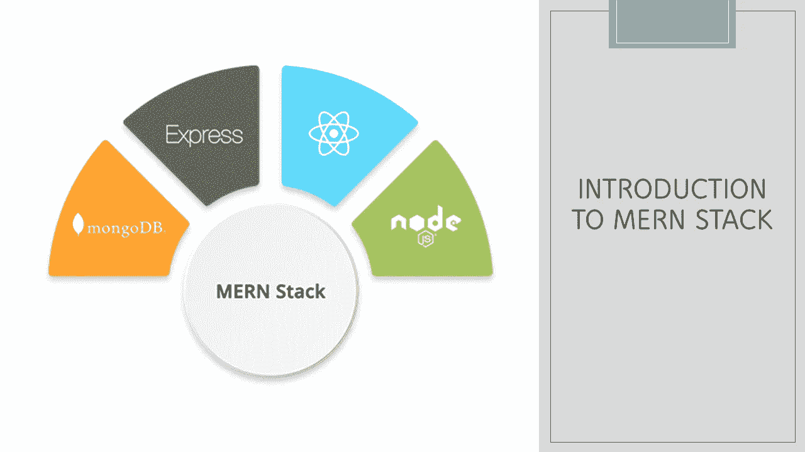
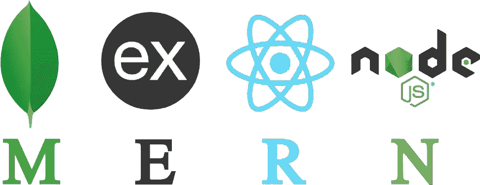

# 什么是 MERN·斯塔克？

> 原文：<https://medium.datadriveninvestor.com/what-is-mern-stack-331d229d87cf?source=collection_archive---------12----------------------->

MERN 堆栈是 MongoDB、Express、React 和 Node.js 的组合，在本文中，我将带您了解什么是 Mern 堆栈？如何在 Web 开发中使用它，以及组成 MERN 堆栈的技术概述。

如今，Web 开发的过程已经发生了变化，不再是几年前的样子。我们现在有如此多的选择，门外汉往往不知道什么是最适合他们的。这不仅适用于整体，也适用于帮助 web 开发的工具，因为今天有如此多的选择。MERN 堆栈是这些选择中的最佳选择之一。

 [## 数据科学项目

### 通过学习和尝试所有这些动手操作、互动的方式，用 Python 实践您的数据科学项目技能

thecleverprogrammer.com](https://thecleverprogrammer.com/2020/06/01/work-on-data-science-projects/) 

# MERN·斯塔克简介

在 MERN 堆栈之前，让我们了解什么是堆栈。任何 web 应用程序或框架都是通过使用大量技术创建的。所有这些技术的组合被称为堆栈，由 [LAMP stack](https://en.wikipedia.org/wiki/LAMP_(software_bundle)) 推广，它是 Linux、Apache、MySQL 和 PHP 的组合，所有这些都是开源组件。

随着 web 开发的成熟和交互性变得越来越流行，单页应用程序(SPAs)变得越来越流行。SPA 是一种 web 应用程序范例，它避免刷新网页来显示新内容；相反，它使用对服务器的简单调用来获取数据或提取和更新网页。

与完全重新加载页面的旧方法相比，结果看起来非常简洁。这导致了前端框架的增加，因为很多工作都是在客户端完成的。大约在同一时间，虽然完全独立，NoSQL 数据库也开始获得普及。

MEAN stack (MongoDB，Express，AngularJS，Node.js)是第一批体现向 SPAs 和 NoSQL 转移的开源栈之一。基于模型-视图-控制器(MVC)设计模型的前端框架 AngularJS 锚定了这个堆栈。MongoDB 是一个非常流行的 NoSQL 数据库，已经被用于持久数据存储。

Node.js 是服务器端 JavaScript 运行时环境，Express 是构建在 Node.js 之上的 web 服务器，它们构成了中间层或 web 服务器。这个堆栈可以说是目前任何新的 web 应用程序最流行的堆栈。

不完全在竞争中，但 React，一种来自脸书的替代前端技术越来越受欢迎，并提供了 AngularJS 的替代品。因此，它平均用一个“R”代替了“A ”,得到了 MERN 堆栈。

## MERN 堆栈的组件

希望你现在知道什么是 MERN 堆栈，以及它是如何在今天的超大规模 web 开发中使用的。在这一节中，我将向您介绍 MERN 堆栈的组件。

 [## 机器学习课程

### 在本文中，我将带您免费学习完整的机器学习课程。本机器学习课程适用于…

thecleverprogrammer.com](https://thecleverprogrammer.com/2020/09/24/machine-learning-course/) 

## MongoDB:

MongoDB 是 MERN 栈中使用的一个非常流行的数据库。简而言之，它是一个便于在线存储的数据库。这是一个面向 NoSQL 文档的数据库，具有灵活的模式和基于 JSON 的查询语言。

## 快递:

Express 是一个框架，它简化了编写服务器代码的任务。Express 框架允许您定义路由，以及当符合特定模式的 HTTP 请求到达时该做什么的规范。

## 反应:

React 锚定 MERN 堆栈。在某种意义上，这是 MERN 堆栈的定义组件。React 是一个由脸书维护的开源 JavaScript 库，可用于创建以 HTML 呈现的视图。

与 AngularJS 不同，React 不是一个框架。这是一个图书馆。因此，它本身并没有规定一个框架模型，比如 MVC 模型。你使用 React 来渲染一个视图(MVC 中的 V)，但是如何链接应用程序的其余部分完全取决于你。

## Node.js:

Node.js 是浏览器之外的 JavaScript。Node.js 的创建者只是使用了 Chrome 的 V8 JavaScript 引擎，并使其作为 JavaScript 运行时引擎独立工作。如果你熟悉运行 Java 程序的 Java 运行时，你很容易联想到 JavaScript 运行时:Node.js 运行时运行 JavaScript 程序。

希望你喜欢这篇介绍 web 开发中常用的 MERN 堆栈的文章。请在下面的评论区提出你有价值的问题。