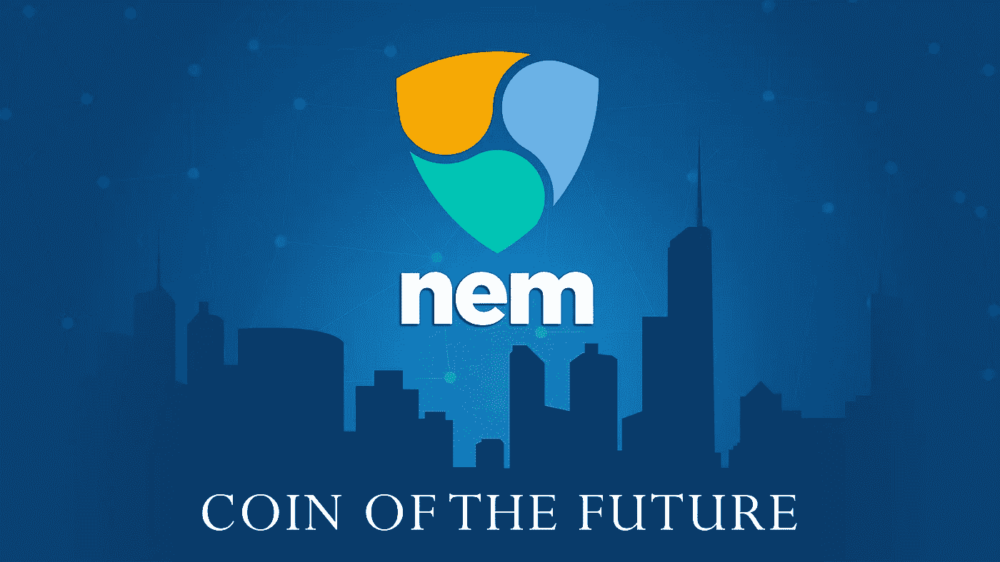

# 什么是 NEM (XEM)？

> 原文：<https://medium.datadriveninvestor.com/what-is-nem-xem-9025050fbc69?source=collection_archive---------5----------------------->

NEM XEM 是一个分布式加密平台。它代表了一个独立的生态系统，可以轻松集成高频交易、社交媒体和金融市场等其他系统。NEM 代表“新经济运动”该平台希望创造一个可持续的经济，保证财务自由，并注重平等机会和自决等价值观。XEM 是相应的加密货币。在 NEM·XEM 之后，全世界有 70 人负责这个加密平台。

# 技术数据

NEM·XEM 的软件是用 Java 编写的。它由两部分组成。一个是 NEM 社区客户端(NCC)，另一个是 NEM 基础设施服务器(NIS)。加密货币 XEM 只代表了加密平台的一小部分。在加密货币中，可以提取 8,999,999,999。一分钟可以挖一块。该平台使用重要性证明(POI)算法，下面将更详细地描述。未来，该平台将开发智能物业瓷砖、智能合约和去中心化交易平台。所有项目都基于 NEM 区块链。

 [## 加密过山车 ETH2.0 测试网的麻烦，动荡的市场，美联储谈论 CBDCs |数据…

### 是只有我这么想，还是外面的情况越来越乐观了？从酒吧凳体育创始人戴夫波特诺伊泵他最喜欢的…

www.datadriveninvestor.com](https://www.datadriveninvestor.com/2020/08/20/crypto-rollercoaster-trouble-on-the-eth2-0-testnet-volatile-markets-the-fed-talks-cbdcs/) 

该软件基本上是为所谓的“瘦客户机”设计的一方面，这样做的好处是客户端也可以用在智能手机或迷你电脑上，比如 Raspberry Pi。加密平台的用户也不依赖于第三方。瘦客户端不需要第三方提供商。用户可以完全控制他们的资产。如上所述，许多其他系统可以集成到该平台中。NEM 希望为广泛的应用创造解决方案。这些包括办公自动化、个人金融、互联网交易和加密个人信息。加密平台提供了高度的安全性和可靠性。

# 安全概念

正如之前宣布的那样，NEM 将重要性证明(POI)算法用于加密货币 XEM。算法是全新的。它计算帐户的“重要性”。要计算的因素包括账户活动、账户余额以及以任何方式互动的账户的重要性。越重要的账户越有可能收取交易费用。这并不排除资金较少的账户，并确保加密货币被实际使用。与工作证明相比，重要性证明不受极端价格波动的影响，没有通货紧缩，使用更少的能源，并且绝对保持分散。

对于自己的网络，NEM 建立了信誉算法“Selftrust++”自信任度量参与节点的可信度。一个节点越可信，它就越有可能与其他节点通信。此外，NAM 还同步了每台电脑之间的时间，并集成了反垃圾邮件功能。进一步的安全措施包括基于区块链的多重签名方法。通过这种方法，查询自己钱包的几个密钥来执行交易。例如，除了密码之外，还可以查询 2FA 标识。

# 结论

NEM 具有革命潜力。加密平台想要永久改变世界。背后的概念看似简单。他们为互联网上的各种应用提供加密平台。加密货币 XEM 出现在它旁边，就像一个巧合的伴随物。提供的 slim 软件可以在许多设备上运行，并且易于理解。总而言之，NEM 是一个非常健壮的加密平台，具有巨大的未来潜力。它也是可持续的、安全的和高效的。

我在每月一期的 [**简讯中分享了更多私密的想法，你可以在这里**](https://mailchi.mp/bf8f8e8ed697/keep-in-touch-with-lukas) 查看。请在评论中告诉我，并在各种社交媒体平台上加入我:

[**推特**](https://twitter.com/WiesfleckerL)●[**insta gram**](https://www.instagram.com/lukaswiesflecker/)●[**脸书**](https://www.facebook.com/lukaswiesfleckerr)●[**Snapchat**](https://www.snapchat.com/add/luggooo)**●[**LinkedIn**](https://www.linkedin.com/in/lukas-wiesflecker-1b11251a5/)**

**无论你做什么，都要带着爱和激情去做！**

****访问专家视图—** [**订阅 DDI 英特尔**](https://datadriveninvestor.com/ddi-intel)**