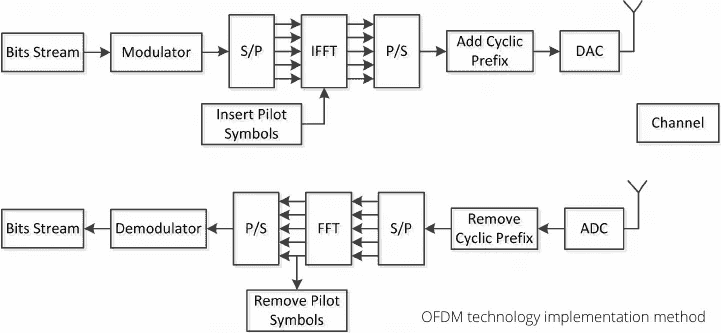

# 什么是 OFDM:技术和发展

> 原文：<https://medium.datadriveninvestor.com/what-is-ofdm-technology-and-development-2bedab27a078?source=collection_archive---------4----------------------->

## 正交频分复用(OFDM)是一种多载波传输技术，通过频分复用将高速串行数据转换为并行传输目标

Image by [Anand Kumar](https://pixabay.com/users/anandkz-3271136/?utm_source=link-attribution&utm_medium=referral&utm_campaign=image&utm_content=1737568) from [Pixabay](https://pixabay.com/?utm_source=link-attribution&utm_medium=referral&utm_campaign=image&utm_content=1737568)

# **简介**

在数据处理速度和传输速度迅速提高的今天，数据传输的质量越来越重要。正交频分复用(OFDM)可以支持多用户接入，并且具有更好的抗多径衰落能力。

**20 世纪 60 年代**首次提出 OFDM 技术思想，但由于子载波之间的正交关系，需要快速傅立叶变换来完成调制，但快速傅立叶变换设备条件等要素的复杂性和使用受到限制，因此在初期没有得到科学的实际应用。

**80 年代初**，数字集成电路完成了快速傅立叶变换技术，OFDM 调制技术再次成为探索的焦点。大家对数字移动通信中的多载波调制进行了更深入的研究，使得 OFDM 技术在无线移动通信中的应用进展迅速。

到目前为止，OFDM 技术的使用已经有 70 年左右了。随着时间的推移，人们对 OFDM 技术的探索变得更加实用，因为 OFDM 具有非常高的频率使用率，适合快速傅立叶变换。

这种计算方法的处理可以成功运用到很多系统中，从思想和技术上来说都是比较完备的。目前的 OFDM 技术早已应用于 4G-LTE 技术，是长期演进的三大核心技术之一，在 5G 中仍然是首选的调制方式。

## **对 OFDM 技术的基本了解**

OFDM 技术属于一种特殊的多载波传输策略。其基本原理是将信道分成若干正交的子信道，将速率较高的串行信息转换成速率较低的并行子数据流，完成并行传输。

[https://gph.is/g/aNgAB3G](https://gph.is/g/aNgAB3G)

# **OFDM 技术实现方法**

OFDM 技术的本质是在频域上将信道划分成若干正交的子信道，将较高速率的信息流转换成子信息流，在任意一个子信道中选择一个子载波实施相应的调制。

> **载波可以在子信道上并行传输**

由于其中任何一个子信道采用窄带传输，信号带宽都会小于该信道的相关带宽，因此可以将这些子信道视为平坦弱化，从而大大消除信号波形之间的干扰。

**在 OFDM**等系统中，各类载波呈现正交关系，任何一个载波在一定时间内都有整数个载波周期。

**载波本身的频谱**的零点可以与相邻载波的零点重叠，这样可以减少子载波之间的干扰，提高频谱利用率。

此外，在 OFDM 符号之间放置一种保护间隔，以确保其长度高于无线信道的最高延迟扩展，这可以大大消除多径引起的符号间干扰。

如果以循环前缀(CP，cyclic prefix)为保护区间，可以 100%防止多径造成的信道间干扰。由于其简单性和有效性，OFDM 技术已经成为无线高速通信系统中极其关键的技术。

> OFDM 技术最早的任务

是处理多径效应对信息传输造成的干扰。由于传输速度较高，频谱利用率不理想，多径传输的符号干扰是一个非常麻烦的问题。

**OFDM 技术**通过在不传输信号的情况下在符号之间添加保护间隙来处理这个问题。这种情况仍然不能处理对接口控制信息(ICI，接口控制信息)的信道干扰。

如果子载波之间彼此的正交特性被破坏，则接收端不能很好地接受和恢复原始信号。

> **这部分问题是毁灭性的**

因此，OFDM 技术的处理方法实际上是从符号的后面取一部分信息，放在每个符号的前面，作为传输的保护间隙。这种类型的方法是循环前缀。

**在 OFDM 系统**中，二进制比特流导入后，在传输过程中，先进行代码交换、调制、添加导频，然后进行串行或并行转换，分成 N 个 M 字的信息流，然后对每个子信道信息进行正交调制，再进行加法运算。

**经过并行或串行转换**后，插入一个循环前缀(CP，cyclic prefix)，然后进行模拟转换(D/A)，最后经过射频放大后发送到接收端，接收端去除循环前缀(CP，Cyclic Prefix)并解调各个通道(FFT)，将数据串进行并行转换，解码交织后恢复原始信号。

Source: Author (made by [canva.com](https://www.canva.com/))

# **OFDM 技术的主要优势**

1。频谱利用率高。由于 OFDM 技术采用正交子载波作为子载波信道，不仅不需要维持 OFDM 子载波的带宽，而且频谱可以重叠，很大程度上利用了频谱数据。而且 OFDM 中的子载波也选择了多系统调制方式，可以加深频谱利用率。

2。抗多径干扰能力强。OFDM 技术对等待发送的数据符号进行串并转换，将速率较高的串行信息转换成 N 列速率较低的并行信息。结果，符号的速率降低，从而确保符号的周期增加。

从而科学地削弱多径效应带来的干扰和码间串扰。此外，OFDM 技术指出添加循环前缀 CP 是保持间隔的一种方式。结果，它不仅可以确保信道之间的正交特性不干扰，而且可以最小化甚至消除码之间存在的干扰。

3。抵御弱点的能力强。对于单载波传输系统，如果出现削弱或干扰，所有传输链路都可能失效。然而，OFDM 调制方式适合于多径和弱信道中的高速率信息传输。如果发生衰落或干扰，只有落入频率凹陷的载波及其携带的数据会受到干扰，而其他子载波不会被破坏。

4。资源分配更敏感。在一个简单的调制和解调过程中，IDFT 和 DFT 被用于 OFDM 系统来完成正交调制和解调。对于具有大量子载波的系统，可以使用 FFT 来完成。因为数字信号处理(DSP，digital signal processing)技术和数字集成电路(CPLD，Complex PLD)技术的发展速度非常快，所以使用 IFFT 和 FFT 来完成计算是非常容易完成一系列任务的。

5。不对称型的输送速度更快。OFDM 系统可以通过选择不同数量的子信道来调整上行链路和下行链路的传输速度，并且可以实现上行链路和下行链路速度的不对称传输。另外，通过传输操作的负载计算方法实现，OFDM 可以将信息放置在更高速率的信道中，因此 OFDM 系统可以以更高速率完成非对称信息传输。

Image by [Ramyar Rasooli](https://pixabay.com/users/rrae-1083585/?utm_source=link-attribution&utm_medium=referral&utm_campaign=image&utm_content=850007) from [Pixabay](https://pixabay.com/?utm_source=link-attribution&utm_medium=referral&utm_campaign=image&utm_content=850007)

# **OFDM 技术的主要缺点**

1。系统的复杂度比较高。在 OFDM 系统中，每个子信道决定其发射功率和数据速率，因此为了有效地实现信号功率和信息的分配，引入了加载算法。但是引入了加载算法，引入了具有自适应特性的调制技术。这将导致复杂的收发器设备。如果终端以非常高的速度移动，它将不适合于自适应调制技术。

2。频率极其敏感。OFDM 系统对噪声和载波频率偏移敏感，并且容易受到频率误差的干扰。由于相互覆盖的子信道的频率随时间变化，子载波的正交特性被破坏，信号传输频谱发生了偏移，造成子信道间的干扰。

3。波峰因数太高。由于 OFDM 系统的导出信号由几个子信道叠加，并且由几个单独调制的子载波组成，所以多个信号的相同相位的累积也将导致复合信号具有极高的峰值功率。整个系统的瞬时功率将远大于系统的平均功率，因此将产生非常大的峰均功率比(PAPR ),这将降低功率传输效率。

同时，它对发射机中相关放大器的动态范围和线性度条件产生巨大影响，会导致信号失真，OFDM 不同子信道之间的正交性能被破坏，产生一系列干扰，影响系统特性。

# **OFDM 的用途**

根据 OFDM 技术的这些优点，它已经被广泛应用于许多技术领域。

**在数字音频和视频广播服务方面**

与模拟广播相比，数字音频广播(DVB)可以改善更高质量的语音和数字服务。1995 年，欧洲电信标准协会通过了第一个 DAB 标准。此外，日本的 ISDB-T 和美国的 IBOC 包括 OFDM 技术。OFDM 技术也已经应用在数字视频广播(DVB)的 DVB-T 标准中。

**在无线局域网领域**

在高速无线局域网的相关标准中，OFDM 技术被应用于 HiperLAN/2 物理层。同时，在 IEEE802.11 标准的 ISM 频段中，2.4 GHz 和 5.8 GHz 频段都使用了该技术的 IEEE802.11a 和 IEEE802.11g 标准。

**4G 蜂窝系统解决方案**

当考虑 4G 蜂窝网络系统中的空中接口设计时，OFDM 技术由于其在抗多径衰落方面的明显优势而被采用。如日本的 NTT DoCoMo 和中国的未来计划，大大提高了系统的性能。

**第五代移动通信(5G)的使用**

与 OFDM 技术相比，OQAM-OFDM 技术具有更低的带外频谱泄漏，因此成为 5G 关键技术的重要组成部分。由于 OQAM-OFDM 技术不需要载波间的同步，因此不像 OFDM 那样严格，因此具有更好的兼容性，适应更多的业务需求。还有 5G 统一空口技术 F-OFDM 也是基于 OFDM 技术，F-OFDM 的子带滤波器可以抑制子带带外频谱泄漏。

[https://gph.is/g/E3gR3k7](https://gph.is/g/E3gR3k7)

## **OFDM 技术的发展趋势**

随着高速通信系统的不断发展，如何在有限的信道容量资源和大多数用户同时需求的前提下，充分为用户提供时间敏感的服务是当务之急。多址方案的设计可以有效地解决这方面的相关问题。

 [## 各种类型的分布式分类帐技术|数据驱动的投资者

### 随着比特币和加密货币在全球的采用、使用和魅力增长，它们已经成为常见的流行语。这个新的…

www.datadriveninvestor.com](https://www.datadriveninvestor.com/2020/12/04/various-types-of-distributed-ledger-technology/) 

# **OFDM 技术的多址方案**

## **OFDM-CDMA 方案**

码分多址(CDMA，Code division Multiple Access)是移动通信的主流技术。窄带信号乘以扩频信号成为宽带信号，其中扩频信号可以使用伪随机码序列，这允许用户共享相同的资源。

> 提高了频谱效率，并且不会造成大的干扰

**OFDM 技术**适合在高速信息传输过程中使用。它可以将信息流分成许多子信息流，然后将它们依次调制成许多正交的子载波。子载波内的数据速率较低，所有子载波信道都具有平坦衰落的特性，可以科学地降低信道频率选择的干扰，从而减少 ISI 带来的系统性能损失。

**子载波的正交性**允许信道干扰的不利影响减少到每个子载波。然而，如果子载波处于深度衰落状态，如果不选择纠错编码，将导致非常高的误码率。

**OFDM 技术和 CDMA 技术**各有优缺点。两者结合可以弥补不足，达到更好的通信传输效果。它必将在新一代无线移动通信系统内部发挥更加关键的作用。

## **OFDM-FDMA 方案**

OFDM-FDMA 多址方案传输可以将带宽划分为正交的子载波集，将不同的子载波集划分给不同的用户，为用户提供可以在各种接收终端之间灵活共享的带宽资源，有效避免不同用户之间的多址干扰。

**为了避免不同用户之间的无线信道干扰**，只有信噪比高的子载波才能分配给不同的用户。这实际上是一种根据频率划分来分配用户的多址接入模式。如果系统有 M 个用户，一个用户使用 N 个子载波，那么系统中将有 M×N 个子载波。

对于每个用户的前(m = 1，2，…，M )(m=1，2，⋯，m)，其导入的信息首先进行信道编码等相关操作，然后在交织后的比特流上进行符号映射，再将得到的矢量信号调制到 n 个子载波上。

**从理论上分析**，没有分配给其他 m1 个用户的任意 N 个子载波都可以分配给该用户。然而，由于子载波之间的相关特性，通常使用一种等间隔的子载波分配方案。

首先，选择 N 个具有最长间隙(用 M 表示)的子载波，并分配它们使用一个；然后将这些子载波在频域上移动一个子载波，分配给用户二……以此类推，最后生成的新子载波集分配给第 m+1 个用户。

**在这样分配给这 M 个用户的子载波集合**中，它们的相关性较弱，可以包容多址干扰，信令开销最低。

**在**系统时间同步和载波同步都很好的情况下，接收信号可以不受 ISI 和 ICI 等干扰。

[http://gph.is/1SwNhNS](http://gph.is/1SwNhNS)

## **OFDM-TDMA 方案**

OFDM-TDMA 多址方案可以在某个时间段内将所有带宽分配给一个用户。这是一种按时间区分用户的多址方式。

> 在 TDMA 帧结构中

一个 TDMA 无线电帧由一些子帧组成，一个子帧由一些时隙组成，并且 OFDM 信号在这些时隙中传输。

**在 OFDM-TDMA 传输系统**中，OFDM-TDMA 传输系统，采用测试驱动开发(TDD)方式，灵活调整上下行转换点以满足业务需求，实现双向业务。在高速传输数据的同时，实现了资源的灵活管理。

> **如果用户的上行数据高于下行数据**

可以调整子帧中的转换点，以增加用户使用的时隙数量。由于发送给用户的 OFDM 符号的数量是可变的，OFDM-TDMA 解决方案可以为用户提供具有不同数据速率的多种服务选项。

**如果用户的上行数据量太小，申请较低的信息传输速度**

然后调整子帧中的转换点，减少用户使用的时隙数，分配给该用户的 OFDM 符号数也相应减少。

不同多址接入算法的复杂性很大程度上取决于所有系统选择的自适应方式。

> 对于 OFDM-TDMA 系统

因为低信噪比的子载波被滤除或者使用了自适应调制技术，所以需要传输额外的数据，这不仅提高了性能，还增加了信令开销。

# **时空技术**

如果载波频率高并且波长短，则多个天线可以用于移动终端。空时处理技术和多输入多输出天线结构采用了密集天线和差错控制编码以及小尺度时空分集，大大提高了频谱效率。

> **在独立的瑞利分布散射环境中**

理论数据速率随着天线数量的增加而线性增加。与当今无线局域网和蜂窝电话系统中使用的调制技术和编码技术相比，结合 MIMO 空时技术的 OFDM 技术的频谱效率可以高一个数量级。

从目前的技术发展来看，时空技术不仅可以适应蜂窝网络的使用，也可以适应自组织网络的应用。

[https://gph.is/g/ZYxPMGp](https://gph.is/g/ZYxPMGp)

# **多天线技术**

由于多天线技术可以理想地增加系统容量和突出系统特性，并可以显著提高网络稳定性和可靠性，大大增加信号覆盖范围，因此特别适合在互联网和多媒体业务中使用。

MIMO-OFDM 系统结合了 MIMO 技术和 OFDM 技术，大大提高了系统的性能。在 MIMO-OFDM 系统中使用了与发射分集、空间复用、接收分集以及干扰消除、自适应调制和编码相关的一些核心技术和计算方法。

# **融合接入结构**

随着高清电视、移动视频、模拟现实等新业务的出现，人们对带宽的需求越来越大。高速宽带接入不仅是人们日益迫切的需求，也是技术发展的必由之路。

**近年来**，WDM-PON 技术(波分复用无源光网络)和 RoF 技术(光纤无线通信系统)作为有线和无线宽带接入领域的新解决方案受到广泛关注。

> **OFDM 技术以其独特的优势应用于通信系统**

OFDM 技术和融合接入结构的结合极大地提高了系统性能。

WDM-PON 虽然可以为用户提供非常大的带宽资源，但是移动性有限；RoF 技术可以为用户提供一定范围内的移动性，但它提供的带宽无法满足像前者那样的高清电视。

**灵敏度的带宽需求**

因此，有线接入和无线接入的融合是未来通信的必然发展方向。因此，人们提出了融合接入网的解决方案，以实现有线和无线的融合，促进接入网的发展。

> 常见的融合接入结构在发送端对数据进行预编码，并将其调制成不同波长的光波

不同波长的光波用 AWG(阵列波导光栅)组合后，用 IM(强度调制器)。

**将单播数据调制后的射频信号重新调制**到光载波上。在通过光纤传输到端局之后，复用的光载波被 AWG 解复用。

**不同波长的光载波**通过光纤传输到指定的光网络单元(ONU，光网络单元)。在接收端，光载波被分路器分成两路传输无线网络信号。

**光波**被光电直接接收，然后得到射频信号通过天线发送出去；传输光网络信号的光波经过 MZDI(Mach-Zehnder Delay Interferometer，Mach-Zehnder 延迟干涉仪)，然后接收 PD 得到数据。

[http://gph.is/1TCmAXR](http://gph.is/1TCmAXR)

## **基于 OFDM 技术的融合接入网络**

由于 OFDM 技术具有成熟的理论体系，并广泛应用于各个领域，因此被视为新时代 4G 和无线局域网协议的焦点技术。

**同时**，其与光接入网技术的结合也被证明是有价值的。如果能以技术为桥梁连接光和无线传输环境，将大大简化融合接入网的结构，减少传输过程中的信号处理任务，降低系统复杂度和架设维护成本，增加其商业价值。

# **结论**

OFDM 技术的出现顺应了当今社会对高速数据传输的需求。以其独特的抗干扰能力和提高频谱利用率的特性，受到了世界各国的广泛关注和研究。

OFDM 技术与其他技术相结合后，更具优势，可以有效解决单一技术的缺点，提高 MIMO 数据传输系统的吞吐量，还可以解决数字视频广播在恶劣地面环境下的有效通信问题，并应用于车载广播。

在无线局域网领域，OFDM 技术大大提高了其网络的吞吐量，在保证其兼容性的同时实现了信息的高速传输。

现在各种资源逐渐稀缺。随着技术的不断发展，OFDM 技术的优势旨在满足人们对更高速率和更高效的无线通信的日益增长的渴望。

## 访问专家视图— [订阅 DDI 英特尔](https://datadriveninvestor.com/ddi-intel)