# 什么是 OpenAI 显微镜？

> 原文：<https://medium.datadriveninvestor.com/what-is-openai-microscope-1f0b4de36241?source=collection_archive---------3----------------------->

8 个流行的 CNN 模型的重要层的可视化集合。

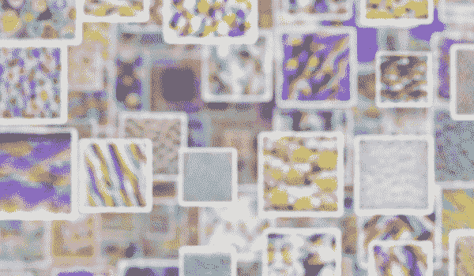

Source: OpenAI

M 显微镜系统地将几个通常被研究的视觉模型中的每一个神经元可视化，并使所有这些神经元可链接。可以通过以下方式支持:

*   可视化可以使用 OpenAI 在 TensorFlow 支持下构建的开源库 [Lucid](https://github.com/tensorflow/lucid/) ( ***通过下面的代码解释*** )来获得。
*   将模型和神经元联系起来，可以让我们对这些神经元的研究进行即时的审查和进一步的探索。
*   可以帮助研究人员，生物学家，病理学家和更多不同的方式，如果看到在疫情的情况下。
*   最终有助于更好地理解 CNN 的黑箱本质。

# 这是给谁的？

*   任何对探索神经网络工作原理感兴趣的人。
*   共享工件以促进这些模型的长期比较研究。
*   例如，对于具有相邻专业知识神经科学的研究人员来说，更大的影响将是能够更容易地接近这些视觉模型的内部工作方式。

# 怎么用？有人能给我指出一些有趣的事情吗？

开放式显微镜基于两个概念，模型中的位置和技术。打个比方，位置是你对准显微镜的地方，技术是你把什么透镜固定在上面。

模型由“节点”(神经网络层)的图形组成，这些节点通过“边”相互连接。每个 op 包含数百个“单元”，大致类似于神经元。我们使用的大多数技术只有在特定的分辨率下才有用。例如，特征可视化只能指向“单元”，而不能指向其父“节点”。

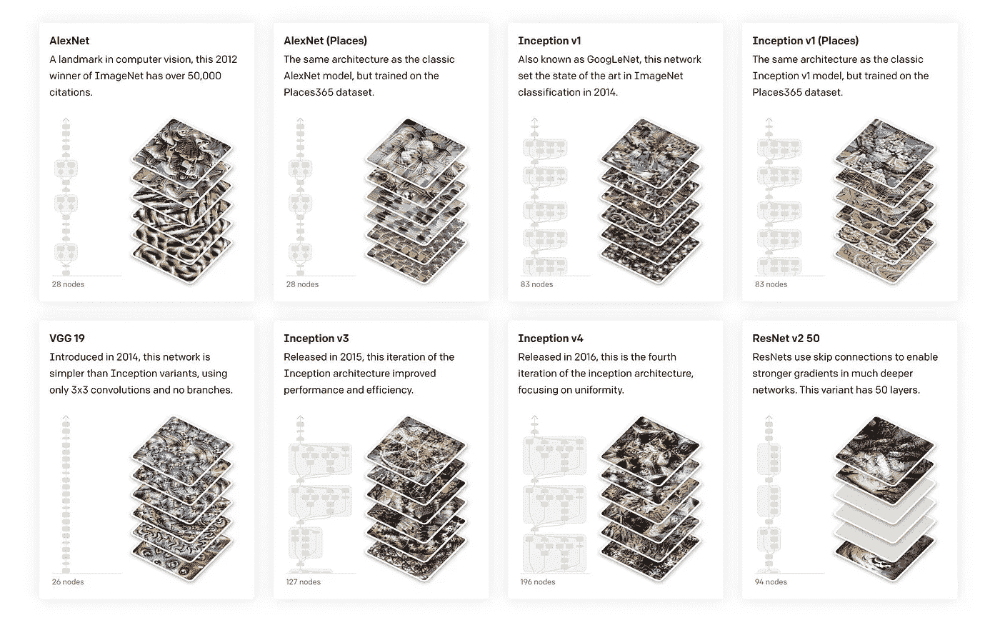

Top 8 Widely Used CNN Models

# 如果发现了有趣的东西呢？

您还可以加入 distilt slack([join link](http://slack.distill.pub))`#circuits`频道，了解更多关于功能和电路的详细讨论。

# 我可以重复使用这些图像吗？执照是什么？

显微镜在[知识共享署名许可 4.0 (CC-BY 4.0)](https://creativecommons.org/licenses/by/4.0/) 下生成的可视化效果。

> **让我们看一个例子**
> 
> 让我们以我最喜欢的和最受欢迎的 ResNet 神经网络为例，它赢得了 2015 年图像网络挑战赛，ResNet 在无层方面比竞争对手复杂得多。它解决了图像分类的问题，其中输入是 1000 个不同类别之一的图像(例如，书、鸟、汽车、杯子等。)并且输出是 1000 个数字的概率向量。

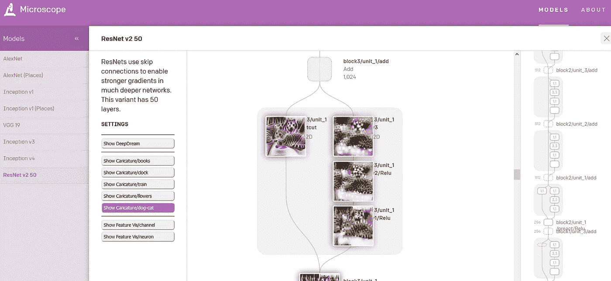

在 OpenAI Microscope 的帮助下，我可以看到一个样本数据集，并可视化 ResNet v2 50 的核心架构，以及所使用的每个层和数据集样本上的图像分类过程的状态。

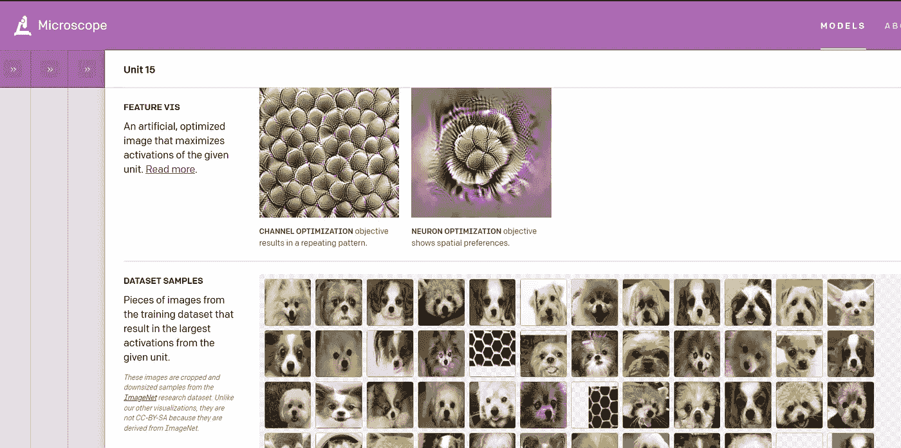

*OpenAI 还希望显微镜能有助于* [*电路协作*](https://distill.pub/2020/circuits/zoom-in/) *正在进行的工作，通过理解神经元之间的连接来对* ***神经网络*** *进行逆向工程。*

> 不仅如此，OpenAI 并不是唯一拥有这样的库的，许多其他的库像 **Keras 的**([https://keras.io/examples/conv_filter_visualization/](https://keras.io/examples/conv_filter_visualization/))， **PyTorch 的 Captum** 用于模型可解释性([https://github.com/pytorch/captum](https://github.com/pytorch/captum))，Google 和 OpenAi 一起发布了**Activation Atlas**[https://openai.com/blog/introducing-activation-atlases/](https://openai.com/blog/introducing-activation-atlases/)([Colab code](https://colab.research.google.com/github/tensorflow/lucid/blob/master/notebooks/activation-atlas/activation-atlas-simple.ipynb)

其他人工智能显微镜可视化包括 2015 年图像幻觉软件 [DeepDream](https://ai.googleblog.com/2015/06/inceptionism-going-deeper-into-neural.html) 和合成调谐曲线。

# Lucid 图书馆:

神经网络可解释性研究的基础设施和工具的集合。最重要的是，这是研究代码，不是生产代码。

**注:**

*   在 Tensorflow 1.x 上运行
*   需要 GPU。
*   可以在 Colab 上运行。
*   根据文档支持 python 2.7。

> ***让我们深入一些代码吧！！！***

1.  **安装、导入、加载型号:**

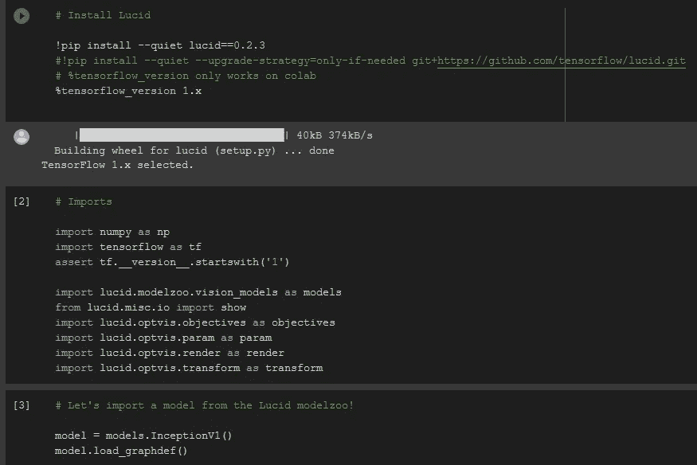

现在库已经设置好了，InceptionV1 模型已经加载。

**2。可视化一个神经元:**

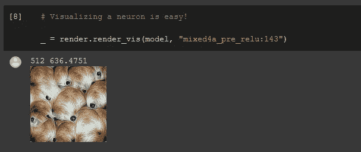

可视化可以通过三个部分实现:

*   **目标**——你想让模特看到什么？
*   **参数化** —如何描述图像？
*   **变换** —你希望你的可视化对什么样的变换具有鲁棒性？

3 ***。*目标组件:**

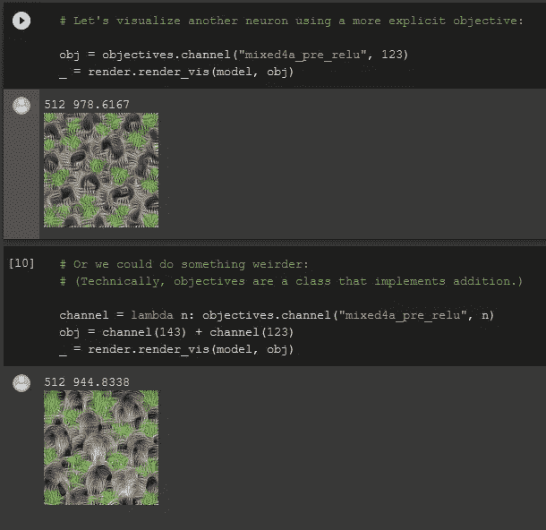

4.**变换鲁棒性:**

试图找到即使我们稍微改变它们也能高度激活优化目标的例子。在图像的情况下，即使是很小的量似乎也是非常有效的，特别是当结合更一般的高频正则化剂时。具体来说，这意味着我们在应用优化步骤之前随机抖动、旋转或缩放图像。

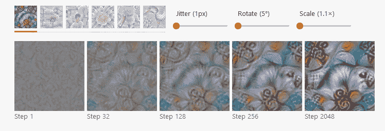

See that with steps inner transformation enhance up

当你输入一个种子值时，它随机变换一个张量流张量。**要理解逻辑运行这个- >？？transform.jitter**

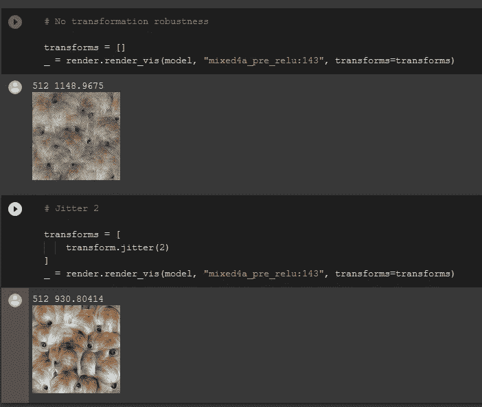

现在玩它会产生这个

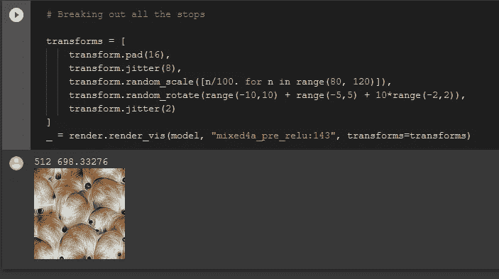

5.**参数化:**

这改变了哪个下降方向将是最陡的，以及优化在每个方向上移动的速度，但是它没有改变最小值是什么。如果有许多局部极小值，它可以拉伸和收缩它们的吸引域，改变优化过程落入的域。

理解这个

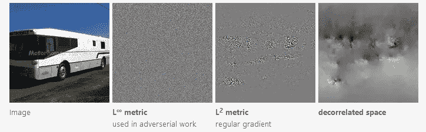

所有这些方向都是同一目标的有效下降方向，但我们可以看到它们完全不同。请注意，去相关空间中的优化会降低高频，而使用 L∞会提高高频。

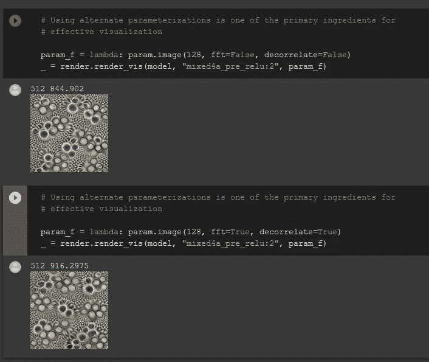

> **完整代码:**

[https://colab . research . Google . com/github/tensor flow/lucid/blob/master/notebooks/tutorial . ipynb](https://colab.research.google.com/github/tensorflow/lucid/blob/master/notebooks/tutorial.ipynb)

由于我从事计算机视觉工作已经有一段时间了，在最初阅读时，它可能会在脑海中跳动，所以我请求您阅读以下内容以熟悉它:

*   [*特征可视化*](https://distill.pub/2017/feature-visualization/)
*   [*可解释性的积木*](https://distill.pub/2018/building-blocks/)
*   [*利用人工智能增强人类智能*](https://distill.pub/2017/aia/)
*   [*可视化表象:深度学习与人类*](http://colah.github.io/posts/2015-01-Visualizing-Representations/)
*   [*可微图像参数化*](https://distill.pub/2018/differentiable-parameterizations/)
*   [*激活图册*](https://distill.pub/2019/activation-atlas/)

继续读 _/\_ 注意安全。

**参考:**

 [## 开放式显微镜

### 我们正在介绍 OpenAI 显微镜，它是八个重要层和神经元的可视化集合…

openai.com](https://openai.com/blog/microscope/) 

[https://github.com/tensorflow/lucid](https://github.com/tensorflow/lucid)