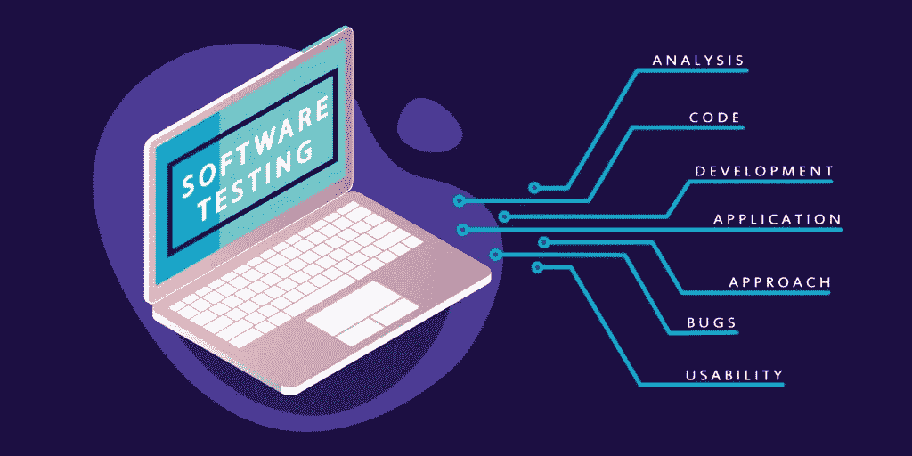

# 什么是回归测试——例子和特征

> 原文：<https://medium.datadriveninvestor.com/what-is-regression-testing-examples-and-features-131490a1caa7?source=collection_archive---------7----------------------->

创建一个应用程序是一项艰苦的工作。你必须处理一些事情，比如改变需求，发现和消除错误，增加新的功能。如果您决定添加新功能或对现有功能进行更改，这可能会对整个应用程序的性能产生多米诺骨牌效应。为了确定一切都按照预期的方式运行，公司将回归测试合并到 SDLC 中。让我们仔细看看回归测试，这样我们就能理解为什么在[开发软件](https://skywell.software/)时进行回归测试是重要的。

# 回归测试的定义

当你创建应用程序时，你必须对代码进行一些修改或调整。当这种情况发生时，您如何知道这些变化没有对功能产生负面影响呢？找出这个问题的方法是通过回归测试。基本上，这是采取一些你已经执行过的测试，然后再做一次，以确保一切都按预期运行。这种形式的测试在以下情况下进行:

*   对现有要求所做的更改
*   添加了新功能
*   有些缺陷需要修正
*   有一些性能问题需要解决

这在实践中看起来如何？让我们考虑一些回归测试的例子。假设您有一个功能为 X + Y 的应用程序，在测试过程中，发现了一个 bug。修补程序在软件本身中执行，以修复缺陷，从而改变原始代码。但是，当您实施修补程序时，您已经拥有的功能 Y-X 会受到影响。在这种情况下，需要回归测试来确定功能 X 和 Y 是否能够如它们最初预期的那样工作。

 [## 创建折衷书架的程序员指南

### 每个开发者都应该有一个书架。他的内阁中可能的文本集合是无数的，但不是每一个集合…

www.datadriveninvestor.com](https://www.datadriveninvestor.com/2019/03/25/a-programmers-guide-to-creating-an-eclectic-bookshelf/) 

另一个例子是，您正在向现有的功能添加功能 Z。您需要运行这样的测试来确定 X+Y 是否受到了 X * Y 功能变化的影响。

# 如何编写回归测试用例

回归测试可以用几种方式编写:

1.  全面的重新测试——这是当前套件中的所有测试都需要重做的时候。你可以想象，这可能是非常昂贵的。
2.  测试的选择——您可以选择测试套件中需要重做的特定部分，而不是重新执行所有的测试。这些可以进一步分为可重用的和过时的测试。
3.  测试用例的优先化——有时，某些测试会根据它们的业务影响和对整体功能的关键程度而被赋予更高的优先级。用这种方法编写您的案例将进一步有助于减少回归测试套件。

# 如何进行回归测试

您可以选择手动或自动进行回归测试。我们将讨论每种测试类型的优缺点。稍后，您应该执行这两种类型，因为每种类型在发现特定领域的特定类型的问题时都很有用。

手动软件回归测试的好处包括:

*   更容易适应变化
*   更快地找到与应用外观和感觉相关的问题
*   小的改变可以在旅途中进行
*   可用于探索性测试

负面因素是:

*   有些测试根本无法手动执行
*   结果不会像自动化测试那样可靠
*   耗时的
*   会导致团队士气低落和冷漠

另一种方法是自动化测试。您可以对重复性回归测试用例进行编程，使其在后台运行，甚至在无人工作的时候运行。理想情况下，您应该在每次部署后执行回归测试。最常用的工具有:

就像我们之前说过的，你不应该仅仅依赖于一种特定类型的测试。虽然自动化测试更快、更有效，但也仅此而已。如果你有一个特别的断言，也许效果最好，你需要找出它是否正确。

自动化测试的好处包括:

*   测试可以回收和重复
*   使用更少的时间和金钱
*   提供更可靠的结果

自动化测试的缺点是:

*   自动化测试更加昂贵
*   使用的工具可能有缺陷
*   团队成员需要更多的技术背景

# 尽早并经常开始测试

在构建过程中，无论何时进行更改，以及当您添加新功能时，合并回归测试都是至关重要的。通过尽早发现问题，您将能够节省大量时间和资源，并保持项目按计划进行。

*最初发布于*[*https://sky well . software*](https://skywell.software/blog/what-is-regression-testing-examples-and-features/)*。*