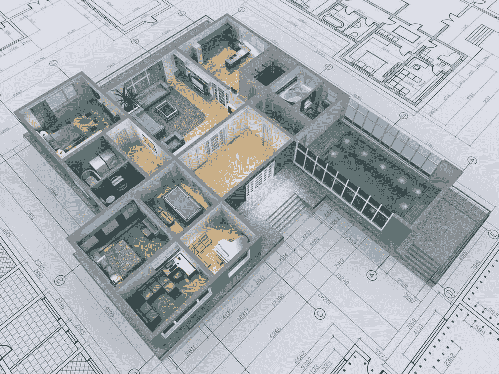

# 什么是渲染，它的优势以及在 8 个行业中的使用案例

> 原文：<https://medium.datadriveninvestor.com/what-is-rendering-its-benefits-and-use-cases-in-8-industries-e19d12e4515b?source=collection_archive---------37----------------------->

当我们看到游戏、电影甚至印刷媒体中所有栩栩如生的图像时，我们倾向于将它们视为 3D 模型。然而，将它们称为渲染的 3D 图形是正确的，通常在常规 2D 图像中描绘。虽然建模和渲染是不同的过程，但它们都是 3D 工作流的重要元素。让我们首先得到一个渲染定义，这样我们就对它的定义有了一致的看法，然后再来看看不同行业中的一些用例。

# 什么是渲染？

虽然渲染听起来像是一个复杂的术语，但它仅仅意味着您正在使用一些软件来创建一个物理对象的数字表示。如果你想知道如何渲染，有很多方法可以做到:

1.  光栅化-将模型视为多边形网格；
2.  光线投射——从摄像机的角度将光线投射到模型上；
3.  光线跟踪——从摄像机的角度来看，初级光线投射到模型上，产生次级光线；
4.  渲染方程式-这是一个真实的方程式，用于模拟光线在现实中如何更准确地发射。

# 呈现不同行业的优势和使用案例

产品渲染有很多好处。首先，可能性只受到你想象力的限制。如果你能开发的概念， [3D 渲染服务](https://skywell.software/3d-modeling-scanning-services/)将能够在 3D 渲染。如果你对一个新产品或设计有一个愿景，你可以将它形象化，以便更好地理解，你将能够实时地做出改变。对于每个行业来说，图像渲染还有许多其他好处，所以接下来让我们来看看其中的一些。

# 房地产

房地产行业已经开始将越来越多的 3D 技术融入他们的日常工作流程。对房地产经纪人和他们的客户来说，最大的好处是完全沉浸在关于房子或建筑的图像和信息中。例如，房地产经纪人可以利用房屋渲染向他们的客户展示从任何角度看房子是什么样子，而不必实际访问实际位置。他们还可以比蓝图或其他图纸更详细地展示平面布置图的布局。

# 室内设计

当向设计师描述你理想的室内环境时，很难用语言表达你真正想要的是什么。毕竟一图胜千言。室内设计师可以采用客户的想法，并创建一个三维渲染，客户可以实时对其进行任何调整。这将为每个人节省大量时间，因为有了可视化，就有可能更快地创造出理想的设计。

# 娱乐

我们已经习惯了电影中的一些 3D 场景，在这些场景中，角色会从屏幕中跳出，就好像他们是真实的一样。虽然这也涉及 3D 渲染，因为 3D 模型穿插着真人表演，但这项技术已经成为你每天观看的常规节目。这使得不是基于动作的表演更加精彩。例如，如果你正在看《财富之轮》, 3D 渲染会让你感觉自己是一个正在解谜的参赛者。

 [## 我作为软件工程师学会的 4 个关键习惯|数据驱动的投资者

### 我从事软件工程已经快 3 年了。老实说，我不认为我擅长这个(我不知道我会不会…

www.datadriveninvestor.com](https://www.datadriveninvestor.com/2020/10/12/4-key-habits-i-learned-as-a-software-engineer/) 

# 制造业

3D 渲染为预制部件等事物开辟了新的机会。这非常有用，因为您将创建一个逼真的零件描述，进行必要的更改或调整，然后创建实际的东西。这将为制造商和设计师节省大量时间和资源，因为第一次就可以正确地创建零件。我们已经在 3D 打印中看到了类似的东西，这已经在许多制造设施中使用。

# 体系结构

建筑效果图正开始取代传统的图纸，它给建筑公司和他们的客户带来了很多好处。例如，在过去，如果某个特定的细节被错误计算或完全忽略，它只会在施工阶段被发现，从而导致各种各样的延误。如今，建筑效果图允许建筑经理可视化对象的每个细节，并在它们成为大问题之前做出必要的改变。此外，由于更改是实时完成的，因此没有必要浪费时间重新绘制设计。

# 卫生保健

3D 渲染可以为医疗专业人员和他们的患者提供许多优势。可以对身体的任何部分创建逼真的图像，使医生能够识别和诊断各种医疗问题。3D 渲染也可以用来创造任何东西，从假肢到鞋子的足弓支撑。它甚至可以用来制造修复受损器官的零件。

# 营销和广告

营销人员喜欢创作更形象化的材料，而不是要求客户通读冗长的广告。这意味着他们经常不得不雇佣专业摄影师来拍摄照片。3D 渲染可以帮助营销人员比雇佣摄影师更快、更便宜地制作图像。他们还可以改变或调整图像，就像在真实的照片拍摄中一样，这更耗时。

# 时尚

时尚品牌依靠图像来充分传达其产品的独特性，但其网站上的图像通常无法完成工作。一种更好的方法是以 3D 方式呈现图像，这样购物者就可以更好地理解是什么让这件商品如此特别。这通常会导致更高的转化率，因为渲染图像提供了更多的信息。

# 开始将 3D 渲染融入您的工作流程

我们提到了各行业公司的诸多优势，而 [Skywell 软件](https://skywell.software/)也可以帮助您的公司实现这些优势。我们在为多个行业的企业渲染 3D 图像方面拥有丰富的经验，也可以为您提供帮助。请立即联系我们，了解有关 3D 渲染的更多信息以及我们能为您做些什么，或者浏览我们的案例研究，了解我们过去帮助客户取得的成果。

*原载于*[*https://sky well . software*](https://skywell.software/blog/what-is-rendering-benefits-use-cases-in-different-industries/)*。*

**访问专家视图—** [**订阅 DDI 英特尔**](https://datadriveninvestor.com/ddi-intel)