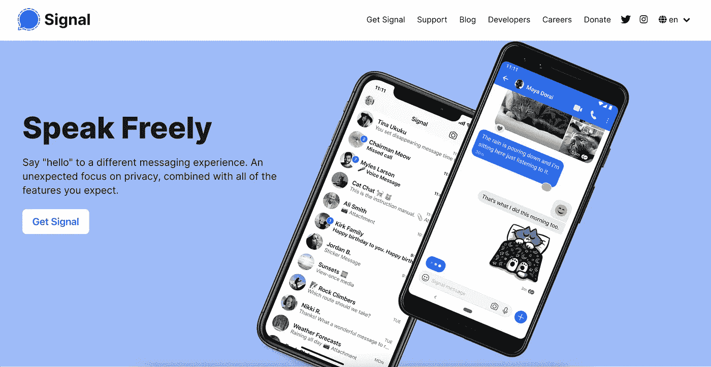
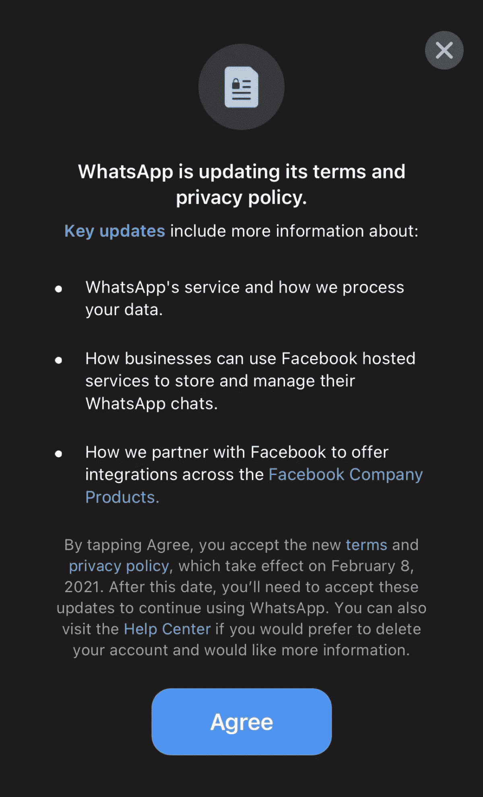
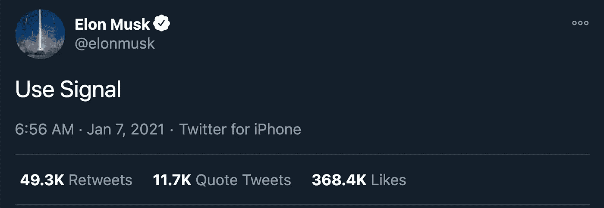
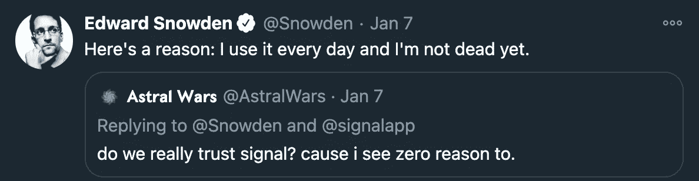

# 什么是信号，为什么每个人都在谈论它？

> 原文：<https://medium.datadriveninvestor.com/what-is-signal-and-why-is-everyone-talking-about-it-721210b8f091?source=collection_archive---------29----------------------->

这款应用的起源以及它为何突然变得如此庞大。

From [Signal.org](https://signal.org/en/)

如果你在 2020 年 12 月问美国的大多数人，信号，这是一个他们从未听说过的名字。现在，它是苹果和谷歌 Play 商店下载量最高的应用，[在 2021 年 1 月 11 日](https://www.foxbusiness.com/technology/signal-no-1-app-app-store-google-play)一天内被下载了 130 万次。

在我们回答这个流量来自哪里之前，我们必须看看这个应用是什么，它是如何产生的。

2018 年初，布莱恩·阿克顿和莫邪·马林斯派克成立了信号基金会，这是一个 501(c)(3)非营利组织，致力于使私人通信成为主流。

这是他们的使命宣言:他们的目标是“支持，加速和扩大信号的使命，使私人通信无障碍和无处不在。”

基本上，这意味着他们的使命是帮助他们的使命，使沟通更加私人和可及。

马林斯派克将大部分功劳归于阿克顿，称整个基金会都是他“创造并使之成为可能”的。阿克顿是 WhatsApp 的联合创始人，并已决定在 2017 年离开 WhatsApp 和脸书，即创办 Signal 的前一年。

该基金会的启动资金为 5000 万美元，全部来自阿克顿的个人银行账户。马林斯派克表示，Signal 没有，也没有任何意向从风险投资界拿钱。

> Signal 从未接受过风险投资或寻求投资，因为我们认为将利润放在第一位与建立一个将用户放在第一位的可持续项目是不相容的。因此，Signal 有时会因我们在短期内缺乏资源或能力而遭受损失，但我们一直认为，从长远来看，这些价值会带来最佳体验。
> 
> —莫邪·马林斯派克

尽管如此，5000 万美元也不是一个小数目。阿克顿决定担任基金会的执行主席，而马林斯派克将担任 Signal Messenger 的首席执行官。

如果你看一下该公司提供的服务，你会发现他们对你所有的短信和电话都进行了“最先进的端到端加密”。

该应用程序还表示，没有广告，因此没有必要跟踪你的位置或你的行踪。

所有这些内置的隐私功能使它成为乔治·弗洛伊德·黑人的命也是命抗议期间的首选信使。在六月的第一周，该应用程序的[下载量比以前多了 5 倍多](https://www.nytimes.com/2020/06/11/style/signal-messaging-app-encryption-protests.html)。

Signal 为帮助抗议者保护隐私所做的努力只会提升他们的品牌形象。例如，6 月，Signal 推出了一款工具，允许用户在发送的照片中模糊面部。这是对联邦政府加强追踪和监控抗议者的回应。

所有这些出色的功能开始慢慢提升 Signal 作为重视隐私的人使用的应用程序的形象，就像任何重视隐私的人使用 DuckDuckGo 一样。

然而，对于不关注这个东西的人来说，它仍然是完全未知的。

例如，我从未听说过它。只有当…时我才注意到它

1 月初，脸书旗下人气极高的即时通讯应用 WhatsApp 改变了其条款和条件政策，具体如下。

From my phone

虽然这听起来很无辜，但 WhatsApp 所说的是，WhatsApp 的商业账户现在可以使用脸书托管的服务在 WhatsApp 上做广告。

商业账户现在可以使用脸书的功能和应用，如[脸书商店](https://about.fb.com/news/2020/05/introducing-facebook-shops/)，脸书现在可以收集关于*你*的数据，如果你与这些广告互动的话。

这引起了大规模的歇斯底里，许多 WhatsApp 用户试图找到另一个不会连接到脸书的消息应用程序。信号和电报，另一个信使，看到他们的下载量飙升。

然后…

From Elon Musk’s Twitter

人们暴跳如雷。[在马斯克发布推文](https://www.unilad.co.uk/technology/signal-stops-working-as-downloads-surge-following-elon-musk-endorsement/)后的一周，Signal 的下载量达到了 880 万次，而在此前一周，只有 24.6 万次。现在，它在全球拥有超过 5 亿的活跃用户。

这里有一个例子说明人们有多疯狂。许多投资者看到这条推文后，争相购买 Signal 公司的股票，不知道这是一个非营利组织。

他们开始购买一家名为 Signal Advance 的生物技术公司的股票，该公司的股票代码为 Signal。在没有做任何研究的情况下，投资者将[的股价抬高了 438%](https://www.cnbc.com/2021/01/11/signal-advance-jumps-another-438percent-after-elon-musk-fueled-buying-frenzy.html) ，是之前的 4 倍。

在所有流量的情况下，Signal 应用程序[在周五](https://www.cnet.com/news/signal-operational-again-after-daylong-outage/)宕机，经历了持续 24 小时的宕机，然后在周六重新上线。

总的来说，这款应用似乎做得不错，主要是因为它试图为世界做些好事。这给了他们一大批拥护者，比如埃隆·马斯克。爱德华·斯诺登一直在赞美它，

管理层似乎遵循这样的意识形态，“好人有好报”，这似乎对他们很有效。