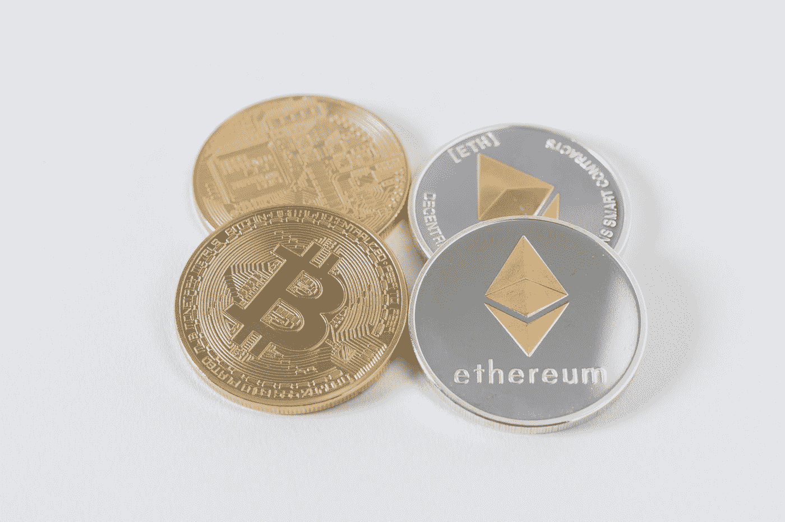

# 什么是赌注？

> 原文：<https://medium.datadriveninvestor.com/what-is-staking-91272710410e?source=collection_archive---------12----------------------->

最近，你可能已经赢得了这个术语“赌注”在加密空间使用了很多。但实际上是什么呢？这真的很简单，你可以把它看作是采矿的一种替代方式，但资源消耗更少。它涉及到在加密货币钱包中持有硬币，基本上这就是你需要做的所有事情。通过这样做，你们支持了区块链的行动并提高了安全性。你只需要 ***锁定加密货币就可以领取奖励*** 。

Photo by [Thought Catalog](https://unsplash.com/@thoughtcatalog?utm_source=medium&utm_medium=referral) on [Unsplash](https://unsplash.com?utm_source=medium&utm_medium=referral)

在大多数情况下，你可以从钱包里开始下注，但现在许多交易所都增加了这个选项。币安赌注让你以最简单的方式赢得奖励，你只需要在交易中持有你的硬币。为了帮助您深入了解这一流程的工作原理，我们来看一下利益相关证明。

# 什么是股份或 POS 的证明？

如果你还记得我以前的一篇[文章](https://medium.com/datadriveninvestor/understanding-bitcoin-how-the-network-works-the-halving-impact-difficulty-adjustments-price-52162fb2ca8b)的话，我们已经解释了比特币的工作证明和它的作用。但是，如果您不记得了，这是允许将事务聚集到块中的机制。然后，这些积木被连接在一起，形成了区块链。

工作证明尽管这是一个非常好的想法，但它仍然是一个强大的机制，可以让区块链以分散的方式达成共识。这里的问题是，它包括许多任意的计算和要解决的难题。这是因为保持安全，但人们不能只监督低效率。

另一方面，股权证明则完全不同，不需要每秒钟进行数百万次计算。这个想法是，用户可以锁定他们的硬币，在特定的时间间隔后，一个协议随机选择一个硬币来验证下一个区块。决定哪个用户创建区块的因素不是基于 TH/S，而是基于他们持有或下注了多少硬币。

 [## 稳定币会危及比特币在加密领域的地位吗？数据驱动的投资者

### Stablecoin 是一种加密货币，主要用于维持稳定的市场价值。它可以通过…

www.datadriveninvestor.com](https://www.datadriveninvestor.com/2020/06/08/can-a-stablecoin-jeopardize-the-position-of-bitcoin-in-the-crypto-space/) 

# 赌注奖励是如何计算的？

相比之下，采矿在这里不是一个专门的工具，帮助您计算确切的利润数额。每个区块链可能会使用不同的方法来计算奖励，所以这也没有帮助。一般来说，有几个因素会影响你的奖励。

*   验证机押了多少硬币
*   验证程序已经活跃了多久
*   总共有多少硬币被押在网络上
*   通货膨胀率

对于其他一些网络，赌注奖励确定为一个固定的百分比。这些奖励分发给验证者，作为对通货膨胀的一种补偿。

# 如何入门？

开始下注真的很容易，正如我们上面解释的，你也可以只通过你的钱包下注。然而，如果你想有某种可预测的奖励计划，你应该考虑加入赌注池。就像采矿有自己的池一样，打桩也有。币安为每个使用它的人提供了一个游泳池，你也可以使用所有其他功能，而不会受到赌注的影响。实际上，你所要做的就是去币安买一些硬币来下注，就这样。其他的技术都由他们处理。

Photo by [Jason Briscoe](https://unsplash.com/@jsnbrsc?utm_source=medium&utm_medium=referral) on [Unsplash](https://unsplash.com?utm_source=medium&utm_medium=referral)

在我个人看来，这是一个真正有趣的机会，让人们了解加密空间，也赚一些钱。随着我们将会看到越来越多人采用这项技术，这种访问的便利性将会战胜电力。很快我会发一个帖子展示我上个月赌博赚了多少钱。

**进入专家视角—** [**订阅 DDI 英特尔**](https://datadriveninvestor.com/ddi-intel)