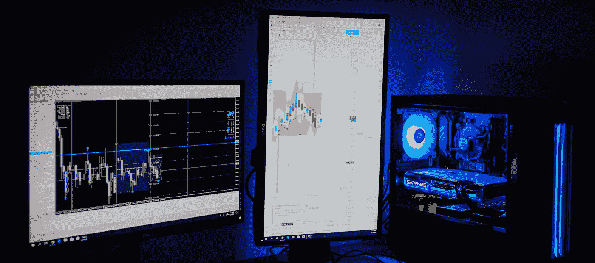
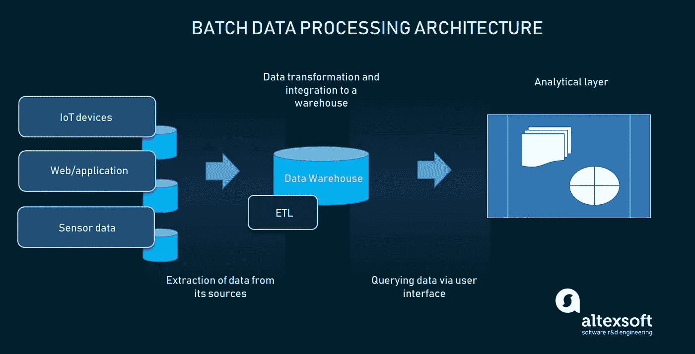
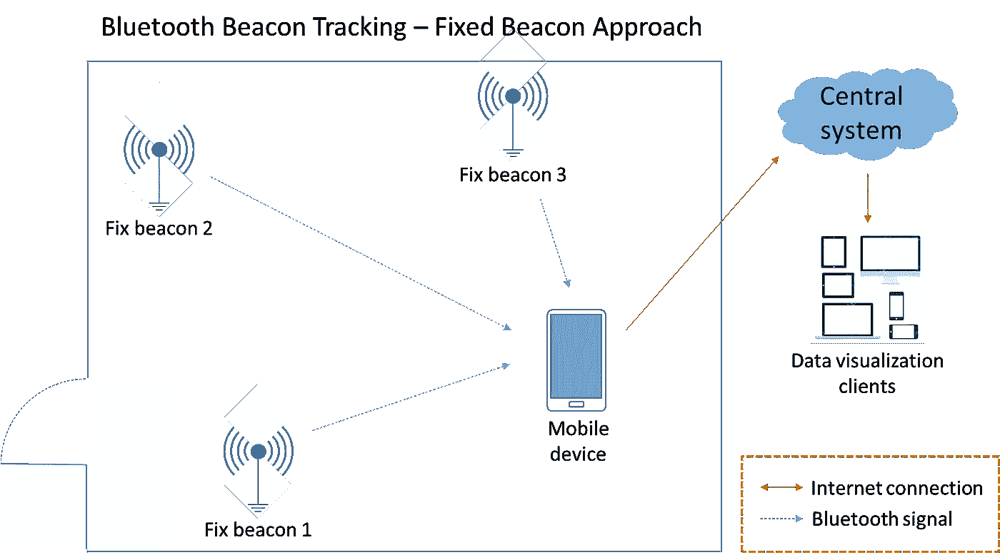
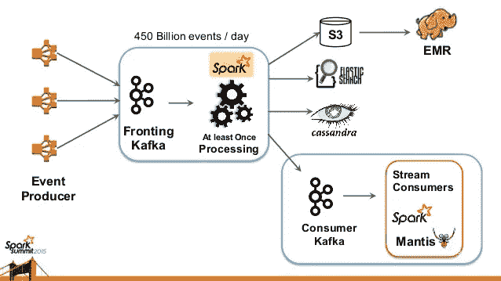
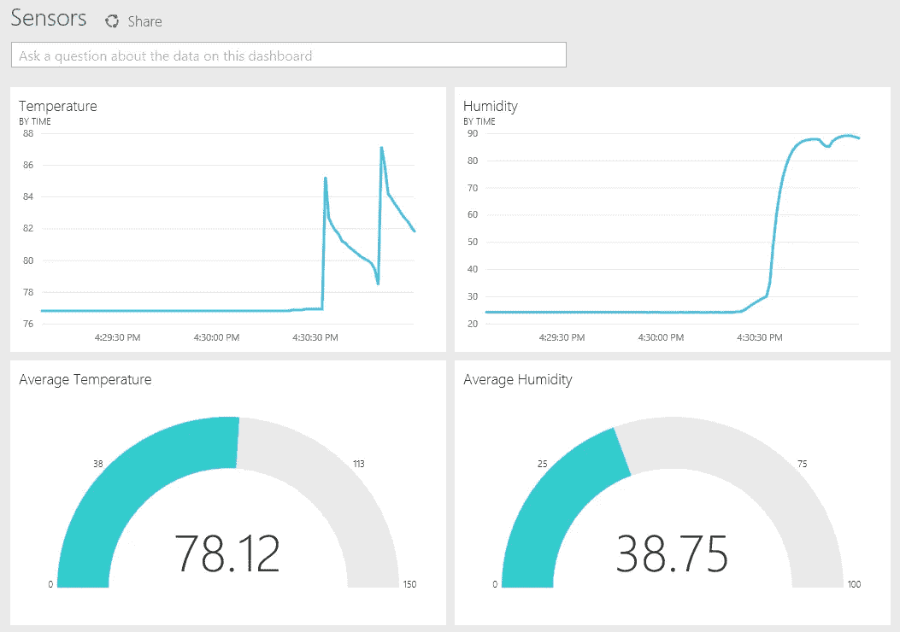
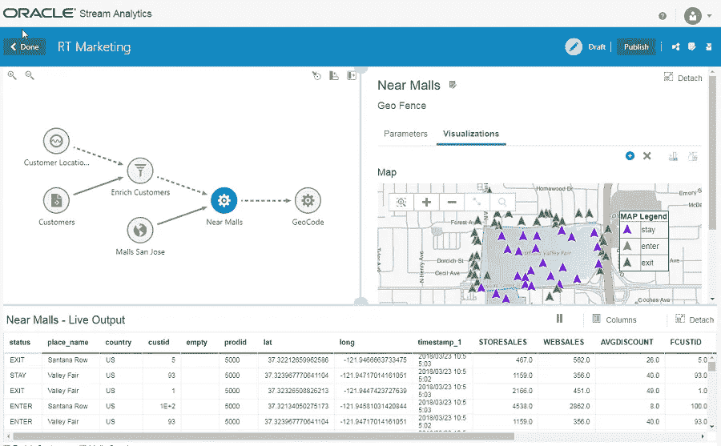

# 什么是流分析:流处理、数据流和实时分析

> 原文：<https://medium.datadriveninvestor.com/what-is-streaming-analytics-stream-processing-data-streaming-and-real-time-analytics-e7aed4cd612c?source=collection_archive---------6----------------------->

速度当然是一个描述当今世界事物流动的词。下载一部电影或一首歌曲从未如此之快，但你不必如此。像网飞、Prime 和 Spotify 这样的流媒体服务可以在瞬间把它带到你的设备上。那么，发生了什么变化？

流媒体服务让我们无需上传整个文件就能持续消费内容。这种方法需要在任何给定的时刻发送和接收数百万比特的数据，这样你就可以在旅途中播放另一集*黑镜*。由于其类似于水的物理喷射的行为，数据的连续转换被命名为*流*，现在它以不同的形式存在。

媒体流是其中之一，但这只是数据流的冰山一角。随着[物联网](https://www.altexsoft.com/blog/business/11-key-enterprise-iot-security-recommendations/?utm_source=MediumCom&utm_medium=referral&utm_campaign=shared) (IoT)设备的增长，整体数据量增加，该领域的工程进步带来了收集、处理和分析数据的新方法。因此，通过处理流数据来提供实时分析成为可能。

 [## 数据科学和软件工程哪个更有前途？数据驱动的投资者

### 大约一个月前，当我坐在咖啡馆里为一个客户开发网站时，我发现了这个女人…

www.datadriveninvestor.com](https://www.datadriveninvestor.com/2019/01/23/which-is-more-promising-data-science-or-software-engineering/) 

*请注意:由于该主题需要对分析和数据工程有一些大致的了解，如果您是该主题的新手，我们建议您阅读以下文章:*
[*数据工程概述*](https://www.altexsoft.com/blog/datascience/what-is-data-engineering-explaining-data-pipeline-data-warehouse-and-data-engineer-role/?utm_source=MediumCom&utm_medium=referral&utm_campaign=shared)
[*商业智能和分析完全指南*](https://www.altexsoft.com/blog/business/complete-guide-to-business-intelligence-and-analytics-strategy-steps-processes-and-tools/?utm_source=MediumCom&utm_medium=referral&utm_campaign=shared)
[*商业智能开发人员的角色*](https://www.altexsoft.com/blog/bi-developer-role-responsibilities-skills/?utm_source=MediumCom&utm_medium=referral&utm_campaign=shared)
[*数据可视化作为数据表示和分析的一部分*](https://www.altexsoft.com/blog/data-visualization-tools-types-techniques/?utm_source=MediumCom&utm_medium=referral&utm_campaign=shared)

这篇文章解释了什么是流分析。我们将通过真实的例子来了解数据流、实时处理以及传统分析和流分析之间的区别。还必须涵盖处理流数据的优势，以及这种类型的数据分析的主要用例。

# 什么是流或实时分析？

**流分析**或**实时分析**是一种数据分析类型，可呈现实时数据，并允许使用该数据执行简单计算。与处理历史数据相比，处理实时数据涉及的机制略有不同。也就是说，它使用一种特定类型处理大量不断更新的数据，称为**流处理**。

这种类型的分析主要处理数据流，没有复杂的分析任务。它的主要目的是为用户提供最新的信息，并保持数据状态的更新。鉴于这些特征，流分析通常用于以下行业:

**重型机械/运输/车队运营**:从传感器和物联网设备获取数据流；

**医疗保健**:健康状况实时监控、临床风险评估、客户状态分析和警报；

**财务**:交易处理、市场/货币状态监控；

**零售/客服**:客户行为分析和运营改进；

**制造/供应链**:实时监控、预测性维护、中断/风险评估；

**家庭安全**:物联网数据流分析、智能防护、警报系统改进；和

**IT** :任何一种实时数据分析，如欺诈检测或系统维护。

然而，使用范围可以与传统分析相吻合。为了理解流处理的细节，让我们将它与传统的批处理进行比较。

## 成批处理

当我们谈到传统分析时，我们指的是商业智能(BI)方法和技术基础设施。BI 是一种支持数据驱动的业务决策的实践。它主要关注历史数据，在大多数情况下，这些数据并没有失去其重要性或相关性。

*Batch processing architectural components*

历史数据存储为一个稳定的单元，可以分成多个部分。在 [ETL](https://www.altexsoft.com/blog/datascience/who-is-etl-developer-role-description-process-breakdown-responsibilities-and-skills/?utm_source=MediumCom&utm_medium=referral&utm_campaign=shared) 和[入库](https://www.altexsoft.com/blog/enterprise-data-warehouse-concepts/?utm_source=MediumCom&utm_medium=referral&utm_campaign=shared)过程中，数据被批量移动和处理。用户或软件程序必须查询一个批次。因此，系统将了解何时获取数据和数据的哪些部分，如何处理数据，并将其呈现给最终用户。

**示例** : *一个组织在其仓库中存储销售数据。一旦用户想要查询数据进行分析，他或她将传递参数来定义所需的信息部分，例如:*

*产品:真皮表带*
*销售地区:北加州*
时间段:2019 年第一季度

系统会理解从存储器中获取哪些数据。因此，传递给定参数的每条数据都是一批。

## 流处理

流媒体是一个相对较新的概念。首先，流处理处理*数据流*。数据流是一种持续不断的数据流动，它以很高的频率更新，并在很短的时间内失去相关性。例如，这些可能是交易数据、来自物联网设备的信息、硬件传感器等。

*Stream processing architectural components*

由于数据流没有起点和终点，所以不能分成批次。因此没有时间将数据上传到存储器并进行处理。相反，数据流是动态处理的。

**例子** : *一个安全组织在客户家里安装运动传感器和报警系统。运动传感器每秒钟都会收集有关运动的信息，当超过某个阈值时会发出安全警报信号。然后，进入处理器的数据将被每个传感器和特定的传感器组分开。因此，要查看数据，用户必须接收来自后门传感器组的数据流。随着数据流的接收，用户将能够查看给定传感器组的实时数字和变化。*

所以这种情况下的应用程序逻辑变成了一个恶性循环，因为查询和处理是连续进行的。然而，数据流也可以是收集历史数据的信息源。在这种情况下，一个额外的仓库将存储这些要格式化的数据，并在 BI 中进一步使用。

*Stream and batch processing combined into one analytical platform*

现在，为了进行多个流的并发处理，我们需要特定的硬件和软件。流处理由称为**事件流处理器(ESP)** 的系统进行，这些系统能够接收数据流并以很短的响应时间处理它们，并且没有数据丢失。

事件(数据)可以由许多来源同时生成，可能来自大型购物中心的信标。信标跟踪购物中心沿线的顾客活动，不断发送位置数据。那将是一个数据流。

*Beacons gather customer-location data to pass it as a data stream*

ESP 同时处理所有这些数据，方法是获取位置，保持更新，并不断地将其提供给用户。此外，可以通过分析仪表板将数据视为实时跟踪器，该仪表板将根据请求或不断更新客户位置。

# 流处理工具

使流处理器能够快速计算和并发处理多个数据流的专用技术是构建流分析平台的关键。我们来看看主要的技术。

## 阿帕奇工具:卡夫卡、火花、风暴和弗林克

[**Apache Kafka**](https://kafka.apache.org/) 最初由 LinkedIn 开发为消息队列应用，于 2011 年开源并捐赠给 Apache。之后，Kafka 发展成为一个开源的数据流平台。

Kafka 是一个流处理器，它通过一个 [API](https://kafka.apache.org/10/documentation/streams/developer-guide/processor-api.html) 集成应用程序和数据流。与 Apache Foundation Software 的其他产品一样，Kafka 已经被优步和网飞这样的巨头推广开来。由于其运行并发处理和快速移动大量数据的能力，Kafka 被用于大数据流，如网飞的大数据摄取平台。

*Netflix’s big data ingestion platform architecture* *Source:* [*slideshare.net/SparkSummit*](https://www.slideshare.net/SparkSummit/spark-and-spark-streaming-at-netfix-sedakar-daxini)

Apache Kafka 还可以与仓储解决方案 [Apache Hive](https://hive.apache.org/) 和用于批量处理存储数据的 [Hadoop](https://hadoop.apache.org/) 集成。也可以配合 [Apache Spark](https://spark.apache.org/) 这个大数据处理引擎使用。但是，还有许多其他工具可以处理流处理，例如用于分布式流处理和混合类型数据处理的 [Storm](https://storm.apache.org/) 和 [Flink](https://flink.apache.org/flink-architecture.html) 。两者都可以用作集成到 Hadoop 中的 ETL 工具或批处理处理器。

## 亚马逊工具:Kinesis 流，Kinesis 和消防软管

[**亚马逊 Kinesis Streams**](https://aws.amazon.com/kinesis/data-streams/) 是一个可扩展、可定制的处理和分析数据流的解决方案。Kinesis Streams 提供了一个流处理器，还允许您通过使用[客户端库](https://docs.aws.amazon.com/streams/latest/dev/developing-consumers-with-kcl.html)、[连接器](https://aws.amazon.com/kinesis/data-streams/resources/)和 API 来构建自己的应用程序。

[**亚马逊**](https://aws.amazon.com/kinesis/) 。还可以使用托管流处理解决方案 Amazon Kinesis。除了托管处理和微调之外，Amazon Kinesis 还提供了一系列与 Apache 服务的可能集成，如前面提到的 Spark 和 Kafka。

[**Amazon Firehose**](https://aws.amazon.com/kinesis/data-firehose/) 使您能够将数据流集成到现有的 BI 工具和分析界面或仓库中。它还可以帮助你获取数据，并将其集成到亚马逊现有的仓储解决方案中，如 [S3](https://aws.amazon.com/s3/) 和[红移](https://aws.amazon.com/redshift/)云仓库。

您选择的架构解决方案会因运行数据的实例数量而异。然而，所有这些都可以在市场上买到，以满足特定的流媒体需求。现在，让我们来解决可以作为实时分析界面的面向用户的部分。

# 实时分析仪器

将数据流集成到您的数据平台是创建您自己的实时分析解决方案的重要一步。在这个阶段，您将能够接收数据并执行分析计算。但是，如果没有 UI，它什么也做不了，用户可以在 UI 中查看信息，创建可视化效果，并在仪表板中进行操作。

如果您是商业智能从业者，并且您已经有了一个分析工具，那么您可以将数据流集成到其中。BI 接口用于各种分析目的，包括处理大数据和数据挖掘。因此，提供实时分析是您可以使用该界面的另一个选项。查看我们关于可用 [BI 工具](https://www.altexsoft.com/blog/best-bi-tools-comparison/?utm_source=MediumCom&utm_medium=referral&utm_campaign=shared)的专用材料。

现在，我们将重点关注提供流处理、数据摄取和分析软件的复杂解决方案。

## Azure 流分析

[**Azure Stream Analytics**](https://docs.microsoft.com/en-us/azure/stream-analytics/stream-analytics-introduction)是微软搭配其分析接口 Power BI 推出的流处理平台。这两种解决方案都完全在云中管理和部署。流分析使用微软的 Trill 流处理器。它集成了数据，并提供跨多个来源的低延迟处理。

*Real-time data coming from hardware sensors measuring temperature in PowerBI*

[**Power BI**](https://powerbi.microsoft.com/en-us/) 是一款通用的商业智能工具，可用于批量和实时分析。微软文档包含将流分析集成到 Power BI 的[指南](https://docs.microsoft.com/en-us/azure/stream-analytics/stream-analytics-power-bi-dashboard)。它允许您通过交互式元素和设置来更新仪表板和创建视觉效果，从而将数据流连接到 Power BI 并管理数据。

## GoogleCloud 流分析

[**Google Cloud Stream Analytics**](https://cloud.google.com/solutions/stream-analytics/?hl=ru#products-services)在流处理方面提供了类似的功能，因为他们的产品包括一个用于数据摄取、处理和分析的专用引擎。数据操作可由三种仪器处理:

*   [Pub/Sub](https://cloud.google.com/pubsub/?hl=ru) 是一个消息服务和数据摄取工具，类似于 Apache Kafka。它允许您执行事件更新并将数据转移到分段存储中。
*   [Dataflow](https://cloud.google.com/dataflow/?hl=ru) 是管理摄取数据的工具。基本上，它是一个为批处理和流处理设计的数据转换/格式化工具。
*   [BigQuery](https://cloud.google.com/bigquery/?hl=ru) 是 Google 的云仓储解决方案，可以作为你的数据平台的存储。

作为分析接口，数据管道可以插入 [Google Cloud BI](https://cloud.google.com/solutions/business-intelligence/) 。它可以和 [Google Data Studio](https://marketingplatform.google.com/about/data-studio/) 一起作为数据平台 UI 使用。只要数据流是使用 [Apache Beam SDK](https://beam.apache.org/) (一种用于数据处理的统一编程模型)构建的，谷歌[就提供](https://cloud.google.com/dataflow/docs/samples/molecules-walkthrough)将[机器学习模型](https://www.altexsoft.com/blog/datascience/comparing-machine-learning-as-a-service-amazon-microsoft-azure-google-cloud-ai-ibm-watson/?utm_source=MediumCom&utm_medium=referral&utm_campaign=shared)集成到你的流分析中，使用 [TensorFlow](https://www.tensorflow.org/) 和 Beam。

## Oracle 流分析

[**Oracle Stream Analytics**](https://www.oracle.com/middleware/technologies/stream-processing.html)是一个基于云的平台，为流获取、处理和可视化提供一体化解决方案。该平台构建在 Apache Spark 之上，因此它与其他 Apache 技术兼容。数据摄取是通过 Apache Kafka 完成的。但是，数据转换、日志捕获和实时数据集成可以通过专用包 [Oracle GoldenGate](https://www.oracle.com/middleware/technologies/goldengate.html) 来完成。

其他重要的考虑是可视化和数据表示。你可以找到一个 Oracle 的专用 BI 工具[但是它没有提供太多关于与流分析平台集成的信息。原因可能是在一个专用界面中处理表格实时数据和物联网流数据的可视化。](https://www.oracle.com/business-analytics/business-intelligence/)

*Oracle Stream Analytics IoT geo-visualization in a real-time data dashboard*

甲骨文还支持基于机器学习算法的人工智能驱动的解决方案，所以如果你对人工智能感兴趣，你可以考虑一下。

## IBM 流分析

[**IBM Streaming Analytics**](https://www.ibm.com/cloud/streaming-analytics)可用于构建实时分析应用。它由 [IBM Streams](https://www.ibm.com/support/knowledgecenter/SSCRJU_5.2.0/com.ibm.streams.welcome.doc/doc/kc-homepage.html) 提供支持，这是一个用于流处理、数据接收/转换和分析的数据平台。流可以作为 IBM Cloud 的一部分部署在云上，也可以在内部部署。和上面提到的所有平台一样，IBM 也支持 Kafka 作为消息传递和数据摄取工具。

# 流式分析的真实例子有哪些？

好了，我们已经讨论了流处理一般如何工作的理论部分，以及它如何应用于数据分析和业务使用。现在，提及一些企业如何利用实时分析及其带来的好处的真实示例至关重要。

## 优步:伴侣审计工具

我们都知道优步是做什么的:国际叫车和送餐服务。优步移动应用程序处理两个实时实例:

*   跟踪驱动程序和客户端的位置需要持续的数据流和地理位置更新，将这些数据推送给这两种类型的应用程序用户。这意味着优步必须处理数 Pb 的消息来跟踪数据流。
*   需要监控直接通过应用程序进行支付的优步用户的持续资金流量。金融运营意味着欺诈风险很高。因此，除了控制流数据的数量，优步还必须警惕欺诈检测。

优步的[伴侣](https://eng.uber.com/chaperone-audit-kafka-messages/)审计数据平台，基于 Apache Kafka，就是为了应对这两个问题而建立的。优步使用 Kafka 作为其消息服务，执行高速数据丢失、审计和重复检测。通过在多个数据中心之间执行审计，优步有可能降低错误率、避免数据丢失并提高欺诈检测能力。

## 网飞:Keystone 流媒体平台和螳螂

[**Keystone 流处理平台**](https://netflixtechblog.com/keystone-real-time-stream-processing-platform-a3ee651812a) 。网飞需要处理数 Pb 的实时数据，因此 Keystone 不是唯一一个处理数据流的数据平台。它的核心是 Apache Kafka 作为一种消息服务，允许低延迟处理，而 Flink 持有分布式流。此外，该平台通过面向用户的独立 Kafka 连接到分析界面。此外，亚马逊和 ElasticSearch 使用 S3 发送数据进行批处理。

[螳螂 。网飞的另一个流处理平台是 Mantis，它主要致力于在其上构建一个低延迟的实时应用程序。Mantis 专注于内部组织使用的操作应用程序，因此它内部有一套完全不同的工具。螳螂没有深入太多的技术细节，而是提供了操作仪表板和实时警报来处理数据。](https://netflixtechblog.com/stream-processing-with-mantis-78af913f51a6)

# 如何开始流分析

无论如何，熟悉 Apache 产品和框架会使实现自己的平台容易得多。在构建专用平台方面，我们的建议是将重点放在选择多样化的流处理器，以与您现有的分析接口相匹配。或者，留意同时提供流处理和 BI 即服务的供应商。

从流分析开始的最好方法是看看 [Apache](https://spark.apache.org/streaming/) 在开源工具方面提供了什么。你主要可以关注 Kafka 文档，因为大多数用于流分析的数据平台和产品都是基于它作为消息服务和流处理器。

*最初发表于 AltexSoft 技术博客“* [*什么是流分析:流处理、数据流和实时分析*](https://www.altexsoft.com/blog/real-time-analytics/?utm_source=MediumCom&utm_medium=referral&utm_campaign=shared)