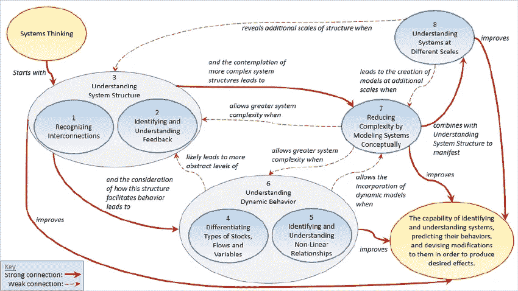
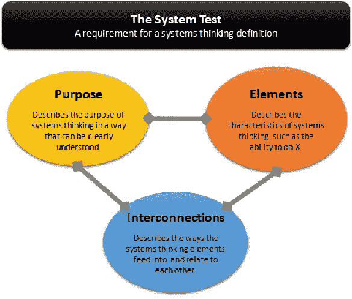

# 什么是系统思维？

> 原文：<https://medium.datadriveninvestor.com/what-is-systems-thinking-1798d662f5c3?source=collection_archive---------8----------------------->

## 罗斯·阿诺德和乔恩·韦德的《系统思维的定义:系统方法》概述

Systems Thinking Systemigram (Ross Arnold and Jon Wade)

罗斯·阿诺德和乔恩·韦德认为，几句话不能完整地描述系统思维。试图提供一个简短描述的定义经常错过系统思考的几个组成部分或者它们之间的相互联系。最好最完整的定义实际上是一个模拟系统思维的系统本身。

> *“系统思维，从字面上看，是一个关于系统的思考系统”*(阿诺德，韦德)

在我们开始之前，让我们快速转向*简化论*。简化论旨在通过将概念分解成更简单的元素并对其进行分析来理解概念。虽然它多年来对科学界做出了巨大贡献，但它对理解系统没有太大帮助，因为我们失去了不同组件之间的相互作用和影响。系统思维处理的是观察全局。

> 系统思维的核心是能够用一只眼睛同时看到森林和树木。

Photo by [Lukasz Szmigiel](https://unsplash.com/@szmigieldesign?utm_source=medium&utm_medium=referral) on [Unsplash](https://unsplash.com?utm_source=medium&utm_medium=referral)

“系统思维”一词是由巴里·里士满创造的，他将其定义为能够通过深入理解底层结构来做出可靠的推断。他说“接受系统思维的人把自己定位成既能看到森林又能看到树木；各一只眼。”Barry 提到了这样一个事实，即系统思维将重点放在理解单个元素(树木)的作用上，并且还理解部分的总和可能不同于整体(森林)。虽然这个定义确实提供了对系统思维的洞察，但它未能解释不同元素之间的相互联系。

> “系统思维是一套协同分析技能，用于提高识别和理解系统、预测其行为以及设计对其进行修改以产生预期效果的能力。这些技能作为一个系统协同工作。”(阿诺德，韦德)

一个系统是由其目标定义的。系统思维的目标是识别系统，预测它们的行为，并理解元素的变化如何表现为系统整体的变化。随着目标的确定，到了定义单个元素及其相互联系的时候了。Ross 和 Jon 利用以前的文献很好地定义了系统的要素，精心设计了系统的 8 个要素。

This picture is your best friend — reference it often

1.  **识别相互联系:**识别系统不同部分之间的重要联系。
2.  **识别和理解反馈:**系统是动态的，这意味着它们总是在影响和被影响。有时，这些联系形成了反馈回路，其中存在着元素相互影响的循环。能够识别这些循环并理解它们的行为是很重要的。
3.  **理解系统结构:**我发现这一步有些多余，但它被定义为理解互连和反馈回路的结构以及如何促进系统行为。它就像一个包含 1 和 2 的容器元素，以理解结构如何影响动态行为，以及稍后修改模型作为结果将如何再次影响结构。
4.  **区分股票、流量和变量的类型:**股票是一个系统的资源。它们可以是金钱、血液、幸福、松果或任何东西。流量就是这些资源的变化。变量是系统中影响存量和流量的可变部分。它们可以作为约束或品质存在。如流速、库存容量或乘数。
5.  **识别和理解非线性关系:**除了这里的流程是非线性的以外，这一个与上一个相同。从概念上讲，很难理解线性和非线性之间的区别。非线性关系具有突现性，或者说是由多个系统元素协同产生的特性。这些性质使系统不同于其各部分的总和。
6.  **理解动态行为:**这个元素与元素 3 非常相似，因为它是元素 4 和元素 5 的封装。它是关于理解相互联系，反馈回路，股票，流量和变量。
7.  **通过对系统进行概念性建模来降低复杂性:**这一要素是关于对系统的不同部分进行建模，并通过简化、转换、抽象或同质化来简化系统。简化系统各部分的目的是使它们更容易理解，从这些新的角度可以发现新的见解。
8.  **认识不同尺度的系统:**能够认识不同尺度的系统和由系统组成的系统。例如，一个系统的组件可能是共享这 8 个元素的另一个系统。

One more time for good luck

光看描述只会给你半壁江山。另一半在于元素之间的相互作用。注意一个元素中的每一个元素是如何受到那个元素的影响的，即使是弱连接。该系统不断向提高系统思考能力的最终目标传播，同时也改变自己以更好地满足该目标。

 [## 规划和建立您的房地产业务|数据驱动的投资者

### 房地产行业是有史以来最受欢迎的五大职业之一。原因很简单。它确实…

www.datadriveninvestor.com](https://www.datadriveninvestor.com/2020/12/14/plan-and-build-your-real-estate-business/) 

最后，这个定义可以通过使用系统测试作为一个系统来验证。要被归类为一个系统，所有这三个属性必须存在。

(Arnold and Wade)

目的:识别和理解系统，预测它们的行为，并设计修改以产生期望的效果

元素:该定义有 8 个元素，将对其进行详细描述

相互联系:系统图深入描绘了所有元素之间的关系

在一个互联的世界中，系统无处不在，为了有效地解决现代问题，我们需要使用系统思维。将线性模型应用于非线性系统是一种不正确的方法，因为一维思维无法准确预测结果。与大多数现实世界的关系不同，线性解决方案假设因果关系没有反馈。大多数人都像 A -> B->C 一样思考，实际上更像是 A->B->C，也是 A。另一方面，系统思维考虑到了现实世界问题的所有复杂性，如反馈回路、突现性质以及在多个尺度上理解系统的能力。

查看全文，获得对系统思维更深入的解释、简史和系统介绍。这是一个快速阅读和重新连接你的大脑的良好开端。

 [## (PDF)系统思维的定义:系统方法

### 本文提出了一个系统思维的定义，用于各种各样的学科，特别强调…

www.researchgate.net](https://www.researchgate.net/publication/273894661_A_Definition_of_Systems_Thinking_A_Systems_Approach) 

这篇文章也有助于解释线性思维和非线性思维的区别。

 [## 线性思维与非线性思维

### 在真实的物理世界或商业世界中，大多数关系都是非线性的。数字业务和世界…

futureofcio.blogspot.com](https://futureofcio.blogspot.com/2015/01/linear-thinking-vs-non-linear-thinking.html) 

## 来源:

阿诺德，罗斯&韦德，乔恩。(2015).系统思维的定义:系统方法。计算机科学。44.669–678.10.1016/司法程序

*线性思维 vs 非线性思维*。(2017).首席信息官的未来。[https://futureofcio . blogspot . com/2015/01/linear-thinking-vs-non-linear-thinking . html](https://futureofcio.blogspot.com/2015/01/linear-thinking-vs-non-linear-thinking.html)

## 获得专家观点— [订阅 DDI 英特尔](https://datadriveninvestor.com/ddi-intel)