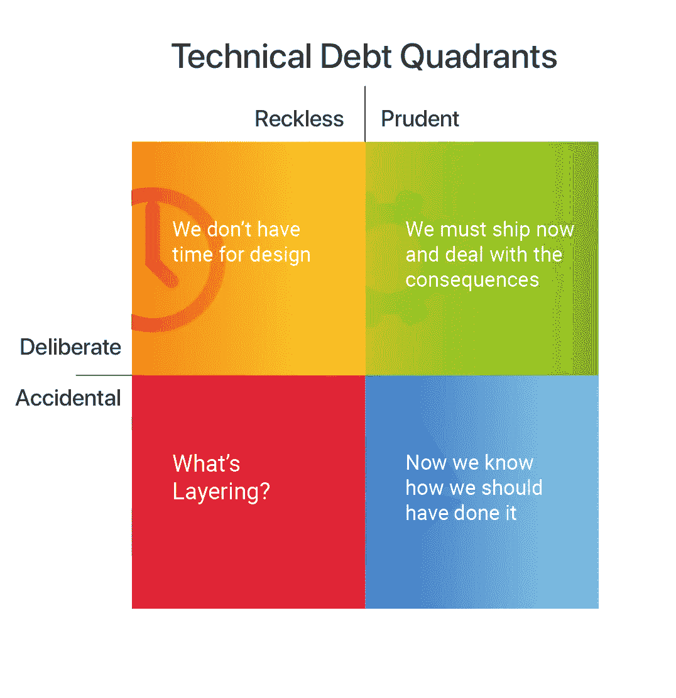
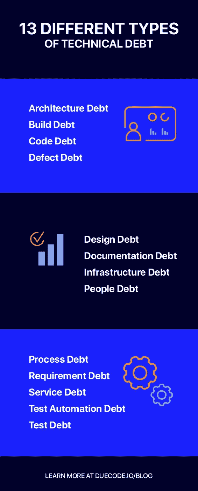
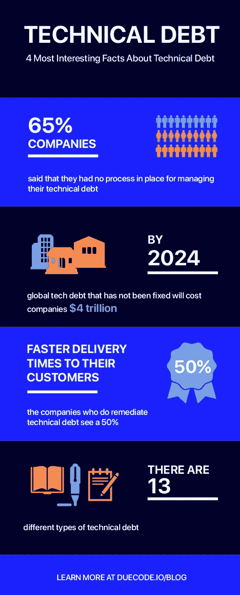

# 什么是技术债？

> 原文：<https://medium.datadriveninvestor.com/what-is-technical-debt-a5c98bb075c3?source=collection_archive---------19----------------------->

软件业是一个不稳定的世界。今天流行的技术在不久的将来会过时。当[。NET Framework](https://en.wikipedia.org/wiki/.NET_Framework) 于 90 年代初发布，开发人员热衷于学习这项新技术。但是到了 2010 年，没有人热衷于学习这个框架。因为它的辉煌时代早已过去。Objective C & [Perl](https://www.perl.org/) 也在遵循同样的路线图&我们不会对这些语言很快完全退出生产感到惊讶。

机器学习、深度学习、区块链、AR/VR 现在是市场上最热门的概念，但我们不知道 20 年后，我们是否还会使用这些技术。

简而言之，随着时间的推移和新技术进入市场，旧程序被贴上了过时的标签，它们的需求和支持大大减少。在这篇文章中，我们将讨论[【技术债务】](https://duecode.io/blog/what-does-technical-debt-look-like/) &的概念，我们还将了解不断变化的技术如何对“技术债务”产生影响。

我们都从银行贷过款，对吗？当你从银行贷款时，银行向你收取一定的利息&你必须向银行偿还原始金额和利息的总和。因此，也可以说你正式负债，也就是说你欠某人钱。你结清贷款的时间越长，情况就越糟糕。

“技术债务”也是如此。技术债务是一个编程概念，起源于做出“快速和肮脏”的开发决策。总的结果是，由于走了更短的路线，现在存在返工代码所涉及的开销成本，这种成本现在没有达到预期。但是，债务是一件坏事吗？这当然取决于具体情况&你如何使用它。请继续关注我们对“技术债务”的了解。

# 技术债务象限

# 13 种不同类型的技术债务

凡事皆有因。同样，技术债务背后也有一个原因。虽然技术债务现在已经成为软件开发人员生活中反复出现的事件，但了解其背后的原因是很重要的。

# 以下是这一概念背后的一些主要原因

# 1.时间限制:

软件开发人员总是在紧迫的期限内工作。称之为管理层的过度承诺或开发人员的懒惰，软件开发人员总是在压力下满足期限是真的。在时间如此稀缺的情况下，开发人员比其他任何事情都更期待让代码工作，这是合理的。因此，他们经常忘记跟踪像时间和空间复杂性、代码质量和可伸缩性这样的概念。因此，目前，代码运行得非常好，但是随着时间的推移，客户会发现程序中有很多错误&可能还会注意到速度不是他/她所期望的。这就导致了[技术债](https://duecode.io/blog/how-to-manage-technical-debt/)的情况。

# 2.沟通不畅&没有咨询开发团队就做出商业决策:

这听起来可能令人惊讶，但实际上这是技术债务概念背后的主要原因之一。大多数客户本质上都是非技术型的&在制定需求时，他们不能区分特性是否可实现。还有，问题是这个特性是否真的需要。这经常会在开发团队、经理和客户之间产生误解。这导致了特性的随机实现&如果客户不满意，在这种情况下会分配重做。

# 3.缺乏未来规划:

让我们假设一个软件团队正在构建一个 SaaS 产品。最初，他们认为他们的服务器每小时可以接收 1000 个请求。因此，他们以这样一种方式实现了这个概念，即他们的服务器每小时可以处理 1000 个请求+一些开销。但是，他们的产品突然变得流行起来&现在每小时有 100000 个请求流入。因此，软件开发人员无法管理这些请求，因为他们没有考虑可伸缩性因素。这将要求他们重新编写代码&因此出现了技术债务的情况。

# 4.更改编程语言:

正如第一段提到的，改变编程语言在‘技术债务’的概念中也起着重要的作用。虽然这是一个长期的影响，但它肯定有助于这一概念。用一些非常不受欢迎的旧编程语言编写的新软件肯定需要在未来的时间里重新编写。

# 5.缺乏编码标准和由初级开发人员开发:

大公司非常关心编码标准。创业公司，没那么多。最终的结果是，代码变得越来越乱&在某个时间点上，在代码中调试和添加新特性变得很成问题。同样，初级开发人员和应届毕业生需要接受关于[编码标准&代码质量](https://duecode.io/blog/code-quality-standards/)的培训，否则，代码可能会很混乱&未来的开发人员将很难理解代码。无论哪种方式，都会产生技术债务的情况。

一旦我们确定了技术债务背后的原因，现在重要的是理解我们如何[减少债务](https://duecode.io/blog/how-to-reduce-technical-debt/)。我们提到了其中一些，但是，我们不会详细描述它们。其中一些建议如下。

# 我们如何减少技术债务

# 1.重复代码审查

# 2.选择灵活的架构

# 3.适当的测试(自动化优先)

# 4.记录这些变化

我们希望你现在已经理解了什么是技术债务&为什么对软件团队来说成功地否定它是重要的。我们也希望您按照上述建议[减少技术债务](https://duecode.io/blog/how-to-minimize-technical-debt/)。

# 关于技术债务的 4 个最有趣的事实

*原载于 2020 年 12 月 11 日*[*https://due code . io*](https://duecode.io/blog/what-is-technical-debt/)*。*

在 [**编码、软件和移动开发**](https://app.ddichat.com/category/coding-software-mobile-development) 中安排 DDIChat 会话:

 [## 专家-编码、软件和移动开发- DDIChat

### DDIChat 允许个人和企业直接与主题专家交流。它使咨询变得快速…

app.ddichat.com](https://app.ddichat.com/category/coding-software-mobile-development) 

在这里申请成为 DDIChat 专家[。
与 DDI 合作:【https://datadriveninvestor.com/collaborate】](https://app.ddichat.com/expertsignup)
点击这里订阅 DDIntel [。](https://ddintel.datadriveninvestor.com/)