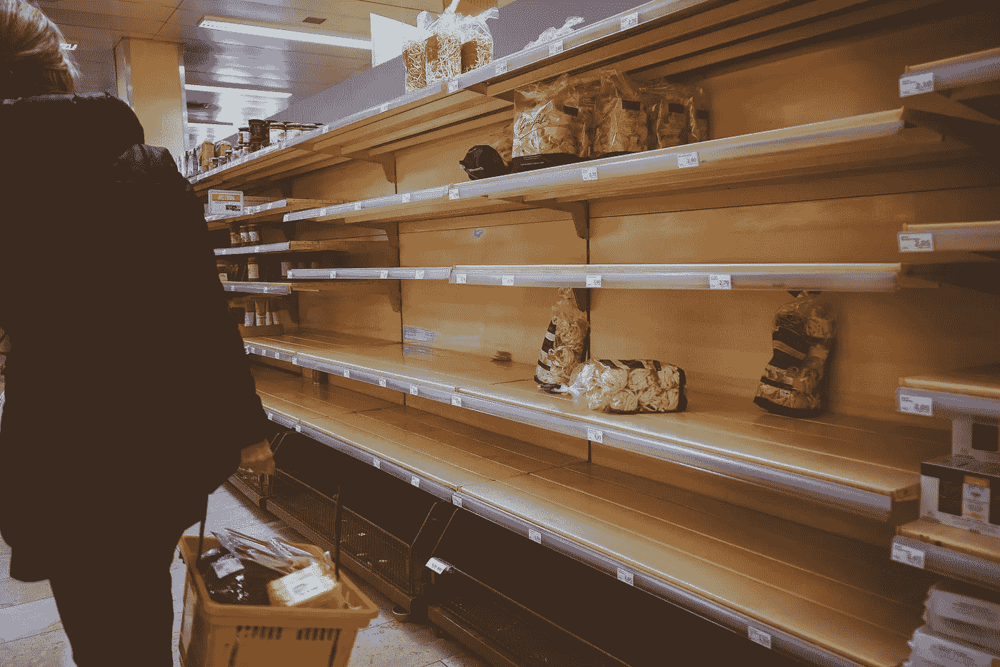
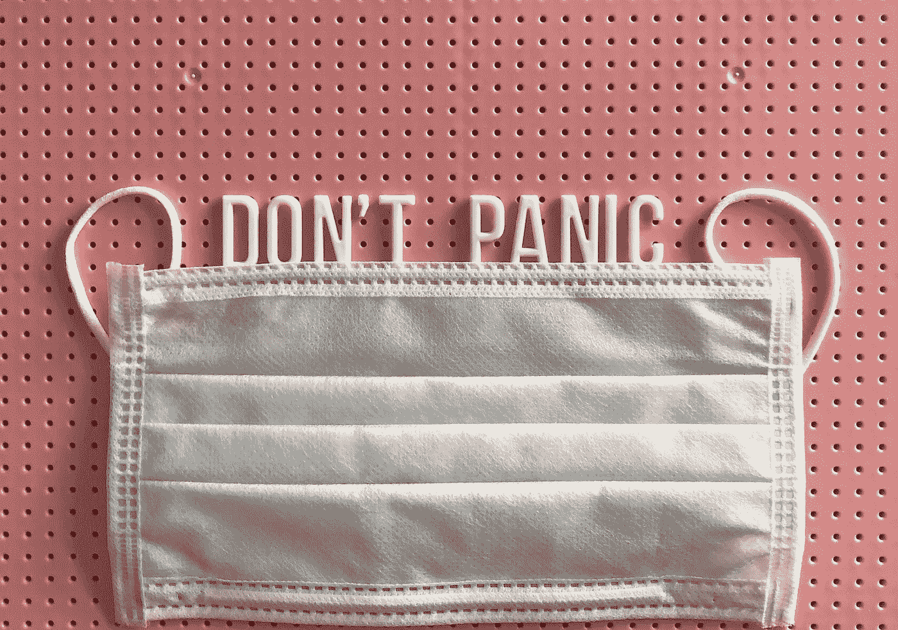

# 面对全球[病毒|疫情|营销机会|世界末日的催化剂]，你能做的最好的事情是什么

> 原文：<https://medium.datadriveninvestor.com/what-is-the-best-thing-you-can-do-in-the-face-of-a-global-virus-pandemic-marketing-5fbf6e5073b8?source=collection_archive---------21----------------------->

## 冠状病毒的影响远远超出了病毒本身。它在哪里结束，对此我们能做的最好的事情是什么

Photo by [Micheile Henderson](https://unsplash.com/@micheile?utm_source=unsplash&utm_medium=referral&utm_content=creditCopyText) on [Unsplash](https://unsplash.com/s/photos/coronavirus?utm_source=unsplash&utm_medium=referral&utm_content=creditCopyText)

自从新冠肺炎零号病人被确诊以来，整整四个月过去了。从病毒变异，到疫情，到营销机会(说真的！)到现在看来是全球崩溃和普遍恐慌的催化剂。

## 病毒还是疫情？

新冠肺炎最初是一种病毒，被认为起源于蝙蝠，传播给其他物种，然后传播给人类。这不是第一次 T2 病跨物种传播了。冠状病毒的不同之处在于它传播的速度，部分原因是它的[潜伏期长(长达 14 天)](https://www.healthline.com/health/coronavirus-incubation-period)以及症状的平庸性，这在大多数人身上就像普通感冒一样。

 [## 为什么包容性财富指数比 GDP 更能衡量社会进步？|数据驱动…

### 你不需要成为一个经济奇才或金融大师就能知道 GDP 的定义。即使你从未拿过 ECON 奖…

www.datadriveninvestor.com](https://www.datadriveninvestor.com/2019/03/08/why-inclusive-wealth-index-is-a-better-measure-of-societal-progress-than-gdp/) 

冠状病毒之所以成为疫情，是因为它已经在世界范围内传播——这是疫情的字面定义。有趣的是，疫情的定义不包括季节性流感，冠状病毒是它的近亲。以年度为基础，冠状病毒的致命性比[车祸](https://www.asirt.org/safe-travel/road-safety-facts/)、[谋杀](https://ourworldindata.org/homicides)、[蚊子致死](https://blogs.unimelb.edu.au/sciencecommunication/2019/10/08/natures-biggest-killer-the-mosquito/)和[马致死](https://www.aihw.gov.au/getmedia/b79fc4f1-a447-4e6f-ab76-d5257f4b738f/bulletin24.pdf.aspx?inline=true)低几个数量级。

*我们能做什么来阻止病毒:*洗手，吃健康的食物，晒晒太阳，做做运动——换句话说，**做你平时应该做的事情**。

我们能做些什么来阻止疫情:最明智的想法是给这个星球上的每个人两周的带薪假期和一张在家工作的通行证。虽然这听起来很荒谬，但关闭世界两周的假期将比股票市场的[损失](https://www.nytimes.com/2020/03/05/business/stock-market-covid-19.html)、[数百万投入刺激方案的](https://www.theguardian.com/world/2020/mar/16/australian-government-signals-second-round-of-stimulus-as-market-tumbles-97)和[数十亿流入“战斗”](https://www.livescience.com/coronavirus-national-emergency-us.html)的成本更低。不幸的是，世界不太可能关闭，所以最好的办法是(如果你可以，你很可能可以)**呆在家里两周。**

## 营销机会？

有一点我可以肯定，冠状病毒不应该是一个营销机会。像我一样，如果你是人类，你的收件箱将会塞满关心和安慰的邮件，这些邮件来自随机的公司，承诺“尽我们所能帮助你度过这个困难时期”。我不确定这意味着什么，因为没有一个来自 Lululemon 的人来敲我的门，提供用抗菌湿巾擦拭坚硬表面的服务。我 20 年的银行同情地提醒我，他们正在“实施技术来为我服务”,但还没有提供我在上周交易中损失的 35%的小费。

冠状病毒，病毒或疫情，是一个肤浅的理由来达到你的营销线索数据库。“新冠肺炎保持安全”电子邮件的公开价格不会增加您的季度收入。

*营销团队能做什么* : **停止通过电子邮件发送**毫不掩饰的令人担忧的营销信息。

## **大决战的催化剂？**

我们的想象力为源于全球流行病的恐惧做好了准备。[传染病](https://en.wikipedia.org/wiki/Contagion_(2011_film))、[同行](https://en.wikipedia.org/wiki/Counterpart_(TV_series))、[每日头条](https://www.straitstimes.com/singapore/morning-briefing-top-stories-from-the-straits-times-on-march-17)和[谷歌甲骨文](https://trends.google.com/trends/story/US_cu_4Rjdh3ABAABMHM_en)都在讲述同一个故事:**恐慌**。市场在下跌，航班在结束，人们在家工作，[卫生纸快用完了](https://medium.com/@annaharrison/hoard-cash-not-toilet-paper-1c14edfd7636)。上周，澳大利亚超市里光秃秃的货架让我回想起上世纪 80 年代的共产主义波兰。

Photo by [Boris Dunand](https://unsplash.com/@borisdunand?utm_source=unsplash&utm_medium=referral&utm_content=creditCopyText) on [Unsplash](https://unsplash.com/s/photos/coronavirus?utm_source=unsplash&utm_medium=referral&utm_content=creditCopyText)

**我们没有做我们能做的事情**——呆在家里洗手— **我们被全球恐慌的浪潮所欺骗**。出售股票，囤积我们不需要的东西，担心，紧张。恐慌降低了我们的免疫系统，使我们更容易受到任何类型的感染。我们沉迷于此，把我们通常很低的参与度和工作效率降低到更低，同时告诉自己我们“不能”关闭业务几周或休假。作为企业，我们感到恐慌——我们削减成本，终止与我们赖以生存的公司的合同。恐慌引发的连锁反应变成了自我实现的预言。

昨天我听到了一个关于企业的故事。该公司雇佣了大约 100 名员工，为两家主要客户服务，而这两家客户恰好是航空公司。航班减少，航空公司通过削减合同来应对。像这样的反应性的问题是它有深远的影响——对一家航空公司来说，它是平衡一个电子表格。对小企业来说，这是生命线。对在那里工作的人来说，这就是生活。

> 在刺激和反应之间有一个空间。在那个空间里，我们有能力选择我们的反应

长时间、大范围的恐慌不是找到解决方案的策略。压力和创造力之间的联系是众所周知的——我们的基本生物线路给了我们恐慌或创造 T2 的机会，但不能同时出现这两种情况。在全球性危机的时候，比如病毒爆发， [**我们能做的最好的事情就是什么都不做**](https://www.madfientist.com/coronavirus-market-crash/) 。关掉你的电视，停止压力，照顾好你和你家人的健康。计划外休假，减轻雇主和自己的压力。不要贱卖你所有的股份。

停止反应性恐慌的循环。

*怎么办* : **没事**。在一个全球疫情的时代，挑战自己保持安静，不要做出反应，不要被无益的恐慌浪潮席卷。

Photo by [Captionery](https://unsplash.com/@captionery?utm_source=unsplash&utm_medium=referral&utm_content=creditCopyText) on [Unsplash](https://unsplash.com/s/photos/coronavirus?utm_source=unsplash&utm_medium=referral&utm_content=creditCopyText)