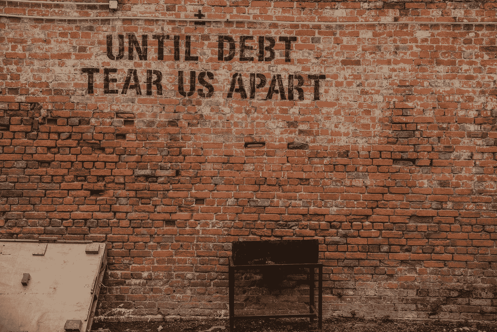

# 还清债务最好的方法是什么？

> 原文：<https://medium.datadriveninvestor.com/what-is-the-best-way-to-pay-off-debt-e4bd53aa4cf?source=collection_archive---------0----------------------->

## 流行方法之间的比较

Photo by [Alice Pasqual](https://unsplash.com/@stri_khedonia?utm_source=medium&utm_medium=referral) on [Unsplash](https://unsplash.com?utm_source=medium&utm_medium=referral)

如果你对个人理财感兴趣，你可能听说过戴夫·拉姆齐。

如果你不知道他是谁，只知道他是一个金融大师，教普通人如何管理他们的财务，而且他非常擅长这个。

在拉姆齐先生出版的许多作品中，“婴儿的 7 个步骤”是最受债务缠身的人欢迎的指南。它提出了一个简单、易于遵循的计划，建立了一个财务基础，使债务能够迅速还清。

# 学习走路

在指南中，这 7 个小步骤利用了一种强大的偿还债务的方法，这种方法被称为**债务雪球**。

简而言之，你支付你累积的每笔债务的最低金额，将所有额外的资金用于偿还最小的债务，然后将你支付给最小债务的钱转移到第二小债务。这种情况一直持续到你还清所有欠款。随着你开始偿还更多的债务，你为大额账单支付的金额将会更高。

 [## 外汇投资如何帮助偿还债务|数据驱动的投资者

### 外汇是对外汇市场的投资，不同国家的货币在外汇市场上进行兑换

www.datadriveninvestor.com](https://www.datadriveninvestor.com/2019/02/13/how-forex-investment-helps-to-repay-your-debts/) 

这听起来很棒，对吧？嗯，它可能会，直到你听说你遵循这种方法额外出血。

当你把所有额外的钱都用来偿还你的小债务时，你欠的大债务仍然会在本金的基础上产生大量的利息——这意味着你没有首先消除那一大块债务会损失现金。

因此，尽管**戴夫·拉姆齐**教授的方法不是最好的，但重要的是要记住，每个债务计划都有其不利的一面。

不过，债务滚雪球仍然是摆脱困境的好方法。毕竟流行是有原因的！

然而，还有什么其他还债计划来摆脱债务呢？

# 债务雪崩

一个更有数学依据的债务偿还计划是债务雪崩。

和上面说的债务雪球很像。你将每月支付每张账单的最低金额，并把你能筹集到的所有额外现金用于一笔债务，以帮助你更快地还清。

然而，债务雪崩不是像债务雪球那样首先攻击余额较小的债务账户，而是集中在具有最高利率的债务上。这将使你的总利息支付更低，比滚雪球法更快地让你摆脱债务。

## 一个例子

让我们假设你有以下债务:

*   10%利息的 5000 美元个人贷款
*   利率为 12%的 15，000 美元汽车贷款
*   利率为 25%的 10，000 美元信用卡债务

用债务雪崩法，你会先处理信用卡债务。如果任其发展，在一年的时间里，债务将产生极高的利息。呀！这可不是可以扔在一边的零钱。

通过首先摆脱高利率的信用卡债务，你切断了来自吸血利率的额外漏洞，从长远来看节省了更多的钱。只要你坚持这个计划，债务雪崩会减少你负债的时间。

## 不利之处

不幸的是，使用雪崩方法也有缺点。

第一个也是最普遍的问题是，需要更长的时间才能看到结果。因为这种方法只关注利率而不是平衡，所以在你赢得第一次胜利之前可能需要时间。

另一个问题是这个计划需要高度的纪律性。雪崩方法需要持续的支付才能奏效。如果你拖欠债务的最低还款额，这个计划将会失败，你将会花更多的钱，并在更长的时间内负债。

雪崩法*难。但是如果你设法保持自律并坚持下去，你会实现这个计划所提供的一切。*

# 债务滚雪球

在本文的顶部，我们已经讨论了雪球。

你开始积极攻击余额最低的账户，一旦还清，你就把钱转移到第二低的账户。这个过程会一直持续到你还清债务。

让我们以上面的例子为例:

*   10%利息的 5000 美元个人贷款
*   利率为 12%的 15，000 美元汽车贷款
*   利率为 25%的 10，000 美元信用卡债务

用债务滚雪球法，你会找到余额最小的账户，先投资还清，忽略利率。在这种情况下，个人贷款的余额最小，所以所有额外的现金都要用来偿还。

但是，我们也说过，滚雪球会让你亏损，因为你忽略了你所有账户的利率。缺乏对利息的考虑会导致你慢慢地失血，因为你将为那些高息账户的本金支付更少的钱。

在上面的例子中，你将首先关注个人贷款。忽视信用卡极高的利率，你就放弃了一年中大量的钱，这些钱进入了信用卡公司的口袋，而不是本金。

## 那么为什么要用雪球呢？

尽管滚雪球似乎不是偿还债务最数学合理的方案，但它无疑是最受欢迎的。

首先，它更快地提供了 **胜利**的**感觉。通过先处理小额债务，你会比用雪崩法更快收到更少的账单。这不仅让人感觉更好，而且还能保持更高的动力水平，并有助于成功偿还债务。**

雪球也导致动量的增加。通过还清多项账单，腾出大量现金来偿还最大的债务，你会*觉得自己完成了更多。*

引用戴夫·拉姆齐关于债务雪球的博文:

> *“债务滚雪球之所以奏效，是因为这都是关于* ***行为修正*** *，而不是数学。归根结底，希望与这个等式的关系比数学更大。”*

雪球的优势是心理上的。这是一个容易执行的计划。

# 债务合并

这种方法名声不好，尤其是在个人理财领域。

如果你不小心的话，你可能会因为合并债务而越陷越深。

债务合并背后的想法是，你拿出一笔贷款。然后你会用这笔贷款来偿还你可能欠的其他债务，留下债务合并贷款作为你唯一的未偿债务。这有可能让你重组账单，降低利率。

## 什么时候债务合并是一个好主意？

有限的人可以从合并债务中受益，但对那些可以帮助的人来说，这可能是一项伟大的投资。

通常，您会希望:

*   不要将大部分收入用于偿还债务
*   有足够好的信用资格获得低利率的整合贷款
*   制定一个计划，一旦债务还清，就远离债务

## 什么时候是个坏主意？

债务整合不是免罪卡。如果出现以下情况，将无济于事:

*   你有一小笔未偿债务。甚至不要担心你是否能在一年内还清目前的债务，因为你几乎什么也攒不下
*   你有不良信用。你会花更多的钱，因为你没有资格申请低息贷款
*   你被债务压垮了

## 个人贷款呢？

办理个人贷款来巩固债务怎么样？

一般来说，它遵循相同的原则。

个人贷款可以是另一种债务整合策略，如果你有足够好的信用，让银行以合理的利率贷款给你适量的现金。

然而，作为一个正常的债务合并贷款，这不是一个包罗万象的答案。如果你有一个极端数额的债务，个人贷款将非常难以获得。如果你设法找人借钱给你，利率会很高，从长远来看，你最终会支付更多的钱。

# 债务糟透了

尽管偿还债务并不有趣，但却极其重要。

记住:没有什么比不欠任何人任何东西的自由感觉更好的了！