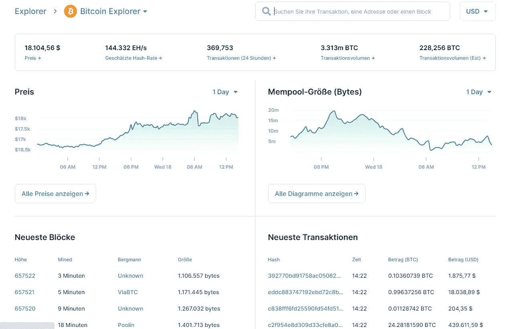
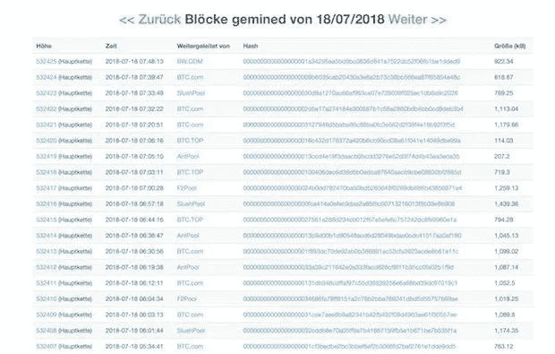

# 什么是区块链区块浏览器，为什么它如此重要

> 原文：<https://medium.datadriveninvestor.com/what-is-the-blockchain-block-explorer-and-why-it-is-so-important-cd449e5daf07?source=collection_archive---------7----------------------->

许多人从他们的家用电脑上熟悉资源管理器这个术语。区块链块浏览器或区块链浏览器是它的加密对应。然而，许多人甚至不知道这种浏览器的特殊功能，因为它可以做的不仅仅是文档事务。

# 区块链 Block Explorer 简要说明

区块链浏览器通常称为街区浏览器，是一个允许用户浏览区块链街区的网站或程序。因此，它相当于计算机资源管理器中列出的文件夹和文件。几乎所有常见的加密货币都有自己的 Block Explorer。用户只能使用也适用于该平台的块浏览器。例如，这意味着比特币浏览器不能显示以太坊交易。因此，必须使用以太坊浏览器。第一个比特币探索者于 2010 年 11 月推出。

 [## 硬叉确认:比特币现金会发生什么？

### 前天再次被叉在比特币现金上。它来到了区块链的分裂，但它不是…

medium.com](https://medium.com/coinmonks/hard-fork-confirmed-what-happens-at-bitcoin-cash-60917f1e064f) 

# 块资源管理器能做什么？

区块链上的事务和节点数(什么是区块链？)变得越来越复杂，越来越难以理解。街区探索者可以帮助把光明带进黑暗。许多用户在这样的浏览器上跟踪他们最近的交易，以查看付款是否已经到达。但是块管理器有更多的功能:

**Block Feed:** 通过 Block Explorer，用户可以实时关注新数据块添加到区块链的情况。资源管理器会列出这些信息，通常会给出时间和许多其他信息，例如块高度、块哈希、包含的事务、令牌中的块输出、事务费用以及矿商或矿池的名称。

**交易馈送:**用户可以使用浏览器浏览和跟踪每个区块的交易。

**特定地址历史:**用户还可以跟踪特定钱包地址的交易历史。只要知道公共地址。这使得检查所有以前的交易和当前账户余额变得容易。
用数字评估:许多探索者评估事务和块并指出它们。例如，可以显示一天中最大的交易，或者一天中总共有多少个块，等等。
双重问题和孤立块:一些更高级的浏览器可以显示在过去的 10 分钟内发生了多少次双重花费，并显示当前存在多少孤立块。

**Mempool:** 所谓 Mempool，是用来收集尚未确认的交易，并分组到块中。这些也可以在资源管理器中显示。为此，通常会为某些提供商显示额外信息，如交易费率、费用、数据大小和全球分布。

**创世纪地块:**创世纪地块是区块链的第一个地块。该块也可以用块管理器显示。日期、时间和矿工等信息

 [## 近距离协议——可扩展性的再思考

### 可伸缩性、用户和开发者焦点:NEAR 应该是现代互联网的基础

medium.com](https://medium.com/coinmonks/the-near-protocol-scalability-rethought-d39b13538eb3) 

# 谁使用块浏览器，为什么？

一般来说，每个人都可以并且应该使用这样的浏览器。初学者和高级用户可以获得许多关于各自区块链的有趣信息。用户可以跟踪他们的交易。探索者对采矿者也很重要，因为他们向他们展示了开采的最后一个区块，以及其中包含的交易、支付的费用等等。这些信息可以用来计算可能的利润率，并可以得出许多其他结论。

explorer 非常重要，因为它实现了开源区块链技术的一个核心特性:透明性！在资源管理器中记录块及其包含的事务创建了每个人都可以访问的清晰且不可更改的文档。

我在每月一期的[时事通讯中分享了更多私密的想法，你可以在这里查看](https://mailchi.mp/bf8f8e8ed697/keep-in-touch-with-lukas)。请在评论中告诉我，并在各种社交媒体平台上加入我:

[推特](https://twitter.com/WiesfleckerL) ● [Instagram](https://www.instagram.com/lukaswiesflecker/) ● [脸书](https://www.facebook.com/lukaswiesfleckerr)●[Snapchat](https://www.snapchat.com/add/luggooo)●[LinkedIn](https://www.linkedin.com/in/lukas-wiesflecker-1b11251a5/)

无论你做什么，都要带着爱和激情去做！