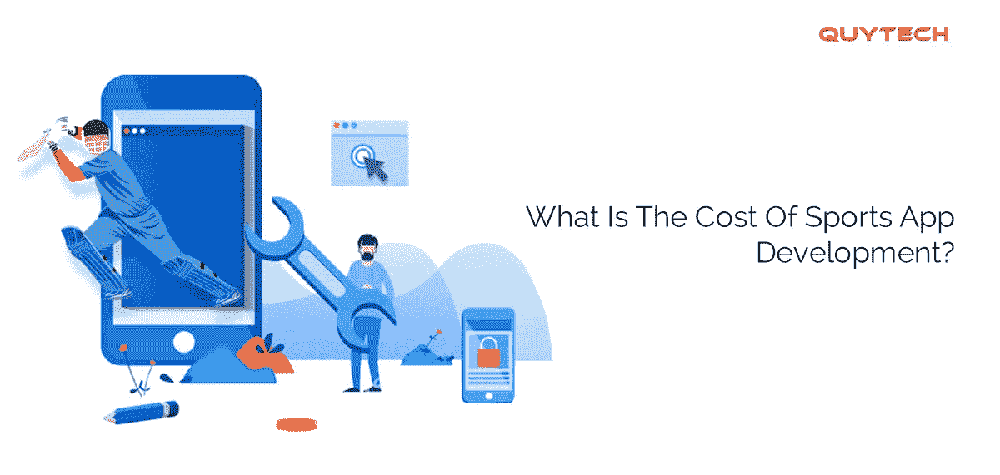
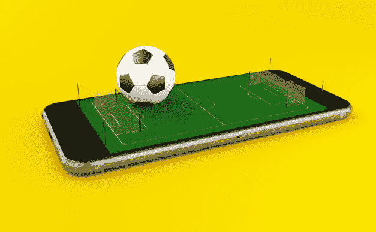
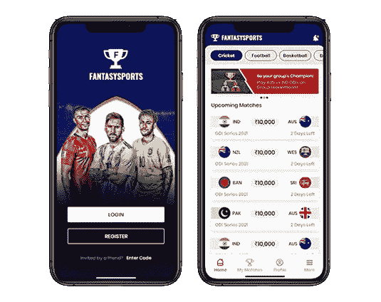
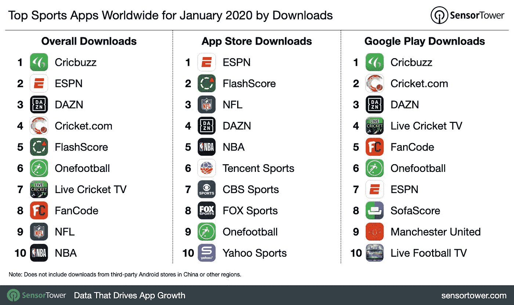
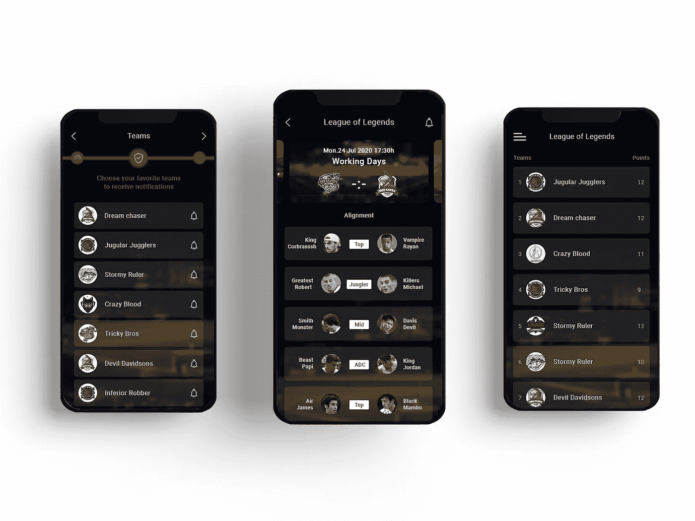

# 开发一个运动 App 要多少钱？

> 原文：<https://medium.datadriveninvestor.com/what-is-the-cost-of-sports-app-development-1e1effcf53dc?source=collection_archive---------12----------------------->

Sports App Development

随着网络体育的日益普及，体育移动应用的需求也在不断增加。如果你也计划开发一个运动应用程序，并且想知道它要花多少钱，那么这篇文章是专门为你准备的。考虑到我们在网上进行的各种调查，你可能需要为开发一个体育手机应用支付大约**20，000 美元到**5，000，000 美元。

然而， [**体育 app 开发**](https://www.quytech.com/sports-app-development.php) **成本**可能会因以下因素而异:

**1。** **你要发布 app 的平台**

为 Android 平台和 iOS 平台构建一个运动或任何其他应用程序的成本是不一样的。所以，你要决定你的 app 要选择哪个平台。如今，用户更喜欢可以从多种设备和操作系统访问的应用程序。因此，您可以考虑构建一个跨平台的应用程序，但这会增加开发的总成本。

**2。** **体育应用的特性**

注册/签约、社交媒体集成、应用内聊天、讨论、推荐和赚取、与可穿戴设备的集成、门票预订和搜索栏是体育应用的一些基本功能。万一，如果你想增加高级功能，那么你将不得不为此支付一点额外的费用。原因很简单，要添加这些额外的功能，你需要更有经验的开发人员，他们会比有几年经验的开发人员收费更高。

**3。** **UI/UX 设计**

source: [https://www.freepik.com/](https://www.freepik.com/)

应用的设计是用户遇到的第一件事。即使你的应用充满了激动人心的世界级功能，如果设计没有吸引力，它也可能会被拒绝。在计算体育应用程序开发的预计成本时，UI/UX 设计也是一个主要考虑因素。

**4。**app 的复杂程度

复杂性包括特性和你想要的目标受众。如果你想为全球用户推出你的应用程序，那么你必须集成专门的功能，这将增加应用程序的复杂性和成本。

**5。** **体育 app 开发公司的地理位置和经验**

如果你在印度雇佣 Android 开发人员或 iOS 开发人员，那么你的花费将远远低于在美国或任何其他国家雇佣同样的人员。同样，如果你选择一家有相当经验的移动应用开发公司，那么成本可能会很高。因此，在估算体育 app 开发成本时，这两个因素很重要。

**6。** **体育应用类型**

每个运动应用都不一样，开发的代价也不一样。换句话说，你不能指望移动应用程序开发服务提供商向你收取开发足球移动应用程序和梦幻体育应用程序的相同费用。这两个或任何其他体育应用程序所需的专业知识种类之间存在巨大差异。

**7。****app 开发所需的工具和技术**

移动应用程序开发领域的趋势和技术日新月异。现在，开发一个体育应用程序的价格取决于开发者使用哪些工具和技术进行开发。因此，你可以把它看作是质数因素之一。

**8。** **开发团队的规模**

很明显，如果一个体育应用程序需要两三个开发人员来开发，那么它的成本会比需要 15-20 个开发人员组成的庞大团队的成本要低。因此，开发团队的规模对于决定应用程序开发的总成本至关重要。

**9。** **项目开发所需的时间**

创建一个体育应用程序的成本还取决于开发需要多少时间。当你考虑体育应用程序开发的成本因素时，你必须记住这一点。

除了上面提到的因素，你还需要考虑其他几个因素。你选择开发的公司可能会告诉你同样的事情。

## **顶级体育应用**

看看那些不仅统治着 Play Store 和 App Store，还拥有庞大客户群的体育应用吧。探索它们的功能，然后决定你可以提供哪些额外的功能，让你的应用脱颖而出。

*   雅虎体育
*   哥伦比亚广播公司体育
*   BBC 体育
*   尿游离皮质醇
*   theScore
*   所有足球

# **如何开发一款运动应用？**

要开发体育移动应用程序，您可以联系顶级的移动应用程序开发公司。你也可以雇佣 Android 开发者或者 iOS 开发者为你打造一款运动应用。在这两种情况下，建议[查看作品集](https://www.quytech.com/portfolio.php)以了解他们的作品。此外，事先详细讨论你的要求。

在移交体育应用程序开发项目之前，另外两个重要的考虑因素是询问项目交付时间表以及他们用于与客户沟通的软件。明智地选择一家公司或开发商，让你的钱物有所值。

**底线**

想知道运动 app 开发要多少钱？阅读这篇文章，了解决定相同的因素。此外，查看体育应用开发的估计[成本](https://www.quytech.com/blog/key-features-and-development-cost-of-a-fantasy-sports-app/)。除此之外，我们还提供了流行的体育应用程序的信息，以及如何以具有成本效益的价格构建这样一个应用程序。