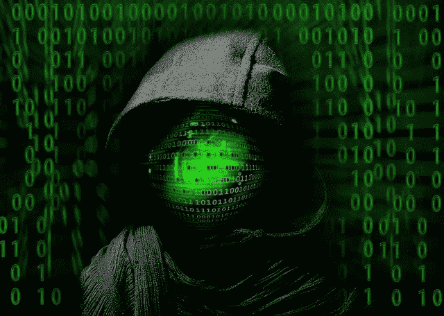
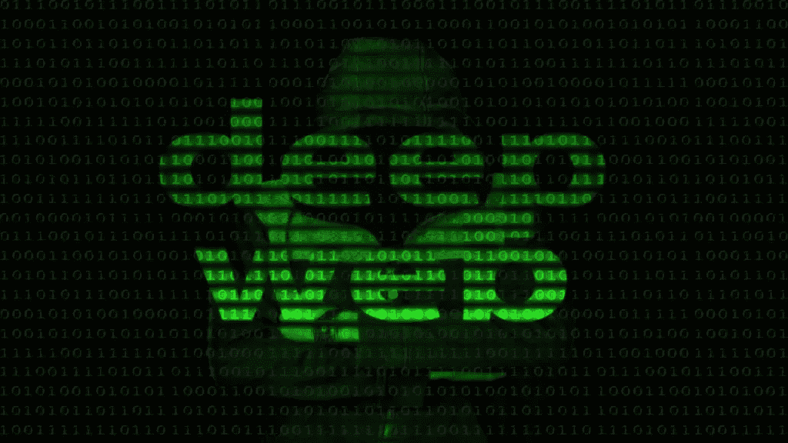

# 什么是黑暗之网？你需要知道的一切

> 原文：<https://medium.datadriveninvestor.com/what-is-the-dark-web-everything-you-need-to-know-38f85e673858?source=collection_archive---------27----------------------->

你知道在我们正常浏览和访问的网页内容之外，还有一个神秘的网站世界吗？谷歌或其他搜索引擎能找到的任何网站都是“表层网”的一部分，而表层网只占万维网的 4%。这意味着，如果把整个网络想象成一座冰山，表面的网络只是冰山的一角，其余的 96%是隐藏的！

哇…实际上？！

统计数据和观点在一定程度上有所不同，但或多或少，是的，我们浏览了不到 5%的万维网。

那么，在我们通常无法访问的网络隐藏部分中有什么呢？为什么要隐藏起来？为了了解它，我们需要理解两个术语——深度网络和黑暗网络。

## 什么是 Deep Web？

deep web 是网络中不被互联网搜索引擎索引的部分。这意味着在一般搜索查询的结果中找不到 deep web 的内容。内容就在网上，但不是任何人都能访问。

Deep web 内容对我们来说并非完全未知；我们熟悉某些类型的内容。例如，它包括私人数据库、组织的内部网、电子邮件和社交媒体帐户、个人和组织的云存储、网上银行、数字图书馆以及隐藏在防火墙后、仅限使用帐户和密码访问的其他网站。

深度网络就是前面提到的，网络中 96%隐藏的部分。除了合法的受限网站之外，它还包括可疑的和一些非法的网站和页面，这些网站和页面可以通过非常特殊的方法和/或工具进行搜索，称为“黑暗网络”,下面将详细介绍。

[这是卡巴斯基](https://www.kaspersky.com/resource-center/threats/deep-web)的一篇很好的文章，用来理解表层网络、深层网络和黑暗网络。

## 什么是黑暗之网？

黑暗之网包含在深层之网中。暗网和深网并不像普遍认为的那样是同义词。黑暗网络上的内容无法通过谷歌或必应等搜索引擎或通过知道网址来访问。它只能通过专门的浏览器和软件来访问，如 Tor、I2P、Freenet 和 Riffle。暗网被希望:

*   创建内容，不管是好的还是坏的，将其极度隐藏，只允许某些其他实体访问。
*   在他们创建和访问的网站上保持完全匿名
*   不要留下任何数字痕迹和历史
*   在通常是非法的市场上购买、出售或交易物品，交易使用比特币，因此无法追踪支付情况
*   成为此类团体、论坛或聊天室的一员，在这里讨论的观点或共享的信息具有如此敏感的性质，一旦暴露，将构成犯罪活动并受到严厉惩罚

你可以理解为什么对于一个人来说，想在某个美好的一天进入黑暗网络并创建一个账户并开始工作并不容易。

## 黑暗网站内容

并非所有黑暗网络上的内容都是非法的。有一些与政治、激进主义、新闻等相关的网站。其中讨论的主题非常敏感，需要保密，直到某个时候该小组认为适合向世界公开。

暴虐、独裁或军事政权禁止部分互联网的国家的公民，可以通过访问黑暗网络来获得一些救济和重要信息。

还有一些由政府或国家军队控制的网站或存储库，包含计划、秘密和信息，如果被另一个国家或整个世界知道，这些将是高度爆炸性的数据。

相反，黑暗网络也被告密者用来揭露他们认为公众应该知道的某些公司或政治数据和秘密。

另一方面，黑暗网络是犯罪分子、恐怖分子和反社会分子的首选平台，他们利用匿名进行非法、违法和破坏性活动。

调查和分析帮助将超过 75%的非法域名归类为市场。主导这些市场的商品包括:

*   药品和娱乐性药物
*   欺诈和被盗文档，如信用卡/借记卡、身份证件、银行账户、电子邮件账户、社交媒体账户
*   单独或集体出售数据或服务的黑客
*   假冒商品交易
*   与令人不安和厌恶的行为相关的内容，如色情(尤其是儿童)、暴力和虐待。

发表在国际货币基金组织金融与发展版块的这篇文章提供了关于黑暗网络及其用途的详细信息。

## 加密货币和黑暗网络

加密货币的发明和出现给暗网市场的交易带来了好处。想象一下一种不留痕迹、不受任何政府或组织控制的交易形式！这正是黑客、罪犯和恐怖分子所需要的，他们可以谨慎地实施他们的非法行动，并达到无限的目的。

比特币在黑暗网络市场的使用最早始于丝绸之路的运作，这是一个臭名昭著的黑市，以贩卖毒品闻名。加密货币推动了丝绸之路向其他黑市商品和服务贸易的扩张；该市场于 2013 年被联邦调查局关闭，但当时它为大约 10 万名客户提供服务。

对一些人来说，黑暗网络可能是一个蓬勃发展的行业，但执法和治安机构迟早会赶上来，并能够关闭这些非法和破坏性的操作。

**这里有一些关于黑暗网络的惊人数据:**

## 这一切是如何开始的？

黑暗网络是如何形成的，以及它是如何发展成今天这个样子的，这是一个非常有趣的[故事和时间线](https://www.soscanhelp.com/blog/history-of-the-dark-web)。非法在线交易的种子在 20 世纪 70 年代初就已经播下。那是 40 年前，那时互联网还没有诞生！

所以，这是一个逐渐形成的想法，而不仅仅是一个突然进入某人脑海并在一夜之间生根发芽的想法。

基本上，我们必须回到 20 世纪 60 年代，第一个计算机网络 ARPANET 建立的时候。阿帕网扩展到高级研究计划局网络:当时，这是一个由美国国防部下属机构承担的实验项目。

国防部一直想要一个受保护的加密网络来保持其部门和间谍之间的匿名和不可追踪的通信和消息传递(听起来很熟悉吧？);此外，网络没有中央核心，因此他们不必担心敌人会破坏核心通信。

几年后，在 1983 年，创始人将 ARPANET 一分为二——一部分是 MILNET(军事网络),继续为军事和国防部门所用——另一部分仍然是 ARPANET，但对研究人员、大学等开放。去实验。这后来就成了民用版，也就是互联网。

快进到 2002 年，当 [Tor(洋葱路由器)](https://en.wikipedia.org/wiki/Tor_(anonymity_network))向全世界发布的时候。它提供的高度加密和匿名性使其成为一个有利可图的非法活动平台，黑暗网络的想法开始迅速发展。

## 在访问黑暗网络之前需要注意什么

黑暗网络通过加密提供匿名。虽然使用 Tor 和访问黑暗网络并不违法，但它为接触非法网站和活动打开了方便之门。这不是一个安全的地方，不能相信任何人。以下是人们在考虑访问黑暗网络之前必须考虑的一些重要方面。

*   犯罪意图在黑暗网络上猖獗。犯罪分子可能试图利用一个人，而黑客则不断试图窃取信息。访问者或新用户很容易成为目标。
*   虽然一个人仍然是匿名的，但他们确实需要非常小心地透露多少关于他们自己的信息(例如，在聊天室)或他们访问的网站和/或在黑暗网络中注册的网站。
*   执法机构也在匿名的掩护下使用暗网。他们不断追踪罪犯和参与非法活动的人。
*   如果一个人在黑暗网络上的活动被发现可疑，无论是有意还是无意，他都可能被起诉、罚款，甚至入狱几年。
*   在参与黑暗网络市场的任何活动之前，请记住，这些活动大多与非法和违法物品的交易有关。
*   黑暗网络上的许多内容是露骨的、有害的、令人作呕的。不容易脱离自己或忘记他们所看到或遇到的，即使只是浏览和探索的一部分。有些事情会给人留下终生的创伤。

这一部分并不意味着一个官方的信息或权威来建议一个人是否应该访问黑暗网络；只是呼吁一个人在冒险之前应该权衡所有的选择，考虑可能的结果。

无论您是否决定查看黑暗网络，您的信息安全始终是最重要的。您需要对共享个人信息保持警惕，并采取适当的措施来保护和防止您的数据或身份被盗。

如果你是一家企业，你必须采用并实施严格的网络安全策略。您还应该通过中立和公正的第三方对您的 IT 环境和信息安全措施的有效性进行定期评估。[立即与我们合作](https://securetriad.io/contact/)讨论您的需求，并获得对您 IT 环境的独立详细评估。

*原载于 2021 年 2 月 11 日*[*https://securetriad . io*](https://securetriad.io/the-dark-web/)*。*