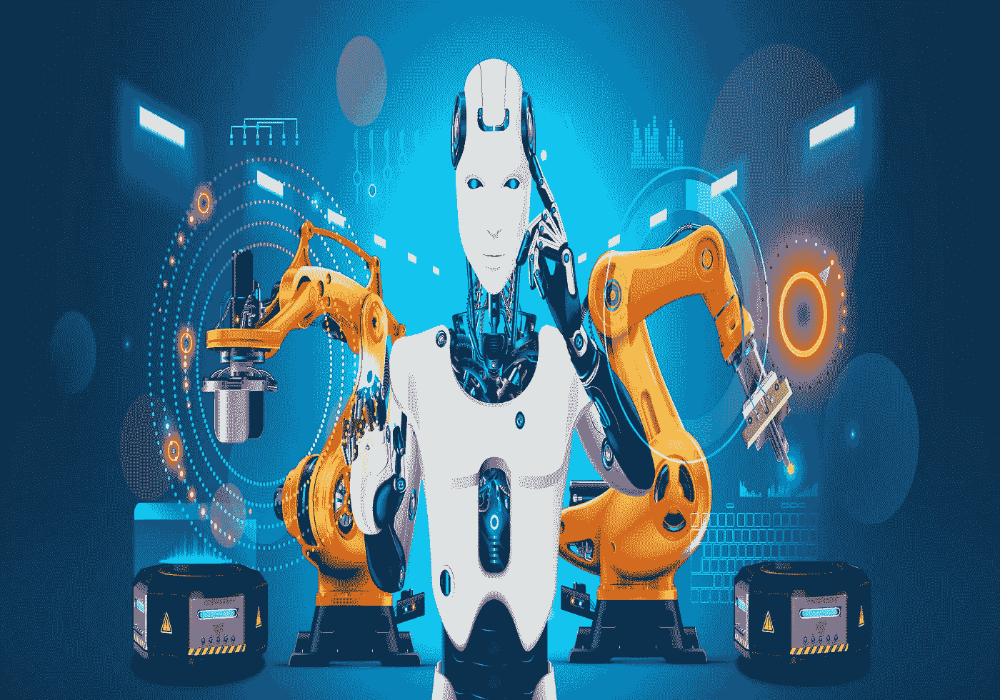
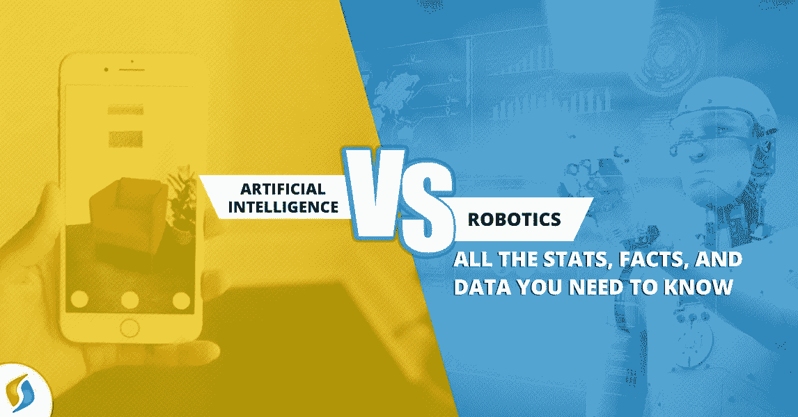

# AI 和机器人有什么区别？

> 原文：<https://medium.datadriveninvestor.com/what-is-the-difference-between-ai-and-robotics-5df886bde092?source=collection_archive---------24----------------------->

## 人工智能和机器人技术

[source](https://acim.nidec.com/motors/motion-control/industries/robotics)

人工智能是计算机科学的一个领域，它帮助我们开发能够自我学习的计算机程序。你可以输入数据，它们也可以从数据中学习，或者你可以使用传感器或输入到算法中，它们可以自我学习。

在机器人学领域，工程基本上专注于建造操作机器人。所以可以自主做事的机械工具。我们在制造业中已经看到这种情况很长时间了，我们有工具可以让我们注册制造汽车，我们也知道它有多先进，几乎可以做任何事情。这就是机器人技术和人工智能之间的重叠之处，我们可以将人工智能和机器人技术结合起来。机器人是身体，人工智能是大脑。所以，如果你想一想，过去我们有像造汽车这样的机器人，但它们是愚蠢的机器人，它们被编程为挑选一些东西并把一些东西拧进它们的汽车里，给汽车装上轮子，喷漆，汽车，但它不能智能地做出决定。现在我们可以给机器人一个传感器，我们可以给这些机器人一些东西，像充当它们眼睛的照相机，我们把两个智能作为大脑加入这个等式，突然你就有了一个人工智能机器人。这就是最近机器人技术的所有进步，如果你最近想到无人机，作为一个机器人的例子，有大脑的人工智能使这个机器人能够自主飞行。我们现在又有了自动驾驶汽车，它结合了机器人技术、大脑和人工智能。

一个很好的例子是机器人最近采摘树莓，基本上在过去机器人不可能采摘树莓，你只需要想想每一丛灌木看起来都不同，树莓的位置也不同，如何轻轻地采摘它，人们基本上认为你需要灵巧的人来做这件事。然而，通过结合人工智能和机器人技术，你可以做到这一点。现在你有了一个覆盆子采摘机器人，它使用机器视觉，所以一个摄像头来检测覆盆子在哪里，然后使用一个带有很多传感器的机械臂来完美地采摘覆盆子，不要太用力，然后把它放在篮子里，这是一个很好的例子，说明了自主机器人已经走了多远，基本上我们现在也有了这种强化学习的能力，所以不是给机器提供大量数据来识别覆盆子，而是让机器通过经验来学习。所以现在我们可以使用强化学习，这几乎是通过经验学习。所以我最近看到了一个机器人，它基本上监控环境，自己学习开始行走，每次失败都加强了一个学习点，每次成功都是成功的一步，例如机器人没有摔倒，它们注册它，所以现在你得到了这种自我延续的学习循环，机器人也可以像婴儿一样学习说话和行走，这是人工智能和机器人学结合的最新进展。

## 概述

[SOURCE](https://medium.com/datadriveninvestor/artificial-intelligence-vs-robotics-all-the-facts-you-need-to-know-1079e01e05e2)

概括地说，人工智能和机器人并不相同，人工智能是关于数据科学是关于能自我学习的计算机程序，机器人是关于能做自主事情的机器，但通过将它们与人工智能结合起来，机器人成为大脑，你可以实现惊人的事情。

**进入专家视图—** [**订阅 DDI 英特尔**](https://datadriveninvestor.com/ddi-intel)