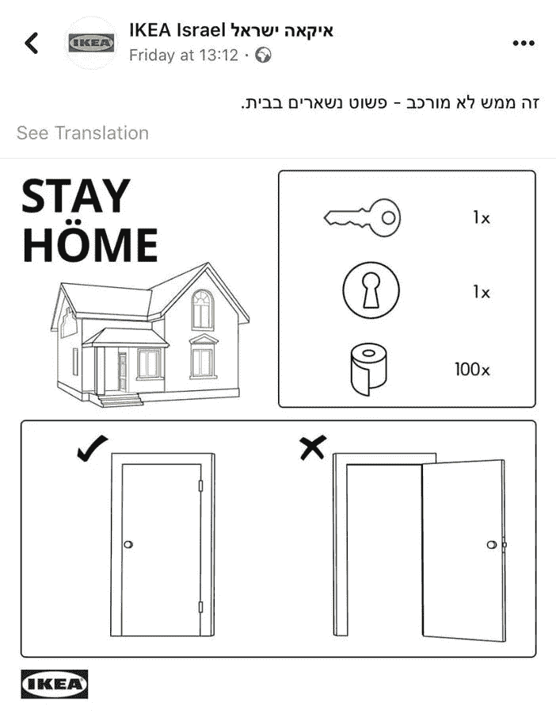

# 你能讲的最伟大的故事是什么？

> 原文：<https://medium.datadriveninvestor.com/what-is-the-greatest-tale-you-can-tell-e68ff19e4e84?source=collection_archive---------9----------------------->

## 当品牌在压力下分享他们的故事时，他们会大放异彩

Photo by Nong Vang on Unsplash

从现在开始，当被问及他是如何在世界经济急刹车的时候幸存下来的时候，[兵营奥尼扬戈](https://twitter.com/barryonyango/)将会有一个精彩的故事要讲。那是他的专长。

这位数字战略家重视拥有一个清晰的故事并阐明它，从他喜欢称之为“善意银行”的存款中获取利益。

奥尼扬戈[作为](https://www.datadriveninvestor.com/2019/01/30/humanizing-triumphs-over-digital-marketing/) [Sparks Corporates](https://twitter.com/Sparks_Corp) 的联合创始人，过着传奇的生活，这是一家提供全方位服务的品牌管理、传播、数字营销和培训机构。在一次[非洲推特聊天中](https://twitter.com/AfricaTweetChat)，他分享了品牌如何在每个人都有压力的情况下讲述他们的故事的金块。

 [## 我们讲述自己最精彩的故事

### 讲故事赋予你的品牌个性

medium.com](https://medium.com/datadriveninvestor/we-tell-our-own-best-stories-8a07ec5ab760) 

最重要的是，讲述你所做的事情。清楚地表明你是有空的——不管是不是疫情。那么人们就不会认为你在危机中获利了。

“虽然你应该隔离自己，但不要隔离你的品牌，”奥尼扬戈说。“以前有人说过，我再说一遍:内容为王。专注于你正在制作的内容。让它信息化、娱乐化，最重要的是，让它人性化。

“品牌应该分享他们业务中真正发生的幕后见解——以及他们如何解决关键问题——并根据他们的使命帮助他们的供应商和社区，”他说。

公司通过向外发光来获利。

奥尼扬戈说:“你的另一个策略可以是创造内容来推广他人的服务。”“通过这种方式，你的消费者将会确信，尽管你在经营一家企业，但你并没有脱离现实。

“承认世界各地的人们都在受苦受难，他们需要帮助，”他说。

公司的讲故事计划应该源于考虑到危机的战略。接下来的问题是转移到 B 计划，而不是必须快速思考，在企业产生的信息中显得笨拙和随意。

# **从自动驾驶转换**

如果你已经[自动化内容](https://blog.markgrowth.com/dont-take-it-personal-if-you-overdo-automation-1f9fc5534f5c?source=friends_link&sk=929cc45f379f58190b05f80799dc0083)，也许可以放松一下——至少确保计划发布的内容不会让你看起来麻木不仁。

“首先，问问自己，‘在这段时间里，我希望自己因什么而出名？’”奥尼扬戈说人们会记得你现在给他们的感觉，无论是积极的还是消极的。换位思考是关键。

“不要五音不全，疏远他人，”他说。“最近几乎每个人都在担心一些事情。问问你自己，你发出了正确的信息吗？你可能需要改变你的品牌信息，以适应这种“新常态”"

 [## 超级营销从一个故事开始

### 观点通过来回的对话而改变

blog.markgrowth.com](https://blog.markgrowth.com/supercharged-marketing-starts-with-a-story-b1b785142721) 

要自信，要负责。

奥尼扬戈说:“作为一名领导人，大声疾呼。”。“人们的情绪越来越高。一个品牌的失误可能不会那么容易被原谅或遗忘。”

以目的为导向的故事讲述会让消费者放心，公司有存在的理由。由此，企业家可以在最黑暗的时期为问题提供解决方案。

“人们要求品牌不仅能提供更好的自我，还能提供更好的社会，”奥尼扬戈说。“例如，耐克选择通过一则新广告将消费者对运动的渴望转化为拯救生命的行动号召，该广告告诫消费者‘如果你曾经……'

“在任何情况下，尤其是在危机中，消费者对品牌的核心期望是，[品牌将为其员工、供应商、客户和整个社会做正确的事情，而不考虑成本有多高，”他说。](https://www.datadriveninvestor.com/2018/10/01/is-brand-advocacy-worth-the-risk/)

品牌应该坚持反映其核心价值的内容，而不是像秃鹫一样为了自身利益在尸体上盘旋。

奥尼扬戈说:“创造目的驱动的故事的最佳实践包括教育消费者如何做出更好的消费和生活方式选择，以及激励其他商业领袖和决策者效仿。”“运动建设和伙伴关系如果来自集体的声音，也会带来更大的可信度。

“品牌应该避免*假设*，并理解文化和价值观不仅仅是由意图塑造的，”他说。“它们最终是由一个关于我们需要成为什么样的人才能成功的故事塑造的。内容有助于传达目的，而目的有助于推动内容创作、策略和实施。”

# **追求情感**

建立数字足迹的品牌应该有讲故事的计划。

Onyango 说:“情感诉求是与客户联系的最真实的方式，而故事是实现这一点的最有力的方法，”他遵循以下几点:

*   扎根现实的故事。品牌叙事必须真实，因为消费者在一英里之外就能闻到不真诚。
*   保持简单。
*   考虑你的视角。
*   建立一种感同身受的联系。

“每个品牌都有自己的故事，”奥尼扬戈说。“确保你的故事值得讲述。”

在危机期间，讲述顾客的故事以及他们是如何应对的。即使在最糟糕的时候，人们仍然喜欢看到他们的名字和他们认识的人。对于符合并支持公司信息的用户生成内容来说，这可能是一个好时机。

奥尼安戈说:“使用动画、插图、计算机生成的图像、[视觉效果](https://arvrjourney.com/get-real-and-be-sure-you-know-what-youre-doing-a1a5356edc44?source=friends_link&sk=29a4bfeba13b51771cc5c10b9db9f6b4)、运动图形、合成、库存素材、[用户生成的素材以及更多的](https://www.adweek.com/creativity/getting-creative-with-your-storytelling-when-the-world-is-on-pause/)”。

他举了宜家以色列的例子，宜家以色列在其脸书账户上发布了简单的指示:“呆在家里”，并附有一张关着的门和一卷卫生纸的图片。

品牌[与讲故事](https://medium.com/datadriveninvestor/we-tell-our-own-best-stories-8a07ec5ab760?source=friends_link&sk=c492973312b9513860c95bbd7a21669d)息息相关，不管他们周围发生了什么。

“人类的大脑是一个故事处理器，而不是逻辑处理器，”奥尼扬戈说。Origin-Hill Holliday 的研究揭示了产品故事的一些基本原理:消费者更看重产品，因此，如果附带的信息是故事形式的，他们会付更多的钱。

“故事以高度具体和情感上有影响力的方式传达信息，”他说。“它们令人难忘。它们给了我们认同和坚持的东西。统计数据告诉我们现实是什么。故事告诉我们为什么它很重要，为什么我们需要关心。”

# **变得舒适**

写得最好的内容是受欢迎的。

“通过讲故事，我们打开门，邀请人们进来，舒服地呆一会儿，”奥尼扬戈说。“我们还建立社区，而不仅仅是追随者和客户。”

一些最感人、最扣人心弦的故事讲述了失败者克服重重困难，最终取得胜利的故事。

“最伟大的工具之一是同理心，”奥尼扬戈说。"换句话说，把你自己放在顾客或观众的位置上."

 [## 那是她的故事，而且她坚持这样做

### 创意遇上内容营销讲故事

blog.markgrowth.com](https://blog.markgrowth.com/thats-her-story-and-she-s-shticking-to-it-47924f608fc6) 

他举了这些例子:

*   驾驭情感。"我能激励我的观众去采取行动吗？"
*   驱动同理心。"我能让我的听众感受到我所讲的内容或与之相关联吗？"
*   培养抱负。“我的观众渴望做什么或成为什么样的人？”

奥尼扬戈说:“勾选所有的方框，你就可以回家了。”他挑选了几个通过讲故事做到最好的品牌:

*   [耐克](https://twitter.com/Nike/)
*   [鸽子](https://twitter.com/Dove/)
*   [杜蕾斯](https://twitter.com/DurexKE/)
*   [英国宜家](https://twitter.com/IKEAUK/)

**关于作者**

吉姆·卡扎曼是拉戈金融服务公司的经理，曾在空军和联邦政府的公共事务部门工作。你可以在[推特](https://twitter.com/JKatzaman)、[脸书](https://www.facebook.com/jim.katzaman)和 [LinkedIn](https://www.linkedin.com/in/jim-katzaman-33641b21/) 上和他联系。