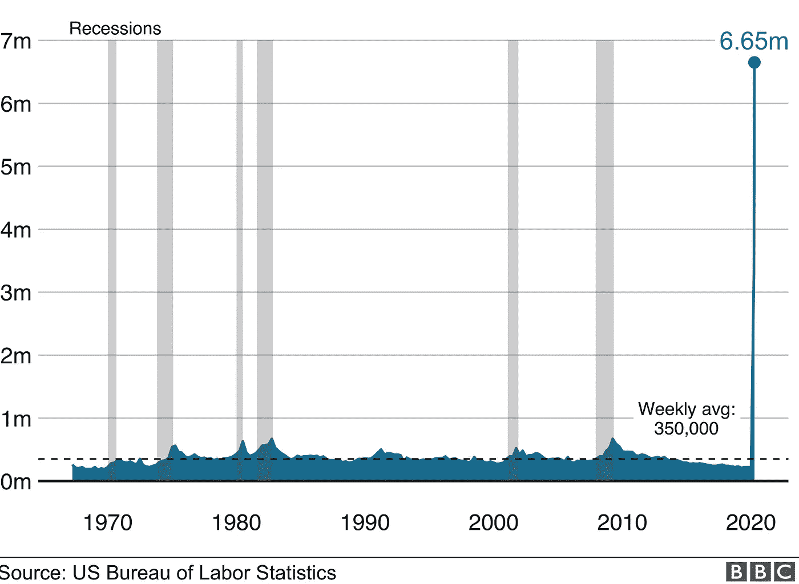
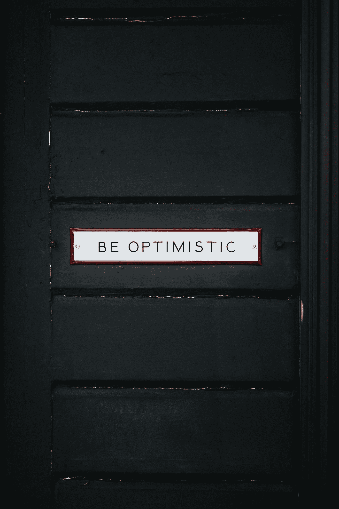

# 新冠肺炎对房地产市场有什么影响？

> 原文：<https://medium.datadriveninvestor.com/what-is-the-impact-of-covid-19-on-the-real-estate-market-d8c4410f1843?source=collection_archive---------3----------------------->

## 繁荣还是萧条

盖尔·库尔茨-迈耶斯

Photo by [Avi Waxman](https://unsplash.com/@aviosly?utm_source=medium&utm_medium=referral) on [Unsplash](https://unsplash.com?utm_source=medium&utm_medium=referral)

当我们想到在过去的一个月里，当我们适应我们的新常态时，发生了多大的变化，这是令人不安的。虽然自我隔离有它的好处(更多属于自己的时间和更好的工作生活平衡)，但它对短期经济来说并不好。目前，疫情冠状病毒没有停止的迹象，已经影响了 100 多万人，夺去了 83，000 多人的生命，并且还在继续。

随着从库存到我们的食品和卫生纸供应的一切逐渐消失，世界上许多供应链已经停止。由于投资者急于清算股票，为不确定的未来做准备，各种商品和指数中的数十亿美元消失了。因此，经济学家预测衰退会比 2009 年更严重。

房地产市场现在也感受到了冲击，以前人们认为房地产市场在政治和经济不稳定的情况下几乎是不可战胜的。不幸的是，房地产市场也不能幸免于像野火一样蔓延的流行病。

美国全国房地产经纪人协会在 3 月 16 日至 17 日进行的一项调查发现，72，734 名房地产经纪人中有 48%的人表示，由于新冠肺炎疫情的爆发，买家的兴趣急剧下降。

既然人们没有足够的收入，对房地产的需求将会放缓。官员和零售部门不太可能在短期内扭转颓势。有道理；如果没有任何收入，人们应该如何购买房产？许多房地产经纪人正在适应市场动态，提供 360 度虚拟旅游和视频漫游，而不是开放房屋。

作为社交距离努力的一部分，有远见的房地产经纪人现在使用移动应用程序和各种电子工具签署相关文件，以限制每个人的安全暴露。

 [## 使用谷歌搜索趋势预测首次申请失业救济人数|数据驱动的投资者

### 几年来，我的重点一直是使用多种替代数据来预测宏观经济统计数据…

www.datadriveninvestor.com](https://www.datadriveninvestor.com/2020/03/25/using-google-search-trends-to-predict-initial-jobless-claims/) 

尽管做出了这些让步，房地产市场还是受到了冲击。买家和卖家都暂停交易，直到危机过去。

接下来的问题不是这种新型冠状病毒是否会影响房地产市场，买家和卖家都在暂停交易，直到疫情过境，评估损害的程度。虽然在这个不确定的时期下断言还为时过早，但我们可以通过研究房地产趋势(现在和过去)来做出合理的估计，以帮助我们评估未来会发生什么。

由于许多消费者希望在 2003 年疫情非典期间减少非必要的人类接触，这意味着在疫情持续期间房地产交易损失了 33%至 72%。值得注意的是，房地产价格在此期间并没有下跌。

## 基于理论模型分析定量模式

Zillow Research 对全球流行病的经济影响进行了研究，为新冠肺炎的未来提供了更多的视角。他们得出了以下结论:

在 2003 年 SARS 和 1918 年流感爆发等流行病期间，经济活动急剧下降(占 GDP 的 5%至 10%)，但一旦疫情结束，经济活动就迅速反弹。

这种模式实际上无法与标准衰退相提并论，因为经济活动会保持 6 至 18 个月的休眠状态，然后以非常缓慢的速度复苏。

在 2003 年非典期间，香港的房地产价格没有大幅下跌。尽管如此，他们的交易量暴跌了 33%至 72%，因为人们实行自我隔离，避免不必要的旅行、公共聚会和餐馆等活动。一旦疫情结束，就不再需要它了，之前暂停的交易迅速恢复到疫情之前的趋势。

关于中国房地产市场的状况，有一些令人担忧的报道。卖方价格没有下降，但交易放缓。

几乎不可能准确预测与大流行相关的经济放缓的概率，以及这种打击如何引发标准的衰退，因为这取决于新型冠状病毒的进展。标准的衰退定义为至少连续两个季度 GDP 下降。

在标准的经济衰退期间，交易量和房地产价格可能不会一直下降(就像 2001 年的衰退那样)。

在 2020 年之前，许多经济指标都给出了今年标准衰退风险的信号。2019 年 12 月的概率为 30%，2020 年 1 月的概率为 15%，截至 3 月 1 日，这一概率已飙升至 44%。

## 过去，可再生能源市场是如何应对流行病的

在我们深入研究新冠肺炎及其对我国房地产市场的影响之前，有必要了解一下世界各经济体是如何应对 2003 年疫情非典的。这种病毒造成的死亡人数是巨大的；对经济的代价也感受很深。

当时实施的保护措施远没有我们今天在全国范围内实行的社会距离那么极端，受影响国家的卫生官员实施了严格的措施，比如不鼓励随意旅行和握手。

让我们看看加拿大的多伦多。虽然受到了严重急性呼吸系统综合症(SARS)的严重打击，但这不足以抑制经济，加拿大的国内生产总值在 2003 年进一步增长了 1340 亿加元，达到 8920 亿加元，最终在 2004 年跨过了万亿加元的门槛。此外，房地产市场没有表现出任何痛苦的迹象。

与 2003 年相比，销售量和价格都有所上升。粗略地看一下 2003 年的住房销售数据显示，销售量从 2002 年的 74，759 套上升到 2003 年的 78，898 套。在同一时间段内，销售价格也增加了 18，000 美元。

然而，冠状病毒是一种完全不同的野兽，我们可以预计在未来几个月内会有更明显的经济后果。

## 中国和香港如何应对

香港的国内生产总值略有下降，从 2002 年的 1660 亿美元下降到 2003 年的 1610 亿美元。值得一提的是，香港经济自 1997 年达到 1770 亿美元的峰值后就一直没有增长，因此将这一缺口归咎于非典疫情可能不太明智。香港的房地产租金在经历了非典时期的历史低点后也有所回升。

《城市经济学杂志》2008 年的一份报告显示，香港的房价下跌了 8%，总共损失了 2800 万美元。SARS 夺去了 300 名香港居民的生命，占全球 SARS 相关死亡人数的三分之一。

在 4 月和 5 月 SARS 爆发期间，香港的 GDP 下降了 5%至 6%左右。但是，一旦疫情平息，GDP 不仅迅速恢复，而且继续进一步增长。

中国经济从 2003 年的 1.3 万亿美元增长到 2003 年的 1.6 万亿美元，并且自 2006 年以来每年都以创纪录的速度增长。

当时和现在的区别在于，世界动员资源遏制威胁的努力奏效了。现在真正的挑战是地平线上隐约出现的不确定性将对房地产市场造成严重影响。也会导致卖家更加谨慎，采取保守的租赁策略。

## 美国房地产市场恐慌

将股市与房地产市场相提并论有点不公平。因为只有约 55%的美国人声称拥有股票([盖洛普【2019 年 4 月调查)。与 2019 年 65.1%的住房拥有率相比(由](https://news.gallup.com/poll/266807/percentage-americans-owns-stock.aspx)[统计局](https://www.statista.com/statistics/184902/homeownership-rate-in-the-us-since-2003/)估计)，你很快就会意识到事实。

Photo by [Stephen Leonardi](https://unsplash.com/@stephenleo1982?utm_source=medium&utm_medium=referral) on [Unsplash](https://unsplash.com?utm_source=medium&utm_medium=referral)

更重要的是，对大多数美国人来说，房子是一项庞大而昂贵的购买。许多人把他们的钱紧紧套在各种房地产投资上，这些投资可能会损失很多价值。一场暂时的抵押贷款危机即将来临。

就像 2007 年至 2008 年的抵押贷款危机一样，大量美国人最终可能会发现自己被抵押贷款套牢。他们在房子上欠的钱超过了房子的实际价值。例如，你可能有一个价值 400，000 美元的房子抵押贷款，而这个房子只值 300，000 美元。代表你无法偿还的 10 万美元债务。

人们越来越担心对不合规抵押贷款实施更严格的贷款条件。潜在买家感受最深——传统上，他们的债务收入比高于 45%的个体户。

失业率已经飙升至 20%之多。这样的利率堪比 20 世纪 30 年代的大萧条。从长远来看，1933 年美国的最高失业率记录为 24.9%(由[平衡](https://www.thebalance.com/unemployment-rate-by-year-3305506)报告)。\

我们可以发现这是今天的情况，因为美国失业救济人数已经跃升至高达 660 万。美国银行(Bank of America)的分析师现在警告说，他们看到了“有史以来最严重的衰退”。

结果，超过 330 万美国人提出索赔，超过了 1982 年创下的 69.5 万人的纪录。尤其可怕的是，这些数字比许多经济学家担心的还要糟糕。

因新冠肺炎而签署成为法律的 2 万亿美元的经济刺激方案可能会为一些企业和个人提供救济和支持，包括失业救济金。事实将证明，这在房地产行业非常重要，因为自雇工人和合同工现在将首次申请失业工资。

## 商业领域房地产崩盘的迹象

新型冠状病毒的影响也出现在商业房地产市场。更具体地说，它正在对房地产投资信托基金(REITs)造成严重破坏。例如，购物中心运营商 Simon Property Group Inc .的股价在不到一个月的时间里下跌了近 100 美元。2020 年 2 月 24 日，西蒙的价格是 140.78 美元。仅一个月后，该公司的股价为 53.26 美元。2020 年 3 月 18 日，售价 44.92 美元。

另一个房地产投资信托基金 Seritage Growth Properties(纽约证券交易所代码:SRG)没有变化。他们拥有凯马特和西尔斯的大部分房地产。他们的股价从 2020 年 2 月的 37.23 美元暴跌至 2020 年 3 月 24 日的 7.92 美元。

房地产投资信托基金的价格显示，商业房地产的最重要指标正在自我崩溃。如果这些行业巨头无法经受住新冠肺炎的冲击，那么传统上消费能力较弱的消费者的住宅房地产价格又会如何呢？住宅价格也将随之上涨。不难假设，许多商业地产 REITs 将在未来几天面临破产。

## 房地产市场受打击最严重的部分

到目前为止，房地产领域受到的打击最大，包括餐馆、酒吧、酒店和各种娱乐场所，尤其是那些游客流量大的地方，其次是零售和住宅。

我们必须考虑的一件事包括对建筑商和开发商的供应。许多供应被中断，由于企业关闭、宵禁和隔离，工人们呆在家里。大量裁员最终将导致消费者购买力进一步下降，从而引发经济活动的螺旋式下降。

另一方面，中国的企业和工厂正在恢复运营，这应该给世界其他地区带来乐观的理由。冠状病毒相关的经济放缓不应与标准衰退相提并论。历史证明，一旦受到遏制，全球经济就会重新采取行动(恢复到疫情爆发前的趋势)，并继续保持增长轨迹。

也就是说，中国政府能够迅速采取行动，而美国和世界各地的类似政府只能眼红。控制疫情病毒有这么多活动部件，如果我们现在不能控制这种新型冠状病毒，后果将不堪设想。

## 新冠肺炎的影响将取决于不同的地区

新冠肺炎对房地产市场的实际经济影响将因州而异。佛罗里达就是一个很好的例子，它有着完全不同的环境和行业，包括:

酒店

赌场

体育中心

酒吧和餐馆

游轮和轮船

Photo by [Chalo Garcia](https://unsplash.com/@photosbychalo?utm_source=medium&utm_medium=referral) on [Unsplash](https://unsplash.com?utm_source=medium&utm_medium=referral)

此外，现在看佛罗里达州的老年住房市场会受到怎样的影响还为时过早。旅游业以两种不同的方式发生了变化:一种是因为自我隔离和隔离而产生的直接影响，另一种是因为收入减少和股票价值缩水而产生的间接影响。这两者一起将削弱财富，减少可支配收入，并阻止旅游。

在得克萨斯州，新冠肺炎的影响将冲击油价。随着油价下跌，德州一些地区的经济也会随之下滑。此外，要求社会距离的呼声正在冲击着酒店、餐馆、酒吧和运动场所。例如，在德克萨斯州的哈里斯县，所有的餐馆都被要求只提供送货、上门取货和免下车服务。

酒吧和俱乐部也必须关闭总共 15 天，但这一时间可能会增加。

## 新冠肺炎对住宅建设的影响

房屋建筑商不得不面对一系列完全不同的挑战。不仅是家庭购物者的需求下降，供应方面的情况也不乐观。这是因为大多数房屋建筑商从中国进口材料，占所用材料的 30 %以上。

在 NAHB 进行的一项调查中，至少 81%的受访者声称新冠肺炎对家庭交易产生了负面影响。由于强制封锁，这个数字现在可能接近 100%。另有 54%的受访者表示，在进口完成各种项目所需的建筑材料方面存在问题。

由于显而易见的原因，如果他们没有现成的材料，他们将无法建造房屋。因此，房屋建筑商注意到销售额大幅下降。

股市的彻底崩溃也将影响消费者的购房方式。许多因为新冠肺炎而失去积蓄的人会更加关注他们的消费决策，可能会减少在非必需品上的支出。

计划买房的人现在会重新安排他们的储蓄，这也会影响房地产市场。

只要疫情肆虐，它将对辅助生活设施和疗养院产生严重影响。

Photo by [Ricardo Gomez Angel](https://unsplash.com/@ripato?utm_source=medium&utm_medium=referral) on [Unsplash](https://unsplash.com?utm_source=medium&utm_medium=referral)

## 对租赁行业的影响

随着人们失去工作和收入，他们将在未来的日子里请求宽容。短期内房东会对房客宽大处理。同样的房东也会向他们的贷款人寻求宽容的让步。最终，这一趋势将在 4 月底达到顶峰。

疫情爆发前，租赁续约率的趋势看起来相当不错，公寓建设全速进行，每年超过 50 万套。B 类资产可能比 A 类和 C 类资产表现更好；这是因为他们更容易受到租户收入损失和失业的影响。许多人最终可能会搬回去和父母住在一起，至少在疫情消失之前是这样。危机结束后，疫情爆发前的租赁趋势将会反弹。

单户出租房屋市场将受益于疫情，因为我们将看到一个逐渐向适合在家工作的单元的转变。许多潜在买家会寻找更大的空间作为家庭办公室。

## 对仓库空间的影响

仓库市场观察到供应链的中断；它的长期影响是乐观的。许多人将继续通过互联网购买商品。亚马逊已经加大了招聘力度，并在其履行工作中开辟了超过 10 万个新职位。观察到的沃尔玛等其他电子商务巨头的趋势可能会改善仓库开发的稳定需求。

Photo by [All Bong](https://unsplash.com/@all_bong?utm_source=medium&utm_medium=referral) on [Unsplash](https://unsplash.com?utm_source=medium&utm_medium=referral)

## 对办公行业的影响

由于呼吁保持社交距离，现在很多办公室都空着。但人们只能想象，一旦病毒蔓延开来，那些同样的办公室将再次挤满工作人员。一个重要的问题值得深思:在家工作的趋势会长期持续下去吗？

许多员工可能会利用在家工作的经历来说服他们的雇主，让他们相信他们可以在舒适的家中提高工作效率，许多人仍然希望回到他们的办公室。

我们必须观察就业市场。如果就业增长率继续以这种速度下降，我们将经历另一次衰退，对办公空间的需求将会减少。一旦经济衰退过去，对新办公空间的需求就会恢复。

## 房地产的未来会怎样

对房地产的需求将取决于控制疫情的效率和速度，当然，这取决于新病例的增长率何时趋于平稳并开始逐渐下降。一旦发生这种情况，人们将再次开始增加支出，美国经济(和世界经济)将像以前一样继续发展。

供应链的停顿需要更长的时间来恢复，这将取决于整个世界如何应对。根据世界其他地区遏制疫情的速度，需求可能会出现滞后。

好消息是，一旦病毒自行其是，人们开始建立免疫力，房地产市场将回到冠状病毒爆发前的轨道。像大衰退后那样启动经济将不再具有挑战性。专家认为，增长率周期将看起来更像一个 V 形，甚至是一个非常窄的 U 形，代表着巨大的下降，但也代表着急剧上升，将在今年的某个时候看到。

所有被压抑的对商品和住房的需求都恢复了，因为以前无法出门购物的人们将没有任何东西可以阻挡他们。有可能购买家具，修理管道，或者完成房屋粉刷。在技术方面，公司将能够安装业务所需的新设备和建造结构。

因为新冠肺炎而暂停的假期将最终再次发生，为酒店和主题公园等供电。我们可以从中国找到相似之处。由于他们能够“拉平”曲线，中国正在恢复正常的商业活动。不幸的是，意大利和其他仍在与病毒斗争的国家却没有这么说。

情况看起来如此之好，以至于像联邦快递和优步(在中国有相当大的业务)这样的公司现在表示，大约 70%的中小企业又开始像以前一样运作了。

中国经济仍然与世界其他地区交织在一起。他们的经济起步艰难缓慢，并受到国外需求骤降的困扰。

## 这对美国和世界其他地区意味着什么？

我们的经济可能会比金融或房地产崩溃后更快地重新启动。中国第一季度的 GDP 增长数字据说是零或负数；第二和第三季度可能会有所改善。对于美国来说，很明显，他们的第二季度 GDP 增长将是负数，但下半年情况会再次好转。

当然，这只有在病毒的影响消失时才起作用，而且我们设法保持这种状态。

在病毒最终消失之前，我们还不清楚。基于社会距离的有效性，可能会有一个复兴。伦敦帝国理工学院的研究人员建议，人们应该继续练习社交距离，直到他们接种了疫苗——这可能需要 18 个月或更长时间。

在长期呼吁社会距离的情况下，我们的经济和世界经济都不会繁荣。这将对商业、就业、利润以及房地产构成威胁。对于房地产公司来说，这次疫情带来的一个积极的事情是有机会以低价购买房产，尤其是现在融资利率是我们当中一些人见过的最低水平。

Photo by [Nathan Dumlao](https://unsplash.com/@nate_dumlao?utm_source=medium&utm_medium=referral) on [Unsplash](https://unsplash.com?utm_source=medium&utm_medium=referral)

底线是，世界经济从未经历过如此大规模的经济衰退。我们不知道它会持续多久，大多数房地产预测模型都没有针对这种情况进行优化，但我们是一个强大的世界，将会反弹。

保持警惕；要聪明；乐观点。还有呆在家里把曲线压平！