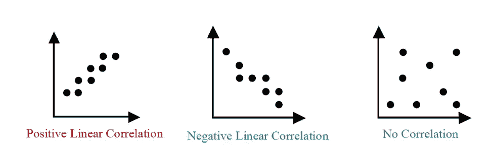
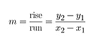
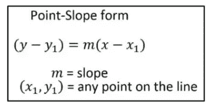
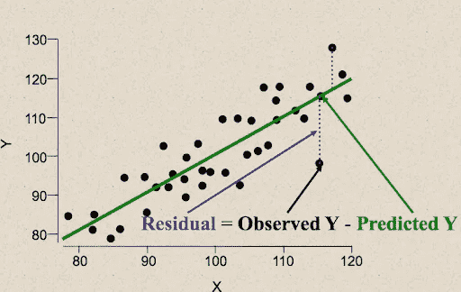
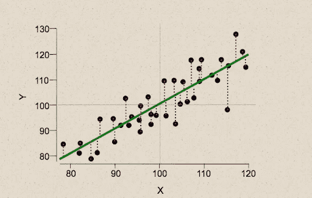
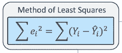

# 最佳拟合线是什么，它的意义是什么？

> 原文：<https://medium.datadriveninvestor.com/what-is-the-line-of-best-fit-and-what-is-its-significance-af5d8e6f7bd2?source=collection_archive---------2----------------------->

您知道最佳拟合线有时被称为趋势线或回归线吗？

*是的！！*

事实上，当我们以**散点图**的形式表示数据时，我们能够看到一个变量如何影响另一个变量。当数据遵循相似的模式时，这种关系称为相关性。

我们通过使用趋势线或最佳拟合线来表示这种相关性，这有助于我们逼近一组数据点。

首先，我们必须从给定的数据中构建一个散点图，并试图理解相关性。

Types of Correlation

接下来，我们画出看起来最接近相关性的线。我们必须构建一条最能代表趋势的线。最有可能的是，我们在看中值，这就是为什么趋势线有时被称为中值拟合线。

然后我们找到位于回归线上的两个点，并计算斜率 m。

最后，我们使用点斜率形式来写出表示最佳拟合线的线性方程。

在上面的散点图中，绿线是最佳拟合线。

现在，在实际场景中，并不是每个数据点都在我们的最佳拟合线上。因此，在我们的线上和线下会有点数。我们预测中的这种误差称为残差，它是数据点和回归线之间的垂直距离。直线与数据拟合得越好，残差就越小(平均而言)。换句话说，一些实际值将大于它们的预测值(它们将落在线上)，一些实际值将小于它们的预测值(它们将落在线下)。

我们必须考虑所有残差的某种组合，并试图将其最小化。

有些误差是正的，有些是负的。所以，如果我们把所有的误差加起来，总和将是零。

因此，为了测量总误差，我们对误差求平方，并找到一条使误差平方和最小的线。当我们平方一个误差时，误差会变得很大，误差平方的总和会在总和中占更大的比例。

观察/实际 Y-预测 Y =误差

Y-Y ' = Y-Y '

然后我们取误差的平方=**(Y-Y’)**

所有平方误差之和=均方误差。

这种方法，即最小二乘法，可以找到使误差平方和最小的截距(b)和斜率(m)的值。

这种方法非常有价值，因为它考虑了显著的异常值，即远离模型的点。

因此，当我们使用这种方法来计算我们的最佳拟合线方程，我们的最佳拟合线将确实是最好的！

谢谢你的来访！

*原载于 2020 年 9 月 19 日*[*【https://www.numpyninja.com】*](https://www.numpyninja.com/post/what-is-the-line-of-best-fit-and-what-is-its-significance)*。*