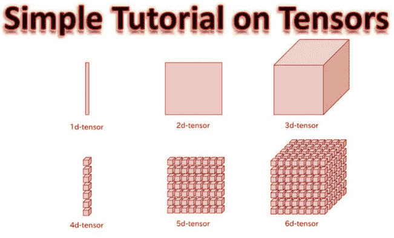
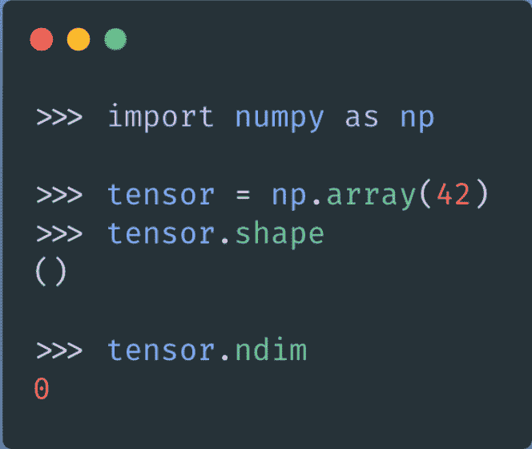
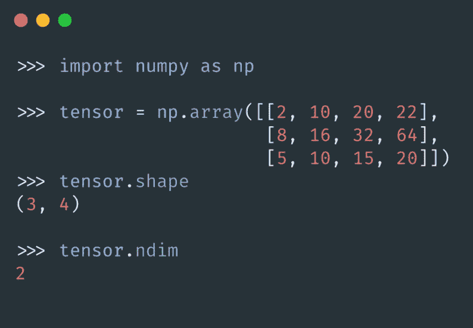

# 深度学习中的张量是什么？

> 原文：<https://medium.datadriveninvestor.com/what-is-the-tensor-in-deep-learning-77c2af7224a1?source=collection_archive---------3----------------------->

深度学习技术中重要且基础的课题之一！！！

在转向张量之前，让我们看看什么是深度学习？

深度学习是机器学习的一个子集。这是一个基于通过检查计算机算法进行自我学习和改进的领域。虽然机器学习使用更简单的概念，但深度学习与人工神经网络一起工作，人工神经网络旨在模仿人类的思维和学习方式。我们都知道 [TensorFlow](https://www.tensorflow.org/learn) 和 [PyTorch](https://pytorch.org/tutorials/) 库是深度学习框架。

## 深度学习框架中的张量是什么？

张量是机器学习系统使用的数据结构，了解它们是你应该尽早建立的一项基本技能。

张量是数字数据的容器。这是我们在系统中存储信息的方式。

三个主要属性定义了张量:

1.  **排名**
2.  **形状**
3.  **数据类型**

让我们详细谈谈三个主要属性。

这里张量的秩指的是张量的轴数。

*示例*:

矩阵的秩是 2，因为它有两个轴。

向量的秩是 1，因为它只有一个轴。

张量的形状指的是沿每个轴的维数。

*示例*:

正方形矩阵可以具有(2，2)维。

秩为 3 的张量可以具有(3，5，8)维。

张量的数据类型是指其中包含的数据类型。

以下是一些受支持的数据类型:

*   **浮动 32**
*   **浮动 64**
*   **uint8**
*   **int32**
*   **int64**

现在让我用数学概念来描述张量。

标量(0D 张量)的秩为 0，包含一个数字。这些叫做 0 维张量。

下图显示了如何使用 NumPy 构建 0D 张量。

向量(1D 张量)的秩为 1，代表一组数字。

下图显示了一个形状为(4)的矢量。

矩阵(2D 张量)的秩为 2，代表一组向量。矩阵的两个轴通常被称为行和列。

下图显示了一个形状为(3，4)的矩阵。

可以获得更高维的张量(3D，4D 等。)通过将低维张量打包成数组。例如，将一个 4D 张量打包成一个数组，我们就得到一个 8D 张量。

以下是一些常见的张量表示:

**向量** : 1D —(特征)

**序列** : 2D —(时间步长，特征)

**图像** : 3D —(高度、宽度、通道)

**视频** : 4D —(帧、高度、宽度、通道)

通常，机器学习算法一次处理一个数据子集，称为批处理。

当使用一批数据时，张量的第一个轴是为该批数据的大小(样本数)保留的。)

例如，如果您处理 2D 张量(矩阵)，一批张量将总共有 3 个维度:

白色小正方形(样本、行、列)

注意第一个轴是我们批次中的矩阵数量。

遵循相同的逻辑，一批图像可以被表示为 4D 张量:

*   白色小方块(样本、高度、宽度、通道)

一批视频作为 5D 张量:

*   白色小正方形(样本、框架、高度、宽度、通道)

# 结论

> 希望大家完全理解张量概念。如果还有任何问题，请随时联系我[balavenkatesh.com](http://balavenkatesh.com/)