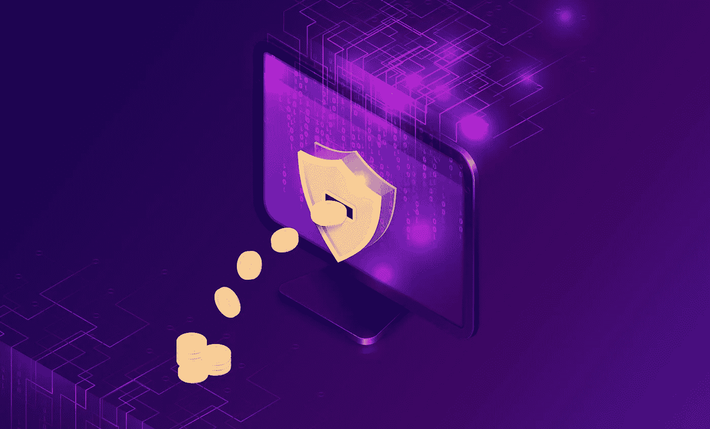
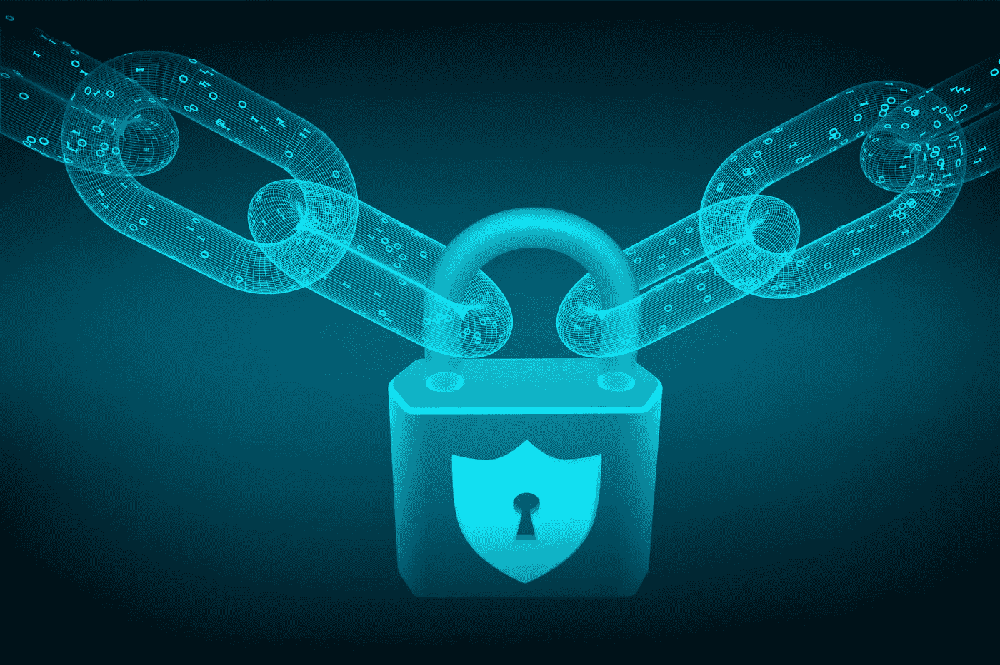

# 区块链中什么是令牌化？

> 原文：<https://medium.datadriveninvestor.com/what-is-tokenization-in-blockchain-c799a5d4af62?source=collection_archive---------4----------------------->

令牌化是将物理和数字资产转换为基于区块链的数字令牌。在深入研究标记化之前，让我们了解一下为什么我们需要标记化，以及标记化的好处是什么。

当我们将实物转化为数字时，我们称之为数字化。例如，当我们将一项资产(无论是物理资产还是数字资产)转换为基于区块链的分散资产时，我们可以称之为令牌化。此外，表示将在令牌，可以通过区块链转让给另一个人。

比特币问世后，它改变了我们使用和储存货币的方式。以前，我们把钱存在银行，我们需要通过一个程序把钱转给另一个人。然而，在比特币之后，我们可以安全地拥有我们钱包中的钱，并随时转移到世界上任何我们想要的人。

因此，无论我们在区块链上标记什么资产，默认情况下都会获得一些加密货币的特征，我们可以添加更多功能，使其更适合我们的用例/行业。在区块链之上对资产进行令牌化将创建具有完全所有权的安全、透明且可审计的令牌。

在区块链，我们有不同类型的代币，如 ERC20、NFT(ERC720)、ERC 1155 和 SFT。这些令牌中的每一个都有其令牌化资产的方式，我们将在下一篇博客中详细讨论这些内容。

**用例**

总部位于区块链的供应链是世界上常见的区块链用例之一。让我们看看如何将符号化应用于此，以及它将如何使区块链进程更容易。

在供应链中，如果我们把它看作是从农场到货架追踪一些橙子。在链的开始，也就是农场级别，我们可以标记区块链的橙子。例如，如果我们有 1000 公斤橙子，那么我们可以创建 1000 个橙子代币，其中每公斤= 1 个代币。从那时起，如果农民想要使用第三方运输将橙子转移到工厂，那么他只需通过区块链将 1000 个代币转移给司机，这将显示代币的新所有者。

在某一点上，驱动程序会将所有权转移到一个工厂，在处理和清洗后，工厂将最终拥有 990 个橙色令牌，因为我们可以认为其余 10 个是损坏的令牌。然后，工厂可以将代币拆分到不同的超级市场，一个超级市场可以获得 350 个橙色代币，这些代币将放入他们的货架。

在每一点上，所有者可以向令牌添加不同的数据，并且当他们将令牌转移给新所有者时，所有数据也将被转移。但是，新所有者只能查看过去的数据，不能修改任何旧数据。最后，当消费者扫描产品二维码时，橙子在区块链的全部历史都会显示出来。

通过在区块链使用令牌化，我们可以轻松实现这一使用案例，只需最少的努力，就能最大限度地控制令牌和数据并提高其安全性。

再比如房地产。房地产是较早采用标记化并利用它进行改进的行业之一。总是很难找到买家出售一个大的财产，另一方面，有很多人有少量的钱，他们想投资房地产以获取利润。

例如，如果一个人拥有价值 100 万美元的房地产，那么他可以通过以太坊或另一个区块链的智能合约，在区块链创造 100 万枚代币。然后他可以说每个代币值 1 美元。因此，人们可以投资从 1 美元起的任何金额来购买代币，他们拥有的代币数量将决定他们在建筑物中拥有的百分比。如果所有者愿意，他仍然可以拥有大多数代币，让其他人购买。即使他出租财产或财产获得的任何收益，也将根据代币持有人拥有的代币数量与代币持有人平均分享(现在在许多国家将房地产代币化是合法的，智能合同在法庭上也是有效的法律证据)。在转换为代币的那一刻，实物资产就变成了具有流动性的数字表示。

***令牌化不仅仅局限于*** 供应链或者房地产你可以将世界上任何一个实体或者数字的项目进行令牌化，从一段数据到一艘宇宙飞船。已经存在这样的使用案例:他们拥有令牌化的医疗记录、体育卡、门票、证书、忠诚度积分、礼品卡、碳信用额度等收藏品。在下一篇博客中，让我们了解令牌的类型以及更多关于用例的细节。