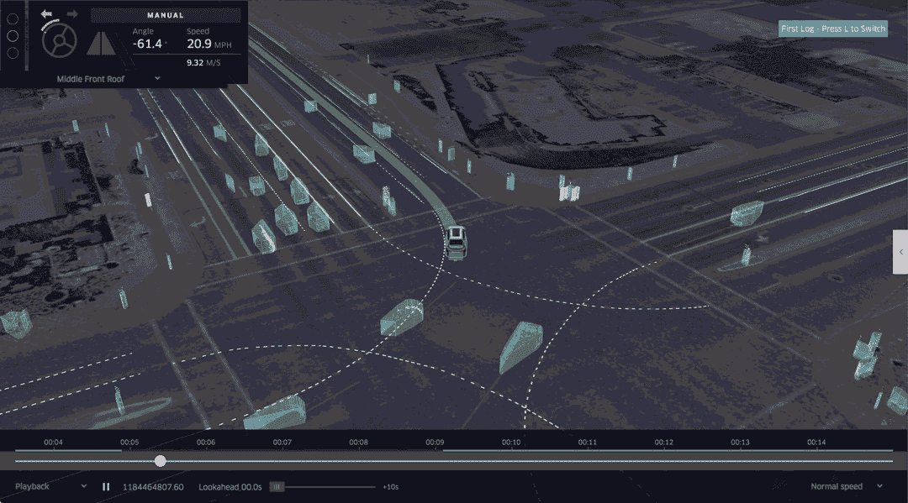
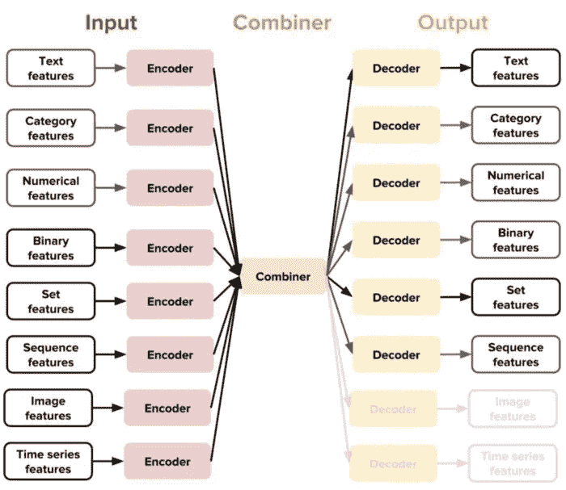

# 优步的路德维希是什么？

> 原文：<https://medium.datadriveninvestor.com/what-is-ubers-ludwig-c963d089e0e?source=collection_archive---------1----------------------->

## 低代码 ML 的开源框架…



Pic credits — Uber Blog

机器学习是在没有明确编程的情况下赋予计算机学习能力的研究领域。它是人工智能的一个子集，主要关注机器，从他们的经验中学习，并根据经验做出预测。


How it works

[](https://medium.com/datadriveninvestor/stack-overflow-analyzed-data-from-60-000-software-developers-hours-they-work-languages-they-476ac6ca0197) [## Stack Overflow 分析了来自 60，000 多名软件开发人员的数据，包括他们的工作时间、语言…

### 以下是他们的发现…

medium.com](https://medium.com/datadriveninvestor/stack-overflow-analyzed-data-from-60-000-software-developers-hours-they-work-languages-they-476ac6ca0197) [](https://medium.com/datadriveninvestor/hacker-earth-surveyed-16000-developers-from-76-countries-heres-what-i-found-dbd5d7c422b0) [## 黑客地球调查了来自 76 个国家的 16000 名开发者——以下是我的发现

### 惊人的洞察力…

medium.com](https://medium.com/datadriveninvestor/hacker-earth-surveyed-16000-developers-from-76-countries-heres-what-i-found-dbd5d7c422b0) [](https://medium.com/datadriveninvestor/hacker-rank-analyzed-data-from-100k-developers-and-hiring-managers-here-is-what-i-found-a374b98e937e) [## Hacker Rank 分析了来自 10 万多名开发人员和招聘经理的数据——以下是我的发现

### 来自 100，000 多名开发人员和招聘经理的出色分析结果

medium.com](https://medium.com/datadriveninvestor/hacker-rank-analyzed-data-from-100k-developers-and-hiring-managers-here-is-what-i-found-a374b98e937e) 

# 机器学习有哪些不同的类型？


Different types of Machine Learning

*   **受监督的机器学习** —受监督的学习是指在一个带标签的数据集上训练模型。带标签的数据集既有输入参数也有输出参数。在这种类型的训练和验证学习中，数据集被标记


**Supervised Machine Learning ( *source: gifs.com*)**

*   **无监督机器学习** —模型通过观察学习，并在数据中找到结构。一旦为模型提供了数据集，它就会通过在数据集中创建分类来自动查找数据集中的模式和关系。它不能做的是向集群添加标签。


**Unsupervised Machine Learning ( *source: gifs.com*)**

*   **强化机器学习** —强化学习是训练机器学习模型做出一系列决策。代理人学习在不确定的、潜在的复杂环境中实现目标。在强化学习和人工智能中面临着类似游戏的情况。计算机采用反复试验的方法来解决这个问题。


**Reinforcement Machine Learning ( *source: gifs.com*)**

# ML 的不同阶段


Pic credits — Maurice Chang

# 深度学习

深度学习是机器学习的一个分支，本质上，它实现了具有多个单个隐藏层神经元的神经网络。


AI, ML, DL (Pic credits: Pinterest)


A basic Neural Network

深度学习的训练和测试阶段需要 ML 架构和数据基础设施的复杂知识。作为解决方案，优步引入了一个无需编写代码就能训练和测试深度学习模型的框架，并将其命名为 Ludwig —

> Ludwig 是一个建立在 TensorFlow 之上的工具箱，它允许我们在不需要编写代码的情况下训练和测试深度学习模型。

[](https://www.datadriveninvestor.com/2020/06/24/disclosure-and-resolution-program-wont-prevent-physicians-from-practicing-defensive-medicine/) [## 人工智能、深度学习和医疗实践|数据驱动的投资者

### 人工智能和深度神经学习的效用看起来可能是合法和有前途的，特别是…

www.datadriveninvestor.com](https://www.datadriveninvestor.com/2020/06/24/disclosure-and-resolution-program-wont-prevent-physicians-from-practicing-defensive-medicine/) 

路德维希的核心设计原则是(来源:路德维希 Github):

*   **不需要编码:**不需要编码技能来训练一个模型并使用它来获得预测。
*   **通用性:**一种新的基于数据类型的深度学习模型设计方法，使该工具可以跨许多不同的用例使用。
*   **灵活性:**有经验的用户对模型的建立和训练有广泛的控制，而新手会发现它很容易使用。
*   **扩展性:**易于添加新的模型架构和新的特征数据类型。
*   **可解释性和可理解性** : Ludwig 包括帮助数据科学家理解机器学习模型性能的可视化。


Pic Credits — Ludwig’s Website

*   *Ludwig 使用模块化设计，其中模型的每个组件，如编码器、解码器和磁头，都作为一个单独的模块来实现。这种设计允许您轻松地混合和匹配组件，以构建适合您的特定用例的定制模型。*
*   *要使用 Ludwig，首先以表格格式准备数据，如 CSV 文件。然后，使用 YAML 配置文件定义模型架构，该文件指定输入和输出特性、要使用的编码器和解码器以及任何附加的超参数。*
*   *接下来，您使用 Ludwig 命令行界面训练模型。Ludwig 负责训练过程，包括将数据分成训练集和验证集，设置优化器和损失函数，以及为指定数量的时期训练模型。*
*   *最后，您可以使用相同的命令行界面在新的数据集上测试该模型，Ludwig 将生成评估指标，如准确度、精确度、召回率和 F1 分数。*

***路德维希的目标是让机器学习经验有限的人能够轻松快速地训练和测试机器学习模型，让专家能够快速地试验新的模型和想法，而不必从头开始编写代码。***

# 如何与路德维希合作？

输入为 CSV 文件，包含您的数据、列列表和用作输出的列列表，Ludwig 将完成其余工作。可以使用简单的命令在本地或以分布式方式训练模型，并使用它们来预测新数据。

## 路德维希 API —

可以插入一个编程 API 来使用 python 代码中的 Ludwig。一套可视化工具允许您分析模型的训练和测试性能，并对它们进行比较。

有 4 个步骤—

# 1.安装

只要运行`pip install ludwig`就可以使用了。

路德维希的基本要求如下:

*   张量流
*   numpy
*   熊猫
*   python 3
*   scipy
*   sci kit-学习
*   Cython
*   h5py
*   有平面的
*   tqdm
*   PyYAML
*   抽象逻辑推理

# 2.火车

在 CSV 文件中准备数据，在模型定义 YAML 文件中定义输入和输出特征，然后运行:

```
ludwig train
--data_csv file.csv
--model_definition definition.yaml
```

# 3.预测

准备 CSV 文件中的数据，并使用预先训练的模型来预测输出目标:

```
ludwig predict
--data_csv data.csv
--model path_to_model
```

# 4.设想

Ludwig 提供了许多可视化选项。例如，如果您想查看模型的学习曲线，运行:

```
ludwig visualize
--visualization learning_curves
--training_statistics train_statistics.json
```

# 对于 API —

训练模型并使用它们直接从 Python 进行预测

```
from ludwig.api import LudwigModel# train a model
model_definition = {...}
model = LudwigModel(model_definition)
train_stats = model.train(training_dataframe)
# or load a model
model = LudwigModel.load(model_path)# obtain predictions
predictions = model.predict(test_dataframe)
```

# 什么时候用路德维希？

从业者可以使用 Ludwig 快速训练和测试深度学习模型，研究人员也可以使用 Ludwig 获得强大的基线，这些基线可用于比较，并具有通过执行标准数据预处理和可视化来确保可比性的实验设置。

Ludwig 提供了两个主要功能:训练模型，然后使用这些模型进行预测。

Ludwig 基于数据类型抽象，这意味着数据预处理和后处理将在共享数据类型的不同数据集上执行，并且为一项任务开发的相同编码和解码模型可以在不同的任务中重复使用。



Source: [https://eng.uber.com/introducing-ludwig/](https://eng.uber.com/introducing-ludwig/)

# 例子—

输入您的 image_classification.csv，其中有一列包含要分类的图像的路径/url。

```
ludwig experiment \   --data_csv image_classification.csv \   --model_definition_file model_definition.yaml
```

用`model_definition.yaml`

```
input_features:     
- 

   name: image_path         
   type: image         
   encoder: stacked_cnnoutput_features:     
-         
   name: class         
   type: category
```

参考文献和致谢—

[](https://ludwig-ai.github.io/ludwig-docs/) [## Ludwig —无代码深度学习工具箱

### 只要运行 pip install ludwig，它就可以使用了。有些功能可能需要进一步的步骤，请阅读入门…

ludwig-ai.github.io](https://ludwig-ai.github.io/ludwig-docs/) 

# 想看程序员幽默？

[](https://medium.com/datadriveninvestor/programming-humor-part-2-f92cf5a26f2b) [## 编程幽默第 2 部分

### 继续笑，因为太搞笑了…

medium.com](https://medium.com/datadriveninvestor/programming-humor-part-2-f92cf5a26f2b) [](https://medium.com/datadriveninvestor/the-most-hilarious-code-comments-ever-bae3cb1030b5) [## 史上最搞笑的代码注释

### 程序员幽默:是的，实际上是程序员写的！

medium.com](https://medium.com/datadriveninvestor/the-most-hilarious-code-comments-ever-bae3cb1030b5) [](https://medium.com/datadriveninvestor/coding-sins-hilarious-developer-confessions-f55eb342454e) [## 编码原罪:令人捧腹的开发者自白

### “白板”是如何被嘲笑的

medium.com](https://medium.com/datadriveninvestor/coding-sins-hilarious-developer-confessions-f55eb342454e) [](https://medium.com/datadriveninvestor/10-witty-programming-jokes-that-will-make-you-go-rofl-a53fbfb91943) [## 10 个让你着迷的诙谐编程笑话

### 这些太搞笑了…

medium.com](https://medium.com/datadriveninvestor/10-witty-programming-jokes-that-will-make-you-go-rofl-a53fbfb91943) 

# 推荐文章-

[](https://medium.com/python-in-plain-english/python-iterators-generators-and-decorators-made-easy-659cae26054f) [## Python 迭代器、生成器和装饰器变得简单

### 快速实施指南

medium.com](https://medium.com/python-in-plain-english/python-iterators-generators-and-decorators-made-easy-659cae26054f) [](https://medium.com/ai-in-plain-english/23-data-science-techniques-you-should-know-61bc2c9d1b3a) [## 你应该知道的 23 种数据科学技术！

### 使用这些技巧来节省你的宝贵时间

medium.com](https://medium.com/ai-in-plain-english/23-data-science-techniques-you-should-know-61bc2c9d1b3a) [](https://medium.com/datadriveninvestor/coding-sins-hilarious-developer-confessions-f55eb342454e) [## 编码原罪:令人捧腹的开发者自白

### “白板”是如何被嘲笑的

medium.com](https://medium.com/datadriveninvestor/coding-sins-hilarious-developer-confessions-f55eb342454e) [](https://medium.com/datadriveninvestor/5-cool-advanced-pandas-techniques-for-data-scientists-c5a59ae0625d) [## 面向数据科学家的 5 项酷炫先进熊猫技术

### 使用这些技巧…

medium.com](https://medium.com/datadriveninvestor/5-cool-advanced-pandas-techniques-for-data-scientists-c5a59ae0625d) [](https://medium.com/datadriveninvestor/stack-overflow-analyzed-data-from-60-000-software-developers-hours-they-work-languages-they-476ac6ca0197) [## Stack Overflow 分析了来自 60，000 多名软件开发人员的数据，包括他们的工作时间、语言…

### 以下是他们的发现…

medium.com](https://medium.com/datadriveninvestor/stack-overflow-analyzed-data-from-60-000-software-developers-hours-they-work-languages-they-476ac6ca0197) [](https://medium.com/datadriveninvestor/advanced-python-made-easy-part-4-a4996ba9fe19) [## 高级 Python 变得简单—第 4 部分

### 使用这些技巧和技术…

medium.com](https://medium.com/datadriveninvestor/advanced-python-made-easy-part-4-a4996ba9fe19) [](https://medium.com/datadriveninvestor/advanced-python-made-easy-part-1-ce1e2f17431e) [## 高级 Python 变得简单—第 1 部分

### 使用这些技巧和技术…

medium.com](https://medium.com/datadriveninvestor/advanced-python-made-easy-part-1-ce1e2f17431e)