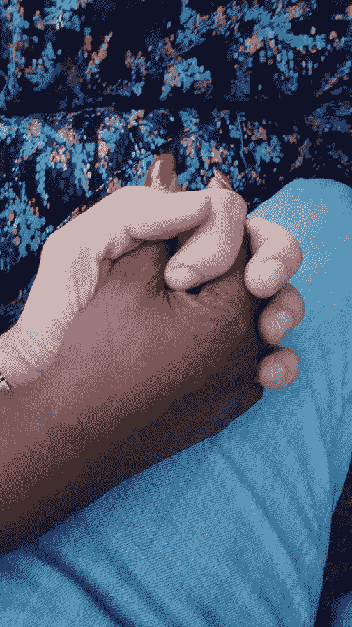

# 什么是无意识偏见(以及如何战胜它)

> 原文：<https://medium.datadriveninvestor.com/what-is-unconscious-bias-and-how-you-can-defeat-it-8fb9cb702d3b?source=collection_archive---------27----------------------->

你如何战胜无意识偏见？首先，你需要知道它是什么。

[无意识偏见](https://journals.sagepub.com/doi/abs/10.1177/003172170909000504?journalCode=pdka)(也称为[隐性偏见](https://www.jstor.org/stable/20439056))指的是基于种族、性别、性征、民族、能力、年龄等的无意识形式的歧视和刻板印象。它不同于[认知偏差](https://disasteravoidanceexperts.com/how-to-evaluate-unconscious-bias-caused-by-cognitive-biases-at-work/)，后者是一种可预测的精神错误模式，导致我们错误地感知现实，并因此偏离最有可能实现目标的方式。

换句话说，从什么对我们个人最有利的角度来看，陷入认知偏见总是会降低我们得到我们想要的东西的可能性，从而伤害我们。尽管认知偏见有时会导致歧视性的思维和感觉模式，但这是两个不同的概念。

认知偏见在人类中很普遍，与我们大脑的特定线路有关，而无意识偏见与不同群体之间的感知有关，是我们生活的社会所特有的。例如，我敢打赌，你不会在意甚至不会去想一个人是贵族还是平民，然而这种区别在几个世纪前的欧洲非常重要。再举一个例子——地理上的而不是时间上的——大多数美国人对逊尼派和什叶派穆斯林没有强烈的感觉，然而这种区别在世界上许多地方都非常有意义。

 [## 对有商业头脑的投资者有用的行为经济学概念|数据驱动的投资者

### 在美国企业界，高斯统计，对我们周围世界的确定性解释，以及理性…

www.datadriveninvestor.com](https://www.datadriveninvestor.com/2020/07/09/helpful-behavioral-economics-concepts-for-the-business-minded/) 

组织经常让我作为[演讲者](https://disasteravoidanceexperts.com/speaking/)在[多元化和包容性](https://youtu.be/TUknjg0qNaI)演讲，以解决潜在的无意识[歧视行为](https://youtu.be/4TPT8xWrX10)。当我在演讲中分享美国黑人遭受警察骚扰和暴力的比例远高于白人时，一些参与者(通常是白人)偶尔会试图通过声称黑人比白人更暴力、更有可能违法来为警察辩护。他们由此将警察骚扰归因于黑人的内在特征(暗示这是应得的)，而不是警察行为的外部背景。

事实上，正如我在对这些人的回应中指出的那样，研究表明，黑人因同样的活动受到警察骚扰和伤害的比例要高得多。例如，从统计数据来看，从警察身边走过的白人比黑人更不容易被拦下搜身。另一方面，一个拒捕的白人比一个黑人更不容易被暴打。换句话说，[统计数据显示](https://www.journals.uchicago.edu/doi/abs/10.1086/697905?mobileUi=0)警察对美国黑人的骚扰和暴力发生率较高是因为警察的偏见，至少在很大程度上是这样。

但是，我小心翼翼地澄清，这种歧视[不一定是故意的](http://kirwaninstitute.osu.edu/my-product/2015-state-of-the-science-implicit-bias-review/)。有时，这确实是故意的，白人警察有意识地认为美国黑人应该比白人受到更多的审查。在其他时候，歧视行为源于无意识的、隐含的思维过程，警察不会有意识地认可这种思维过程。

有趣的是，研究表明，许多黑人警察对其他黑人有一种无意识的偏见，在评估潜在嫌疑人时，他们比白人更加负面。许多——不是所有——黑人警察都带有这种无意识的偏见，这有助于表明，这种偏见——至少在很大程度上——来自警察部门的内部文化，而不是在某人加入警察部门之前就已经存在的种族主义态度。

这种文化通过内部规范、政策和培训程序得以延续，任何希望解决无意识偏见的警察部门都需要首先解决内部文化，而不是将种族主义归咎于个别警官。换句话说，与其说这是一桶好苹果中的几个坏苹果，关键是要认识到隐性偏见是一个系统性问题，这个桶的结构和关节需要修复。

要强调的关键一点是，隐性偏见中没有羞耻或责备，因为它不是源于个人的任何过错。这种无羞耻的方法减少了不情愿的观众的战斗、冻结或逃跑的防御反应，帮助他们听到和接受这个问题。

有了这些额外的统计数据和对隐性偏见的讨论，这个问题基本上就解决了。尽管如此，从他们随后的行为来看，很明显，这些观众中的一些人没有立即将这一证据内在化。让他们感到安慰的是，警察是对的，任何被警察盯上的人都是罪有应得；反过来，由于这些群体面临的结构性挑战，他们非常不愿意接受将更多努力和精力集中在保护美国黑人免受警察暴力上的必要性。

无意识偏见的问题不符合他们的直觉，因此他们拒绝这一概念，尽管有大量强有力的证据表明它在警务中的普遍作用。需要一系列后续的对话和[干预](https://www.ncbi.nlm.nih.gov/pmc/articles/PMC3603687/)才能动针。根据我的经验和[的研究](https://hbr.org/2016/07/why-diversity-programs-fail)，单一的培训几乎是不够的。

这个如何对抗无意识偏见的例子说明了你需要遵循更广泛的模式来解决这类问题，以便解决无意识偏见，做出[最佳人事决策](https://disasteravoidanceexperts.com/nevergut)。毕竟，当我们简单地跟随直觉时，我们的本能反应会导致我们做出糟糕的判断选择。

1)相反，你需要从[开始了解](https://disasteravoidanceexperts.com/wise-decision-maker-movement-manifesto/)那种由你自己无意识的偏见导致的问题，这样你就知道你在试图解决什么。

2)然后，你需要向你想影响的人传达，比如你的员工或任何其他群体，甚至你自己，承认我们的本能不应该感到羞耻或内疚。

3)接下来，你需要传达跟随他们的直觉所带来的危险，在改变行为上建立情感投资。

4)然后，你需要[传达正确的思维习惯](https://disasteravoidanceexperts.com/12-mental-skills-to-defeat-cognitive-biases/)，这将帮助他们做出最佳选择。

记住，一次性的培训是不够的。克服无意识的偏见需要长期的承诺、持续的训练和努力。

# 关键要点

> 要解决无意识偏见，需要了解它是什么，以及你可能在哪里以及如何陷入其中。同样重要的是，它需要培养一系列健康的心理习惯，防止你陷入无意识的偏见。— -> [点击推文](https://twitter.com/intent/tweet?text=To%20address%20unconscious%20bias%20requires%20understanding%20what%20it%20is%20and%20where%20and%20how%20you%20might%20fall%20into%20it.%20Just%20as%20importantly%2C%20it%20requires%20developing%20a%20series%20of%20healthy%20mental%20habits%20that%20prevent%20you%20from%20falling%20for%20unconscious%20bias&url=https%3A%2F%2Fbit.ly%2F2Vp23kX&via=Gleb_Tsipursky)

# 需要考虑的问题(请在评论区分享你的想法)

*   你观察到的无意识偏见的案例研究有哪些？
*   无意识的偏见在哪里对你来说是个问题？
*   基于阅读这篇文章，你会采取什么步骤？

图片来源:[维基共享资源](https://commons.wikimedia.org/wiki/File:Female_black_and_male_white_hand_(holding,_adult).jpg)

*原载于* [*避灾专家*](https://disasteravoidanceexperts.com/what-is-unconscious-bias-(and-how-you-can-defeat-it)/)

—

**Bio** :国际公认的思想领袖，被称为灾难规避专家，[Gleb Tsipursky](https://disasteravoidanceexperts.com/glebtsipursky/)博士的使命是通过制定最有效的决策策略来保护领导者免受被称为认知偏差的危险判断错误的影响。作为一名畅销书作家，他最著名的作品是《T4》*《永远不要跟着感觉走:先锋领导者如何做出最佳决策并避免商业灾难* (职业出版社，2019 年)、《我们之间的盲点:如何克服无意识的认知偏见并建立更好的关系 (《新先驱》，2020 年)和《韧性:适应并计划新冠肺炎冠状病毒疫情 (《变革者图书》，2020 年)他发表了 550 多篇文章，接受了 450 多个知名媒体的采访，如[*Inc .*](https://www.inc.com/entrepreneurs-organization/a-behavioral-scientist-explains-why-your-swot-analysis-is-dangerously-flawed.html)[*企业家*](https://www.entrepreneur.com/article/348115)[*CBS 新闻*](https://www.cbsnews.com/video/study-says-taking-a-small-break-from-facebook-might-be-good-for-your-mental-health/)[*时代*](http://time.com/4257876/wounded-warrior-project-scandal/)[*商业内幕*](https://www.businessinsider.com/disaster-expert-companies-should-face-coronavirus-with-pessimism-2020-3)[*政府官员*](http://www.govexec.com/excellence/promising-practices/2017/03/heres-why-your-gut-instinct-wrong-work-and-how-know-when-it-isnt/136104/)[他的专业知识来自于作为](https://disasteravoidanceexperts.com/NeverGut/)[避灾专家](http://disasteravoidanceexperts.com/)的 CEO，20 多年的[咨询](https://disasteravoidanceexperts.com/consulting/)、[辅导](https://disasteravoidanceexperts.com/coaching/)、[演讲和培训](https://disasteravoidanceexperts.com/speaking/)。这也源于[作为一名行为经济学家和认知神经科学家在学术界超过 15 年的](http://disasteravoidanceexperts.com/research)。通过 Gleb[at]DisasterAvoidanceExperts[dot]com、Twitter[@ Gleb _ tsipursky](https://twitter.com/Gleb_Tsipursky)、insta gram[@ dr _ Gleb _ tsipursky](https://www.instagram.com/dr_gleb_tsipursky/)、 [LinkedIn](https://www.linkedin.com/in/dr-gleb-tsipursky/) 联系他，注册他的免费[明智决策者课程](https://disasteravoidanceexperts.com/newsletter/)。

**进入专家视角—** [**订阅 DDI 英特尔**](https://datadriveninvestor.com/ddi-intel)