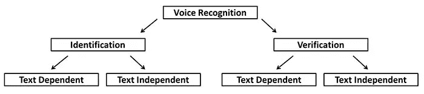

# 什么是语音识别技术及其优势

> 原文：<https://medium.datadriveninvestor.com/what-is-voice-recognition-technology-and-its-benefits-8bdbbee4b4b8?source=collection_archive---------15----------------------->

Source: einvestigator.com

语音助手在我们身边已经有一段时间了，但一旦它被引入智能手机，语音助手就变得更加流行。

从苹果的 Siri，亚马逊的 Alexa 到微软的 Cortana 和不太为人知的三星的 bix by——一路走来，人们对[语音 AI](https://www.nextiva.com/blog/what-is-conversational-ai.html) (人工智能)越来越感兴趣。

语音助手的趋势正在增长，因为仅在去年就有报道称，仅在美国就有超过 100 万人使用语音助手。

# 什么是语音识别？

语音识别是指特定设备接收和解释口头指令的能力——简单地说，语音识别技术可以与人类的命令进行交互并做出响应。

语音识别起源于个人电脑，但随着智能手机的集成和日益普及，它在家庭设备中变得更加容易使用。通过这种方式，我们的厨房、客厅等都可以使用这项技术。

随着如今许多人使用语音识别，人们对语音识别的兴趣也在不断增长——这就是企业考虑使用语音识别技术的原因。

Source: voicerecognition.com

今天，我们区分两种类型的语音识别:

*   依赖文本—取决于用户所说的特定单词集—你需要逐步认证和身份验证，为了被激活，用户必须说出必要的短语。
*   文本无关—不依赖于特定文本，但依赖于对话语音。认证不需要用户说出一组所需的短语。

Source: bayometric.com

# 简史

第一次记录[语音识别](https://verbit.ai/from-audrey-to-siri-the-evolution-of-speech-recognition-technologies/)是在 1952 年，当时贝尔实验室设计了“Audrey”系统——这是一个识别单个声音说出的数字的系统。IBM 在 20 世纪 60 年代初开发了' [Shoebox](https://www.ibm.com/ibm/history/exhibits/specialprod1/specialprod1_7.html) ，它可以识别并回应 16 个英语单词，包括从 0 到 9 的数字——它被称为今天语音识别系统的'*先驱。*

接下来的几年带来了技术进步和快速处理器，这导致了像[龙指令](https://www.dragondictationsoftware.com/about-2/)这样的软件的开发和更普遍的使用。

一直以来，语音处理技术都在稳步发展，直到 2011 年，苹果决定推出 Siri。

从那时起，语音识别就一直在兴起，随着[谷歌的语音搜索](https://en.wikipedia.org/wiki/Google_Voice_Search)、[亚马逊的 Alexa](https://www.amazon.com/gp/help/customer/display.html?nodeId=G9PRYPSKBUUM6AGC) 的跟进，它开始被广泛使用。

Source: wired.com

# 语音识别是如何工作的？

[语音识别](https://www.ibm.com/cloud/learn/speech-recognition)和语音识别不是一回事。

语音识别只识别单词，并专注于将单词翻译成文本。

语音识别确保语音被识别并识别单个用户的语音。

[语音识别](https://en.wikipedia.org/wiki/Speaker_recognition)能够通过分析一个人的声音模式和序列来鉴别说话者，从而能够识别特定的人。

这种方法确保了安全，因为所有的输入都将由你自己的声音授权，而不是其他人。

Source: geeky-gadgets.com

# 语音识别技术的优势

语音识别技术已经成为一种趋势，企业应该考虑利用这种创新，因为如果将它纳入自己的战略，他们可以获得许多好处:

# 生成个性化

一切都与个性化有关

为您的服务添加个性化的最佳方式是让您的客户能够轻松快速地提出他们的需求，这可以通过语音识别技术来实现。

例如，今天的市场由具有数字素养的客户或被认为是数字一代的[千禧一代](https://en.wikipedia.org/wiki/Millennials)组成，语音识别技术将为他们的需求带来个性化，并可能成为他们的赢家。

这些个人对话可以通过[语音人工智能](https://www.voices.com/blog/guide-synthetic-ai-human-voice-brand/)进行，这可以在公司和个人之间提供更好的联系。

Source: totalvoicetech.com

# 产生更多时间

说话比打字还快！

语音识别技术正被内置到更多的设备和小工具中，以使生活更容易，因为语音输入远比打字更有效。

 [## 各种类型的分布式分类帐技术|数据驱动的投资者

### 随着比特币和加密货币在全球的采用、使用和魅力增长，它们已经成为常见的流行语。这个新的…

www.datadriveninvestor.com](https://www.datadriveninvestor.com/2020/12/04/various-types-of-distributed-ledger-technology/) 

语音识别技术每天都在进步[据斯坦福大学](https://engineering.stanford.edu/magazine/article/smartphone-speech-recognition-faster-and-more-accurate-typing)称，语音识别技术已经进步到能够更快、更准确地输出文本(例如在移动设备上听写等)的程度。)比一个人在键盘上打字的能力更强。

如果实施这种技术，企业可以简化管理流程，减轻打字和其他类似任务的负担，同时使员工能够专注于更复杂的工作。

Source: usabilitygeek.com

# 提高生产力水平

当谈到工作场所时，语音识别可以为任务管理职责提供支持和帮助，例如[设置电话会议](https://www.lifewire.com/conference-call-with-google-voice-3426279)，安排会议或设置提醒，例如亚马逊的 Alexa。这种方法使公司能够为每个人简化流程，从而提高生产力和效率。

随着语音识别的发展，现在可以根据语音指令获取相关信息，为任何特定项目请求数据，或者只是通过语音检索朋友的消息，所有这些活动现在都比我们通常手动进行的活动花费更少的时间。

翻译功能使说不同语言的人能够进行交流，该技术能够将内容翻译成目标语言，这有助于消除日常业务运营中的语言障碍。

Source: business.com

# 让每个人都可以接触到你

由于语音技术只需要语音，对于行动不便或有困难的人来说，这是一个非常好的选择，可以更方便地与您的企业沟通。

这种技术给原本可能以缓慢速度甚至根本无法获得电力的人带来了电力。

此外，使用语音识别软件可以极大地帮助患有关节炎或手抖等其他残疾的人，如果白天打字过多，这些残疾会恶化。

# 一次联系多个用户

有了语音人工智能，就有可能同时联系到不同的用户或客户，而不像以前那样，客户支持人员只能与一个人交谈。

这种技术使企业能够增加客户数量，并更有效地处理多种问题或顾虑。

语音技术在不断改进，变得越来越复杂，因此公司在探索如何实施语音技术、扩大其覆盖范围以及改善其业务成果方面投入了更多。

在接下来的一年里，它肯定会增长得更快，大多数公司都将依靠它来进行营销。

Source: freepik.com

# 支持免提工作

无论您做什么，无论您执行什么工作，使用语音识别都可以更轻松地完成任务。

与客户打交道，在接到客户电话后记下笔记，或者向同事发送关于最近会议的信息等等。—如果手动完成，所有这些任务都需要很长时间。

语音人工智能可以以一种有用的方式促进工作流程，因为你不必使用其他材料——所有客户的信息和所有笔记或问题都将被自动准确地记录下来。

# 最后的

语音识别技术是许多人和公司都想接受的趋势——它不仅可以为家庭，也可以为企业带来好处。

随着语音搜索和语音助手越来越受欢迎，企业开始考虑是否应该在他们的沟通策略中使用这种技术。

进化和改进仍在继续，但请记住，语音技术已经慢慢证明了它在日常生活中使用语音辅助的优势。

点击下面的链接，安排一次 DDIChat 会话 [**Maja Dakic**](https://app.ddichat.com/experts/maja-dakic) 。

 [## 马贾达基奇-迪迪恰特

### 技术行业(软件、移动应用、物联网、人工智能等)的资深作家。)以及在…

app.ddichat.com](https://app.ddichat.com/experts/maja-dakic) 

在这里申请成为聊天专家[。
与 DDI 合作:](https://app.ddichat.com/expertsignup)[https://datadriveninvestor.com/collaborate](https://datadriveninvestor.com/collaborate)
点击此处订阅 DDIntel [。](https://ddintel.datadriveninvestor.com/)