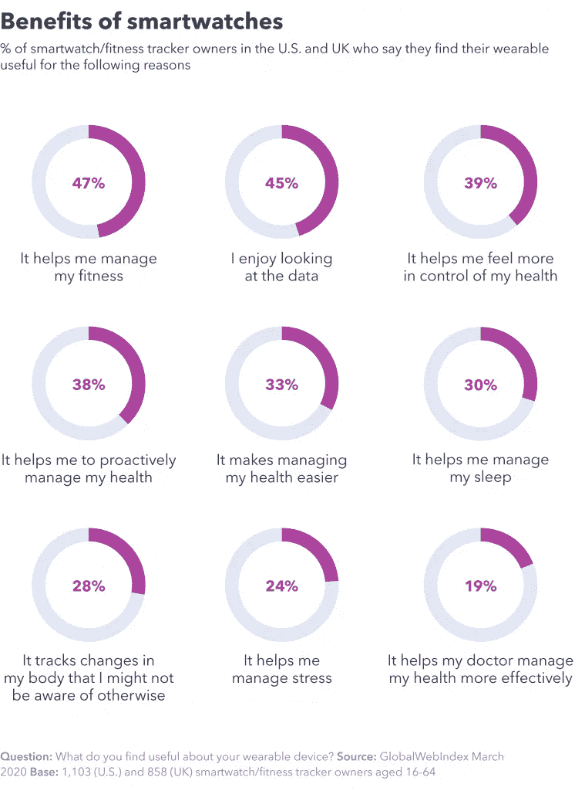

# 什么是可穿戴技术？

> 原文：<https://medium.datadriveninvestor.com/what-is-wearable-technology-c1d3325224f?source=collection_archive---------21----------------------->

可穿戴技术到底是什么？好吧，看看周围！从基本的健身追踪器和高度先进的运动和智能手表，到虚拟和增强现实耳机，可穿戴设备无处不在。这些设备使用传感器来连接人类用户。传感器收集的数据可以帮助您进行多任务处理，达到您的健身目标，改善您的睡眠，让您成为更好的员工，等等。通勤者、看护者、孩子以及介于两者之间的所有人都在加入可穿戴设备的行列。继续读下去，看看所有的炒作是怎么回事！

# 可穿戴技术如何帮助消费者？

可穿戴技术可以为一个人的生活带来便利、健康甚至时尚。尽管体积很小，但这些设备可以对最终用户的生活产生巨大影响。

# 可穿戴技术的便利性和生产力

可穿戴技术简化了日常任务，如打电话、发短信和导航。通过在智能手表上启用语音服务，为您提供一步一步的指示，无需在公路旅行中浏览地图应用程序。如果你正忙着在厨房里烤面包，就大声朗读你的短信。多任务处理轻而易举，无论您身在何处，都能进行免提电话通话！

 [## 新的健康技术如何让我们活过 100 岁？数据驱动的投资者

### 不久前，我们都在看一台黑色电视，不得不带着天线跑遍整个公寓，以确保…

www.datadriveninvestor.com](https://www.datadriveninvestor.com/2020/08/12/how-new-health-technology-makes-us-live-past-100-years/) 

# 可穿戴技术的健康

过去数步的日子已经被先进的健身追踪器所取代。用于健康的可穿戴技术可以包括智能戒指、智能珠宝、智能手表、健身追踪器、智能服装等等。这些发展帮助消费者了解复杂的健康数据，包括心率监测、睡眠分析和血压测量。

# 可穿戴技术的风格

虽然与生产力和健康相比，时尚的作用远没有那么重要，但它是可穿戴技术最具吸引力的方面之一。[苹果手表](https://www.apple.com/watch/?afid=p238%7Cs2Dzxn29V-dc_mtid_20925qtb42335_pcrid_469141421434_pgrid_108533509085_&cid=wwa-us-kwgo-watch-slid---Brand-AppleWatch-Avail-)多年来一直是最热门的配件，而且没有放缓的迹象。从黑色领带到 BBQ，有大量时髦的可互换腕带，与光滑的表盘搭配得很好。除了其物理外观，可穿戴技术还发出了一个强有力的视觉信息，即你重视自己的健康，并关心保持时尚。

# 可穿戴技术如何帮助专业人士？

可穿戴设备不仅是个人设备，它们还可以辅助职业生活。办公室员工和医疗保健提供商正在引领可穿戴设备的专业应用。

# 办公室中的可穿戴技术

可穿戴技术在办公室越来越受欢迎。从一个小隔间到另一个小隔间，专业人士正在利用这些设备来提高他们的工作表现(psst，甚至有技术声称可以帮助[改善姿势](https://www.wareable.com/wearable-tech/the-best-wearables-for-improving-your-posture)！).让我们深入了解一下[可穿戴设备可以帮助办公室专业人士增强能力和竞争力的四种方式](https://www.sciencedirect.com/science/article/pii/S0007681320300367#:~:text=They%20provide%20employees%20with%20useful,by%20monitoring%20actual%20work%20performance.):

1.  消除风险
    像智能眼镜这样的可穿戴设备可以识别盲点，警告员工潜在的危险，从而降低风险。
2.  提高工作效率
    腕带可以检测心率加快或皮肤电活动(出汗)。这允许员工在他们的表现或生产力下降之前有意识地休息一下。
3.  能力提升
    可穿戴设备可以通过两种方式提升员工的能力:首先，通过让员工熟悉他们的工作环境(智能耳机消除噪音和语音缺陷，以减少信息失真)。第二，通过向员工提供关于他们表现的反馈(智能手表可以提醒用户压力情况，激励员工避免这种情况)。
4.  丰富和扩展工作体验
    可穿戴技术为智能设备独有的办公环境增加了知识和深度——这是独一无二的！

# 医疗保健中的可穿戴技术

医疗保健行业一直在寻找改进的方法，以便更多的人可以接受专家护理。进军可穿戴技术。这些智能工具已经成为医疗保健专业人员值得信赖的助手。

1.  鼓励锻炼
    据估计，20%的医疗费用来自缺乏持续锻炼和睡眠不足。通过使用可穿戴技术来鼓励更多的锻炼和更好的睡眠模式，这将有助于患者变得更健康，并减轻医疗系统的压力。
2.  保险费降低
    保险公司知道可穿戴技术的价值。一些供应商甚至开始提供折扣作为使用折扣的激励。
3.  细菌的缓慢传播医疗服务提供者佩戴的可穿戴设备可以监测健康和活动水平。这些信息可以防止员工在完全恢复之前返回工作岗位，同时也为他们何时能够返回工作岗位提供了更现实的见解。
4.  健康保险公司 [Humana](https://www.humana.com/) 开始向员工提供可穿戴设备，以获得实现健身活动目标的奖励。一项对参与该计划的员工进行的为期三年的研究显示，病假天数减少了 44%。

# 可穿戴技术的未来

你想更努力地工作，还是想更聪明地工作*？可穿戴应用带来了越来越多的机会，帮助你探索个人和职业生活中未知的领域。你会用可穿戴技术的力量做什么？*

## *访问专家视图— [订阅 DDI 英特尔](https://datadriveninvestor.com/ddi-intel)*