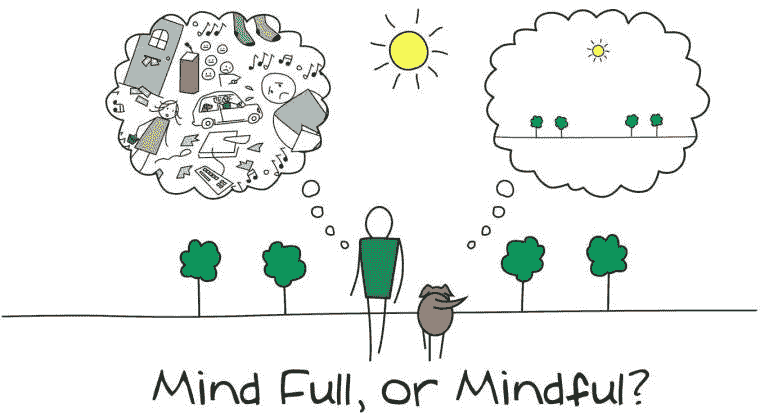

# 你的超能力是什么？多任务还是正念？

> 原文：<https://medium.datadriveninvestor.com/what-is-your-superpower-multitasking-or-mindfulness-c8b66e0f741d?source=collection_archive---------5----------------------->

# 分心的多任务处理者还是专注的禅师

现代生活中一个不争的事实是每个人似乎都很忙。总是有更多的电子邮件，更多的会议，更多的东西要读，更多的想法要跟进。数字移动技术意味着你可以在家里、假期或健身房轻松完成更多的待办事项。此外，社交媒体似乎经常占据中心位置；我们受到来自 Instagram、脸书、推特、短信、视频、广告、新闻等的无情和持续的攻击。没有超能力是不可能管理好这个的，但是你的超能力是什么？

多任务处理似乎是一天的顺序，但结果是，我们的注意力只持续了几秒钟，就厌倦了，我们有冲动去做下一件吸引我们注意力的大事。

忙碌具有讽刺意味的后果是，我们实际上效率更低，完成的工作更少，做出的决定更糟糕，优先处理琐碎的任务而不是重要的任务，最终感到不知所措。我们是精力和能力有限的人类，但却承受着来自工作和社交媒体的看似无限的轰炸，这些媒体侵入了我们的家庭和休闲时间。

正念是解决方法吗？

(看着女儿做作业，抱怨她很无聊，看着她每分钟查看社交信息不少于一次，我有了写这篇文章的灵感。我刚指出这一点，她就指出我犯了同样的错误；医生，治愈你自己。)

# 什么是多任务处理？

多任务最初是一个计算术语，用来描述在计算机的中央处理器(CPU)和主内存中同时执行任务。多任务处理允许用户同时执行多项计算机任务，但并不一定意味着任务是并行执行的。操作系统能够通过跟踪您在这些任务中的位置来进行多任务处理，并在不丢失信息的情况下从一个任务切换到另一个任务。

直到 20 世纪 90 年代，多重任务才作为一个术语应用于人类。人类的多任务处理也是指同时执行一项以上任务的能力，例如在开车时接电话。然而，人类多任务处理的正常方式更类似于计算机过去的方式，通过切换任务而不是同时执行任务。

近年来有很多关于多任务处理的文章，很多概念都混淆了，所以在这篇文章中，我试图澄清我下面的定义，并问我们多任务处理是否是我们的本性？

# 真正的多任务处理

我们的大脑容量有限，很难真正完成多项任务，除非这些任务中的一项或多项是“第二天性”，也就是说，它是如此之好，以至于没有必要思考来执行它。例子包括走路、嚼口香糖、开车和听有声读物。

# 任务切换

当我们大多数人说我们正在进行多任务处理时，看起来我们正在进行多任务处理，但实际上——就像计算机多任务处理一样——我们实际上只是在快速连续地从一个任务切换到另一个任务。尽管你可能认为你可以同时写邮件和打电话，但是，事实上，你不能，而且实际上比你分别做这两件事花费更多的时间，效率更低。

# 盲目浪费时间

我们做的一些事情，我们罪恶的快乐——当我们无聊时很容易陷入其中，不是任务，而是无意识的浪费时间。在你的个人 Instagram 账户上发布一个故事，好吧——这可以说是一项任务，但每小时查看 30 或 40 次你的订阅，玩游戏，在脸书上发布一堆赞——这更可能是无意识的浪费时间——没有多任务点。

# 多重任务的神话

一心多用是一种普遍的现代现象，然而，有相当多的证据表明它对个人健康、生产力、效率有负面影响，甚至会降低同情心。多项研究已经证实，一心多用是一个神话，任何认为一心多用能提高生产力和效率的人都错了。数据清楚地表明，一心多用的人比一次只做一件事的人做得更少，压力更大，表现更差。

那么有替代方案吗？

# 专注与正念

马丁·路德是 15 世纪的神学教授、作曲家、牧师和僧侣，也是第一个将《圣经》翻译成白话的人(不要与马丁·路德·金混淆)，他说过一句名言:“*我要做的事情太多了，所以我要用前三个小时来祈祷。*

这听起来有些违背直觉，但就像许多其他违背直觉的实践一样，例如“*稳扎稳打赢得比赛*”,有着坚实的事实基础。专注于一个主题的能力，深度集中的能力，理解它的细微差别和交织的复杂性，以及它的简单性，允许我们的大脑最大限度地吸收信息。

当我们全神贯注时，我们会把全部注意力集中在一项活动上，如果我们要学习任何东西，这是必不可少的。集中注意力，排除所有外界的噪音和干扰也是非常平静的。

专注的好处在于，它让我们与正在做的事情亲密接触，在这种亲密接触中，有学习和快乐。这是头脑想要工作的方式之一，这种类型的专注被称为正念。

# 你的超能力是什么——正念？

正念不仅仅是专注，它是人类完全处于当下的基本能力，意识到我们在哪里，我们在做什么，不会对周围发生的事情反应过度或不知所措。如果生活感觉太忙碌，如果你对你正在做的事情不感兴趣，也许是时候放慢脚步，练习正念了。

有许多关于正念的定义提供了关于正念是什么的更深入的见解，我个人最喜欢的是:

“正念意味着以一种特定的方式，有目的地，在当下时刻，以一种非判断的方式来关注

除了专注，正念还包含了非判断、慈悲、灵性、好奇、接纳和善良。无判断是佛教哲学的很大一部分。佛教没有善恶之分。人类的问题是用无知和智慧来谈论的——世界上痛苦的原因是无知，解决办法是发展智慧。

# 正念的历史

正念练习经常被世俗地教授，但是它们的根源可以追溯到佛陀和其他东方宗教的早期教导。

*“身心健康的秘诀不是哀悼*
*过去或担忧未来，而是明智而认真地活在*
*当下。”*
***佛***

正念在东方通过佛教和印度教等宗教和精神机构成为主流，而在西方，它的流行可以追溯到特定的个人，如乔恩·卡巴特-津恩博士，他的系统是基于一种叫做内观的佛教冥想。

佛教僧侣认为，许多人焦虑、紧张或痛苦的原因是他们陷入了过去发生的事情或担心未来的事情。佛教僧侣学习如何练习正念来帮助他们从焦虑、压力和痛苦中解脱出来。佛教徒相信你的焦点和注意力应该在当下，因为当下是我们唯一可以学习、做或感受任何事情的时候。现在是我们治愈和成长的唯一时间。

# 正念和冥想有什么关系？

正念是对某些事物的觉知，而冥想是对“无”的觉知冥想和正念都有助于平静头脑，但两者之间的主要区别在于，正念的目标是让一个人的思想停留在当下，而对于(先验)冥想来说，目标是超越思想本身，体验一种'*纯粹意识*'的状态

冥想也是一种练习，它训练头脑不是停止思考，而是超越我们自己的思考过程。通过冥想，一个人的思想应该像河流一样流动。如果你有时间冥想，就去做；如果没有时间冥想，那就冥想 5 分钟。承认你的想法，知道它们是什么，但不要参与其中。让想法顺其自然，不要给它们贴上好与坏的标签。

# 如何练习正念

那么，你的超能力是什么？有大量的科学证据证实，专注于我们正在做的事情，或者说正念，是我们应该追求的超能力。正念有很多好处，可以取代多任务处理，如果不是所有的时间，那么至少是一部分。

*   正念可以帮助我们完成更多的工作，可以缓解忙碌的压力；
*   正念可以帮助我们与我们正在做的事情亲密接触，在这种亲密接触中，有学习和快乐；
*   正念有助于应对抑郁、压力，促进心理健康，控制身体疼痛，提高记忆力；
*   正念帮助我们转换到更积极的心态，这反过来帮助我们感到更快乐；
*   心理学证据表明，当冲突出现时，正念可以通过增加我们处理压力的能力来培养更大的关系满意度；
*   正念可以帮助我们更加感性地意识到和欣赏小事情。
*   正念有助于改善我们与周围人交流和联系的方式。这也有助于我们摆脱自动驾驶模式，在这种模式下，我们许多人日复一日、周复一周、月复一月、年复一年地工作；
*   正念可以帮助我们以一种更深思熟虑、不带偏见、更同情自己的方式调节和表达我们的情绪；
*   练习正念有助于建立我们的适应力。

留心会有很多好处，不仅对你，对你周围的人也是如此。法国哲学家西蒙娜·维尔(1909 年 2 月 3 日至 1943 年 8 月 24 日)的这句简单的话表达了最后一个好处:

你的任务，如果你接受的话，是练习与你的朋友、家人和你周围的人分享你的充实，你最好的自己，你的热情、活力、精神，最重要的是你的存在。这是最好的礼物。

而这位我亲爱的朋友就是你的追求！

Joanne Reed — www.authorjoannereed.net
Author of “This Is Your Quest”. You can’t buy happiness but you can buy books. Your mission, should you wish to accept it is to experience happiness