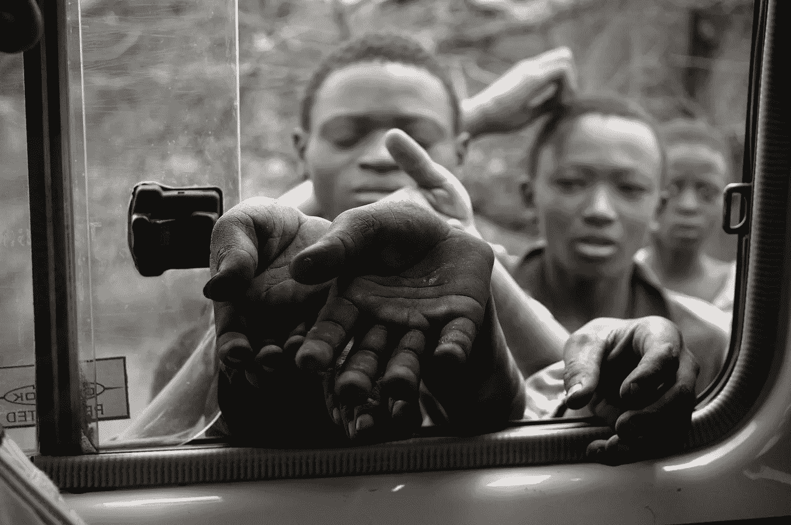
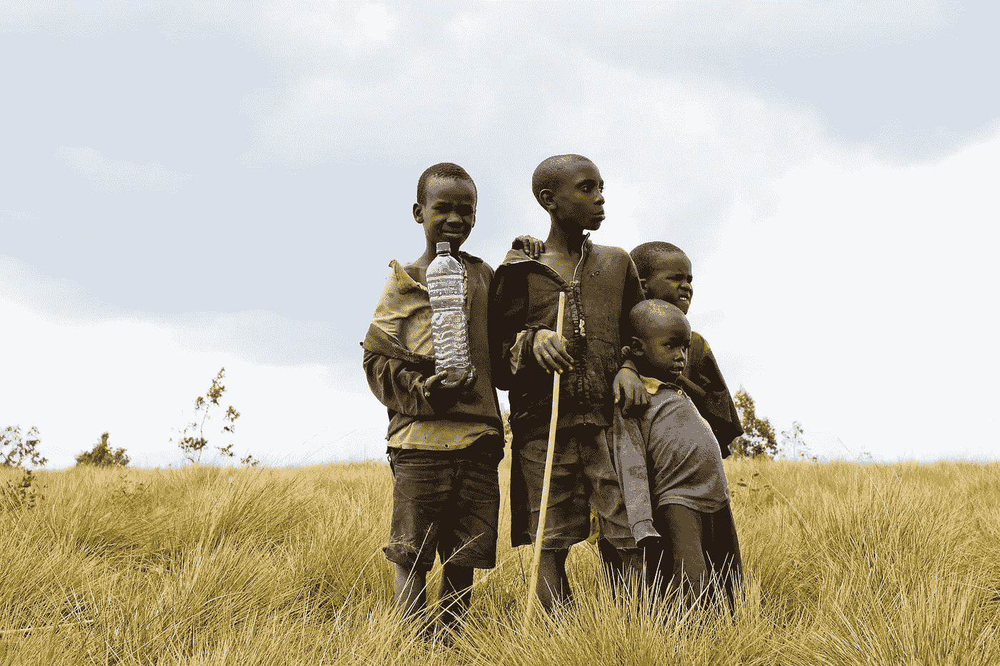
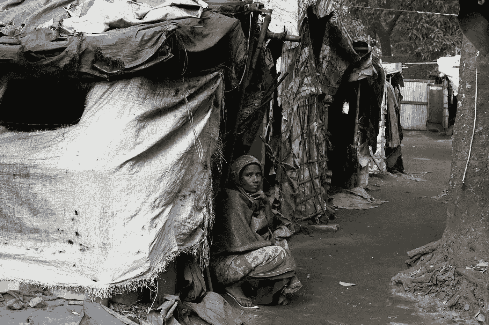
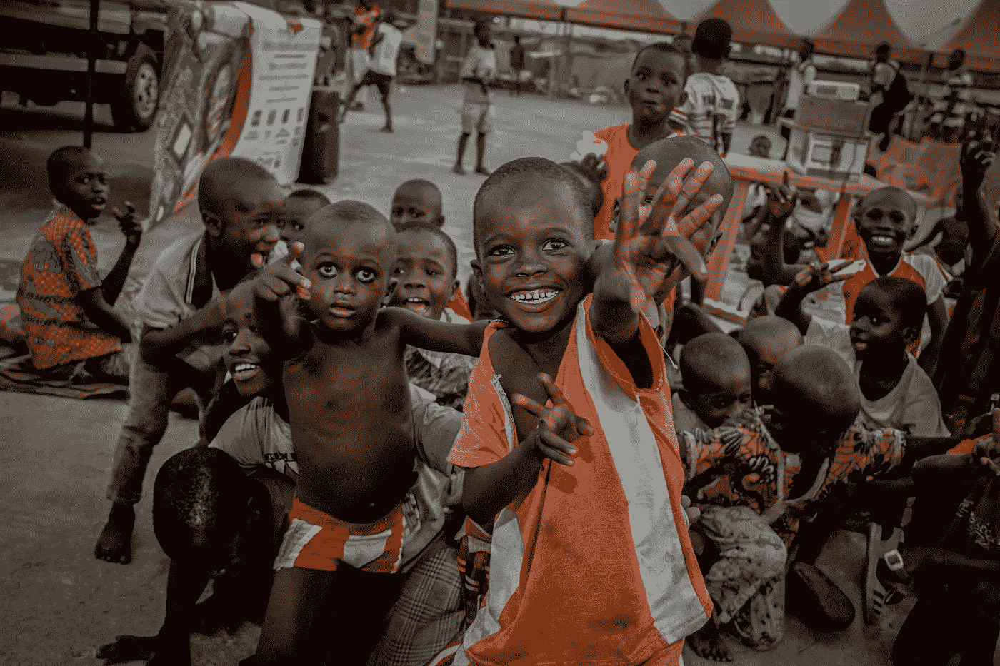

# 生活在世界上最贫穷的国家是什么样的

> 原文：<https://medium.datadriveninvestor.com/what-its-like-to-live-in-the-poorest-countries-in-the-world-5cbe7834da6?source=collection_archive---------1----------------------->

## 你能做些什么来帮助…

Photo by jambogyuri on Pixabay

我最近写了一篇关于生活在世界上最富有的国家卡塔尔的文章。在那篇文章中，我介绍了这个国家的 GDP 估计值，是什么赋予了这个国家财富，以及这个国家日常生活的一些细节。

写那篇文章并了解到生活在世界上最富有的国家所带来的所有好处，虽然很有趣，但它让我思考…

我认为可以肯定地说，了解奢侈比了解贫穷更有趣。作为人类，很难听到其他人生活在我们几乎听不到的环境中，更不用说想象自己生活在这样的环境中。然而，尽管很难，我相信重要的是…

我们大多数人的处境比地球上最贫穷国家的人们要好得多，我们有机会提供帮助。

也就是说，我一头扎进研究中，试图找出世界上最贫穷的国家是什么。与我寻找世界上最富裕国家的研究不同，世界上最贫穷的国家之间存在一些差异。因此，我决定报道世界上最贫穷国家名单中最常出现的 3 个国家，以及 ***我们能做些什么来帮助…***

# 布隆迪

2020 年，布隆迪将成为全世界最贫穷的国家之一(在一些榜单上排名第一)。它们的人均国民总收入估计值(一国一年最终收入的估计美元值除以其人口)仅为 775 美元(近似值)。

让我重申一下…如果你拿**整个国家一**年**的收入**除以人口(估计约 1200 万人)**，每个人只能得到 775 美元**。

由于缺乏财富，70%以上的布隆迪人口(800 多万人)每天的生活费不到 1.9 美元。

Photo by quentcourtois0 on Pixabay

## 关于这个国家

布隆迪是一个人口非常稠密的国家。布隆迪的人口增长率为 3.12%，平均生育率为每名妇女 5.45 胎，是世界上人口密度第 14 大的国家。

尽管人口众多，但布隆迪是地球上最不发达的国家之一。超过 87%的布隆迪人口生活在农村地区，不到 10%的人口用上了电。该国 65%以上的人口生活在贫困之中。

因为该国大部分人口生活在农村地区，所以农业是布隆迪最大的产业，约占其国内生产总值的 33%，雇用了 70%以上的人口。

尽管该国生产大量粮食，但人口过剩和普遍贫困的经济仍使布隆迪成为世界上最饥饿的国家之一，超过 58%的人面临长期营养不良。

此外，由于全国缺乏财富，布隆迪的卫生系统缺乏基础设施和人力资源。因此，布隆迪人民的健康状况可能很差。艾滋病毒/艾滋病和疟疾等疾病肆虐全国，布隆迪人民的预期寿命只有大约 61.2 岁(比美国公民的预期寿命少 18 岁)。

## 如何提供帮助

很明显，布隆迪需要帮助。他们缺乏食物、干净的水、医疗资源和电力等基础设施，这是任何人都不应该面对的重大问题。这里有一些直接帮助布隆迪人民的资源/捐赠链接。

世界粮食计划署(World Food Programme)——该组织不仅帮助世界各地的人们提高粮食安全，还教导布隆迪当地人如何在农业中提高能源效率

[碧昂斯](https://www.beyonce.com/beygood4burundi/) —碧昂斯自己的组织，与[联合国儿童基金会](https://www.unicef.org/)(也是一个捐赠的好地方)合作，希望让布隆迪人有更多的机会获得干净的水

布隆迪教育基金(Burundi Education Fund)——一个帮助向布隆迪面临极端贫困的学生和学校提供物资和财政支持的组织

[AVSI](https://www.avsi.org/en/news/2020/01/27/burundi-working-to-end-energy-poverty-in-rural-areas/1992/) —该组织致力于确保布隆迪 1000 多万无电人口获得负担得起的可持续能源

# 中非共和国

中非共和国是世界上另一个最贫穷的国家，在一些列表中排名第一。

以美元计算，它们的人均国民总收入估计在 730 美元至 1060 美元之间。中非共和国大约 79%的人生活在贫困线以下，这些人的平均日消费价格仅为 1.90 美元。

Photo by Mumtahina Tanni on Pexels

## 关于这个国家

中非共和国是一个内陆国家，2020 年人口约为 480 万，与布隆迪不同，它是地球上人口最稀少的国家之一。即使人口更少、分布更广，仍有超过 45%的国家处于粮食不安全状态。

由于缺乏医疗保健、营养不良和高发病率，中非共和国人民的平均预期寿命是世界上最低的之一，只有大约 52.8 岁(比世界平均预期寿命低近 20 岁)。此外，中非共和国是婴儿死亡率最高的国家之一，每 1000 名活产婴儿中有 84.5 人死亡。

性别不平等在中非共和国肆虐，导致在这个教育水平已经很低的社会中，年轻女孩缺乏中等教育。此外，在车里的成年女性的粮食不安全的可能性大约是男性的两倍。

汽车最糟糕的事情之一是他们的社会和政治地位。2012 年至 2013 年，中非共和国面临叛乱，导致其领导人在 2013 年被推翻。这导致了整个国家的无政府状态，几乎所有政府的痕迹都消失了。

到 2014 年年中，在这个基督教占多数的国家，数千人被暴力杀害，数万名穆斯林被赶出家园。截至 2018 年，超过 27%的人口流离失所，该国至今仍处于内战之中。

 [## 如何在不牺牲孩子或财务的情况下安全理智地离婚|数据驱动…

### 在美国，七月是以孩子为中心的离婚月。作为 cdfaⓡ的专业人士，我可以向你保证，从长远来看…

www.datadriveninvestor.com](https://www.datadriveninvestor.com/2020/07/28/how-to-divorce-safely-and-sanely-without-sacrificing-your-children-or-your-finances/) 

## 如何提供帮助

除了帮助满足一般的食品需求，中非共和国还需要许多其他方面的援助，如性别平等、教育和难民。下面是一些关注这些事情的组织，以及他们网站的链接。

世界粮食计划署(World Food Programme)—该组织再次帮助世界各地的人们提高粮食安全，同时也向中非共和国 300 多万需要一般人道主义援助的人提供帮助

[联合国儿童基金会](https://www.unicefusa.org/mission/starts-with-u/health-for-children?utm_content=health1responsive_E2001&ms=cpc_dig_2020_PillarPages_20200109_google_health1responsive_delve_E2001&initialms=cpc_dig_2020_PillarPages_20200109_google_health1responsive_delve_E2001&gclid=CjwKCAiA_eb-BRB2EiwAGBnXXg9RLd2H7Q3eYEy3K3KwLu5Rn-2Me5-mUObudw2VwcXMAq_ethNGxxoCW0kQAvD_BwE)——一个致力于为全球儿童提供公平生活机会的组织，也负责为中非共和国儿童接种麻疹和脊髓灰质炎疫苗，并致力于提供清洁饮用水

联合国难民署(UN Refugee Agency)帮助向中非共和国境内的难民和流离失所者提供帐篷、垫子和其他紧急救援物资的组织

# 刚果民主共和国

刚果民主共和国是一个人均国民总收入在 796 美元至 1110 美元之间的国家。

它们拥有超过 8950 万的庞大人口，其中四分之三的人每天的平均消费价格仅为 1.90 美元或更低，这使他们处于贫困线以下。

Photo by kassoum_kone on Pixabay

## 关于这个国家

刚果民主共和国是一个实际上有极大潜力变得比他们实际上更富有的国家。这个国家有丰富的贵重矿物，如铜、钻石和黄金。然而，对这些矿产的控制非但没有带来经济繁荣，反而在很大程度上导致了一场遍及全国的内战。

这场被称为第二次刚果战争的内战已经成为自二战结束以来世界范围内最致命的冲突。由于这场战争，数百万人死亡，数百万人流离失所。

刚果民主共和国仍然是一个暴力的地方，武装暴力和袭击并不罕见。警方有时会采取严厉的报复措施，造成平民伤亡，以此来反击这些暴力犯罪。

刚果民主共和国只有大约 17%的人口用上电，没有固定电话线，加上腐败猖獗，在全国开展业务很困难……这是该国经济不景气和缺乏财富的另一个原因。

此外，如此庞大的人口带来了大量的粮食不安全人口。据估计，刚果民主共和国有 2180 万人每天面临粮食短缺，其中至少有 340 万是儿童。

这种食物匮乏导致刚果人民健康状况不佳。像许多其他非洲国家一样，艾滋病和麻疹等疾病在刚果民主共和国非常突出。最重要的是，刚果民主共和国面临着世界上最严重的埃博拉病毒爆发。

## 如何提供帮助

刚果民主共和国正处于混乱状态。他们需要医疗保健、食品需求、电力和难民方面的援助。下面是一些帮助解决这些问题的组织，以及他们网站的链接。

世界粮食计划署(World Food Programme)—真正的最佳粮食捐赠组织之一，不仅希望结束世界饥饿，还希望为刚果民主共和国人民提供提高粮食安全所需的知识和农产品

[无国界医生组织](https://www.doctorswithoutborders.org/what-we-do/countries/democratic-republic-congo#How%20we%E2%80%99re%20helping%20in%20Democratic%20Republic%20of%20Congo)——该组织致力于改善刚果民主共和国的整体健康和医疗保健，并支持和援助难民和其他因暴力而流离失所的人

[救助儿童会](https://www.savethechildren.org/us/where-we-work/democratic-republic-of-congo?vanityurl=drc)——一个致力于通过提供食物、教育和医疗来拯救和改善刚果民主共和国儿童生活的组织

我想可以肯定地说，我们大多数人都是有福气的。

这些国家的人民面临的腐败和可怕的环境是我个人无法想象的。饥饿、电力、干净的水、教育……这些是我们大多数人从来不需要担心的事情——它们是我们所拥有的。

在我看来，像美国这样拥有如此多财富的国家，世界上还有如此多的人生活在贫困中，不知道他们的下一顿饭从何而来，这是不可接受的。

上面列出的组织包含直接链接到其相应网站的链接，所有这些网站都有关于每个组织及其任务的更多信息，以及一个捐赠按钮。

如果不能捐，至少要教育。走出你的方式去了解那些不如你幸运的地方和人，并在你的社交媒体上分享他们的故事，这样也许其他人也会受到鼓舞去做同样的事情。

我们的工作是改变世界。

我们必须开始这样做。一次一小步。

## 访问专家视图— [订阅 DDI 英特尔](https://datadriveninvestor.com/ddi-intel)