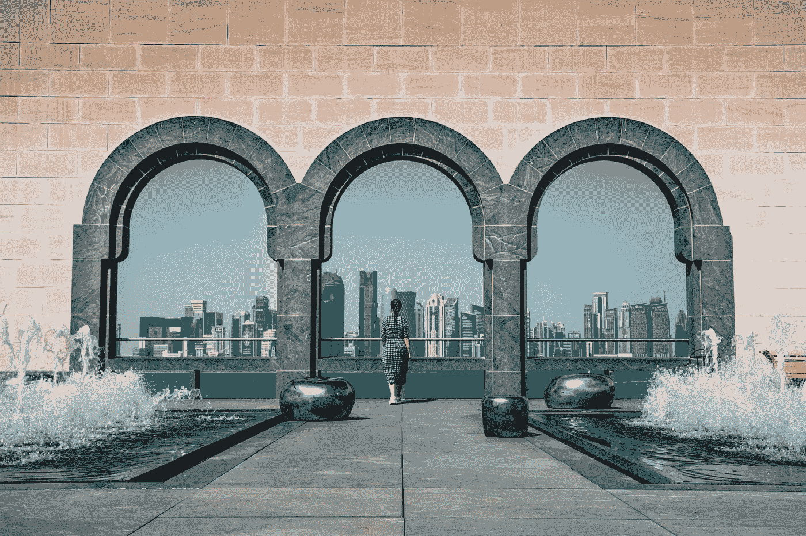

# 生活在世界上最富裕的国家是什么感觉

> 原文：<https://medium.datadriveninvestor.com/what-its-like-to-live-in-the-richest-country-in-the-world-c195fad102d5?source=collection_archive---------0----------------------->

## 它的人民是如何过着奢侈的生活——以及他们是如何不…

Photo by Abdullah on Pexels

世界上最富有的国家…

它在哪里？*为什么*是世界上最富有的国家？那里的人都住在玻璃阁楼里，由他们的私人厨师提供服务吗？那里的日常生活是什么样的，与其他地方有什么不同？

我最近发现了什么是世界上最富有的国家，并深入研究了这个国家的来龙去脉，以及究竟是什么赋予了它财富。我的发现让我吃惊…它可能也会让你吃惊。

在我进入*为什么*这个国家是世界上最富有的国家之前，让我们来谈谈“最富有”到底意味着什么。

不同国家的财富由他们的人均 GDP(国内生产总值——一个国家内商品和服务的生产价值)来衡量。人均国内生产总值是一个国家人均经济产出的细分，计算方法是将国内生产总值除以该国人口。

现在让我们开始吧…

# 卡塔尔的财富

世界上最富有的国家是卡塔尔——一个相对较小的中东国家，位于沙特阿拉伯边境的半岛上。卡塔尔面积不到 4500 平方英里，约为美国的 0.12%。

就我个人而言，我绝不会想到全世界最富有的国家会位于中东的正中心。然而，我发现这个国家的战略位置靠近一个主要的石油储藏地——这些石油是这个国家巨大财富的主要来源。总体而言，卡塔尔控制着全球约 13%的石油储量。

这些石油，以及水泥、氨水和商业修船等较小的贡献因素，导致卡塔尔的人均 GDP 高达 133，000 美元(大约)，比第二高的国家高出约 20，000 美元。

同样，这意味着卡塔尔的商品和服务的总价值除以居住在该国的人口数量，得出人均 133，000 美元！这是美国人均 GDP 的两倍多。

请注意，卡塔尔人口相对较少，大约只有 288 万。这是卡塔尔成为世界上最富有国家的主要原因之一。人口少加上石油产量高，保证了他们是世界上最富有的国家。

抛开这个头衔不谈，并不是全国所有人都有钱。卡塔尔的财富分配远非平均，卡塔尔公民的收入差距巨大。

据报道，卡塔尔的一位前埃米尔(穆斯林军事指挥官或当地酋长)在 2017 年身价 24 亿美元，而 2015 年受访的移民透露，他们的月收入只有 350 美元。

# 日常生活

和世界上任何地方一样，卡塔尔的日常生活因人而异。然而，卡塔尔有许多规则、法律和生活的各个方面帮助决定了卡塔尔人民，并促成了一种与我们许多人可能知道或习惯的生活方式截然不同的生活方式。

以下是其中的几个…

## 房屋

就卡塔尔的住房而言，该国超过 90%的人口居住在多哈，这是卡塔尔建筑风格独特的首都城市，到处都是摩天大楼、购物中心和快餐店。这意味着住房通常不够宽敞，大多数人住在公寓里。

卡塔尔每月的平均房租约为 1，510 美元或 5，500 卡塔尔里亚尔，但这显然会因你的居住地而有很大差异。幸运的是，房租是卡塔尔人唯一需要担心的生活费用之一，因为全国的电、水和电话线都是免费的。

 [## 对有商业头脑的投资者有用的行为经济学概念|数据驱动的投资者

### 在美国企业界，高斯统计，对我们周围世界的确定性解释，以及理性…

www.datadriveninvestor.com](https://www.datadriveninvestor.com/2020/07/09/helpful-behavioral-economics-concepts-for-the-business-minded/) 

## 乔布斯

尽管从最富有的人到最贫穷的人，卡塔尔的收入差别很大，但这个国家的每个人几乎都能保证有一份工作。毕竟，由于其强劲的经济，卡塔尔的失业率是世界上最低的之一，为 0.2%。

由于上面提到的石油储量，石油和天然气无疑是美国最大的产业，也是潜在的最佳行业。由于卡塔尔的石油储量*和*卡塔尔不收所得税，卡塔尔的大部分人口实际上都是来找工作的。

这种涌入农村的人口创造了其他行业的繁荣，包括金融、保险、建筑和房地产。此外，卡塔尔主办 2022 年世界杯的计划正在为建筑行业做出巨大贡献。

## 天气

卡塔尔的天气条件可能非常恶劣。在夏天，温度可以达到 120 华氏度，或 50 摄氏度。这意味着深秋和冬季的温度实际上相当宜人，然而，较低的温度会带来苍蝇和频繁的沙尘暴，能见度为零，几乎需要你呆在室内。

卡塔尔的降雨量很少，平均每年降雨量为 8-9 天。当下雨时，它可以帮助解决沙子/灰尘水平，然而，山洪暴发也不罕见，可以完全接管道路。

## 每日通勤

卡塔尔最主要的常态之一是糟糕的驾驶和交通状况。卡塔尔遵循大多数美国道路法律，要求系安全带，有限速法律，禁止酒后驾车(在卡塔尔，即使一滴酒也会让你酒后驾车)。

尽管他们的法律在其他地方很普遍，但道路被认为是特别糟糕的，因为交通流量大，由此导致的旅行时间长。作为一种试图保持道路相对良好运行的手段，该国的法律非常严格，罚款也很高，如果不遵守规则，几乎肯定会受到处罚。

在卡塔尔开车的一个好处是由于该国的石油储量，汽油价格便宜。汽油通常比一瓶水便宜，一年到头都是由加油工为司机加油的。

## 宗教

宗教在卡塔尔非常重要。伊斯兰文化和历法有助于决定这个国家大多数人的日常生活。例如，因为星期五是伊斯兰教的圣日，工作周和学校周从星期天持续到星期四，大多数企业在星期五的大部分时间(如果不是全部时间的话)都关门是很常见的。

整个国家的服装选择也受伊斯兰教的支配。大多数卡塔尔男子穿着传统的白色长袍，戴着白色或白色和红色的头饰。可以看到卡塔尔妇女穿着黑色的长袍，可以是朴素的，也可以是精心装饰的，还有盖头或面纱来遮住她们的脸。

因为服装对卡塔尔人来说非常重要，他们在 2014 年甚至发起了一项运动，要求游客在访问该国时穿着适度。

虽然大多数卡塔尔人*是*穆斯林(具体来说，是伊斯兰教逊尼派的一部分)，但允许信奉其他宗教。全国其他一些主要宗教包括基督教、印度教和佛教。

## 教育

卡塔尔的教育是所有儿童都必须接受的，并且是基于 12 年制的公立学校系统，与美国非常相似。然而，卡塔尔的公共教育完全免费，教育质量因人而异。

卡塔尔的学校都是独立拥有的，这意味着 T2 的每所学校都遵循相同的课程和指导方针。这需要家庭自己决定什么对他们孩子的教育和未来需求是重要的，并为他们匹配一所符合他们价值观的学校。因此，卡塔尔许多较好的学校都有等候名单，孩子们也不能保证在他们选择的学校中有一席之地。

大多数卡塔尔学校教授的一些科目包括阿拉伯语、英语、数学、科学和伊斯兰研究。与此同时，一些更精英的学校可以有某些学科的重点，如商业，商业，科学，技术，或宗教。

虽然卡塔尔是世界上最富有的国家，并拥有免费教育、无所得税、独特的建筑和廉价的天然气价格等令人惊叹的福利，但这个国家绝对不完美，也有自己的缺点。卡塔尔仍有人生活在贫困中，气候可能会达到令人不安的极端，交通可能会导致即使是距离很近的目的地之间的旅行时间很长。

有趣的是，我们看到了被认为是整个地球上最富有的国家是如何受到他们财富积累的影响的。如果没有财富，卡塔尔肯定会是一个完全不同的国家。

由于卡塔尔的主要收入来自其巨大的石油储量，我很想知道在未来几十年里，随着其他国家努力转向可再生能源，该国是否能保持其世界上最富裕国家的头衔。

只有时间能证明一切，我很想知道事情会如何发展…

**访问专家视图—** [**订阅 DDI 英特尔**](https://datadriveninvestor.com/ddi-intel)