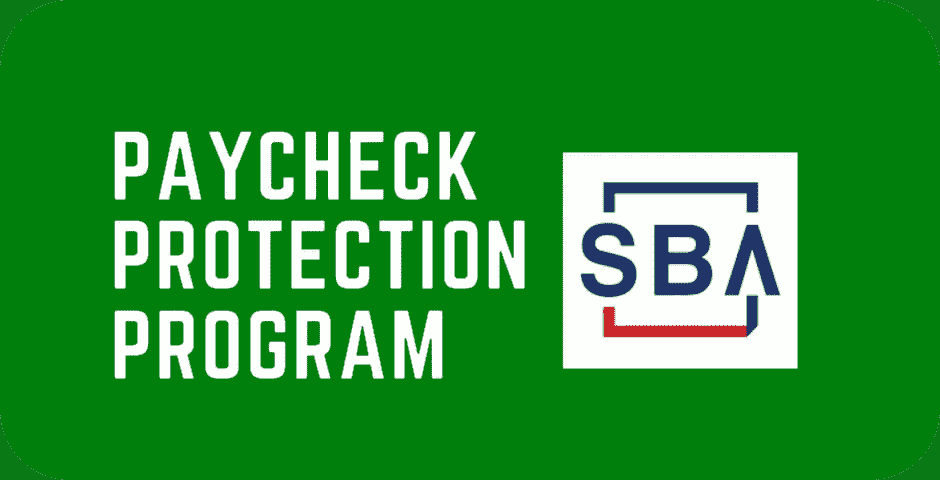

# 我学到了为小企业打包 PPP 贷款

> 原文：<https://medium.datadriveninvestor.com/what-ive-learned-packaging-ppp-loans-for-small-businesses-42d759bbda55?source=collection_archive---------14----------------------->

Photo by [Medienstürmer](https://unsplash.com/@medienstuermer?utm_source=medium&utm_medium=referral) on [Unsplash](https://unsplash.com?utm_source=medium&utm_medium=referral)

The Paycheck Protection Program (PPP) has been a lifeline for struggling small businesses.

在过去的两周里，我每天晚上睡不到 3 个小时。现在，我通常睡得不多，通常在办公室呆到很晚，但 4 月底和 5 月上半月是完全不同的情况。

随着如此多的美国人失业，全国各地苦苦挣扎的小企业关门，我相信你们中的许多人晚上也很难入睡。这就是为什么当我发现我的公司 Capital Velocity 能够打包和处理薪酬保护计划(PPP)申请时，我抓住了这个机会，并加班加点地帮助尽可能多的人从政府那里获得这些可原谅的贷款。

虽然许多小企业知道这些 PPP 贷款，但没有多少人知道这些贷款是什么，以及它们如何惠及需要救灾的公司。以下是我以打包和处理 PPP 贷款申请的形式为美国各地的小企业提供支持的经验。

## 传播消息

当我得知 Capital Velocity 将有能力打包和处理 PPP 贷款时，我做的第一件事就是走上讲台，开始宣传我有能力帮助各种规模的小企业。通过我的 YouTube 频道，我能够向全国成千上万的观众传播我的信息。

虽然第一轮 PPP 融资被上市公司和那些与大银行关系密切的公司抢走，但我知道这一次小公司有机会获得这些救命资金。我确保向所有愿意倾听的人解释，个体经营者、独立承包商和独资经营者都有资格获得 PPP 基金。我还概述了成功和顺利的 PPP 申请流程所需的确切材料。

通过与 Greater Nevada Credit Union 合作，我们能够为小型企业获得数百万美元的 PPP 贷款，为员工发放工资，并以租金、抵押和公用事业的形式提供财务援助。

## 直接听取有需要的人的意见

过去几周最有收获的方面是直接听取最需要这些 PPP 贷款的人的意见。随着数百万人申请失业，1200 美元的刺激支票已经花光，PPP 在这个前所未有的时期提供了另一个财政支持的渠道。

我通过电话和电子邮件与数百名申请人交谈，这给了我动力和奉献精神来包装和处理尽可能多的贷款申请。我每天工作 18 个小时，并雇佣了所有我信任的人来帮助我完成这项艰巨的任务。我为我的团队和我们在全球疫情期间帮助那些需要帮助的人的承诺感到无比自豪。

## 接下来呢？

不幸的是，我们收到了如此多的申请，我们不再能够接受任何新的 PPP 贷款申请。对我们的 PPP 应用程序门户的热烈响应让我对很多事情有了正确的认识，并让我自己产生了一种新的自豪感。在与无数小企业主谈论过现在的艰难时世后，我觉得我有一种更强烈的奉献精神去帮助那些需要帮助的人。

如果这实际上是最后一轮 PPP 融资，我可以放心地知道，我尽我所能帮助尽可能多的小企业。但是，如果政府提供第三轮 PPP，请期待资本流动速度在空中照亮灯塔，为美国各地的小企业提供支持。